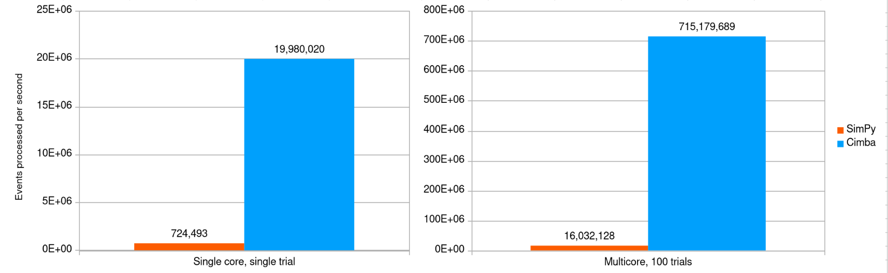

## A multithreaded discrete event simulation library in C

### What is it?
A fast discrete event simulation library written in C and assembly for
both Linux and Windows, providing process- and event-oriented simulated world views 
combined with multithreaded coarse-trained parallelism for high performance on modern CPUs. 
Initially only for x86-64 architectures, ARM and Apple Silicon are planned next.

The chart below shows the number of simulated events processed per second of wall 
clock time with the same scenario, a simple M/M/1 queue, implemented in SimPy and Cimba.
Cimba runs the scenario 45 times faster than SimPy with all CPU cores in use.



### Why should I use it?
It is fast, powerful, reliable, and free.

* *Fast*: The speed from multithreaded parallel execution translates to high
  resolution in your simulation modeling. You can run hundreds of replications
  and parameter variations in just a few seconds, generating tight confidence
  intervals in your experiments and a high density of data points along parameter
  variations.

  In the benchmark shown above, Cimba reduces the run time by 97.8 % compared to the 
  same model in SimPy using all CPU cores. This translates into doing your simulation 
  experiments in seconds instead of minutes, or in minutes instead of hours.

* *Powerful*: Cimba provides a comprehensive toolkit for discrete event simulation:

  * Support for both process- and event-based simulation world views, and 
    combinations of the two.

  * Processes implemented as full, asymmetric stackful coroutines. A simulated process can
    yield and resume control from any level of a function call stack, allowing 
    well-structured coding of arbitrarily large simulation models.
  
  * Pre-packaged process interaction mechanisms like resources,
    resource stores, buffers, object queues, and even condition variables where
    your simulated process can wait for arbitrarily complex conditions – essentially
    for anything you can express as a function returning a binary true or false result.

  * A wide range of fast, high-quality random number generators, both
    of academically important and more empirically oriented types.
  
  * Integrated logging and data collection features that make it easy
    to get a model running and understand what is happening inside it.

* *Reliable*: Cimba is well-engineered open source. There is no
  mystery to the results you get. Each simulated world sits inside its own thread.

* *Free*: Cimba should fit well into the budget of most research groups.

### What can I use Cimba for?
It is a general-purpose discrete event simulation library, in the spirit of a
21st century descendant of Simula67. You can use it to model, e.g.
* computer networks,
* operating system task scheduling, 
* transportation networks, 
* manufacturing systems and job shops,
* queuing systems like bank tellers and store checkouts,
* urban systems like emergency services and garbage collection,
* military command and control systems,
* and quite a few more application domains.

See the tutorial examples at [tut_1_7.c](tutorial/tut_1_7.c), 
[tut_2_2.c](tutorial/tut_2_2.c), and [tut_3_1.c](tutorial/tut_3_1.c) for illustrations of model expressiveness. 
For direct comparison, you will find the same scenario modeled in both Cimba and 
SimPy in the benchmark directory.

If you look under the hood, you will also find reusable internal components
like stackful coroutines doing their own thing on thread-safe cactus stacks,
fast memory pool allocators for generic small objects, and sophisticated data
structures like hash-heaps combining a binary heap and an open addressing hash
map with fibonacci hashing for fast access to various objects. These are not
part of the public Cimba API but are used internally and part of the codebase.

### What does the code look like?
It is C11/C17. As an illustration, this is the entire code for our multithreaded M/M/1 
benchmark mentioned above:

```
#include <inttypes.h>
#include <stdio.h>
#include <stdint.h>

#include <cimba.h>

#define NUM_OBJECTS 1000000u
#define ARRIVAL_RATE 0.9
#define SERVICE_RATE 1.0
#define NUM_TRIALS 100

struct simulation {
    struct cmb_process *arrival;
    struct cmb_process *service;
    struct cmb_objectqueue *queue;
};

struct trial {
    double arr_rate;
    double srv_rate;
    uint64_t obj_cnt;
    double sum_wait;
    double avg_wait;
};

struct context {
    struct simulation *sim;
    struct trial *trl;
};

void *arrivalfunc(struct cmb_process *me, void *vctx)
{
    cmb_unused(me);
    const struct context *ctx = vctx;
    struct cmb_objectqueue *qp = ctx->sim->queue;
    const double mean_hld = 1.0 / ctx->trl->arr_rate;
    for (uint64_t ui = 0; ui < NUM_OBJECTS; ui++) {
        const double t_hld = cmb_random_exponential(mean_hld);
        cmb_process_hold(t_hld);
        void *object = cmi_mempool_get(&cmi_mempool_8b);
        double *dblp = object;
        *dblp = cmb_time();
        cmb_objectqueue_put(qp, &object);
    }

    return NULL;
}

void *servicefunc(struct cmb_process *me, void *vctx)
{
    cmb_unused(me);
    const struct context *ctx = vctx;
    struct cmb_objectqueue *qp = ctx->sim->queue;
    const double mean_srv = 1.0 / ctx->trl->srv_rate;
    uint64_t *cnt = &(ctx->trl->obj_cnt);
    double *sum = &(ctx->trl->sum_wait);
    while (true) {
        void *object = NULL;
        cmb_objectqueue_get(qp, &object);
        const double *dblp = object;
        const double t_srv = cmb_random_exponential(mean_srv);
        cmb_process_hold(t_srv);
        *sum += cmb_time() - *dblp;
        *cnt += 1u;
        cmi_mempool_put(&cmi_mempool_8b, object);
    }
}

void run_trial(void *vtrl)
{
    struct trial *trl = vtrl;

    cmb_logger_flags_off(CMB_LOGGER_INFO);
    cmb_random_initialize(cmb_random_hwseed());
    cmb_event_queue_initialize(0.0);
    struct context *ctx = malloc(sizeof(*ctx));
    ctx->trl = trl;
    struct simulation *sim = malloc(sizeof(*sim));
    ctx->sim = sim;

    sim->queue = cmb_objectqueue_create();
    cmb_objectqueue_initialize(sim->queue, "Queue", CMB_UNLIMITED);

    sim->arrival = cmb_process_create();
    cmb_process_initialize(sim->arrival, "Arrival", arrivalfunc, ctx, 0);
    cmb_process_start(sim->arrival);
    sim->service = cmb_process_create();
    cmb_process_initialize(sim->service, "Service", servicefunc, ctx, 0);
    cmb_process_start(sim->service);

    cmb_event_queue_execute();

    cmb_process_terminate(sim->arrival);
    cmb_process_terminate(sim->service);

    cmb_objectqueue_destroy(sim->queue);
    cmb_event_queue_terminate();
    free(sim);
    free(ctx);
}

int main(void)
{
    struct trial *experiment = calloc(NUM_TRIALS, sizeof(*experiment));
    for (unsigned ui = 0; ui < NUM_TRIALS; ui++) {
        struct trial *trl = &experiment[ui];
        trl->arr_rate = ARRIVAL_RATE;
        trl->srv_rate = SERVICE_RATE;
        trl->obj_cnt = 0u;
        trl->sum_wait = 0.0;
    }

    cimba_run_experiment(experiment,
                         NUM_TRIALS,
                         sizeof(*experiment),
                         run_trial);

    struct cmb_datasummary summary;
    cmb_datasummary_initialize(&summary);
    for (unsigned ui = 0; ui < NUM_TRIALS; ui++) {
        const double avg_tsys = experiment[ui].sum_wait / (double)(experiment[ui].obj_cnt);
        cmb_datasummary_add(&summary, avg_tsys);
    }

    const unsigned un = cmb_datasummary_count(&summary);
    if (un > 1) {
        const double mean_tsys = cmb_datasummary_mean(&summary);
        const double sdev_tsys = cmb_datasummary_stddev(&summary);
        const double serr_tsys = sdev_tsys / sqrt((double)un);
        const double ci_w = 1.96 * serr_tsys;
        const double ci_l = mean_tsys - ci_w;
        const double ci_u = mean_tsys + ci_w;

        printf("Average system time %f (n %u, conf.int. %f - %f, expected %f)\n",
               mean_tsys, un, ci_l, ci_u, 1.0 / (SERVICE_RATE - ARRIVAL_RATE));

        return 0;
    }
}
```
See our tutorial for more usage examples at 
https://cimba.readthedocs.io/en/latest/tutorial.html

### So, what can I use all that speed for?
As shown above, it is some 45 times faster than SimPy in a relevant benchmark. 
This means getting your results almost immediately rather than after a "go brew a pot of 
coffee" delay breaking your line of thought.

For another illustration of how to benefit from the sheer speed, the experiment in 
[test_cimba.c](test/test_cimba.c)
simulates an M/G/1 queue at four different levels of 
service process variability. For each variability level, it tries 
five system utilization levels. There are ten replications for each parameter 
combination, in total 4 * 5 * 10 = 200 trials. Each trial lasts for one million 
time units, where the average service time always is 1.0 time units. This entire 
simulation runs in about 1.4 seconds on an AMD Threadripper 3970X with Arch Linux,
processing some 500 million simulation events per second, and produces the chart below. 


### What do you mean by "well engineered"?
Discrete event simulation fits well with an object-oriented paradigm. That is
why object-oriented programming was invented in the first place for Simula67.
Since OOP is not directly enforced in plain C, we provide the object-oriented
characteristics (such as encapsulation, inheritance, composition, polymorphism, 
message passing, and information hiding) in the Cimba software design instead.

Inside the codebase, you will find namespaces like `cimba_` (overarching code to
manage your experiments and trials), `cmb_`  (used by your simulated world inside
each trial), and `cmi_` (internal stuff that your model does not need to interact 
with). The different functions are then bundled in modules (effectively classes) 
like `cmb_process.h`, containing the API for that part of the library. These
modules form logical inheritance hierarchies, where e.g., a `cmb_process` is a
derived subclass from a `cmi_coroutine`, inheriting all its methods and members.

We distinguish between "is a" (inheritance) and "has a" (composition) relationships.
For example, a `cmb_resource` _is a_ `cmi_holdable` (a virtual base class), while 
it _has a_ `cmb_resourceguard` maintaining an orderly
priority queue of waiting processes, where the `cmi_resourceguard` itself _is a_ 
`cmi_hashheap`. Each class of objects has allocator, constructor, destructor, and
de-allocator functions for an orderly object lifecycle, and where derived classes
behave as you would expect with respect to their parent classes.

The code is liberally sprinkled with `assert` statements testing for preconditions,
invariants, and postconditions wherever possible, applying Design by Contracts 
principles for reliability. Cimba contains about 1000 asserts in about 10 000 lines of 
code in total, for an assert density of 10 %. These are custom asserts that will report 
what trial, what process, the simulated time, the function and line number, and even the 
random number seed used, if anything should go wrong. All time-consuming invariants and 
postconditions are debug asserts, while the release asserts mostly check preconditions 
like function argument validity. Turning off the debug asserts doubles the speed of your
model when you are ready for it, while turning off the release asserts as well only gives 
a small incremental improvement.

This is then combined with extensive unit testing of each module, ensuring that
all lower level functionality works as expected before moving on to higher levels. 
You will find the test files corresponding to each code module in the `test` directory.

But do read the [LICENSE](LICENSE). We do not give any warranties here.

### Object-oriented? In C and assembly? Why not just use C++?
Long story made short: C++ exception handling is not very friendly to the stackful 
coroutines we need in Cimba. C++ coroutines are something entirely different.

C++ has also become a large and feature-rich language, where it will be
hard to ensure compatibility with every possible combination of features.

Hence (like the Linux kernel), we chose the simpler platform for speed, clarity,
and reliability. If you need to call Cimba from some other language, the C calling
convention is well-known and well-documented.

### Version 3.0.0, you say. Why haven't I heard about Cimba before?
Because we did not make it public before. The first ideas that eventually became 
Cimba were built in C++ around 1990. What retrospectively can be called Cimba 1.0
was implemented in K&R C at MIT in the early 1990's, followed by a parallelized
version 2.0 in ANSI C and Perl around 1995–96. The present version written in 
C17 with POSIX pthreads is the third major rebuild, and the first public version.

### You had me at "free." How do I get my hands on Cimba?
It is right here. You clone the repository, build, and install it. You
will need a C compiler and the Meson build manager. On Linux, you can use GCC 
or Clang, while the recommended approach on Windows is MinGW with its GCC 
compiler. For convenience, we recommend the CLion integrated development environment 
with GCC, Meson, and Ninja built-in support on both Linux and Windows.

You will find the installation guide here: https://cimba.readthedocs.io/en/latest/installation.html