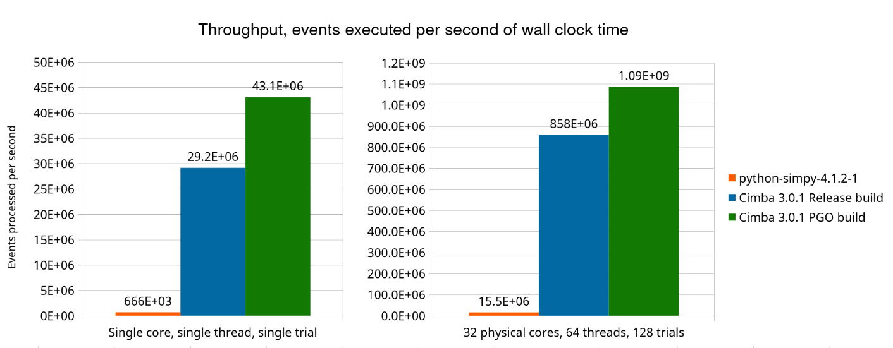
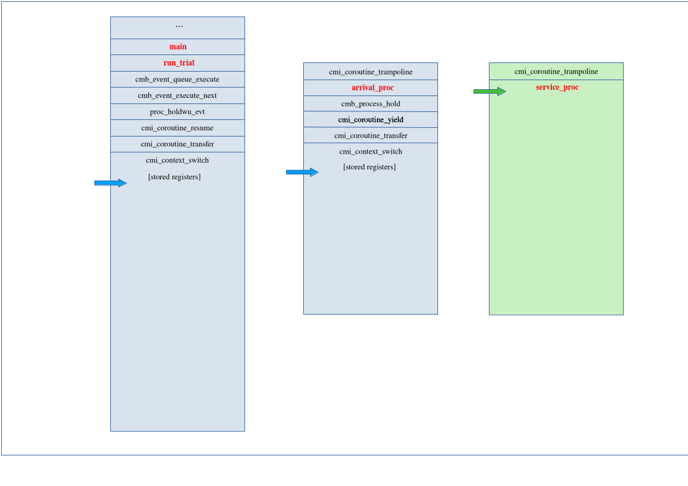

Cimba is a general purpose, fast discrete event simulation library written in C and assembly,
providing an expressive process-oriented simulation worldview combined with multithreaded
trial parallelism in a shared memory space for high performance on modern
desktop computers. The simulated processes are implemented as stackful coroutines 
("fibers") inside the pthreads. Cimba can also use massive GPU parallelism to
calculate model physics within the processes or events of the simulation. As far as we 
know, there is no other discrete event simulation tool that can provide 
a similar combination of powerful features and performance. 

It is currently implemented for both Linux and Windows on the x86-64 architecture, 
with other platforms planned.

### Why should I use it?
It is powerful, fast, reliable, and free.

* *Powerful*: Cimba provides a comprehensive toolkit for discrete event simulation:

  * Processes implemented as asymmetric stackful coroutines. A simulated process can
    yield and resume control from any level of a function call stack, allowing
    well-structured coding of arbitrarily large simulation models.
    A simulated process can run in an infinite loop
    or act as a one-shot customer passing through the system, being both an active
    agent and a passive object as needed.

  * Pre-packaged process interaction mechanisms like resources, resource pools, buffers,
    object queues, priority queues, and timeouts. Cimba also provides condition variables
    where your simulated processes can wait for arbitrarily complex conditions to become
    true – anything you can express as a function returning a binary true or false result.

  * A wide range of fast, high-quality random number generators, both
    of academically important and more empirically oriented types. Important
    distributions like normal and exponential are implemented by state-of-the-art
    ziggurat rejection sampling for speed and accuracy.

  * Integrated logging and data collection features that make it easy
    to get a model running and understand what is happening inside it, including
    custom asserts to pinpoint sources of errors.

  * An entire experiment design is expressed as an array of trials with various
    parameters, all trials executed in parallel and statistics calculated, all in the
    same program. Cimba's architecture strongly encourages applying Design of
    Experiments principles when setting up the trial array.

  * As a C library, Cimba allows easy integration with other libraries and programs. You
    could call CUDA routines to calculate model physics or to enhance your simulation
    models with GPU-powered agentic behavior.
    You could even call the Cimba simulation engine from other programming languages,
    since the C calling convention is standard and well-documented.

* *Fast*: The speed from multithreaded parallel execution translates to high
  resolution in your simulation modeling. You can run hundreds of replications
  and parameter variations in just a few seconds, generating tight confidence
  intervals in your experiments and a high density of data points along parameter
  variations.

  * A relevant benchmark is the Python simulation package SimPy. Cimba models run 
    much faster than SimPy equivalents. The chart below shows the number of simulated 
    events processed per second of wall clock time on a simple M/M/1 queue 
    implemented in SimPy and Cimba. Cimba is shown both with a default release build 
    and a profiler-guided optimizer (PGO) maximum speed build.

    
   
    _Cimba runs this benchmark 70 times faster than SimPy._ In fact, the throughput for 
    Cimba is nearly three times higher (43.1 M events/sec) _on a single CPU core_ than 
    SimPy using all 64 logical cores (15.5 M events/sec combined).

    Running multithreaded, Cimba reduces the run time by 98.6 % compared to the
    same model in SimPy. This translates into doing your simulation experiments in 
    seconds instead of minutes, or in minutes instead of hours. The main reason for 
    the performance advantage is simply that compiled C code and hand-rolled assembly 
    will always run much faster than Python code that needs to be interpreted at 
    runtime. See [the documentation](https://cimba.readthedocs.io/en/latest/background.html#benchmarking-cimba-performance) 
    for technical details on this benchmark. 

  * Another performance reference point is found in the literature on large-scale
    parallel discrete event simulation (PDES). In these models, each simulation run is
    distributed across many physical cores.
    [Fujimoto (2015)](https://informs-sim.org/wsc15papers/004.pdf) states that performance
    for the PDES algorithms has leveled out at around 250 k events/second/core
    on massively parallel supercomputers due to the inherent clock speed limitations on 
    each core, and that further performance improvement in recent years comes from 
    increasing the number of cores. 
  
    *Cimba runs two orders of magnitude faster than this on a per-core basis.* The CPU used 
    in the benchmark above has 32 _physical_ cores, running two threads per physical core.
    Cimba executed 42 M events/sec on a single core and 34 M events/second/core on 32
    physical cores. The reason is that keeping our entire event queue in "hot" CPU cache memory
    is orders of magnitude faster than communicating the events across a link between separate devices.

  * If you need even higher speed, CUDA kernels can be used for massively parallel 
    computation inside each simulated process, e.g., for AI-enabled agents or for 
    intricate physics calculations. In 
    [one of our tutorials](https://cimba.readthedocs.io/en/latest/tutorial.html#adding-cuda-gpu-power-for-simulation-physics), 
    we demonstrate how to combine multithreaded trials with CUDA functions running on 
    multiple GPUs.

* *Reliable*: Cimba is well-engineered open source. There is no mystery to the results you get.

  * The code is written with liberal use of assertions 
    to enforce preconditions, invariants, and postconditions in each function. The 
    assertions act as self-enforcing documentation on expected inputs to and outputs from 
    the Cimba functions. 
  
  * There are unit tests for each module, including comprehensive statistical 
    goodness-of-fit tests for the pseudo-random number distributions. Running the unit 
    test battery in a debug build (all assertions active) verifies the correct 
    operation in great detail. You can do that by the one-liner ``meson test -C 
    build`` from the terminal command line. 
  
  * Cimba is compatible with sanitizers for undefined behavior (UBSan), memory 
    address safety (ASan), thread safety (TSan), and memory leaks (LeakSan). These 
    sanitizers are executed  utomatically as GitHub runners on every push to the 
    repository as public verification of our reliability claim, right 
    here: https://github.com/ambonvik/cimba/actions

  * The code is routinely reviewed adversially by the latest and greatest AI tools as 
    they become available, most recently Anthropic Claude Fable 5 (August 2026) and 
    OpenAI GPT 5.6 Sol (September 2026). Any bugs identified by these reviews are 
    fixed, and a follow-up verification review is done. The reviews can be found here:
    https://github.com/ambonvik/cimba/tree/main/code_reviews

* *Free*: Cimba should fit well into the budget of most research groups.

### What can I use Cimba for?
It is a general-purpose discrete event simulation library, in the spirit of a
21st century Simula67 descendant. You can use it to model, e.g.
* computer networks,
* transportation networks, 
* operating system task scheduling,
* manufacturing systems and job shops,
* military command and control systems,
* hospital and emergency room patient flows,
* queuing systems like bank tellers and store checkouts,
* urban systems like public transport and garbage collection,
* and quite a few more application domains of similar kinds, where overall system 
  complexity arises from interactions between relatively simple components.

If you look under the hood, you will also find additional reusable internal components.
Cimba contains stackful coroutines doing their own thing on thread-safe cactus stacks. 
There are fast memory pool allocators for generic small objects, intrusive linked 
lists, and hash-heaps combining a binary heap and an open addressing hash map using 
Fibonacci hashing. Although not part of the public Cimba API, these components can also
be used in your model if needed, but be aware that anything in the `cmi_` namespace may 
change in future (minor) versions.

### What does the code look like?
It is C code. As an illustration, this is the entire program for a single-threaded M/M/1 
queue simulation, combining active processes with a few discrete control events 
happening at specific times.

```
    #include <cimba.h>
    #include <stdio.h>
    
    #define USERFLAG1 0x00000001
    
    struct simulation {
        struct cmb_process *arr;
        struct cmb_buffer *que;
        struct cmb_process *srv;
    };
    
    struct trial {
        double arr_rate;
        double srv_rate;
        double warmup_s;
        double duration_h;
        double avg_queue_length;
    };
    
    struct context {
        struct simulation *sim;
        struct trial *trl;
    };
    
    void end_sim_evnt(void *subject, void *object)
    {
        cmb_unused(subject);
        cmb_assert_debug(object != NULL);
    
        const struct context *ctx = object;
        const struct simulation *sim = ctx->sim;
        cmb_logger_user(stdout, USERFLAG1, "--- Game Over ---");
        cmb_process_stop(sim->arr, NULL);
        cmb_process_stop(sim->srv, NULL);
    }
    
    static void start_rec_evnt(void *subject, void *object)
    {
        cmb_unused(subject);
        cmb_assert_debug(object != NULL);
    
        const struct context *ctx = object;
        const struct simulation *sim = ctx->sim;
        cmb_buffer_recording_start(sim->que);
    }
    
    static void stop_rec_evnt(void *subject, void *object)
    {
        cmb_unused(subject);
        cmb_assert_debug(object != NULL);
    
        const struct context *ctx = object;
        const struct simulation *sim = ctx->sim;
        cmb_buffer_recording_stop(sim->que);
    }
    
    void *arrival_proc(struct cmb_process *me, void *vctx)
    {
        cmb_unused(me);
        cmb_assert_debug(vctx != NULL);
    
        const struct context *ctx = vctx;
        const struct simulation *sim = ctx->sim;
        const struct trial *trl = ctx->trl;
        struct cmb_buffer *que = sim->que;
    
        cmb_assert_debug(trl->arr_rate > 0.0);
        const double t_ia_mean = 1.0 / trl->arr_rate;
    
        while (true) {
            const double t_ia = cmb_random_exponential(t_ia_mean);
            cmb_logger_user(stdout, USERFLAG1, "Holds for %f time units", t_ia);
            cmb_process_hold(t_ia);
            uint64_t n = 1;
            cmb_logger_user(stdout, USERFLAG1, "Puts one into the queue");
            cmb_buffer_put(que, &n);
        }
    }
    
    void *service_proc(struct cmb_process *me, void *vctx)
    {
        cmb_unused(me);
        cmb_assert_debug(vctx != NULL);
    
        const struct context *ctx = vctx;
        const struct simulation *sim = ctx->sim;
        const struct trial *trl = ctx->trl;
        struct cmb_buffer *que = sim->que;
    
        cmb_assert_debug(trl->srv_rate > 0.0);
        const double t_srv_mean = 1.0 / trl->srv_rate;
    
        while (true) {
            uint64_t m = 1;
            cmb_logger_user(stdout, USERFLAG1, "Gets one from the queue");
            cmb_buffer_get(que, &m);
            const double t_srv = cmb_random_exponential(t_srv_mean);
            cmb_logger_user(stdout, USERFLAG1, "Got one, services it for %f time units", t_srv);
            cmb_process_hold(t_srv);
        }
    }
    
    void run_MM1_trial(void *vtrl)
    {
        cmb_assert_debug(vtrl != NULL);
        struct trial *trl = vtrl;
    
        struct context ctx = {};
        struct simulation sim = {};
        ctx.sim = &sim;
        ctx.trl = trl;
    
        const uint64_t seed = cmb_random_hwseed();
        cmb_random_initialize(seed);
    
        cmb_logger_flags_off(CMB_LOGGER_INFO | USERFLAG1);
    
        cmb_event_queue_initialize(0.0);
    
        ctx.sim->que = cmb_buffer_create();
        cmb_buffer_initialize(ctx.sim->que, "Queue", CMB_UNLIMITED);
    
        ctx.sim->arr = cmb_process_create();
        cmb_process_initialize(ctx.sim->arr, "Arrival", arrival_proc, &ctx, 0);
        cmb_process_start(ctx.sim->arr);
    
        ctx.sim->srv = cmb_process_create();
        cmb_process_initialize(ctx.sim->srv, "Server", service_proc, &ctx, 0);
        cmb_process_start(ctx.sim->srv);
    
        double t = trl->warmup_s;
        cmb_event_schedule(start_rec_evnt, NULL, &ctx, t, 0);
        t += trl->duration_h;
        cmb_event_schedule(stop_rec_evnt, NULL, &ctx, t, 0);
        cmb_event_schedule(end_sim_evnt, NULL, &ctx, t, -100);
    
        cmb_event_queue_execute();
    
        cmb_buffer_print_report(sim.que, stdout);
        
        struct cmb_wtdsummary wtdsum;
        cmb_wtdsummary_initialize(&wtdsum);
        const struct cmb_timeseries *ts = cmb_buffer_history(ctx.sim->que);
        cmb_timeseries_summarize(ts, &wtdsum);
        ctx.trl->avg_queue_length = cmb_wtdsummary_mean(&wtdsum);
        cmb_wtdsummary_terminate(&wtdsum);
    
        cmb_process_terminate(ctx.sim->srv);
        cmb_process_destroy(ctx.sim->srv);
    
        cmb_process_terminate(ctx.sim->arr);
        cmb_process_destroy(ctx.sim->arr);
    
        cmb_buffer_terminate(ctx.sim->que);
        cmb_buffer_destroy(ctx.sim->que);
    
        cmb_event_queue_terminate();
        cmb_random_terminate();
    }
    
    int main(void)
    {
        struct trial trl = {};
        trl.arr_rate = 0.75;
        trl.srv_rate = 1.0;
        trl.warmup_s = 1000.0;
        trl.duration_h = 1e6;
    
        run_MM1_trial(&trl);
    
        printf("Average queue length %f\n", trl.avg_queue_length);
    
        return 0;
    }

```
It will produce this output:
```
    Buffer levels for Queue
    Count   	Mean    	StdDev  	Variance	Skewness	Excess kurtosis
    1.313e+06	   2.275	   3.286	   10.80	   2.226	   6.687
    --------------------------------------------------------------------------------
    ( -Infinity,      0.000)   |
    [     0.000,      2.000)   |##################################################
    [     2.000,      4.000)   |###############=
    [     4.000,      6.000)   |#########-
    [     6.000,      8.000)   |#####-
    [     8.000,      10.00)   |##=
    [     10.00,      12.00)   |#=
    [     12.00,      14.00)   |=
    [     14.00,      16.00)   |=
    [     16.00,      18.00)   |-
    [     18.00,      20.00)   |-
    [     20.00,      22.00)   |-
    [     22.00,      24.00)   |-
    [     24.00,      26.00)   |-
    [     26.00,      28.00)   |-
    [     28.00,      30.00)   |-
    [     30.00,      32.00)   |-
    [     32.00,      34.00)   |-
    [     34.00,      36.00)   |-
    [     36.00,      38.00)   |-
    [     38.00,   Infinity)   |
    --------------------------------------------------------------------------------
    Average queue length 2.275343
```

Note that we have intentionally left out comments in the code above, hopefully 
demonstrating that it is fairly self-explanatory. See
[our tutorial](https://cimba.readthedocs.io/en/latest/tutorial.html) at ReadTheDocs for more usage examples with explanations.

### So, what can I use all that speed for?
As shown above, it is some 70 times faster than SimPy in a relevant benchmark. It means 
getting your results almost immediately rather than after a "go brew a pot of coffee" 
delay breaking your line of thought.

If you can run, say, 10 replications with SimPy within a certain budget for time and 
computing resources, you can run 700 with Cimba. That will tighten the confidence 
intervals in your results by a factor of about 8. The details are in our 
blog post on the topic, 
[Speed is (statistical) power](https://ambonvik.github.io/speed-is-power/).

For another illustration of how to benefit from the sheer speed, the experiment in 
[test_cimba.c](test/test_cimba.c)
simulates an M/G/1 queue at four different levels of 
service process variability. For each variability level, it tries 
five system utilization levels. There are ten replications for each parameter 
combination, in total 4 * 5 * 10 = 200 trials. Each trial lasts for one million 
time units, where the average service time always is 1.0 time units. 

This entire simulation runs in *about 1.5 seconds* on an AMD Threadripper 3970X with 
Arch Linux and produces the chart below.


Or, for a more "real" example, see 
[our tutorial 5](https://cimba.readthedocs.io/en/latest/tutorial.html#adding-cuda-gpu-power-for-simulation-physics).
Using the same 64-core Threadripper and dual RTX 3090 GPUs, it runs 300 trials of an AWACS
scenario with detailed three-dimensional
physics in 73 seconds. Each trial is a six-hour simulation of a thousand target
processes (coroutines) and one sensor process (coroutine) on a 1000 x 1000 nautical mile
synthetic terrain with one arcsecond resolution (approximately 30 meters). The sensor 
process models a scanning S-band surveillance radar including 
line-of-sight geometry, terrain masking, constant-gamma clutter with CA-CFAR detection, 
and specular multipath. The model uses radar dwell intervals (time steps) of 0.04 seconds.

The screenshot below shows one frame from this simulation. The size of
each target is its current radar cross-section, the color is the current detection status.
The vector on the sphere representing the AWACS indicates the current direction of 
the radar lobe. The visualization is done in [ParaView](https://www.paraview.org).


Cimba is able to harness *all* the computing power available in modern computer 
architectures for your simulation purposes, whatever they are.

### What do you mean by "well engineered"?
Discrete event simulation fits well with an object-oriented paradigm. That is
why object-oriented programming was invented in the first place for Simula67.
Since OOP is not directly enforced in plain C, we provide the object-oriented
characteristics (such as encapsulation, inheritance, polymorphism, and abstraction) 
in the Cimba software design instead. (See 
the [ReadTheDocs explanation](https://cimba.readthedocs.io/en/latest/background.html#object-oriented-programming-in-c-and-assembly)
for more details.)

The simulated processes are stackful coroutines on their own call stacks, allowing the 
processes to store their state at arbitrary points and resume execution from there 
later with minimal overhead. The context-switching code is hand-coded in assembly for 
each platform. (You 
can find [more details here](https://cimba.readthedocs.io/en/latest/background.html#coroutines-revisited).)



The stackful coroutines for simulated processes are combined with a higher
level of concurrency in the Posix pthreads managing the trials and replications in an
experiment design, and with a lower level of massive parallelism in GP GPU-based
physics calculations. These three layers of concurrency have clearly separated
semantics in the model code.

The C code is liberally sprinkled with `assert` statements testing for preconditions,
invariants, and postconditions wherever possible, applying 
[Design by Contract](https://en.wikipedia.org/wiki/Design_by_contract) 
principles for high reliability. As of v 3.0, the Cimba library contains 9623 
lines of C code. Of these, there are 1175 assert statements, for a very high assert 
density of 12 %. These are custom-written assert macros that will report 
what trial, what process, the simulated time, the function and line number, and even the 
random number seed used, if anything should go wrong. All time-consuming invariants and 
postconditions are debug asserts, while the release asserts mostly check preconditions 
like function argument validity. Turning off the debug asserts doubles the speed of your
model when you are ready for it. (Again, 
[more explanation here](https://cimba.readthedocs.io/en/latest/background.html#error-handling-the-loud-crashing-noise).)

Extensive unit testing of each module ensures that
all lower-level functionality works as expected before moving on to higher levels. 
You will find the test files corresponding to each code module in the [test](./test) 
directory.

Moreover, Cimba supports sanitizer tools like Address Sanitizer, Undefined Behavior
Sanitizer, Thread Sanitizer, and the CUDA Compute Sanitizer. ASan, UBSan, and TSan are
run automatically on each push to the GitHub repo. The details can be found in the 
GitHub repo, including the results of successive test runs.

But do read the [LICENSE](LICENSE). We are not giving any warranties here.

### Object-oriented? In C and assembly? Why not just use C++?
Long story made short: C++ exception handling is not very friendly to the stackful 
coroutines we need in Cimba. The stackless coroutines in C++ are not the coroutines 
that we are looking for.

C++ has also become a large and feature-rich language, where it will be
hard to ensure compatibility with every possible combination of features.

Hence (like the Linux kernel), we chose the simpler platform for speed, clarity,
and reliability. If you need to call Cimba from some other language, the C calling
convention is well-known and well-documented.

### Version 3.0, you say. Why haven't I heard about Cimba before?
Because it was not made public before. What retrospectively can be called Cimba 1.0
was implemented in K&R C at MIT in the early 1990's, followed by a parallelized
version 2.0 in ANSI C and Perl around 1995–96. The present version written in 
C23 with POSIX pthreads is the third major rebuild, and the first public version.

### You had me at "free." How do I get my hands on Cimba?
It is right here. You clone the repository, build, and install it. You
will need a C compiler and the Meson build manager. On Linux, you can use GCC 
or Clang, while the recommended approach on Windows is MinGW with its GCC 
compiler. For convenience, we recommend the CLion integrated development environment 
with GCC, Meson, and Ninja built-in support on both Linux and Windows.

You will find the installation guide here: https://cimba.readthedocs.io/en/latest/installation.html
