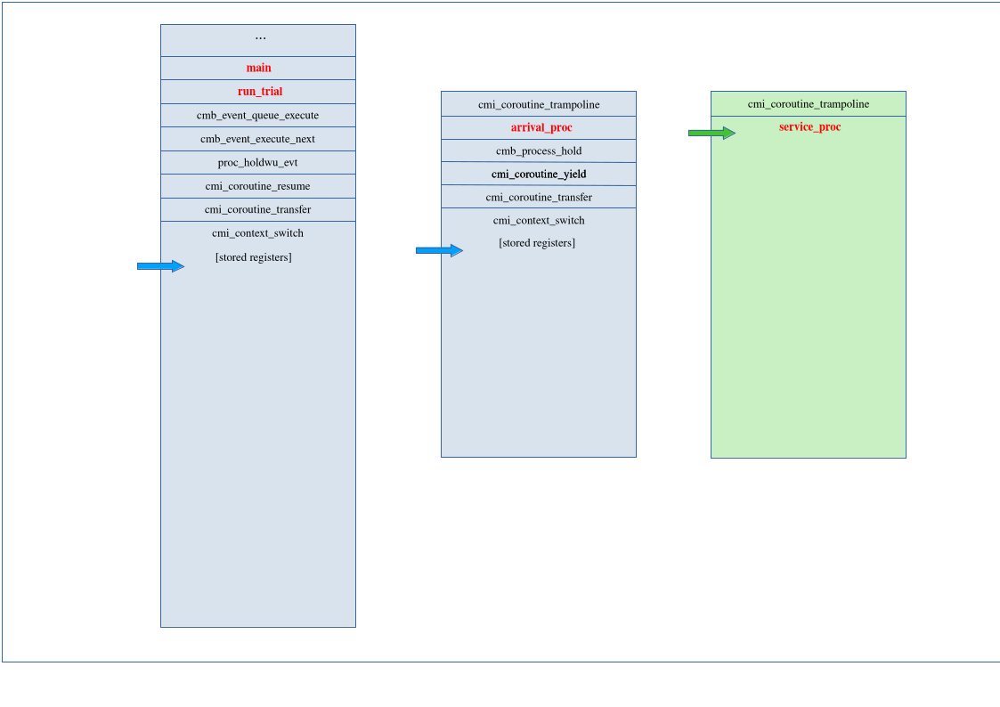
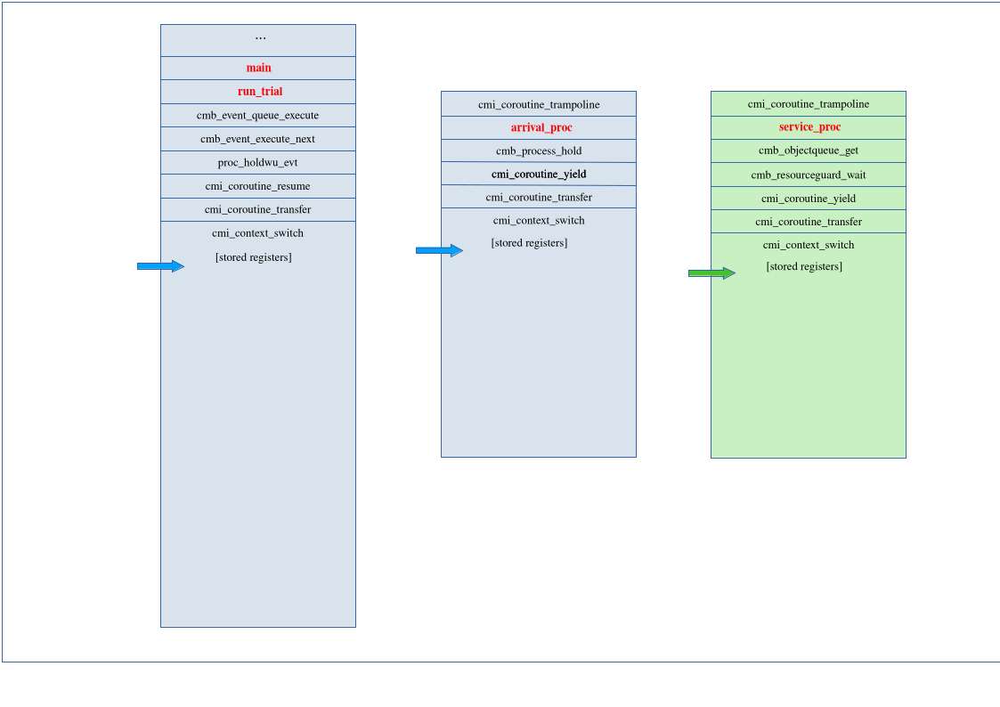
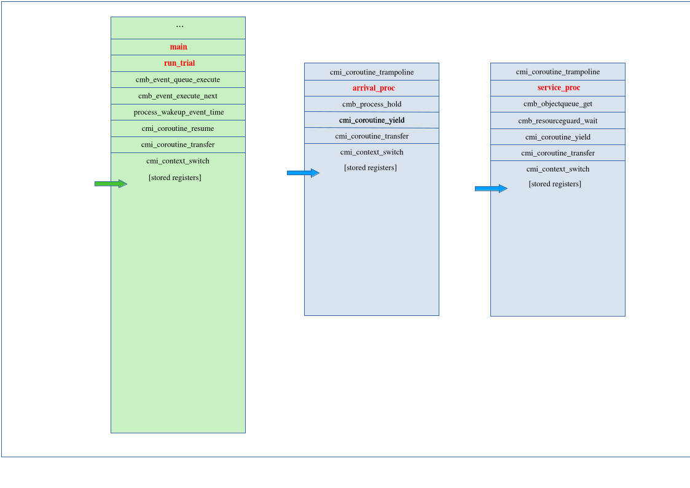
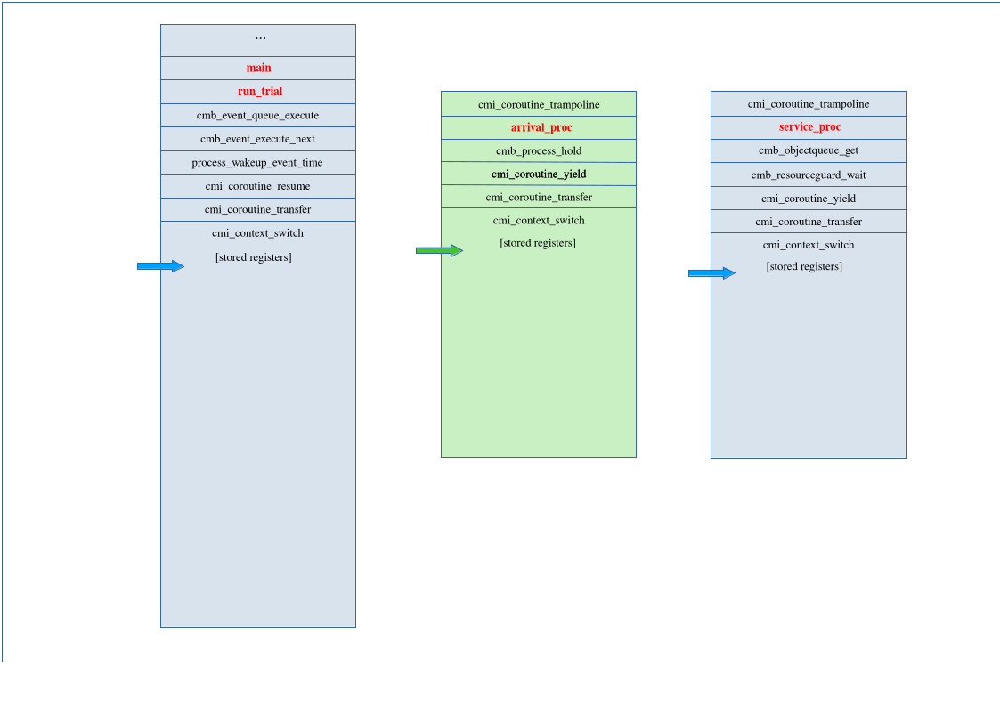
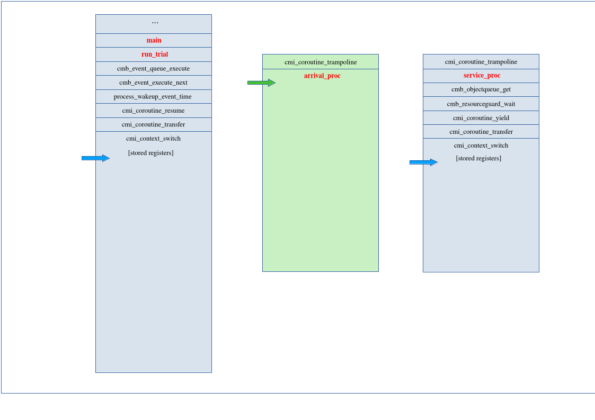
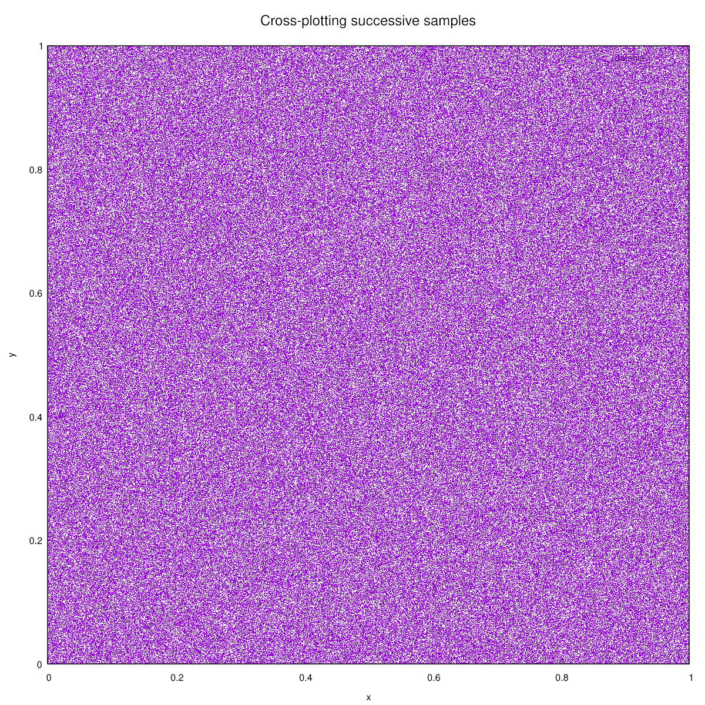

.. _background:

The Whys and Hows of Cimba, Explained
=====================================

In this section, we will explain the background for Cimba and some of
the key design choices that are made in it. We start with a brief history that is
necessary background for the project goals.

.. _background_history:

Project history and goals
-------------------------

Cimba 3.0.0 was released on GitHub as public beta in late 2025, but as the version number
indicates, there is some history before this first public release.

The earliest ideas that eventually became Cimba date to work done at the Norwegian Defence
Research Establishment in the late 1980s, towards the end of the Cold War. I built,
maintained, and ran discrete event
simulation models in languages like Simscript and Simula67. Encountering Simula67's
coroutines and object-orientation was revelatory in its essential *rightness*. However,
Simula67 was still severely limited in many other respects and not really a practical
option at that time. Our simulation models were quite large, up to several hundred
thousand lines of code. The main language used was Simscript II.5.

Around 1990, I started building discrete event simulation models in C++ as an early adopter
of that language. The first C++ models ran on VAXstations where spawning a coroutine is
a single assembly instruction. Trying to port that code to a Windows PC was a somewhat
painful experience (and a complete failure). I actually complained to Bjarne Stroustrup in
person about the inconsistent to non-existent support for Simula-like coroutines in C++ at
a conference in Helsingør, Denmark, probably in 1991. He seemed to agree but I silently
resolved to build my next simulation model in pure K&R C.

That opportunity arose at MIT around 1994, where I needed a discrete event simulation
model for cross-checking analytical models of manufacturing systems. For perhaps obvious
reasons, this was a clean sheet design with no code carried forward from the earlier
C++ work at NDRE. It had a collection of standard random number generators and
distributions, and used a linked list for its main event queue. It did the job, running
on a Linux PC, but could be improved. In retrospect, I consider this Cimba version 1.0.

For my PhD thesis research, I needed to run *many* simulations with various parameter
combinations and replications. By then, I had realized that parallelizing a discrete
event simulation model is trivially simple if one looks at it with a telescope instead
of using a microscope. The individual replications are *meant* to be independent
identically distributed trials, implying that there is nearly no interaction between them
at runtime. One can just fork off as many replications in parallel as one has computing
resources for, and use one computing node to dole out the jobs and collect the
statistics.

This was lashed together at the operating system process level using ``rsh`` and a Perl
script to control the individual simulations on a cluster of workstations, and, just to
make a point, on at least one computer back at the Norwegian Defence Research
Establishment for a trans-Atlantic distributed simulation model. At the same time, the
core discrete event simulation engine was rewritten in ANSI C with a binary heap event
queue. It needed to be very efficient and have a very small memory footprint to run at
low priority in the background on occupied workstations without anyone noticing a
performance drop. This was pretty good for 1995, and can safely be considered Cimba
version 2.0, but it was never released to the public.

After that, not much happened to it, until I decided to dust it off and publish it as
open source many years later. The world had evolved quite a bit in the meantime, so the
code required another comprehensive re-write to exploit the computing power in modern
CPU's, this time coded in C17 and assembly with POSIX pthreads concurrency. This is the
present Cimba 3.0.

The goals for Cimba 3.0 are quite similar to those for earlier versions:

* Speed and efficiency, where small size in memory translates to execution speed on
  modern CPUs with cached memory pipelines, and where multithreading on CPU cores
  provides the parallelism.

* Portability, running both on Linux and Windows, initially limited to the AMD64 /
  x86-64 architecture and GCC-like compilers, with more architectures planned.

* Expressive power, combining process-oriented and event-oriented simulation
  worldviews with a comprehensive collection of state-of-the-art pseudo-random number
  generators and distributions.

* Robustness, using object-oriented design principles and extensive unit testing to
  ensure that it works as expected (but do read the
  `Licence <https://github.com/ambonvik/cimba/blob/main/LICENSE>`_,
  we are not making any warranties here).

I believe that Cimba 3.0 meets these goals and hope you will agree.

.. _background_coroutines:

Coroutines revisited
--------------------

It is well known that the Simula programming language introduced object-oriented
programming, see https://en.wikipedia.org/wiki/Simula for the story. For those of us that
were lucky enough (or just plain old enough) to actually have programmed in Simula67, the
object-orientation with classes and inheritance was only part of the experience, and
perhaps not the most important part.

The most powerful concept for simulation work was the *coroutine*. This
generalizes the concept of a subroutine to several parallel threads of execution that
co-exist and are non-preemptively scheduled. Combined with object-orientation, it
means that one can describe a class of objects as independent threads of execution, often
infinite loops, where the object's code just does its own thing. The objects become
active agents in their own world. The complexity in the simulation arises from the
interactions between the active processes and various passive objects, while the
description of each entity's actions is very natural.

Coroutines received significant academic interest in the early years, but were then
overshadowed by the object-oriented inheritance mechanisms. It seems that current
trends are turning away from the more complex inheritance mechanisms, in many cases
using composition instead of (multiple) inheritance, and also reviving the interest in
coroutines. One fairly recent article is
https://www.cs.tufts.edu/~nr/cs257/archive/roberto-ierusalimschy/revisiting-coroutines.pdf

Unfortunately, when C++ finally got "coroutines" as a part of the language in 2020,
these turned out to be both less powerful and less efficient than expected. (See
https://probablydance.com/2021/10/31/c-coroutines-do-not-spark-joy/ for the details.)
For our purposes here, it is sufficient to say that these coroutines are not the
coroutines we are looking for.

In Cimba, we have some additional requirements to the coroutines beyond being full-fledged
coroutines, i.e., stackful first class objects. Our coroutines need to be thread-safe,
since we will combine these with multithreading at the next higher level of concurrency.
The Cimba coroutines will interact within each thread, but not across threads.

We also want our coroutines to share information both through pointer arguments to the
context-switching functions ``yield()``, ``resume()``, and ``transfer()``, and by the
values returned by these functions. Control is passed out of a coroutine by calling one
of these functions. Control is also passed back to the coroutine by what appears to be a
normal return from this function call. The two ways of communicating between coroutines
are then sharing a pointer to some mutable context data structure as an argument, and
returning a signal value that can be used to determine if something unexpected happened
during the call. We will use both, since these give very different semantics.

Moreover, we want our coroutines to return an exit value if and when they terminate, and
we want the flexibility of either just returning this exit value from the coroutine
function or by calling a special ``exit()`` function with an argument. These should be
equivalent, and the exit value should be persistent after the coroutine execution ends.

And, of course, we want our coroutines to be extremely efficient. Calling ``malloc()`` and
``free()`` or ``memcpy()``'ing large amounts of data in each context switch is a definite
no go. We want the minimal context switches needed to guarantee correctness, only saving
the necessary registers and swapping out the stack pointer, nothing more.

We are not aware of any open source coroutine implementation that exactly meets these
requirements, so Cimba contains its own, built from the ground up in C and assembly. This
gives us a powerful set of thread-safe stackful coroutines, fulfilling all requirements
to "full" coroutines, and in addition providing general mechanisms for communication
between coroutines. The Cimba coroutines can both be used as symmetric or as asymmetric
coroutines, or even as a mix of those paradigms by mixing asymmetric yield/resume pairs
with symmetric transfers. (Debugging such a program may become rather confusing, though.)

.. _background_processes:

Cimba processes are asymmetric coroutines
-----------------------------------------

Our basic coroutines are a bit *too* general and powerful for simulation modeling. We use
these as internal building blocks for the Cimba *processes*. These are essentially named
asymmetric coroutines, inheriting all properties and methods from the coroutine class,
adding a name, a priority for scheduling processes, and pointers to things it may be
waiting for, to resources it may be holding, and to other processes that may be waiting
for it. As asymmetric coroutines, the Cimba processes always transfer control to a single
dispatcher process running on the main program stack, and are always re-activated from
the dispatcher process only.

The processes understand the simulation time and may ``hold()`` for a certain
amount of simulated time. Underneath this call are the asymmetric coroutine primitives of
:c:func:`cmi_coroutine_yield` (to the simulation dispatcher) and
:c:func:`cmi_coroutine_resume`
(when the simulation clock has
advanced by this amount). Processes can also ``acquire()`` and ``release()`` resources,
wait for some other process to finish, interrupt or stop other processes, wait for some
specific event, or even wait for some arbitrarily complex condition to become true.

Since the asymmetric coroutine process concept is fundamental to how Cimba
works, we will now look closely at what happens during a context switch between processes.

Suppose we are running the M/M/1 simulation used to benchmark against SimPy,
`benchmark/MM1_single.c <https://github.com/ambonvik/cimba/blob/main/benchmark/MM1_single.c>`_.
We are running on a single CPU core. The queue is currently empty, the arrival process is
holding, the service process has just woken up from its ``hold()``, looped around, and is
now about to ``get()`` an object from the queue in line 79 of the code.

The illustration below shows the stacks at this point:

The service process to the right (green) has the CPU and is executing user code (red
text).

The main system stack is to the left. The dispatcher has executed the wakeup event
that resumed the service process. It has stored its registers on the stack and transferred
control to the service process. The main stack pointer is at the last register pushed to
the stack, but is itself safely stored to memory instead of in the ``SP`` register.

The arrival process is holding. That call caused a context switch, so its stack pointer
is at the last register that was pushed to its stack. The difference from the
dispatcher on the main stack is that it is *on its own stack* without touching the main
stack at all.

Now the service process is in its ``get()`` call and finds the queue empty. It has to
wait, so it registers itself with the resource guard and yields. At that moment, the
stacks look like this:

The arrival process has saved its registers to the stack and its stack pointer to the
appropriate member of our ``struct cmi_coroutine``. Control transfers to the
dispatcher
on the main stack by loading its stack pointer from memory to the register, and then
popping the remaining register values from the main stack.

The stack rapidly returns up to the dispatcher loop in :c:func:`cmb_event_queue_execute`,
which now pulls off and executes the next event from the event queue.

That happens to be
another hold wakeup call. When executed, that event in turn resumes the target process,
this time the arrival process. The asymmetric coroutine ``yield()``/``resume()`` pair
is implemented by symmetric ``transfer()`` calls, which in turn triggers the context
switch.

At this point, returned from one event and executing the next, the
stacks look the same as in the previous illustration, just with different data values
in the registers and stack variables.

Control then passes to the arrival process. Its stack pointer is loaded from memory
into the appropriate register.

It pops the other saved register values from the stack and returns from the context
call, which in turn returns back to the user code immediately after the
``hold()`` call in line 59 of
`benchmark/MM1_single.c <https://github.com/ambonvik/cimba/blob/main/benchmark/MM1_single.c>`_.
At this point, the context switch from the service to the arrival process by way of
the dispatcher is complete, the arrival process is executing user code, and the stacks
look like this:

As should be evident from these examples, Cimba does not care about what level of the
function call stack its context switching functions get called from. It can be directly
from the process function (like in this example), or the process function can call another
function, that calls some other function, which in turn calls a Cimba function like
:c:func:`cmb_process_hold()`. The intermediate user functions in the call chain do not
even need to know that they are part of a discrete event simulation, much less care about
what stack they are executing on. They are just C functions that get called and do their
thing. There is no need to refactor the whole call chain to yield generators at multiple
levels if you change something deep in the call chain. This is why we insisted on
proper *stackful* coroutines.

We will soon return to Cimba's processes and their interactions, but if the reader has
been paying attention, there is something else we need to address first: We just said
*"inheriting all properties and methods from the coroutine class"*, but we also just
said *"C17"* and *"assembly"*.

.. _background_oop:

Object-oriented programming. In C and assembly.
-----------------------------------------------

Object-oriented programming is a way of structuring program design, not necessarily a
language feature. It uses concepts like *encapsulation*, *inheritance*, *polymorphism*,
and *abstraction* to create a natural description of the objects in the program.

* *Encapsulation* bundles the properties and methods of objects into a compact
  description, usually called a *class*. The individual *instances*, objects that
  belong to the same class, have the same structure but may have different data values.

* *Inheritance* is the relationship between classes where a *child class* is derived from
  another *parent* class. Objects belonging to the child class also belong to the parent
  class and inherit all properties and methods from there. The child class adds its own
  properties and methods, and may *overload* (change) the meaning of parent class methods.

* *Polymorphism* allows the program to deal with parent classes and have each child
  class fill in the details of what should be done. The canonical example is a class
  *shape* with a *draw()* method, where the different child classes *circle*,
  *rectangle*, *triangle*, etc, all contain their own *draw()* method. The program can
  then have a list of *shapes*, ask each one to *draw()* itself, and have the different
  subtypes of shapes do the appropriate thing.

* *Abstraction* selectively exposes important features to surrounding code and hides
  implementation details. This clarifies *what* an object does, while shielding the
  complexity of *how* it is done.

This can also be implemented in a language like C, without explicit support from
programming language features. The key observation is that the first member of a C
``struct`` is guaranteed to have the same address in memory as the struct itself. We
can then use structs as classes, encapsulating the properties of our "class" as struct
members, and implement inheritance by making the parent ``struct`` the first member of
a derived "class". A pointer to a child class object is then also a pointer to a parent
class object, exactly as we want.

Polymorphism can be implemented by having pointers to functions as struct members, and
then place the appropriate function there when initializing the object. If necessary,
this can be extended by having a dedicated ``vtable`` object for the class to avoid
multiple copies of the function pointers in each class member object, at the cost of
one more redirection per function call.

The encapsulation and abstraction is then a matter of disciplined modularity in
structuring the code, with the code and header files as a main building block. Careful
use of ``static`` and ``extern`` functions and variables provide the equivalents of
``private``, ``public``, and ``friend`` class properties and methods. The header file
encapsulate and expose what a module or class does, while the corresponding C code file
contains the implementation details.

Even if this is the most natural way of describing the entities in our simulated world,
there are other things there that might be less natural to describe as classes and
objects. In particular, we do not consider the pseudo-random number generators objects
in this sense. They just exist in the simulated world and are called as functions without
the complexities of creating an object-oriented framework around them. A clear, modular
structure to encapsulate and protect internal workings is still needed.

Cimba functions and variables follow a naming convention of
*<namespace>_<module>_<function>*. There are three namespaces:

* *cimba* - functions and objects at the outer level, organizing and executing your
  multithreaded simulation experiment as a series of trials. This is outside the simulated
  world. Example: :c:func:`cimba_version()`

* *cmb* - functions and objects in the simulated world. These are the building blocks of
  your simulation. You will probably build a single-threaded version only using
  functions from this namespace first, and parallelize it later when you need the
  computing power. Example: :c:func:`cmb_random_uniform()`

* *cmi* - internal functions and objects that for some reason need to be exposed
  globally, but that your simulation model does not need to interact with. Example:
  :c:func:`cmi_coroutine_create()`

Static functions and variables internal to each module do not use the
*<namespace>_<module>_* prefix since they do not have global scope. One example is the
intermediate function ``wakeup_event_time`` visible in the stack images above. It is an
internal static function in ``cmb_process.c``. Hence, its name is not prefixed with
its namespace ``cmb`` and module ``process`` since it has file scope only.

There is one notable exception to this naming convention: The function :c:func:`cmb_time`,
which returns the current simulation clock value. It is declared and defined in the
``cmb_event`` module, and should perhaps be called :c:func:`cmb_event_time`
according to our rule, but since it is a global state in the simulated world and not
related to any particular event, it is more intuitive to make this one exception for it.

As part of our convention, the object methods will take a first argument that is a
pointer to the object itself. This corresponds to the implicit ``this`` or ``self``
pointer in object-oriented languages. Again, there are a few exceptions: Some functions
that are only called by the current process and act on itself do not have this argument.
It is enough to say ``cmb_process_hold(5.0)``, not ``cmb_process_hold(me, 5.0)``.
Similarly, calling ``cmb_process_exit(NULL)`` is enough, calling
``cmb_process_exit(me, NULL)`` would be slightly strange. We believe this exception makes
the code more intuitive, even if it is not entirely consistent.

One can claim that this approach to object-oriented programming provides
most of the benefits while minimizing the overhead and constraints from a typical
object-oriented programming language. However, there are some features we cannot
provide directly:

* *Multiple inheritance*, where a class is derived from more than one parent class. Our
  parent classes need to go first in each child class struct, and then there can only
  be one parent. This is no big loss, since multiple inheritance quickly becomes very
  confusing. We instead distinguish between *is a* relationships (single inheritance)
  and *has a* relationships (composition). For example, our :c:struct:`cmb_resource`
  *is a*   :c:struct:`cmi_holdable` (an abstract parent class), but it *has a*
  :c:struct:`cmb_resourceguard` to
  maintain an orderly priority queue of processes waiting for the resource, and the
  :c:struct:`cmb_resourceguard` itself *is a* :c:struct:`cmi_hashheap`.

* *Automatic initialization and destruction* for objects that go in and out of scope.
  In C++, Resource Allocation Is Initialization (RAII). In C, it is not. (RAINI?) This
  requires us to distinguish clearly between allocating, initializing, terminating, and
  destroying an object. The allocate/destroy pair handles raw memory allocation. For
  objects declared as local variables or implicitly as parent class objects, these are
  not called. The initialize/terminate pair makes the allocated memory space ready for
  use as an actual object and handles any necessary clean-up (such as deallocating
  internal arrays allocated during the object's lifecycle). In some cases, there is
  also a reset function, in effect a terminate followed by a new initialize, returning
  the object to a newly initialized state.

When defining your own classes derived from Cimba classes, such as the ``visitor``
class in :ref:`our third tutorial <tut_3>`, your code has the responsibility to follow
this pattern. Your allocator function (e.g., ``visitor_create()``) allocates raw memory,
while the constructor function (``visitor_initialize()``) fills it with meaningful values.
The constructor does not get called automatically, so your code is also responsible for
calling it, both for objects allocated on the heap, objects declared as local
variables, and for objects that exist as a parent class to one of your objects. The
last case is done by calling the parent class constructor, here
:c:func:`cmb_process_initialize`, from within the child class constructor function.

Similarly, your code needs to provide a destructor to free any memory allocated by the
object (``visitor_terminate()``), and a deallocator to free the object itself
(``visitor_destroy()``). Your destructor function should also call the parent class
destructor (here :c:func:`cmb_process_terminate`), but your de-allocator should NOT
call the parent class de-allocator, since that would be free'ing the same memory twice and
probably crash your application.

By looking around in the Cimba code, you will find many examples of how we have used
the object-orientation. For example, a :c:struct:`cmb_resourceguard` does not actually
care or know what type of resource it guards, only that it is something derived from the
``cmi_resourcebase`` abstract base class. Or, a process may be holding some resource, but
may not really care what kind, only that it is some kind of ``cmi_holdable``, itself
derived from ``cmi_resourcebase``. If the process needs to drop the resource in a
hurry, there is a polymorphic function (really just a pointer to the appropriate
function) for how to handle that for a particular kind of resource.

.. _background_events:

Events and the event queue
--------------------------

The most fundamental property of a discrete event simulation is that *state only
changes at the event times*. The basic algorithm is to maintain a priority queue of
scheduled events, retrieve the first one, set the simulation clock to its reactivation
time, execute the event, and repeat. The time increments between events will vary.

An event may schedule, cancel, or re-prioritize other events, and in general change
the state of the model in arbitrary and application-defined ways. This is why
parallelizing a single model run is near impossible: The dispatcher cannot know what
event to execute next or what state the next event will encounter before the current event
is finished executing.

Cimba maintains a single thread local event queue and simulation clock. These are
global to the simulated world, but local to each trial thread. Two simulations running
in parallel on separate CPU cores exist in the same shared memory space, but do not
interact or influence each other. They are parallel universes.

We define an *event* as a triple consisting of a pointer to a function that takes two
pointers to ``void`` as arguments and does not return any value, and the two pointers
to ``void`` that will become its arguments. The function is an *action*, the two
arguments its *subject* and *object*. The event is then executing the one-liner
``(*action)(subject, object);``

Our process interactions are also events. For example, a process calling
``cmb_process_hold(5.0)`` actually schedules a wakeup event for itself at the current
simulation time + 5.0 before it yields to the dispatcher. At some point, that event has
bubbled up to the top of the priority queue and gets executed. Similarly, when a
:c:struct:`cmb_resourceguard` wakes up a waiting process to inform it that
"congratulations, you now have the resource", it schedules an event at the current time
that actually resumes the process. This avoids long and complicated call stacks.

This also happens to be the reason why our events need to be (at least) a triple: The
event to reactivate some process needs to contain the reactivation function, a pointer to
the process, and a pointer to the context argument for its ``resume()`` call,
``(*event)(me, context)``.

Events are instantaneous in simulated time and always execute on the main stack directly
from the dispatcher. If an event function itself tries to call
:c:func:`cmb_process_hold()`,
it will try to put the event dispatcher itself to sleep. This is not a good idea.

Events do not have a return value. There is nowhere to return the value to. There is
nowhere to store a return value for later use either. An event function has signature
``void foo(void*, void*)`` while a process function has signature
``void *bar(void*, void*)`` since it can and often will return something.

An event is not even an object. It is ephemeral; once it has occurred, it is gone.
You cannot take a pointer to an event. You can schedule an event as a triple ``(action,
subject, object)`` to occur at a certain point in time with a certain priority, and you
can cancel a scheduled event, reschedule it, or change its priority by referring to its
*handle*, but it is still not an object.

The event queue also provides wildcard functions to search for, count, or cancel entries
that match some combination of (action, subject, object). For this purpose,
special values :c:macro:`CMB_ANY_ACTION`, :c:macro:`CMB_ANY_SUBJECT`, and
:c:macro:`CMB_ANY_OBJECT` are defined. As an example, suppose we are building a
large-scale simulation model of an air war. When some plane in the simulation gets shot
down, all its scheduled future events should be cancelled. In Cimba, this can be done by
a simple call like
``cmb_event_pattern_cancel(CMB_ANY_ACTION, my_airplane, CMB_ANY_OBJECT);``

.. _background_hashheap:

The hash-heap - a binary heap meets a hash map
----------------------------------------------

Since the basic discrete event simulation algorithm is all about inserting and
retrieving events in a priority queue, the efficiency of this data structure and the
algorithms acting on it becomes a key determinant of the overall application efficiency.

Cimba uses a hash-heap data structure for this. It consists of two interconnected parts:

* The *heap* is a binary tree represented as a partially sorted array. The next event
  to be executed is always in array position 1. Retrieving it will trigger a reshuffle
  of the heap, making insertion and retrieval O(log n) operations. A scheduled event is
  just a value in this array, which may be moved to another location in the array at any
  time. However, cancelling a future event is a O(n) operation, since the array needs
  to be searched from the beginning to find the event.

* The *hash* complements the heap with an open addressing hash map. When an
  event is first scheduled, it is assigned a unique identifier, a *handle*. The hash
  map keeps track of where in the heap that event is at any time. Accessing the event
  using its handle is then an O(1) operation, while canceling it and reshuffling the
  heap is O(log n). For large models with many scheduled events, this may be a useful
  speed improvement. We use Fibonacci hashing and open addressing for simplicity and
  efficiency, see https://probablydance.com/2018/06/16/fibonacci-hashing-the-optimization-that-the-world-forgot-or-a-better-alternative-to-integer-modulo/

Once we have this module tightly packaged, it can be reused for other purposes than just
the main event queue. We use the same data structure for all priority queues of processes
waiting for some resource, since our :c:struct:`cmb_resourceguard` is a derived class
from ``cmi_hashheap``. It is also used for the :c:struct:`cmb_priorityqueue` class of
arbitrary objects passing from some producer to some consumer process.
In :ref:`our fourth tutorial, the LNG harbor simulation <tut_4>`, we even used an
instance of it at the modeling level to maintain the set of active ships in the model.

Each entry in the hashheap array provides space for four 64-bit payload items, together
with the hash key, a ``double``, and a signed 64-bit integer for use as prioritization
keys. The ``cmi_hashheap`` struct also has a pointer to an application-provided comparator
function that determines the ordering between two entries. For the main event priority
queue, this is based on reactivation time, priority, and as a last resort, the
key (handle) value as a tie-breaker, while the waiting list for a resource will use
the process
priority and the handle value as ordering keys. If no comparator function is provided,
the hashheap will use a default comparator that only uses the ``double`` key and
retrieves the smallest value first, intended as a simple FIFO rule.

For efficiency reasons, the hash table needs to be sized as a power of two. It will
start small and grow as needed. This way, the entire structure will fit well inside
a 2K CPU L1 cache until the application requires it to outgrow the cache. We do not want
to penalize the performance of small simulation models for the ability to run very large
ones.

.. _background_resources:

Resources, resource guards, demands and conditions
--------------------------------------------------

Many simulations involve active processes competing for some scarce resource. Cimba
provides five resource classes and one very general condition variable class. Two of
the resource classes are holdable with acquire/release semantics, where
:c:struct:`cmb_resource`
is a simple binary semaphore that only one process can hold at a time and the
:c:struct:`cmb_resourcepool` is a counting semaphore where several processes can hold
some amount of the resource. The other three resource types have put/get semantics, where the
:c:struct:`cmb_buffer` only considers the number of units that goes in and out, while the
:c:struct:`cmb_objectqueue` and :c:struct:`cmb_priorityqueue` allow individual pointers
to objects.

The common theme for all these is that a process requests something and may have to
wait in an orderly priority queue for its turn if that something is not immediately
available. Our hashheap is a good starting point for building this. For this purpose, we
derive a class :c:struct:`cmb_resourceguard` from the :c:struct:`cmi_hashheap`, adding a
pointer to some resource (the abstract base class) to be guarded, and a list of any
observing resource guards.

When a process requests some resource and finds it busy, it enqueues itself in the
hashheap priority queue. It also registers its *demand function*, a predicate function
that takes three arguments: A pointer to the guarded resource, a pointer to the process
itself, and a ``void*`` pointer to some application-defined context. Using some
combination of this information, the demand function returns a boolean true or false
answer to whether the demand is satisfied. The demand function is pre-packaged for the
four resource types. For example, a process requesting a simple :c:struct:`cmb_resource`
demands that it is not already in use, while a process requesting to put some amount into a
:c:struct:`cmb_buffer` demands that there is free space in the buffer. After registering
itself, the process yields control to the dispatcher. All of this happens inside the
respective ``acquire()``, ``get()``, or ``put()`` call, invisible to the calling process.

When some other process is done with the resource and releases it, it will *signal* the
:c:struct:`cmb_resourceguard`. This signal causes the resource guard to evaluate the
demand function for its highest-priority waiting process. If satisfied, that process is
removed from the wait list, gets reactivated, and can grab the resource. The resource
guard then forwards the signal to any other resource guards that have registered
themselves as observers of this one, causing these to do the same on their wait lists.

The *condition variable* :c:struct:`cmb_condition` is essentially a named resource guard
with a user application defined demand function. The condition demand function can be
anything that is computable from the given arguments and other state of the model at
that point in simulated time. It can be used for arbitrarily complex "wait for any one of
many" or "wait for all of many" scenarios where the :c:struct:`cmb_condition` will
register itself as observer to the underlying resource guards, and, as shown in our second
tutorial, it can include continuous-valued state variables.

We believe that the open-ended flexibility of our demand predicate function,
pre-packaged for the common resource types and exposed for the
:c:struct:`cmb_condition`, makes Cimba a very powerful and expressive simulation tool.

There may also be a weak pun here somewhere on the C++ ``promise`` keyword: Cimba
processes do not promise. They *demand*.

.. _background_error:

Error handling: The loud crashing noise
---------------------------------------

Cimba error handling is intentionally draconian. It will not try to "handle" errors
gently, but will make a loud crashing noise instead.

To understand why, think about the worst case scenario for a discrete
event simulation model: Producing incorrect results. The model can not handle
errors in "helpful" ways that risks introducing biases. The consequences of
that could range from embarrassing (e.g., during your Ph.D. thesis defense) to
catastrophic (e.g., military decision making). Also, the model will run unattended in a
multithreaded environment with no direct user interface. Requesting user clarification is
not an option. It is far better that the simulation stops at any sign of trouble and
requires you to fix the model code or its input before trying again, than to do something
that could turn out to be subtly wrong.

As a contrasting opposite, consider a music player application. If some sample is missing,
the app should interpolate rather than make an audible dropout. If the network is slow,
it should reduce the bit rate and degrade sound quality rather than stopping and
restarting as the buffer empties and refills. This is not the kind of business Cimba is
in. Like the proverbial samurai, it needs to return victorious or not at all.

Our approach is known as
"`offensive programming <https://en.wikipedia.org/wiki/Offensive_programming>`_".
This is closely related to the
`Design by Contract <https://en.wikipedia.org/wiki/Design_by_contract>`_
paradigm, where code expresses clear assertions about the expected preconditions,
invariants, and postconditions during function execution. If one of those assertions is
proven invalid, execution stops right there with a diagnostic message. The assertions
then become self-enforcing
code documentation, since whatever condition it asserts to be true *must* be true for
execution to proceed past that point.

The second important observation is that tracing the flow of execution in a large
discrete event simulation model can become mind-bogglingly complex. We have two levels
of concurrency within the same memory space: Multithreading and stackful coroutines.
Your debugger will probably be very confused. Finding out what happened if the error
has had time to propagate elsewhere in your code before something crashes will be near
impossible. We need to catch it as close to the source as possible. Error messages need
to give additional useful information, not just about what went wrong and where in the
code it went wrong, but also what process, thread, random number seed, and so on, to
replicate, locate, and fix the issue.

Cimba provides its own ``assert()`` macros. Tripping a Cimba assert will give a crash
report like this:

.. code-block:: none

    9359.5	Service	cmb_process_hold (272):  Fatal: Assert "dur >= 0.0" failed, source file cmb_process.c, seed 0x9bec8a16f0aa802a

    Process finished with exit code 134 (interrupted by signal 6:SIGABRT)

It shows the simulation time, process, function, line number, the actual condition that
failed, the program code file, and finally the random number seed used to initialize the
trial. If running multi-threaded, it will also include the trial number.
You now know both where to look and how to reproduce the issue if you want a closer look.

If you are using a debugger, we encourage you to put a permanent breakpoint in
`cmi_assert_failed() <https://github.com/ambonvik/cimba/blob/main/src/cmb_assert.c>`_.
Assuming that you are compiling in debug mode, you will then be able to page up the stack
and identify the circumstances that caused the error, see
:ref:`the example in our first tutorial <tut_1_assert>`.

Our asserts come in two flavors: the :c:macro:`cmb_assert_debug()` and
:c:macro:`cmb_assert_release()`.
There is also a :c:macro:`cmb_assert()` macro, but it is just a shorthand for
:c:macro:`cmb_assert_debug()`.

*Debug* asserts are used at the development stage to ensure that everything is working as
expected, even if the code to check it is time-consuming.
Inside Cimba, you will find asserts that call dedicated predicate functions to validate
whether the coroutine stacks are valid, if the event queue heap condition is satisfied,
and so forth. Like the standard C ``assert()`` macro, the debug asserts vanish from the
code if the preprocessor symbol ``NDEBUG`` is defined. Disabling the debug asserts
will approximately double the execution speed of your model.

*Release* asserts enforce preconditions, the things that need to be true for some
function to work correctly. These remain in the code even with ``-DNDEBUG``, since they
express the contracts towards surrounding code such as valid ranges for input values.
These are typically simple and fast statements. If you are absolutely certain that your
model is working correctly and that all your inputs are valid, you can squeeze out another
slight speed improvement (about 10 %) by defining the preprocessor symbol ``NASSERT`` and
making these vanish as well.

As an illustration, consider the function :c:func:`cmb_random_uniform()`:

.. code-block:: C

    static inline double cmb_random_uniform(const double min, const double max)
    {
        cmb_assert_release(min < max);

        const double r = min + (max - min) * cmb_random();
        cmb_assert_debug((r >= min) && (r <= max));

        return r;
    }

The function generates a pseudo-random uniform variate on the interval ``[min, max]``. We
use those argument names instead of, say, ``[a, b]`` to make the expectation clear. We
then enforce it with a release assert. If ``min`` is not strictly less than ``max``, we
stop right there. Alternatively, we could be "helpful" and generate samples for intervals
with reversed limits, but it is more likely than not that both a zero-width interval and an
interval where ``min > max`` indicates an input or model code error. Cimba's way of being
helpful is to make its loud crashing noise to draw your attention to fixing the error.

The debug assert validates that the result is within the advertised range. It tests for
internal problems in Cimba and can be turned off after sufficient unit testing. After
that, it mainly serves as trustworthy documentation: This statement is true, has been
tested millions of times in unit testing, and you can easily verify it for yourself.

It is clear what valid inputs and outputs are for the function above, even
without a single comment in the code. We are not about to prove total correctness in the
strict C.A.R. Hoare sense, but the function shown above does constitute a logical
`Hoare triple <https://en.wikipedia.org/wiki/Hoare_logic#Hoare_triple>`_.

For empirical data on the relationship between assertions and code quality, see,
e.g., https://www.microsoft.com/en-us/research/wp-content/uploads/2016/02/tr-2006-54.pdf
or https://www.cs.ucdavis.edu/~filkov/papers/assert-main.pdf

.. _background_logging:

Logging flags and bit masks
---------------------------

As explained in :ref:`the first tutorial <tut_1_logging>`, the key concept for the
logger is the *logger flags*; a bit
mask given as an argument to a logger call, and a current bit field. Both are 32-bit
unsigned integers, type ``uint32_t``. If a simple bitwise and (``&``) between the logger's bit
field and the caller's bit mask gives a non-zero result, that line is printed, otherwise
it is not. Initially, all bits in the logger bit field are on, ``0xFFFFFFFF``. You can
turn selected bits on and off with :c:func:`cmb_logger_flags_on()` and
:c:func:`cmb_logger_flags_off()`. The bit field is thread local, so any bit twiddles will only
affect the current thread.

The top four bits are reserved for Cimba use, defined as :c:macro:`CMB_LOGGER_FATAL`,
:c:macro:`CMB_LOGGER_ERROR`, :c:macro:`CMB_LOGGER_WARNING`, and :c:macro:`CMB_LOGGER_INFO`,
respectively.
These correspond to logger functions (actually macro wrappers) :c:macro:`cmb_logger_fatal()`,
:c:macro:`cmb_logger_error()`, :c:macro:`cmb_logger_warning()`, and
:c:macro:`cmb_logger_info()`. These are ``fprintf()``-style functions.

The difference between :c:macro:`cmb_logger_fatal()` and :c:macro:`cmb_logger_error()` is that
``_fatal()`` will call ``abort()`` to terminate your entire program, while ``_error()``
calls ``pthread_exit(NULL)`` to stop the current thread. :c:macro:`cmb_logger_fatal()` should
be used whenever there is a chance of memory corruption that could affect other
threads, while :c:macro:`cmb_logger_error()` can be used if a single trial for some reason is
unsuccessful and needs to bail out without providing a result. To make this work, you
will need to initialize the trial result fields in your experiment array to some
out-of-band value, and ensure that any remaining out-of-band values at the end of the
experiment are not included in the result calculation.

The :c:macro:`cmb_logger_info()` level is used internally in Cimba to give a basic view of
what is going on. It can look like this:

.. code-block:: none

    [ambonvik@Threadripper cimba]$ build/benchmark/MM1_single | more
        0.0000	dispatcher	cmb_event_queue_execute (294):  Starting simulation run
        0.0000	Arrival	cmb_process_hold (278):  Holding for 0.786458 time units
        0.0000	Arrival	cmb_process_timer_add (343):  Scheduled timeout event at 0.786458
        0.0000	Service	cmb_objectqueue_get (214):  Gets an object from Queue, length now 0
        0.0000	Service	cmb_objectqueue_get (246):  Waiting for an object
        0.0000	Service	cmb_resourceguard_wait (149):  Waits for Queue
       0.78646	dispatcher	wakeup_event_time (310):  Wakes Arrival signal 0
       0.78646	Arrival	cmb_objectqueue_put (271):  Puts object 0x555ae5e1c000 into Queue, length 0
       0.78646	Arrival	cmb_objectqueue_put (293):  Success, put 0x555ae5e1c000
       0.78646	Arrival	cmb_resourceguard_signal (219):  Scheduling wakeup event for Service
       0.78646	Arrival	cmb_process_hold (278):  Holding for 0.237395 time units
       0.78646	Arrival	cmb_process_timer_add (343):  Scheduled timeout event at 1.023854
       0.78646	dispatcher	wakeup_event_resource (173):  Wakes Service signal 0
       0.78646	Service	cmb_objectqueue_get (251):  Trying again
       0.78646	Service	cmb_objectqueue_get (234):  Success, got 0x555ae5e1c000
       0.78646	Service	cmb_process_hold (278):  Holding for 1.321970 time units
       0.78646	Service	cmb_process_timer_add (343):  Scheduled timeout event at 2.108428
        1.0239	dispatcher	wakeup_event_time (310):  Wakes Arrival signal 0
        1.0239	Arrival	cmb_objectqueue_put (271):  Puts object 0x555ae5e1c008 into Queue, length 0
        1.0239	Arrival	cmb_objectqueue_put (293):  Success, put 0x555ae5e1c008
        1.0239	Arrival	cmb_process_hold (278):  Holding for 3.063936 time units
        1.0239	Arrival	cmb_process_timer_add (343):  Scheduled timeout event at 4.087789
        2.1084	dispatcher	wakeup_event_time (310):  Wakes Service signal 0
        2.1084	Service	cmb_objectqueue_get (214):  Gets an object from Queue, length now 1
        2.1084	Service	cmb_objectqueue_get (234):  Success, got 0x555ae5e1c008
        2.1084	Service	cmb_process_hold (278):  Holding for 0.576082 time units
        2.1084	Service	cmb_process_timer_add (343):  Scheduled timeout event at 2.684510
        2.6845	dispatcher	wakeup_event_time (310):  Wakes Service signal 0
        2.6845	Service	cmb_objectqueue_get (214):  Gets an object from Queue, length now 0
        2.6845	Service	cmb_objectqueue_get (246):  Waiting for an object
        2.6845	Service	cmb_resourceguard_wait (149):  Waits for Queue
        4.0878	dispatcher	wakeup_event_time (310):  Wakes Arrival signal 0
        4.0878	Arrival	cmb_objectqueue_put (271):  Puts object 0x555ae5e1c008 into Queue, length 0
        4.0878	Arrival	cmb_objectqueue_put (293):  Success, put 0x555ae5e1c008
        4.0878	Arrival	cmb_resourceguard_signal (219):  Scheduling wakeup event for Service
        4.0878	Arrival	cmb_process_hold (278):  Holding for 1.313836 time units
        4.0878	Arrival	cmb_process_timer_add (343):  Scheduled timeout event at 5.401625
        4.0878	dispatcher	wakeup_event_resource (173):  Wakes Service signal 0
        4.0878	Service	cmb_objectqueue_get (251):  Trying again
        4.0878	Service	cmb_objectqueue_get (234):  Success, got 0x555ae5e1c008
        4.0878	Service	cmb_process_hold (278):  Holding for 2.084093 time units
        4.0878	Service	cmb_process_timer_add (343):  Scheduled timeout event at 6.171883
        5.4016	dispatcher	wakeup_event_time (310):  Wakes Arrival signal 0
        5.4016	Arrival	cmb_objectqueue_put (271):  Puts object 0x555ae5e1c000 into Queue, length 0
        5.4016	Arrival	cmb_objectqueue_put (293):  Success, put 0x555ae5e1c000
        5.4016	Arrival	cmb_process_hold (278):  Holding for 1.702620 time units
        5.4016	Arrival	cmb_process_timer_add (343):  Scheduled timeout event at 7.104245

If you compare this to the stack illustrations in the preceding section on Cimba
processes as coroutines, this gives a pretty good view of what is happening on the
stacks. However, it will not be needed very often and can be turned off with

.. code-block:: C

    cmb_logger_flags_off(CMB_LOGGER_INFO);

It will still be in the code if turned off, requiring one 32-bit comparison per call, but
you can make it vanish completely (like the asserts) by defining the preprocessor symbol
``NLOGINFO``. That will turn the :c:macro:`cmb_logger_info()` wrapper macro into a no-op
statement, eliminating it from the code. For fast production code, already well tested,
you may want to compile Cimba with compiler flags ``-DNDEBUG -DNASSERT -DNLOGINFO``. See
the top level `meson.build <https://github.com/ambonvik/cimba/blob/main/meson.build>`_ and
uncomment those options before compiling and (re)installing Cimba.

As shown in the tutorial, the user application can define up to 28 different logger
flags for fine-grained control of what logging messages to print. Remember that these
are bit masks, so your logging flags should be ``0x00000001``, ``0x00000002``,
``0x00000004``, ``0x00000008``, ``0x00000010``, and so on for single bits turned off
and on.

.. _background_random:

Pseudo-random number generators and distributions
-------------------------------------------------

Cimba has a few specific requirements to its pseudo-random number generators as well. For
any discrete event simulation framework, the PRNG's need to be fast and have high
statistical quality. In addition, we need them to be thread-safe, since it must be
possible to reproduce the exact sequence of random numbers in a trial when given the
same seed. We cannot have the outcome depend on other trials that may or may not be
running in parallel. This is not very difficult to do, but it needs to be considered
from the beginning, since the obvious way to code a PRNG is to keep its state in static
variables between calls.

The PRNG in Cimba is an implementation of Chris Doty-Humphrey's ``sfc64``. It
provides 64-bit output and maintains a 256-bit state. It is certain to have a cycle
period of at least 2^64, and is both faster and higher statistical quality than
better-known generators such as the Mersenne Twister. It is in public domain, see
https://pracrand.sourceforge.net
for the details. In our implementation, the PRNG state is thread local, giving each trial
its own stream of random numbers, independent from any other trials.

We initialize the PRNG in a three-stage bootstrapping process:

* First, a truly random 64-bit seed can be obtained from a suitable hardware source of
  entropy by calling :c:func:`cmb_random_hwseed`. It will query the CPU for its best
  source of randomness. On the x86-64 architecture, the preferred source is the
  ``RDSEED`` instruction that is available on Intel CPUs since 2014 and AMD CPUs since
  2016. This instruction uses thermal noise from the CPU itself to create a 64-bit
  random value. If not available, we will negotiate alternatives with the CPU and
  return the best entropy that is available, if necessary by doing a mashup of the clock
  value, thread identifier, and CPU cycle counter.

* Second, the seed is used to initialize the PRNG by calling :c:func:`cmb_random_initialize`.
  It needs to create 256 bits of state from a 64-bit seed. We use a dedicated 64-bit state
  PRNG for this. We initialize it with the 64-bit seed, and then draw four samples from it
  to initialize the state of our main PRNG. This auxiliary PRNG is *splitmix64*, also
  public domain, see https://rosettacode.org/wiki/Pseudo-random_numbers/Splitmix64#C

* Finally, :c:func:`cmb_random_initialize` draws and discards 20 samples from the main PRNG
  to make sure that any initial transient is gone before returning and allowing
  :c:func:`cmb_random_sfc64` to provide pseudo-random numbers to the user application.

The result is a pseudo-random number sequence that cannot be distinguished from true
randomness by any available statistical methods. In particular, successive values
appear to be totally uncorrelated, so it is not necessary or recommended to use
multiple streams of pseudo-random numbers in the same trial. It would do more harm than
good. For this reason, the PRNG is not implemented as an object in the simulated world,
where various entities can carry around their own sources of randomness, but more like
a property of the simulated world. It just *is*. The simulated entities can obtain
sample values from it according to whatever distribution is needed.

The basic :c:func:`cmb_random_sfc64()` returns an unsigned 64-bit bit pattern from the PRNG.
This is a bit spartan for most purposes. The function :c:func:`cmb_random()` instead returns
the sample as a ``double`` between zero and one, inclusive. The first unit test in
``test/test_random.c`` checks the output of :c:func:`cmb_random()` against its expected values:

.. code-block:: none

    Quality testing basic random number generator cmb_random(), uniform on [0,1]
    Drawing 100000000 samples...

    Expected: N 100000000  Mean   0.5000  StdDev   0.2887  Variance  0.08333  Skewness    0.000  Kurtosis   -1.200
    Actual:   N 100000000  Mean   0.5000  StdDev   0.2887  Variance  0.08333  Skewness -1.537e-05  Kurtosis   -1.200
    --------------------------------------------------------------------------------
    ( -Infinity,  8.569e-09)   |
    [ 8.569e-09,    0.05000)   |#################################################=
    [   0.05000,     0.1000)   |#################################################=
    [    0.1000,     0.1500)   |#################################################=
    [    0.1500,     0.2000)   |#################################################=
    [    0.2000,     0.2500)   |#################################################=
    [    0.2500,     0.3000)   |#################################################=
    [    0.3000,     0.3500)   |#################################################=
    [    0.3500,     0.4000)   |#################################################=
    [    0.4000,     0.4500)   |#################################################=
    [    0.4500,     0.5000)   |#################################################=
    [    0.5000,     0.5500)   |#################################################=
    [    0.5500,     0.6000)   |#################################################=
    [    0.6000,     0.6500)   |#################################################=
    [    0.6500,     0.7000)   |#################################################=
    [    0.7000,     0.7500)   |#################################################=
    [    0.7500,     0.8000)   |#################################################=
    [    0.8000,     0.8500)   |#################################################=
    [    0.8500,     0.9000)   |#################################################=
    [    0.9000,     0.9500)   |##################################################
    [    0.9500,      1.000)   |#################################################=
    [     1.000,  Infinity )   |-
    --------------------------------------------------------------------------------

    Autocorrelation factors (expected 0.0):
               -1.0                              0.0                              1.0
    --------------------------------------------------------------------------------
       1  -0.000                                 -|
       2  -0.000                                 -|
       3   0.000                                  |-
       4   0.000                                  |-
       5   0.000                                  |-
       6   0.000                                  |-
       7   0.000                                  |-
       8  -0.000                                 -|
       9  -0.000                                 -|
      10  -0.000                                 -|
      11  -0.000                                 -|
      12  -0.000                                 -|
      13   0.000                                  |-
      14  -0.000                                 -|
      15  -0.000                                 -|
    --------------------------------------------------------------------------------

    Partial autocorrelation factors (expected 0.0):
               -1.0                              0.0                              1.0
    --------------------------------------------------------------------------------
       1  -0.000                                 -|
       2  -0.000                                 -|
       3   0.000                                  |-
       4   0.000                                  |-
       5   0.000                                  |-
       6   0.000                                  |-
       7   0.000                                  |-
       8  -0.000                                 -|
       9  -0.000                                 -|
      10  -0.000                                 -|
      11  -0.000                                 -|
      12  -0.000                                 -|
      13   0.000                                  |-
      14  -0.000                                 -|
      15  -0.000                                 -|
    --------------------------------------------------------------------------------

    Raw moment:   Expected:   Actual:   Error:
    --------------------------------------------------------------------------------
        1             0.5     0.50002    0.004 %
        2         0.33333     0.33335    0.006 %
        3            0.25     0.25002    0.008 %
        4             0.2     0.20002    0.010 %
        5         0.16667     0.16669    0.012 %
        6         0.14286     0.14288    0.013 %
        7           0.125     0.12502    0.015 %
        8         0.11111     0.11113    0.016 %
        9             0.1     0.10002    0.018 %
       10        0.090909    0.090926    0.019 %
       11        0.083333    0.083349    0.019 %
       12        0.076923    0.076938    0.020 %
       13        0.071429    0.071443    0.020 %
       14        0.066667     0.06668    0.021 %
       15          0.0625    0.062513    0.021 %
    --------------------------------------------------------------------------------

Another way to check the quality is to generate a million successive (x, y) pairs from
:c:func:`cmb_random()` and plot them. The human eye is pretty good at detecting correlations
and patterns, sometimes even where no pattern exists, so this is a quite sensitive (but
informal) test:

The various pseudo-random number distributions build on this generator, shaping its
output to match the required probability density functions. The algorithms used are
selected for speed and accuracy. Please run
`the unit test <https://github.com/ambonvik/cimba/blob/main/test/test_random.c>`_
for verification of the individual distributions versus expected values.

The exponential and normal distributions are implementations of Chris McFarland's
improved Ziggurat algorithms, see https://github.com/cd-mcfarland/fast_prng
or https://arxiv.org/pdf/1403.6870

The gamma distribution uses an algorithm due to Marsaglia and Tsang. It uses a similar
rejection sampling approach as the Ziggurat algorithm, but with a continuous function
instead of the stepped rectangles of the Ziggurat. See https://dl.acm.org/doi/10.1145/358407.358414

Many other distributions are built on top of these, as sums, products, or ratios of
samples. For example, the infamous Cauchy distribution is simply the ratio of two normal
variates, suitably scaled and shifted.

Cimba also provides a collection of discrete-valued distributions, starting from the
simple unbiased coin flip in :c:func:`cmb_random_flip`. It also provides Bernoulli trials
(biased coin flips, if such a thing exists), fair and loaded dice, geometric, Poisson and
Pascal distributions, and so forth.

In some cases, a model needs to sample based on some empirical, discrete-valued set of
probabilities. The probabilities can be given as an array *p[n]*, where *p[i]* is the
probability of outcome *i*, for *0 <= i < n*. A clever algorithm for this is the
Vose alias method, see https://www.keithschwarz.com/darts-dice-coins/

The alias method requires an initial step of setting up an alias table, but provides fast
O(1) sampling thereafter. This is worthwhile for *n* larger than seven or so, and about
three times faster than the basic O(n) method for *n = 30*. In Cimba, the alias table
is created by calling :c:func:`cmb_random_alias_create()`, sampled with
:c:func:`cmb_random_alias_sample()`,
and destroyed with :c:func:`cmb_random_alias_destroy()`. (In this case, we have bundled
the allocation and initialization steps into a single ``_create()`` function, and the
termination and deallocation steps into the ``_destroy()`` function.)

.. _background_data:

Data sets and summaries
-----------------------

As we saw in the previous section, Cimba provides a simple set of statistics utilities
for debugging and simple reporting. The most basic class is the :c:struct:`cmb_dataset`,
simply a conveniently resizing array of sample values. It provides methods that require
the individual values, such as calculating the median, quartiles, autocorrelation factors,
and printing a histogram. It does not directly support fundamental statistics like mean
and variance, though.

These are provided through a separate class, :c:struct:`cmb_datasummary`, that computes
running tallies for the first four moments in a single-pass algorithm whenever new data
points are added to the summary, using the methods described by
Pébay (https://www.osti.gov/servlets/purl/1028931)
and Meng (https://arxiv.org/pdf/1510.04923).

The reason for this is that we do not always need to keep all individual sample values,
so we do not want to take the memory penalty of storing them if a simple summary is
enough. In those cases, just adding the successive samples to a
:c:struct:`cmb_datasummary` is more efficient. If we need both, collect the samples in
a :c:struct:`cmb_dataset` and use the function :c:func:`cmb_dataset_summarize` to
calculate a data summary object from the complete data set.

The basic dataset is extended to a time series by the :c:struct:`cmb_timeseries` class.
It adds a second ``double`` to make each sample an ``(x, t)`` pair. In addition, it
calculates a third value ``w`` (for *weight*) that represents the time interval between
one sample and the next.

Recall that in a discrete event simulation, nothing happens except at the event times,
which can have arbitrary time intervals between them. We may need to handle time
series, e.g., the length of some queue, that may be zero for a long time and have short
bursts of several non-zero values, but perhaps with zero or near zero durations. If we
want to calculate sensible statistics from this time series, the sample values need to
be weighted by the duration they had. The :c:struct:`cmb_timeseries` calculates these
weights on the fly.

Similarly to the simple data set and data summary, there is a related
:c:struct:`cmb_wtdsummary` class for calculating duration-weighted statistics from a time
series, or, in cases where the complete time series data is not needed, directly in one
pass by simply adding sample values to the :c:struct:`cmb_wtdsummary` along the way. The
algorithm is described by Pébay and others in a separate publication, see
https://link.springer.com/article/10.1007/s00180-015-0637-z

If one for some reason needs to calculate *unweighted* statistics from a time series,
simply use the :c:func:`cmb_dataset_summarize` function instead. As a derived class,
the :c:struct:`cmb_timeseries` is still also a :c:struct:`cmb_dataset`, and
:c:func:`cmb_dataset_summarize` will treat it as such.

The single pass calculations of variance and higher moments are non-trivial. The
obvious implementation is numerically unstable. We strongly recommend using the Cimba
:c:struct:`cmb_summary` and :c:struct:`cmb_wtdsummary` to do this robustly whenever
anything more than a simple sum and average is needed.

And, of course, if more statistical power is needed, use the :c:func:`cmb_dataset_print`
and :c:func:`cmb_timeseries_print` functions to write the raw data values to file, and
use dedicated software such as *R* or *Gnuplot* to analyze and present the data.

.. _background_trials:

Experiments consist of multi-threaded trials
--------------------------------------------

We now return to the primary objective for Cimba: To provide multi-threaded
discrete event simulation that harnesses the power of modern multi-core CPU's. As
explained in the sections about coroutines and pseudo-random number generators above,
Cimba is designed from the ground up to enable multithreaded execution. Once that is in
place, the actual implementation is straightforward. We use POSIX pthreads as the
concurrency model, see https://en.wikipedia.org/wiki/Pthreads

The basic idea is to structure your *experiment* as an array of *trials*. Your
simulated world is constant across trials, except for the trial parameters. Cimba
creates a small army of worker threads, one per logical CPU core, and lets them help
themselves to the experiment array. Each thread will pick the next available trial,
execute the simulation trial function with the given parameters, store the results, and
repeat. When there are no more trials to run, the worker processes stop and the main
thread takes over again for final output and cleanup.

This gives us near perfect load balancing for free, without the main thread having to
do anything. The worker threads keep themselves busy. The alternative approach would be
to launch each trial in its own thread and close it again before launching the next
trial from the main scheduler. This would also work, but with some more overhead.

The downside to our approach is that new trials will be launched into a thread memory
space where an earlier trial used the event queue and the random generators. If the
user application is not scrupulous in initializing and terminating objects, it may
encounter garbage values with somewhat unpredictable results.

We define the *trial function* as a function that takes a ``void *`` as argument and
does not return any value, ``typedef void (cimba_trial_func)(void *trial_struct)``.
Note that the ``trial_struct`` is just a variable name for a ``void *``, not a type
name. Cimba cannot know in advance the structure of your trial struct, and makes
no assumptions on it.

Our `tutorial/tut_1_7.c <https://github.com/ambonvik/cimba/blob/main/tutorial/tut_1_7.c>`_
can serve as an example for how the experiment array can be structured:

.. code-block:: c

    struct simulation {
        struct cmb_process *arr;
        struct cmb_buffer *que;
        struct cmb_process *srv;
    };

    struct trial {
        /* Parameters */
        double arr_rate;
        double srv_rate;
        double warmup_time;
        double duration;
        /* Results */
        uint64_t seed_used;
        double avg_queue_length;
    };

    struct context {
        struct simulation *sim;
        struct trial *trl;
    };

This is user application code, so you can call these structs what you want. Our use
of ``struct simulation`` here is a slight tip o' the hat toward old Simula's ``CLASS
SIMULATION``. Note also that we chose to let the trial function get its own seed from
hardware and store it as a result value rather than feed it a pre-packaged seed for the
trial.

The trial function, here ``run_MM1_trial()``, expects to receive a pointer to a
``struct trial`` as argument (disguised as a ``void *``), sets up, executes the
simulation, and cleans up afterwards.

The user application allocates the experiment array, e.g.:

.. code-block:: c

    struct trial *experiment = calloc(n_trials, sizeof(*experiment));

and initializes it with the various trial parameters, with the necessary variations and
replications. Once it has loaded parameters into each trial of the experiment array, it
calls :c:func:`cimba_run_experiment()` and waits for the results.

.. code-block:: c

    cimba_run_experiment(experiment, n_trials, sizeof(*experiment), run_MM1_trial);

Once this function returns, each trial in the experiment array will have its results
fields populated. The application can then parse the outcome and present the results in
any way it wants.

Two less obvious features to be aware of, perhaps also less useful, but still:

* You can use different trial functions per trial. If the trial function argument to
  :c:func:`cimba_run_experiment` is ``NULL``, it will instead take the first 64 bits of
  your   trial struct as a pointer to the trial function to be used for this particular
  trial. You could have different trial functions for every trial if you
  want. Of course, if the trial function argument to :c:func:`cimba_run_experiment()` is
  ``NULL`` and the first 64 bits of your trial structure do *not* contain a valid function
  address, your program will promptly crash with a segmentation fault.

* :c:func:`cimba_run_experiment()` does not even care if the trial functions it executes
  is a simulation or something else. You could feed it some array of parameter values and
  a pointer to some function that does something with whatever those parameter values
  indicate. It is just a wrapper to a worker pool of pthreads and will happily
  multithread whatever task you ask it to. The main design challenge with Cimba was to
  construct a discrete event simulation engine that *can* be run in the multithreaded
  wrapper, not constructing the wrapper as such.

.. _background_benchmark:

Benchmarking Cimba against SimPy
--------------------------------

The most relevant comparison for Cimba is probably the Python package SimPy
(https://pypi.org/project/simpy/),
since it provides similar functionality to Cimba, only with Python as its base language
instead of C. SimPy emphasizes ease of use as a main design objective, following the
overall Python philosophy, while Cimba (being a C library) has a natural emphasis on
speed. SimPy processes are based on stackless generators, whereas Cimba has its
stackful coroutine processes. The current SimPy version is 4.1.1.

For comparable multithreading functionality, SimPy needs to be combined with the Python
``multiprocessing`` package. In the following, when referring to SimPy in a
multithreading context, this should be understood as SimPy + multiprocessing.

In the `benchmark <https://github.com/ambonvik/cimba/tree/main/benchmark>`_ directory,
you will find examples of the same simulated scenario implemented in SimPy and Cimba.
A complete multithreaded M/M/1 queue simulation could look like this in SimPy,
`benchmark/MM1_multi.py <https://github.com/ambonvik/cimba/blob/main/benchmark/MM1_multi.py>`_

.. code-block:: Python

    import simpy
    import random
    import multiprocessing
    import statistics
    import math

    NUM_OBJECTS = 1000000
    ARRIVAL_RATE = 0.9
    SERVICE_RATE = 1.0
    NUM_TRIALS = 100

    def arrival_process(env, store, n_limit, arrival_rate):
        for _ in range(n_limit):
            t = random.expovariate(arrival_rate)
            yield env.timeout(t)
            yield store.put(env.now)

    def service_process(env, store, service_rate, stats):
        while True:
            arr_time = yield store.get()
            t = random.expovariate(service_rate)
            yield env.timeout(t)
            stats['sum_tsys'] += env.now - arr_time
            stats['obj_cnt'] += 1

    def run_trial(args):
        n_objects, arr_rate, svc_rate = args
        env = simpy.Environment()
        store = simpy.Store(env)
        stats = {'sum_tsys': 0.0, 'obj_cnt': 0}
        env.process(arrival_process(env, store, n_objects, arr_rate))
        env.process(service_process(env, store, svc_rate, stats))
        env.run()

        return stats['sum_tsys'] / stats['obj_cnt']

    def main():
        num_cores = multiprocessing.cpu_count()
        trl_args = [(NUM_OBJECTS, ARRIVAL_RATE, SERVICE_RATE)] * NUM_TRIALS
        with multiprocessing.Pool(processes=num_cores) as pool:
            results = pool.map(run_trial, trl_args)

        valid_results = [r for r in results if r > 0]
        n = len(valid_results)
        if (n > 1):
            mean_tsys = statistics.mean(valid_results)
            sdev_tsys = statistics.stdev(valid_results)
            serr_tsys = sdev_tsys / math.sqrt(n)
            ci_w = 1.96 * serr_tsys
            ci_l = mean_tsys - ci_w
            ci_u = mean_tsys + ci_w

            print(f"Average time in system: {mean_tsys} (n {n}, conf int {ci_l} - "
                  f"{ci_u}, expected: "
                  f"{1.0 / (SERVICE_RATE - ARRIVAL_RATE)})")

    if __name__ == "__main__":
        main()

The same model would look like this in Cimba,
`benchmark/MM1_multi.c <https://github.com/ambonvik/cimba/blob/main/benchmark/MM1_multi.c>`_:

.. code-block:: C

    #include <inttypes.h>
    #include <stdio.h>
    #include <stdint.h>

    #include <cimba.h>

    #define NUM_OBJECTS 1000000u
    #define ARRIVAL_RATE 0.9
    #define SERVICE_RATE 1.0

    CMB_THREAD_LOCAL struct cmi_mempool objectpool = CMI_MEMPOOL_STATIC_INIT(sizeof(void *), 512u);

    struct simulation {
        struct cmb_process *arrival;
        struct cmb_process *service;
        struct cmb_objectqueue *queue;
    };

    struct trial {
        double arr_mean;
        double srv_mean;
        uint64_t obj_cnt;
        double sum_wait;
        double avg_wait;
    };

    struct context {
        struct simulation *sim;
        struct trial *trl;
    };

    void *arrivalfunc(struct cmb_process *me, void *vctx)
    {
        cmb_unused(me);
        const struct context *ctx = vctx;
        struct cmb_objectqueue *qp = ctx->sim->queue;
        const double mean_hld = ctx->trl->arr_mean;
        for (uint64_t ui = 0; ui < NUM_OBJECTS; ui++) {
            const double t_hld = cmb_random_exponential(mean_hld);
            cmb_process_hold(t_hld);
            void *object = cmi_mempool_alloc(&objectpool);
            double *dblp = object;
            *dblp = cmb_time();
            cmb_objectqueue_put(qp, object);
        }

        return NULL;
    }

    void *servicefunc(struct cmb_process *me, void *vctx)
    {
        cmb_unused(me);
        const struct context *ctx = vctx;
        struct cmb_objectqueue *qp = ctx->sim->queue;
        const double mean_srv = ctx->trl->srv_mean;
        uint64_t *cnt = &(ctx->trl->obj_cnt);
        double *sum = &(ctx->trl->sum_wait);
        while (true) {
            void *object = NULL;
            cmb_objectqueue_get(qp, &object);
            const double *dblp = object;
            const double t_srv = cmb_random_exponential(mean_srv);
            cmb_process_hold(t_srv);
            *sum += cmb_time() - *dblp;
            *cnt += 1u;
            cmi_mempool_free(&objectpool, object);
        }
    }

    void run_trial(void *vtrl)
    {
        struct trial *trl = vtrl;

        cmb_logger_flags_off(CMB_LOGGER_INFO);
        cmb_random_initialize(cmb_random_hwseed());
        cmb_event_queue_initialize(0.0);
        struct context *ctx = malloc(sizeof(*ctx));
        ctx->trl = trl;
        struct simulation *sim = malloc(sizeof(*sim));
        ctx->sim = sim;

        sim->queue = cmb_objectqueue_create();
        cmb_objectqueue_initialize(sim->queue, "Queue", CMB_UNLIMITED);

        sim->arrival = cmb_process_create();
        cmb_process_initialize(sim->arrival, "Arrival", arrivalfunc, ctx, 0);
        cmb_process_start(sim->arrival);
        sim->service = cmb_process_create();
        cmb_process_initialize(sim->service, "Service", servicefunc, ctx, 0);
        cmb_process_start(sim->service);

        cmb_event_queue_execute();

        cmb_process_stop(sim->service, NULL);
        cmb_process_terminate(sim->arrival);
        cmb_process_terminate(sim->service);
        cmb_process_destroy(sim->arrival);
        cmb_process_destroy(sim->service);

        cmb_objectqueue_destroy(sim->queue);
        cmb_event_queue_terminate();
        free(sim);
        free(ctx);
    }

    int main(void)
    {
        struct trial *trl = malloc(sizeof(*trl));
        trl->arr_mean = 1.0 / ARRIVAL_RATE;
        trl->srv_mean = 1.0 / SERVICE_RATE;
        trl->obj_cnt = 0u;
        trl->sum_wait = 0.0;
        run_trial(trl);

        printf("Average system time %f (expected %f)\n",
                trl->sum_wait / (double)trl->obj_cnt,
                1.0 / (SERVICE_RATE - ARRIVAL_RATE));

        return 0;
    }

The Cimba code is significantly longer for this simple example, 139 vs 60 lines. The C
base language demands more careful declarations of object types, whereas Python will
happily try to infer types from context. C requires explicit management of object creation
and destruction, since it does not have Python's automatic garbage collection. This
requires some additional code lines.

For a larger model, where the process function could be large, complex, and
call various other functions, the SimPy code could become much harder to follow. We
leave it as an exercise for the interested reader to build our :ref:`entertainment park
tutorial <tut_3>` or :ref:`LNG harbor tutorial <tut_4>` in SimPy for a similar
benchmarking.

Moreover, Cimba's stackful coroutines allow calls to context-switching functions (like
``cmb_process_hold()`` or ``cmb_resource_acquire()``) from arbitrary deep within
function call hierarchies. Control will leave the call stack where it is and pick up
again from the same point when control is passed back into that ``cmb_process``. This
makes for a very natural way to express agentic behavior by simulated processes. The
stackless Python ``generator`` that SimPy processes are based on cannot do this.

We compile the Cimba code for speed, using gcc v 15.2.1 with options ``-O3 -flto=auto
-fuse-linker-plugin -DNDEBUG -DNASSERT -DLOGINFO`` as appropriate for already well-tested
code (i.e., everything uncommented in
`the top level meson.build <https://github.com/ambonvik/cimba/blob/main/meson.build>`_).
For SimPy, we use Python v 3.14.2. The host system is built around a ASRock TRX40
Taichi motherboard with an AMD Threadripper 3970x CPU and 128 GB RAM. The OS is Arch
Linux.

Both programs produce a one-liner output similar to this:

.. code-block:: none

    Average system time 10.000026 (n 100, conf.int. 9.964877 - 10.035176, expected 10.000000)

However, the Cimba experiment can run its 100 trials in 0.56 seconds, while the SimPy
version takes 25.5 seconds to do the same thing with all available cores in use. Cimba
runs this scenario about *45 times faster* than SimPy. Equivalently, the Cimba running
time is *97.8 % less* than SimPy's for this simple model.

Cimba even processes 25 % more simulated events per second *on a single core* (approx 20
million events / second) than what SimPy can do if it has all 64 logical cores to itself
(approx 16 million events / second).

.. image:: ../images/Speed_test_AMD_3970x.png

Our (admittedly biased) view is that SimPy is good for simple one-off simulations where
learning curve and development time are the critical constraints, while Cimba is better
for larger, more complex, and more long-lived models where software engineering,
maintainability, and efficiency become important. This aligns with our project goals.

.. _background_name:

How about the name 'Cimba'?
---------------------------

Very simple. This is a simulation library in C, the author's initials are 'AMB', 'simba'
means 'lion' in Swahili, and real lions are among the very few predators that eat python
snakes for breakfast. Of course it had to be named Cimba.

If in doubt, read the source code
---------------------------------

Please read the source code if something seems unclear. It is written to be
readable for humans, not just for the compiler. It is well commented and contains
plentiful ``assert()`` statements that mercilessly enforce whatever condition they
state to be true at that point.

The code is strongly influenced by the
`Design by Contract <https://en.wikipedia.org/wiki/Design_by_contract>`_ paradigm,
where asserts are used to document and enforce preconditions, invariants, and
postconditions for every function. It should provide significant clarity on exactly
what can be expected from any Cimba function.

If something *still* seems mysterious, you may have uncovered a bug, and we also consider
unclear or incorrect documentation to constitute a bug. Please open an issue for it in
the GitHub issue tracker at https://github.com/ambonvik/cimba/issues
