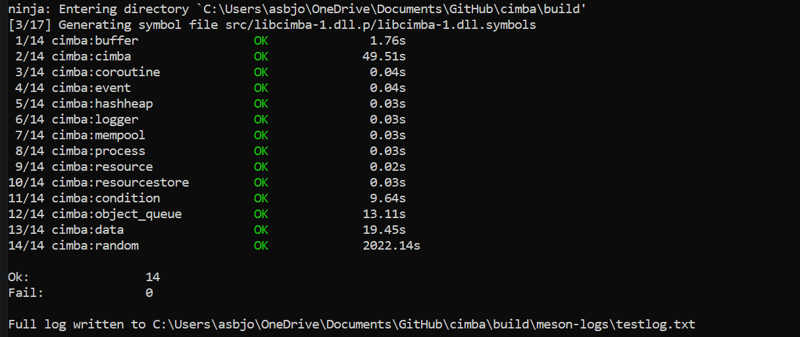

.. _installation:

Installation guide
==================

You will need a C compiler like gcc or clang, the NASM assembler, and a development
toolchain of git, meson, and ninja. For some of the examples in the tutorial, you
will need the free plotting program gnuplot, but this is not strictly necessary for
using Cimba.

We also recommend using a modern integrated development environment (IDE) like CLion,
which has the advantage of being available both on Linux and Windows, integrated
with a gcc toolchain (called MinGW under Windows), and free for open source
work.

Once the build chain is installed, you need to obtain Cimba itself.
Cimba is distributed as free open source code through the Github repository at
https://github.com/ambonvik/cimba. You download, build, and install Cimba with
terminal commands.

Linux
-----

On Linux, it is straightforward:

.. code-block:: bash

    git clone https://github.com/ambonvik/cimba
    cd cimba
    meson setup build
    meson compile -C build
    sudo meson install -C build

You need elevated privileges (`sudo`) for the last step, since it installs
the library and header files in system locations  `/usr/local/include/cimba`
and `/usr/local/bin/cimba`.

Windows
-------

As always, things are more complicated on Windows. So far, Cimba only supports a MinGW-W64
build chain with the `gcc` or `clang` compiler. MSVC is not yet supported.

To use the MinGW-W64 build chain, first make sure you have `gcc` installed and
in your PATH by typing `gcc --version` in a command shell. If it does not respond,
please install it before continuing, see https://www.mingw-w64.org/.

We have encapsulated most of the Windows setup complexity in a batch script called
`setup_MinGW.bat`. This script will call on Microsoft Powershell internally to
change system environment variables safely.

Start a command shell (`cmd.exe`) as administrator. Change directory to where you
want to have the Cimba source hierarchy and issue the following commands:

.. code-block:: batch

   git clone https://github.com/ambonvik/cimba
   cd cimba
   setup_MinGW.bat
   meson compile -C build
   meson install -C build

This will install Cimba in `C:\Program Files\Cimba` and add its `bin` to your
`PATH`. Close the administrator command window when this is done, restart your
computer, and open a new command window without administrator privileges. Type
`echo %PATH%` to verify that the Cimba directory now is in the `PATH`.

If you have Windows Security ransomware protection enabled, you may have to
allow access for various build chain applications to your build folders. You may
also encounter issues with incompatible DLL's already installed by other applications.
Windows will load the one first encountered in your PATH environment variable,
which may be older and incompatible with newly compiled source code.
This may be solved by reordering the items in your PATH or updating the other
applications to the latest version. If all else fails, copy `libwinpthread-1.dll`
from the mingw64\\bin directory to the same directory as your executable files.

Verifying your installation
---------------------------

After installation, we can write a C program like `tutorial/hello.c`:

.. code-block:: c

    #include <cimba.h>
    #include <stdio.h>

    int main(void) {
        printf("Hello world, I am Cimba %s.\n", cimba_version());
    }

Compile it as any other C program, linking to the Cimba library:

.. code-block:: bash

    gcc hello.c -lcimba -o hello

If all goes well, this program should produce output similar to::

    Hello world, I am Cimba 3.0.0 beta.

You now have a working Cimba installation.

For a more comprehensive test, type:

.. code-block:: bash

    meson test -C build

This will run the full suite of unit tests from the `test` directory. It will
take a while. The output will look similar to this:

