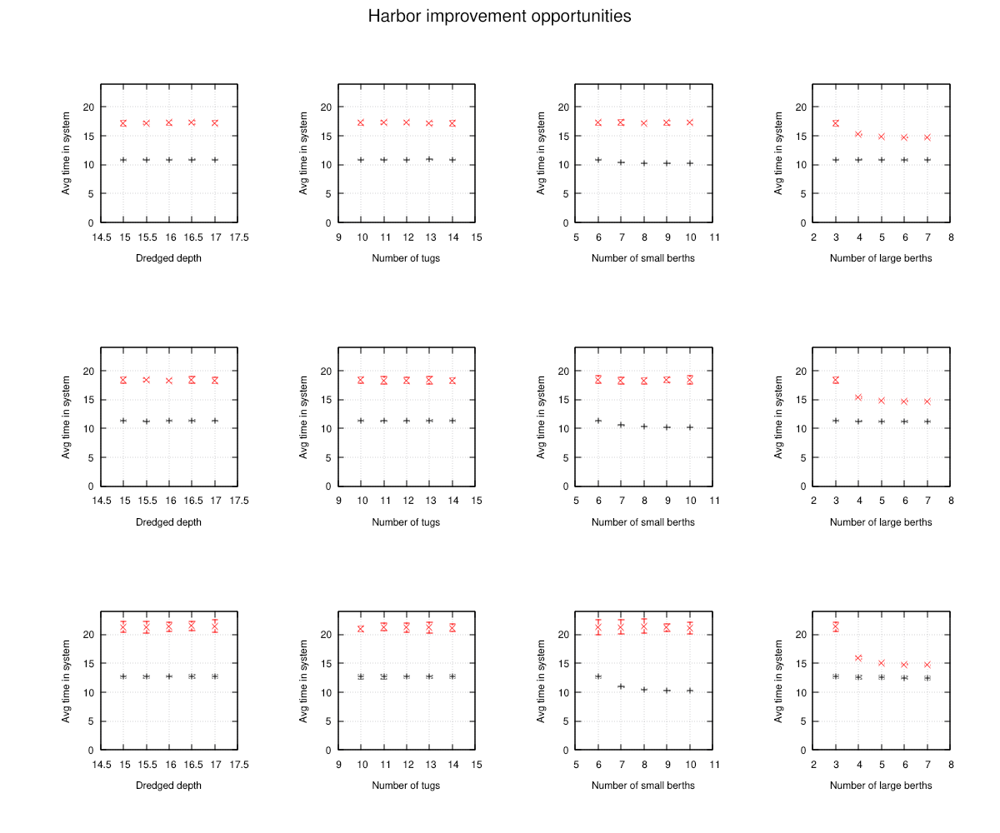

.. _tutorial:

Tutorial: Modeling with Cimba
=============================

.. _tut_1:

Our first simulation - a M/M/1 queue
------------------------------------

In this section, we will walk through the development of a simple model from
connecting basic entities and interactions to parallelizing the model on all
available CPU cores and producing presentation-ready output.

Our first simulated system is a M/M/1 queue. In queuing theory (Kendall)
notation, this abbreviation indicates a queuing system where the arrival process
is memoryless with exponentially distributed intervals, the service process is
the same, there is only one server, and the queue has unlimited capacity. This
is a mathematically well understood system.

The simulation model will verify if the well-known formula for expected
queue length is correct (or vice versa).

Arrival, service, and the queue
^^^^^^^^^^^^^^^^^^^^^^^^^^^^^^^

We model this in a straightforward manner: We need an arrival process that puts
customers into the queue at random intervals, a service process that gets
customers from the queue and services them for a random duration, and the queue
itself. We are not concerned with the characteristics of each customer, just how
many there are in the queue, so we do not need a separate object for each customer.
We will use a :c:struct:`cmb_buffer` for this. In this first iteration, we will hard-code
parameter values for simplicity, such as 75 % utilization, and then do it properly
shortly.

Let us start with the arrival and service processes. The code can be very simple:

.. code-block:: c

     void *arrival(struct cmb_process *me, void *ctx)
    {
        struct cmb_buffer *bp = ctx;

        while (true) {
            double t_ia = cmb_random_exponential(1.0 / 0.75);
            cmb_process_hold(t_ia);
            uint64_t n = 1;
            cmb_buffer_put(bp, &n);
        }
    }

.. code-block:: c

     void *service(struct cmb_process *me, void *ctx)
     {
         struct cmb_buffer *bp = ctx;

         while (true) {
             uint64_t m = 1;
             cmb_buffer_get(bp, &m);
             double t_srv = cmb_random_exponential(1.0);
             cmb_process_hold(t_srv);
         }
     }

This should hopefully be quite intuitive.
The arrivals process generates an exponentially distributed random value with
mean 1/0.75, holds for that amount of interarrival time, puts one new customer
into the queue, and does it again.

Similarly, the service process gets a customer from the queue (waiting for one to
arrive if there are none waiting), generates a random service time with mean 1.0,
holds for the service time, and does it all over again. An average arrival rate
of 0.75 and service rate of 1.0 gives the 0.75 utilization we wanted.

Note that the number of customers to ``put`` or ``get`` is given as a *pointer to
a variable* containing the number, not just a value. In more complex scenarios
than this, the process may encounter a partially completed put or get, and we
need a way to capture the actual state in these cases. For now, just note that
the amount argument to :c:func:`cmb_buffer_put` and :c:func:`cmb_buffer_get` is a
pointer to an unsigned 64-bit integer variable.

The process function signature is a function returning a pointer to void (i.e. a
raw address to anything). It takes two arguments, the first one a pointer to a
:c:struct:`cmb_process` (itself), the second a pointer to void that gives whatever
context the process needs to execute. For now, we only use the context pointer as a
pointer to the queue, and do not use the ``me`` pointer or the return value.

Note also that all Cimba functions used here start with ``cmb_``, indicating
that they belong in the namespace of things in the simulated world. There are
functions from three Cimba modules here, :c:struct:`cmb_process`, :c:struct:`cmb_buffer`,
and :c:struct:`cmb_random`. We will encounter other namespaces and modules soon.

We also need a main function to set it all up, run the simulation, and clean up
afterwards. Let us try this:

.. code-block:: c

    int main(void)
    {
        const uint64_t seed = cmb_random_hwseed();
        cmb_random_initialize(seed);

        cmb_event_queue_initialize(0.0);

        struct cmb_buffer *que = cmb_buffer_create();
        cmb_buffer_initialize(que, "Queue", CMB_UNLIMITED);

        struct cmb_process *arr_proc = cmb_process_create();
        cmb_process_initialize(arr_proc, "Arrival", arrival, que, 0);
        cmb_process_start(arr_proc);

        struct cmb_process *serv_proc = cmb_process_create();
        cmb_process_initialize(serv_proc, "Service", service, que, 0);
        cmb_process_start(serv_proc);

        cmb_event_queue_execute();

        cmb_process_terminate(serv_proc);
        cmb_process_destroy(serv_proc);

        cmb_process_terminate(arr_proc);
        cmb_process_destroy(arr_proc);

        cmb_buffer_terminate(que);
        cmb_buffer_destroy(que);

        cmb_event_queue_terminate();
        cmb_random_terminate();

        return 0;
    }

The first thing it does is to get a suitable random number seed from a hardware
entropy source and initialize our pseudo-random number generators with it.

It then initializes the simulation event queue, specifying at our clock will
start from 0.0. (It could be any other value, but why not 0.0.)

Next, it creates and initializes the :c:struct:`cmb_buffer`, naming it "Queue" and setting
it to unlimited size.

After that, it creates, initializes, and starts the arrival and service processes.
They get a pointer to the newly created :c:struct:`cmb_buffer` as their context argument,
and the event queue is ready, so they can just start immediately.

Notice the pattern here: Objects are first *created*, then *initialized* in a
separate call. The create method allocates heap memory for the object, the initialize
method makes it ready for use. Some objects, such as the event queue, already
exist in pre-allocated memory and cannot be created. There are no
``cmb_event_queue_create()`` or ``cmb_event_queue_destroy()`` functions.

In later examples, we will also
see cases where some Cimba object is simply declared as a local variable and
allocated memory on the stack. We still need to initialize it, since we are not
in C++ with its "Resource Allocation Is Initialization" (RAII) paradigm. In C,
resource allocation is *not* initialization (RAINI?), and we need to be very
clear on each object's memory allocation and initialization status. We have tried
to be as consistent as possible in the Cimba create/initialize/terminate/destroy
object lifecycle.

Having made it this far, ``main()`` calls :c:func:`cmb_event_queue_execute` to run the
simulation before cleaning up.

Note that there are matching ``_terminate()`` calls for each ``_initialize()`` and
matching ``_destroy()`` for each ``_create()``. These functions un-initialize and
and de-allocate the objects that were allocated and initialized.

We can now run our first simulation and see what happens. It will generate
output like this:

.. code-block:: none

    [ambonvik@Threadripper cimba]$ build/tutorial/tut_1_1 | more
        0.0000	dispatcher	cmb_event_queue_execute (294):  Starting simulation run
        0.0000	Arrival	cmb_process_hold (278):  Holding for 0.914167 time units
        0.0000	Arrival	cmb_process_timer_add (343):  Scheduled timeout event at 0.914167
        0.0000	Service	cmb_buffer_get (207):  Gets 1 from Queue, level 0
        0.0000	Service	cmb_buffer_get (244):  Waiting for more, level now 0
        0.0000	Service	cmb_resourceguard_wait (149):  Waits for Queue
       0.91417	dispatcher	process_wakeup_event_time (310):  Wakes Arrival signal 0
       0.91417	Arrival	cmb_buffer_put (291):  Puts 1 into Queue, level 0
       0.91417	Arrival	cmb_buffer_put (298):  Success, found room for 1, has 0 remaining
       0.91417	Arrival	cmb_resourceguard_signal (219):  Scheduling wakeup event for Service
       0.91417	Arrival	cmb_process_hold (278):  Holding for 2.481069 time units
       0.91417	Arrival	cmb_process_timer_add (343):  Scheduled timeout event at 3.395236
       0.91417	dispatcher	wakeup_event_resource (173):  Wakes Service signal 0
       0.91417	Service	cmb_buffer_get (251):  Returned successfully from wait
       0.91417	Service	cmb_buffer_get (207):  Gets 1 from Queue, level 1
       0.91417	Service	cmb_buffer_get (214):  Success, 1 was available, got 1
       0.91417	Service	cmb_process_hold (278):  Holding for 0.361672 time units
       0.91417	Service	cmb_process_timer_add (343):  Scheduled timeout event at 1.275839
        1.2758	dispatcher	process_wakeup_event_time (310):  Wakes Service signal 0
        1.2758	Service	cmb_buffer_get (207):  Gets 1 from Queue, level 0
        1.2758	Service	cmb_buffer_get (244):  Waiting for more, level now 0
        1.2758	Service	cmb_resourceguard_wait (149):  Waits for Queue
        3.3952	dispatcher	process_wakeup_event_time (310):  Wakes Arrival signal 0
        3.3952	Arrival	cmb_buffer_put (291):  Puts 1 into Queue, level 0
        3.3952	Arrival	cmb_buffer_put (298):  Success, found room for 1, has 0 remaining
        3.3952	Arrival	cmb_resourceguard_signal (219):  Scheduling wakeup event for Service
        3.3952	Arrival	cmb_process_hold (278):  Holding for 0.140934 time units
        3.3952	Arrival	cmb_process_timer_add (343):  Scheduled timeout event at 3.536170
        3.3952	dispatcher	wakeup_event_resource (173):  Wakes Service signal 0
        3.3952	Service	cmb_buffer_get (251):  Returned successfully from wait
        3.3952	Service	cmb_buffer_get (207):  Gets 1 from Queue, level 1
        3.3952	Service	cmb_buffer_get (214):  Success, 1 was available, got 1
        3.3952	Service	cmb_process_hold (278):  Holding for 0.051428 time units
        3.3952	Service	cmb_process_timer_add (343):  Scheduled timeout event at 3.446664
        3.4467	dispatcher	process_wakeup_event_time (310):  Wakes Service signal 0
        3.4467	Service	cmb_buffer_get (207):  Gets 1 from Queue, level 0
        3.4467	Service	cmb_buffer_get (244):  Waiting for more, level now 0
        3.4467	Service	cmb_resourceguard_wait (149):  Waits for Queue
        3.5362	dispatcher	process_wakeup_event_time (310):  Wakes Arrival signal 0
        3.5362	Arrival	cmb_buffer_put (291):  Puts 1 into Queue, level 0
        3.5362	Arrival	cmb_buffer_put (298):  Success, found room for 1, has 0 remaining
        3.5362	Arrival	cmb_resourceguard_signal (219):  Scheduling wakeup event for Service
        3.5362	Arrival	cmb_process_hold (278):  Holding for 3.198324 time units
        3.5362	Arrival	cmb_process_timer_add (343):  Scheduled timeout event at 6.734495
        ...

...and will keep on doing that forever. We have to press Ctrl-C or similar
to stop it. The good news is that it works. Each line in the trace contains the
time stamp in simulated time, the name of the currently executing process, exactly
what function and line number is logging, and a formatted message about what is
happening. Our simulated processes seem to be doing what we asked them to do,
but there is a wee bit too much information here.

Stopping a simulation
^^^^^^^^^^^^^^^^^^^^^

We will address stopping first. The processes are *coroutines*, executing
concurrently on a separate stack for each process. Only one process can execute
at a time. It continues executing until it voluntarily *yields* the CPU to some
other coroutine. Calling :c:func:`cmb_process_hold` will do exactly that, transferring
control to the hidden dispatcher process that determines what to do next.

However, the dispatcher only knows about events, not coroutines or processes. It will
run as long as there are scheduled events to execute. Our little simulation will always
have scheduled events, and the dispatcher will not stop on its own. These events
originate from our two processes: To ensure that a process returns to the other end of
its :c:func:`cmb_process_hold` call, it will schedule a wakeup event at the expected time
before it yields control to the dispatcher. When executed, this event will *resume*
the coroutine where it left off, returning through the :c:func:`cmb_process_hold` call with a
return value that indicates normal or abnormal return. (We have ignored the
return values for now in the example above.) So, whenever there are more than
one process running, there may be future events scheduled in the event queue.

To stop the simulation, we simply schedule an "end simulation" event, which
stops any running processes at that point. The dispatcher then ends the run.

This is perhaps easier to do in code than to describe in text. We define a
``struct simulation`` that contains pointers to the entities of our simulated world and
the function for an end simulation event:

.. code-block:: c

    struct simulation {
        struct cmb_process *arr;
        struct cmb_buffer *que;
        struct cmb_process *srv;
    };

    void end_sim(void *subject, void *object)
    {
        struct simulation *sim = object;
        cmb_process_stop(sim->arr, NULL);
        cmb_process_stop(sim->srv, NULL);
    }

We then store pointers to the simulation entities in the ``struct simulation``
and schedule an ``end_sim`` event before executing the event queue:

.. code-block:: c

    int main(void)
    {
        const uint64_t seed = cmb_random_hwseed();
        cmb_random_initialize(seed);
        cmb_event_queue_initialize(0.0);

        struct simulation sim = {};
        sim.que = cmb_buffer_create();
        cmb_buffer_initialize(sim.que, "Queue", CMB_UNLIMITED);

        sim.arr = cmb_process_create();
        cmb_process_initialize(sim.arr, "Arrival", arrival, sim.que, 0);
        cmb_process_start(sim.arr);

        sim.srv = cmb_process_create();
        cmb_process_initialize(sim.srv, "Service", service, sim.que, 0);
        cmb_process_start(sim.srv);

        cmb_event_schedule(end_sim, NULL, &sim, 10.0, 0);
        cmb_event_queue_execute();

        cmb_process_terminate(sim.srv);
        cmb_process_destroy(sim.srv);

        cmb_process_terminate(sim.arr);
        cmb_process_destroy(sim.arr);

        cmb_buffer_terminate(sim.que);
        cmb_buffer_destroy(sim.que);

        cmb_event_queue_terminate();
        cmb_random_terminate();

        return 0;
    }

The arguments to :c:func:`cmb_event_schedule` are the event function, its subject and
object pointers, the simulated time when this event will happen, and an event
priority. We have set end time 10.0 here. It could also be expressed as
``cmb_time() + 10.0`` for "in 10.0 time units from now".

In Cimba, the simulation end does not even have to be at a predetermined time. It is
equally valid for some process in the simulation to schedule an end simulation
event at the current time whenever some condition is met, such as a certain
number of customers having been serviced, a statistics collector having a
certain number of samples, or something else. Or, perhaps even easier, the arrival
process could just stop generating new arrivals, the event queue would clear, and the
simulation would stop. (See
`benchmark/MM1_single.c <https://github.com/ambonvik/cimba/blob/main/benchmark/MM1_single.c>`__
for an example doing exactly that.)

We gave the end simulation event a default priority of 0 as the last argument to
:c:func:`cmb_event_schedule`. Priorities are signed 64-bit integers, ``int64_t``. The
Cimba dispatcher will always select the scheduled event with the lowest
scheduled time as the next event. The simulation clock then jumps to that time and that
event will be executed. If several events
have the *same* scheduled time, the dispatcher will execute the one with the
highest priority first. If several events have the same scheduled time *and*
the same priority, it will execute them in first in first out order.

Again, we ignored the event handle returned by :c:func:`cmb_event_schedule`,
since we will not be using it in this example. If we wanted to keep it, it is an
unsigned 64-bit integer (``uint64_t``).

When initializing our arrivals and service processes, we quietly set the last
argument to :c:func:`cmb_process_initialize` to 0. This was the inherent process
priority for scheduling any events pertaining to this process, its
priority when waiting for some resource, and so on. The processes can adjust
their own (or each other's) priorities during the simulation, dynamically
moving themselves up or down in various queues. Cimba does not attempt to
adjust any priorities by itself, it just acts on whatever the priorities are,
and reshuffles any existing queues as needed if priorities change.

We compile and run, and get something like this:

.. code-block:: none

    [ambonvik@Threadripper cimba]$ build/tutorial/tut_1_2
        0.0000	dispatcher	cmb_event_queue_execute (294):  Starting simulation run
        0.0000	Arrival	cmb_process_hold (278):  Holding for 1.206577 time units
        0.0000	Arrival	cmb_process_timer_add (343):  Scheduled timeout event at 1.206577
        0.0000	Service	cmb_buffer_get (207):  Gets 1 from Queue, level 0
        0.0000	Service	cmb_buffer_get (244):  Waiting for more, level now 0
        0.0000	Service	cmb_resourceguard_wait (149):  Waits for Queue
        1.2066	dispatcher	process_wakeup_event_time (310):  Wakes Arrival signal 0
        1.2066	Arrival	cmb_buffer_put (291):  Puts 1 into Queue, level 0
        1.2066	Arrival	cmb_buffer_put (298):  Success, found room for 1, has 0 remaining
        1.2066	Arrival	cmb_resourceguard_signal (219):  Scheduling wakeup event for Service
        1.2066	Arrival	cmb_process_hold (278):  Holding for 0.269439 time units
        1.2066	Arrival	cmb_process_timer_add (343):  Scheduled timeout event at 1.476016
        1.2066	dispatcher	wakeup_event_resource (173):  Wakes Service signal 0
        1.2066	Service	cmb_buffer_get (251):  Returned successfully from wait
        1.2066	Service	cmb_buffer_get (207):  Gets 1 from Queue, level 1
        1.2066	Service	cmb_buffer_get (214):  Success, 1 was available, got 1
        1.2066	Service	cmb_process_hold (278):  Holding for 0.112337 time units
        1.2066	Service	cmb_process_timer_add (343):  Scheduled timeout event at 1.318914
        1.3189	dispatcher	process_wakeup_event_time (310):  Wakes Service signal 0
        1.3189	Service	cmb_buffer_get (207):  Gets 1 from Queue, level 0
        1.3189	Service	cmb_buffer_get (244):  Waiting for more, level now 0
        1.3189	Service	cmb_resourceguard_wait (149):  Waits for Queue

        ...

        9.3630	dispatcher	wakeup_event_resource (173):  Wakes Service signal 0
        9.3630	Service	cmb_buffer_get (251):  Returned successfully from wait
        9.3630	Service	cmb_buffer_get (207):  Gets 1 from Queue, level 1
        9.3630	Service	cmb_buffer_get (214):  Success, 1 was available, got 1
        9.3630	Service	cmb_process_hold (278):  Holding for 0.039627 time units
        9.3630	Service	cmb_process_timer_add (343):  Scheduled timeout event at 9.402603
        9.4026	dispatcher	process_wakeup_event_time (310):  Wakes Service signal 0
        9.4026	Service	cmb_buffer_get (207):  Gets 1 from Queue, level 0
        9.4026	Service	cmb_buffer_get (244):  Waiting for more, level now 0
        9.4026	Service	cmb_resourceguard_wait (149):  Waits for Queue
        10.000	dispatcher	cmb_process_stop (705):  Stop Arrival value (nil)
        10.000	dispatcher	cmb_process_stop (705):  Stop Service value (nil)
        10.000	dispatcher	cmb_event_queue_execute (297):  No more events in queue

Progress: It started, ran, and stopped.

.. _tut_1_logging:

Setting logging levels
^^^^^^^^^^^^^^^^^^^^^^

Next, the verbiage. Cimba has
powerful and flexible logging that gives you fine-grained control of what to log.

The core logging function is called :c:func:`cmb_logger_vfprintf()`. As the name says,
it is
similar to the standard function ``vfprintf()`` but with some Cimba-specific added
features. You will rarely interact directly with this function, but instead call
wrapper functions (actually macros) like :c:macro:`cmb_logger_user()` or
:c:macro:`cmb_logger_error()`.

The key concept to understand here is the *logger flags*. Cimba uses a 32-bit
unsigned integer (``uint32_t``) as a bit mask to determine what log entries to print
and which to ignore. Cimba reserves the top four bits for its own use, identifying
messages of various severities, leaving the 28 remaining bits for the user application.

There is a global (actually thread local) bit field and a bit mask in each call. If a
simple bitwise and (``&``) between the global bit field and the caller's bit mask gives a
non-zero result, that line is printed, otherwise not. Initially, all bits in the global
bit field are on, ``0xFFFFFFFF``. You can turn selected bits on and off with
:c:func:`cmb_logger_flags_on` and :c:func:`cmb_logger_flags_off`.

Again, it may be easier to show this in code than to explain. We add user-defined logging
messages to the end event and the two processes. The messages take ``printf``-style
format strings and arguments:

.. code-block:: c

    #include <cimba.h>
    #include <stdio.h>

    #define USERFLAG1 0x00000001

    struct simulation {
        struct cmb_process *arr;
        struct cmb_buffer *que;
        struct cmb_process *srv;
    };

    void end_sim(void *subject, void *object)
    {
        struct simulation *sim = object;

        cmb_logger_user(stdout, USERFLAG1, "--- Game Over ---");
        cmb_process_stop(sim->arr, NULL);
        cmb_process_stop(sim->srv, NULL);
    }

    void *arrival(struct cmb_process *me, void *ctx)
    {
        struct cmb_buffer *bp = ctx;

        while (true) {
            double t_ia = cmb_random_exponential(1.0 / 0.75);
            cmb_logger_user(stdout, USERFLAG1, "Holds for %f time units", t_ia);
            cmb_process_hold(t_ia);
            uint64_t n = 1;
            cmb_logger_user(stdout, USERFLAG1, "Puts one into the queue");
            cmb_buffer_put(bp, &n);
        }
    }

    void *service(struct cmb_process *me, void *ctx)
    {
        struct cmb_buffer *bp = ctx;

        while (true) {
            uint64_t m = 1;
            cmb_logger_user(stdout, USERFLAG1, "Gets one from the queue");
            cmb_buffer_get(bp, &m);
            double t_srv = cmb_random_exponential(1.0);
            cmb_logger_user(stdout, USERFLAG1, "Got one, services it for %f time units", t_srv);
            cmb_process_hold(t_srv);
        }
    }

We also suppress the Cimba informationals from the main function:

.. code-block:: c

        cmb_logger_flags_off(CMB_LOGGER_INFO);

We compile and run, and get something like this:

.. code-block:: none

    [ambonvik@Threadripper cimba]$ build/tutorial/tut_1_3
    0.0000	Arrival	arrival (25):  Holds for 5.990663 time units
    0.0000	Service	service (38):  Gets one from the queue
    5.9907	Arrival	arrival (28):  Puts one into the queue
    5.9907	Arrival	arrival (25):  Holds for 0.687769 time units
    5.9907	Service	service (41):  Got one, services it for 0.758971 time units
    6.6784	Arrival	arrival (28):  Puts one into the queue
    6.6784	Arrival	arrival (25):  Holds for 2.199251 time units
    6.7496	Service	service (38):  Gets one from the queue
    6.7496	Service	service (41):  Got one, services it for 0.589826 time units
    7.3395	Service	service (38):  Gets one from the queue
    8.8777	Arrival	arrival (28):  Puts one into the queue
    8.8777	Arrival	arrival (25):  Holds for 0.523423 time units
    8.8777	Service	service (41):  Got one, services it for 1.277856 time units
    9.4011	Arrival	arrival (28):  Puts one into the queue
    9.4011	Arrival	arrival (25):  Holds for 1.751825 time units
    10.000	dispatcher	end_sim (15):  --- Game Over ---

Only our user-defined logging messages are printed. Note how the simulation time,
the name of the active process, the calling function, and the line number are
automagically prepended to the user-defined message.

We turn off our user-defined messages like this:

.. code-block:: c

    cmb_logger_flags_off(CMB_LOGGER_INFO);
    cmb_logger_flags_off(USERFLAG1);

As you would expect, this version of the program produces no output.

Collecting and reporting statistics
^^^^^^^^^^^^^^^^^^^^^^^^^^^^^^^^^^^

Which brings us to getting some *useful* output. By now, we are suitably convinced
that our simulated M/M/1 queuing system is behaving as we expect, so we want it to
start reporting some statistics on the queue length.

It will be no surprise that Cimba contains flexible and powerful statistics
collectors and reporting functions. There is actually one built into the
:c:struct:`cmb_buffer` we have been using. We just need to turn it on:

.. code-block::

    struct simulation sim = {};
    sim.que = cmb_buffer_create();
    cmb_buffer_initialize(sim.que, "Queue", CMB_UNLIMITED);
    cmb_buffer_start_recording(sim.que);

After the simulation is finished, we can make it report its history like this:

.. code-block::

    cmb_buffer_stop_recording(sim.que);
    cmb_buffer_print_report(sim.que, stdout);

We increase the running time from ten to one million time units, compile, and run.
Very shortly thereafter, output appears:

.. code-block:: none

    /home/ambonvik/github/cimba/build/tutorial/tut_1_4
    Buffer levels for Queue
    N  1314513  Mean    2.249  StdDev    2.867  Variance    8.221  Skewness    2.743  Kurtosis    11.94
    --------------------------------------------------------------------------------
    ( -Infinity,      0.000)   |
    [     0.000,      2.050)   |##################################################
    [     2.050,      4.100)   |##########-
    [     4.100,      6.150)   |#####=
    [     6.150,      8.200)   |###-
    [     8.200,      10.25)   |#=
    [     10.25,      12.30)   |=
    [     12.30,      14.35)   |=
    [     14.35,      16.40)   |-
    [     16.40,      18.45)   |-
    [     18.45,      20.50)   |-
    [     20.50,      22.55)   |-
    [     22.55,      24.60)   |-
    [     24.60,      26.65)   |-
    [     26.65,      28.70)   |-
    [     28.70,      30.75)   |-
    [     30.75,      32.80)   |-
    [     32.80,      34.85)   |-
    [     34.85,      36.90)   |-
    [     36.90,      38.95)   |-
    [     38.95,      41.00)   |-
    [     41.00,  Infinity )   |-
    --------------------------------------------------------------------------------

The text-mode histogram uses the character ``#`` to indicate a full pixel, ``=`` for
one that is more than half full, and ``-`` for one that contains something but less
than half filled.

We can also get a pointer to the :c:struct:`cmb_timeseries` object by
calling :c:func:`cmb_buffer_history` and doing further analysis on that. As an
example, let's do the first 20 partial autocorrelation coefficients of the queue
length time series and print a correlogram of that as well:

.. code-block:: c

    struct cmb_timeseries *ts = cmb_buffer_history(sim.que);
    double pacf_arr[21];
    cmb_timeseries_PACF(ts, 20, pacf_arr, NULL);
    cmb_timeseries_print_correlogram(ts, stdout, 20, pacf_arr);

Output:

.. code-block:: none

               -1.0                              0.0                              1.0
    --------------------------------------------------------------------------------
       1   0.952                                  |###############################-
       2   0.348                                  |###########-
       3  -0.172                            =#####|
       4   0.138                                  |####=
       5  -0.089                               =##|
       6   0.087                                  |##=
       7  -0.058                                =#|
       8   0.064                                  |##-
       9  -0.046                                =#|
      10   0.051                                  |#=
      11  -0.037                                -#|
      12   0.042                                  |#-
      13  -0.032                                -#|
      14   0.036                                  |#-
      15  -0.026                                 =|
      16   0.033                                  |#-
      17  -0.023                                 =|
      18   0.029                                  |=
      19  -0.022                                 =|
      20   0.025                                  |=
    --------------------------------------------------------------------------------

This is not quite publication-ready graphics, but can be useful at the model
development stage we are at now: We have numbers. Theory predicts an average
queue length of 2.25 for a M/M/1 queue at 75 % utilization. We just got 2.249.

Close, but is it close enough? We need more resolving power.

Refactoring for parallelism
^^^^^^^^^^^^^^^^^^^^^^^^^^^

Before we go there, we will clean up a few rough edges. The compiler keeps warning
us about unused function arguments. Unused arguments is not unusual with Cimba,
since we often do not need all arguments to event and process functions. However,
we do not want to turn off the warning altogether, but will inform the compiler
(and human readers of the code) that this is intentional by using the
:c:macro:`cmb_unused()` macro:

.. code-block:: c

    void end_sim(void *subject, void *object)
    {
        cmb_unused(subject);
        struct simulation *sim = object;

        cmb_logger_user(stdout, USERFLAG1, "--- Game Over ---");
        cmb_process_stop(sim->arr, NULL);
        cmb_process_stop(sim->srv, NULL);
    }

Warnings gone. Next, we want to tidy up the hard-coded parameters to a proper
data structure. We define a ``struct trial`` to contain parameters and output
values, and bundle both our existing ``struct simulation`` and ``struct trial`` in
a ``struct context``, and pass that between the functions.

.. code-block:: c

    struct simulation {
        struct cmb_process *arr;
        struct cmb_buffer *que;
        struct cmb_process *srv;
    };

    struct trial {
        /* Parameters */
        double arr_rate;
        double srv_rate;
        double warmup_time;
        double duration;
        /* Results */
        double avg_queue_length;
    };

    struct context {
        struct simulation *sim;
        struct trial *trl;
    };

For now, we just declare these structs as local variables on the stack.

We define a small helper function to load the parameters into the ``trial``:

.. code-block:: c

    void load_params(struct trial *trl)
    {
        cmb_assert_release(trl != NULL);

        trl->arr_rate = 0.75;
        trl->srv_rate = 1.0;
        trl->warmup_time = 1000.0;
        trl->duration = 1e6;
    }

.. admonition:: Asserts and debuggers

    Notice the :c:macro:`cmb_assert_release())` in this code
    fragment. It is a custom version of the standard ``assert()`` macro, triggering
    a hard stop if the condition evaluates to ``false``. Our custom asserts come in
    two flavors, :c:macro:`cmb_assert_debug()` and :c:macro:`cmb_assert_release()`.
    The ``_debug`` assert
    behaves like the standard one and goes away if the preprocessor symbol ``NDEBUG``
    is ``#defined``. The ``_release`` assert is still there, but also goes away if ``NASSERT``
    is ``#defined``. See :ref:`the background section <background_error>` for details.

    We will trip one and see how it looks. We temporarily replace the
    exponentially distributed service time with a normally distributed one, mean
    1.0 and sigma 0.25. This will almost surely generate a negative value
    sooner or later, which will cause the service process to try to hold for a
    negative time, resuming in its own past. That should not be possible:

    .. code-block:: c

                // const double t_srv = cmb_random_exponential(t_srv_mean);
                const double t_srv = cmb_random_normal(1.0, 0.25);

    Sure enough::

        /home/ambonvik/github/cimba/build/tutorial/tut_1_5
        9359.5	Service	cmb_process_hold (272):  Fatal: Assert "dur >= 0.0" failed, source file cmb_process.c, seed 0x9bec8a16f0aa802a

        Process finished with exit code 134 (interrupted by signal 6:SIGABRT)

    The output line lists the simulated time, the process, the function and line of code,
    the condition that failed, the source code file where it blew up, and the random
    number seed that was used to initialize the run.

    If using a debugger, place a breakpoint  in :c:func:`cmi_assert_failed`.
    If some assert trips, control will always
    go there. You can then page up the stack and see exactly what happened.

    .. image:: ../images/debugger_assert.png

We also need a pair of events to turn data recording on and off at specified times:

.. code-block:: c

    static void start_rec(void *subject, void *object)
    {
        cmb_unused(subject);
        const struct context *ctx = object;

        const struct simulation *sim = ctx->sim;
        cmb_buffer_start_recording(sim->que);
    }

    static void stop_rec(void *subject, void *object)
    {
        cmb_unused(subject);
        const struct context *ctx = object;

        const struct simulation *sim = ctx->sim;
        cmb_buffer_stop_recording(sim->que);
    }

As the last refactoring step before we parallelize, we move the simulation driver
code from ``main()`` to a separate function ``run_MM1_trial()`` and call it from
``main()``. For reasons that soon will be evident, its argument is a single pointer
to void, even if we immediately cast this to our ``struct trial *`` once inside the
function. We remove the call to :c:func:`cmb_buffer_report`, calculate the average
queue length, and store it in the ``trial`` results field:

.. code-block:: c

        struct cmb_wtdsummary wtdsum;
        const struct cmb_timeseries *ts = cmb_buffer_history(ctx.sim->que);
        cmb_timeseries_summarize(ts, &wtdsum);
        ctx.trl->avg_queue_length = cmb_wtdsummary_mean(&wtdsum);

The ``main()`` function is now reduced to this:

.. code-block:: c

    int main(void)
    {
        struct trial trl = {};
        load_params(&trl);

        run_MM1_trial(&trl);

        printf("Avg %f\n", trl.avg_queue_length);

        return 0;
    }

We will not repeat the rest of the code here. You can find it in
`tutorial/tut_1_5.c <https://github.com/ambonvik/cimba/blob/main/tutorial/tut_1_5.c>`__.
Instead, we compile and run it, receiving output similar to this:

.. code-block:: none

    /home/ambonvik/github/cimba/build/tutorial/tut_1_5
    Avg 2.234060

.. _tut_1_parallel:

Parallelization
^^^^^^^^^^^^^^^

So far, we have been developing the model in a single thread, running on a single
CPU core. All the concurrency between our simulated processes (coroutines) is
happening inside this single thread. The simulation is still pretty fast, but a
modern CPU has many cores, most of them idly watching our work so far with
detached interest. Let's put them to work.

Cimba is built from the ground up for coarse-grained parallelism. Depending on
the viewpoint, parallelizing a discrete event simulation is either terribly
hard or trivially simple. The hard way to do it is to try to parallelize a
single simulation run. This is near impossible, since the outcome of each event
may influence all future events in complex and model-dependent ways.

The easy way is to realize that we rarely do a *single* simulation run. We want to
run *many* to generate statistically significant answers to questions and/or to test
many parameter combinations, perhaps in a full factorial experimental design.
Even if we could answer a question by a single very long run, we may get a better
understanding by splitting it into many shorter runs to not just get an average, but
also a sense of the variability of our results.

When we do multiple replications of a simulation, these are by design intended to be
independent, identically distributed trials. Multiple parameter combinations are
no less independent. This is what is called an "embarrassingly parallel" problem.
There is no interaction between the trials, and they can be trivially parallelized
by just running them at the same time and collecting the output.

Cimba creates a pool of worker threads, one per (logical) CPU core on the system.
You describe your experiment as an array of trials and the function to execute each
trial, and pass these to :c:func:`cimba_run_experiment`.
The worker threads will pull trials from the experiment array and run them,
storing the results back in your trial struct, before moving to the next un-executed
trial in the array. This gives an inherent load balancing with minimal overhead. When all
trials have been executed, it stops.

Returning to our M/M/1 queue, suppose that we want to test the commonly accepted
queuing theory by testing utilization factors from 0.025 to 0.975 in steps of 0.025,
and that we want to run 10 replications of each parameter combination. We then
want to calculate and plot the mean and 95 % confidence bands for each parameter
combination, and compare that to the analytically calculated value in publication
ready graphics. (Not that any famous journal would accept an article purporting to confirm
the queue length formula for the M/M/1 queue, but this is only a tutorial after all.)

We can set up the experiment like this:

.. code-block:: c

    const unsigned n_rhos = 39;
    const double rho_start = 0.025;
    const double rho_step = 0.025;
    const unsigned n_reps = 10;

    const double srv_rate = 1.0;
    const double warmup_time = 1000.0;
    const double duration = 1.0e6;

    printf("Setting up experiment\n");
    const unsigned n_trials = n_rhos * n_reps;
    struct trial *experiment = calloc(n_trials, sizeof(*experiment));

    uint64_t ui_exp = 0u;
    double rho = rho_start;
    for (unsigned ui_rho = 0u; ui_rho < n_rhos; ui_rho++) {
        for (unsigned ui_rep = 0u; ui_rep < n_reps; ui_rep++) {
            experiment[ui_exp].arr_rate = rho * srv_rate;
            experiment[ui_exp].srv_rate = srv_rate;
            experiment[ui_exp].warmup_time = warmup_time;
            experiment[ui_exp].duration = duration;
            experiment[ui_exp].seed_used = 0u;
            experiment[ui_exp].avg_queue_length = 0.0;

            ui_exp++;
        }

        rho += rho_step;
    }

We allocate the experiment array on the heap, since its size will depend on the
parameters. Here, we have hard-coded them for the sake of the tutorial, but they
would probably be given as an input file or as interactive input in real usage.

.. note::

    Do not use any writeable global variables in your model. The entire parallelized
    experiment exists in a shared memory space. Threads will be sharing CPU cores
    in unpredictable ways. A global variable accessible to several threads can be
    read and written by any thread, creating potential hard-to-diagnose bugs.

    Do not use any static local variables in your model either. Your model
    functions will be called by all threads. A static local variable remembers its
    value from the last call, which may have been a completely different thread.
    Diagnosing those bugs will not be any easier.

    Regular local variables, function arguments, and heap memory (``malloc()`` /
    ``free()``) is thread safe.

    If you absolutely *must* have a global or static variable, consider prefixing
    it by :c:macro:`CMB_THREAD_LOCAL` to make it global or static *within that thread only*,
    creating separate copies per thread.

We can then run the experiment:

.. code-block:: c

        cimba_run_experiment(experiment, n_trials, sizeof(*experiment), run_MM1_trial);

The first argument is the experiment array, the last argument the simulation
driver function we have developed earlier. It will take a pointer to a trial as
its argument, but the internals of :c:func:`cimba_run_experiment` cannot know the
detailed structure of your ``struct trial``, so it will be passed as a ``void *``.
We need to explain the number of trials and the size of each trial struct as the
second and third arguments to :c:func:`cimba_run_experiment` for it to do correct
pointer arithmetic internally.

When done, we can collect the results like this:

.. code-block:: c

        ui_exp = 0u;
        FILE *datafp = fopen("tut_1_6.dat", "w");
        fprintf(datafp, "# utilization\tavg_queue_length\tconf_interval\n");
        for (unsigned ui_rho = 0u; ui_rho < n_rhos; ui_rho++) {
            const double ar = experiment[ui_exp].arr_rate;
            const double sr = experiment[ui_exp].srv_rate;
            const double rho_used = ar / sr;

            struct cmb_datasummary cds;
            cmb_datasummary_initialize(&cds);
            for (unsigned ui_rep = 0u; ui_rep < n_reps; ui_rep++) {
                cmb_datasummary_add(&cds, experiment[ui_exp].avg_queue_length);
                ui_exp++;
            }

            cmb_assert_debug(cmb_datasummary_count(&cds) == n_reps);
            const double sample_avg = cmb_datasummary_mean(&cds);
            const double sample_sd = cmb_datasummary_stddev(&cds);
            const double t_crit = 2.228;
            fprintf(datafp, "%f\t%f\t%f\n", rho_used, sample_avg, t_crit * sample_sd);
            cmb_datasummary_terminate(&cds);
        }

        fclose(datafp);
        free(experiment);

        write_gnuplot_commands();
        system("gnuplot -persistent tut_1_6.gp");

We use a :c:struct:`cmb_datasummary` to simplify the calculation of confidence intervals,
knowing that it will calculate correct moments in a single pass of the data. We
then write the results to an output file, write a gnuplot command file to plot
the results, and spawn a gnuplot window to display the chart.

Also, we would like to know the progress of our experiment, so we define a
separate level of logger messages like this:

.. code-block:: c

    #define USERFLAG1 0x00000001
    #define USERFLAG2 0x00000002

.. note::

    The logging flags are bitmasks, not consecutive numbers. The next three
    values would be ``0x00000004``, ``0x00000008``, and ``0x00000010``. You can
    combine flag values bit-wise. For instance, a call to ``cmb_logger_user()``
    with flag level 63 (``0xFF``) will print a line if *any* of the lowest 8 bits
    are set.

We add a logging call to our ``run_MM1_trial()``:

.. code-block:: c

    cmb_logger_user(stdout, USERFLAG2,
                    "seed: 0x%016" PRIx64 " rho: %f",
                    trl->seed_used, trl->arr_rate / trl->srv_rate);

We use the macro ``PRIx64`` from ``#include <inttypes.h>`` for portable formatting
of the ``uint64_t`` seed value.

We add some code to measure run time and some extra ``printf()`` calls, compile
and run, and get output similar to this:

.. code-block:: none

    /home/ambonvik/github/cimba/build/tutorial/tut_1_6
    Cimba version 3.0.0-beta
    Setting up experiment
    Executing experiment
    0	    0.0000	dispatcher	run_MM1_trial (120):  seed: 0xc81e7ac2d54abef1 rho: 0.025000
    2	    0.0000	dispatcher	run_MM1_trial (120):  seed: 0xb995a846d37f1522 rho: 0.025000
    1	    0.0000	dispatcher	run_MM1_trial (120):  seed: 0x246364a107f945e7 rho: 0.025000
    5	    0.0000	dispatcher	run_MM1_trial (120):  seed: 0xa7b5e743900ccc53 rho: 0.025000
    4	    0.0000	dispatcher	run_MM1_trial (120):  seed: 0x775e54d85c8760eb rho: 0.025000
    3	    0.0000	dispatcher	run_MM1_trial (120):  seed: 0x6d4f0bb78fab7321 rho: 0.025000
    6	    0.0000	dispatcher	run_MM1_trial (120):  seed: 0xa0d4d65c953e6ba9 rho: 0.025000
    7	    0.0000	dispatcher	run_MM1_trial (120):  seed: 0xc66885b9c3e01198 rho: 0.025000
    10	    0.0000	dispatcher	run_MM1_trial (120):  seed: 0x0d0324ac1ad47314 rho: 0.050000
    9	    0.0000	dispatcher	run_MM1_trial (120):  seed: 0x60ea3e25c23886cd rho: 0.025000
    8	    0.0000	dispatcher	run_MM1_trial (120):  seed: 0xb2cf2d84fb2cd36e rho: 0.025000
    11	    0.0000	dispatcher	run_MM1_trial (120):  seed: 0x04b83d03be4d5393 rho: 0.050000
    12	    0.0000	dispatcher	run_MM1_trial (120):  seed: 0x6a3c8c7d7657b5a2 rho: 0.050000
    13	    0.0000	dispatcher	run_MM1_trial (120):  seed: 0x79e878ab601d9ba9 rho: 0.050000
    14	    0.0000	dispatcher	run_MM1_trial (120):  seed: 0xcd50fbb55578f7d2 rho: 0.050000
    15	    0.0000	dispatcher	run_MM1_trial (120):  seed: 0xfabb1c5f934c9aad rho: 0.050000

    ...

    384	    0.0000	dispatcher	run_MM1_trial (120):  seed: 0x8aa3bb76ccc324a6 rho: 0.975000
    385	    0.0000	dispatcher	run_MM1_trial (120):  seed: 0x9290801927a4f348 rho: 0.975000
    386	    0.0000	dispatcher	run_MM1_trial (120):  seed: 0xeaff225d8d61a4ad rho: 0.975000
    387	    0.0000	dispatcher	run_MM1_trial (120):  seed: 0xc2c20c0bef3959b7 rho: 0.975000
    388	    0.0000	dispatcher	run_MM1_trial (120):  seed: 0xc11445ad99b4a5c9 rho: 0.975000
    389	    0.0000	dispatcher	run_MM1_trial (120):  seed: 0x5faccc75f803deef rho: 0.975000
    Finished experiment, writing results to file
    It took 3.41133 sec

Note that the Cimba logger understands that it is now running multithreaded and
prepends each logging line with the trial index in your experiment array. Note
also that the trials may not be executed in strict sequence, since we do not
control the detailed interleaving of the threads. That is up to the operating
system.

We also get this image in a separate window:

    .. image:: ../images/tut_1_6.png

Evidently, we cannot reject the null hypothesis that conventional queuing theory
may be correct. Nor can we reject the hypothesis that Cimba may be working correctly.

This concludes our first tutorial. We have followed the development steps from a
first minimal model to demonstrate process interactions to a complete parallelized
experiment with graphical output. The files ``tutorial/tut_1_*.c`` include working
code for each stage of development. The version
`tutorial/tut_1_7.c <https://github.com/ambonvik/cimba/blob/main/tutorial/tut_1_7.c>`__
is functionally the same as our final
`tutorial\tut_1_6.c <https://github.com/ambonvik/cimba/blob/main/tutorial/tut_1_6.c>`__
but with additional inline explanatory comments.

For additional variations of this theme, see also
`benchmark/MM1_multi.c <https://github.com/ambonvik/cimba/blob/main/benchmark/MM1_multi.c>`__
where the queue is modeled as a :c:struct:`cmb_objectqueue` with individual customers
tracking their time in the system, and
`test/test_cimba.c <https://github.com/ambonvik/cimba/blob/main/test/test_cimba.c>`__
modeling a M/G/1 queue with different utilizations and service time varibilities.

.. _tut_2:

Acquiring, preempting, and releasing resources
----------------------------------------------

We will now introduce the Cimba methods for acquiring and releasing resources
of various kinds. We will also show additional process interactions where
the active process is acting directly on some other process. We will
demonstrate these through a somewhat cartoonish example. First, some necessary
background.

Resources and resource pools
^^^^^^^^^^^^^^^^^^^^^^^^^^^^

Cimba provides two kinds of resources that a process can acquire, hold, and release.
These are the :c:struct:`cmb_resource` and the :c:struct:`cmb_resourcepool`. The difference is
that the :c:struct:`cmb_resource` is a single unit that only can be held by one process
at a time, while the :c:struct:`cmb_resourcepool` consists of several units that each
can be held by a process. A process may hold more than one unit from the
:c:struct:`cmb_resourcepool`, but there is a certain upper limit for how many units are
available simultaneously from the pool. In computer science terms, the
:c:struct:`cmb_resource` is a *binary semaphore*, while the :c:struct:`cmb_resourcepool` is a
*counting semaphore*.

If the requested resource or number of resources is not available, the ``_acquire``
calls will wait in a priority queue until the requested amount becomes available.
The ordering is determined first by the process priority, then FIFO based on the
simulation timestamp when it entered the queue. Changing a process' priority with
:c:func:`cmb_process_priority_set` will also have effect on any priority queues it may
be waiting in, with no need to explicitly reorder the queue from the application.

The typical usage pattern is also the reason for the name :c:func:`cmb_process_hold`:

.. code-block:: c

    cmb_resource_acquire(res);
    cmb_process_hold(dur);
    cmb_resource_release(res);

Or:

.. code-block:: c

    cmb_resourcepool_acquire(respl, 6);
    cmb_process_hold(dur);
    cmb_resourcepool_release(respl, 3);
    cmb_process_hold(dur);
    cmb_resourcepool_release(respl, 3);

Or even:

.. code-block:: c

    cmb_resourcepool_acquire(respl, 6);
    cmb_resource_acquire(res);
    cmb_process_hold(dur);
    cmb_resource_release(res);
    cmb_resourcepool_release(respl, 6);

Note that there is no timeout argument in these calls. We will show how to do this
in :ref:`the next tutorial <tut_3>`, but will leave it as a (very small) cliffhanger
until then.

Note also that there are some differences between the ``_acquire()``/``_release()`` pairs
and the similar ``_get()``/``_put()`` pairs for buffers and queues. Suppose that you
have a ``cmb_buffer`` of maximal size 10. It is still possible to call
``cmb_buffer_put(oqp, 100)``. The call just puts in 10 to begin with, waits for
someone to get one or more of them, and then keeps refilling the queue until all 100 are
put in. The call only returns at that point (unless interrupted, which we will discuss in
a moment).  Similarly, ``cmb_buffer_get(oqp, 100)`` works as expected, and trying to
``_put()`` another item into a full :c:struct:`cmb_objectqueue` or
:c:struct:`cmb_priorityqueue` just suspends the caller until space becomes available.

Resources and resource pools are not like that. Requesting more from a resource pool
than its maximum is an error. If we have a resource pool with maximum size 10, 5 of
which already are in use, it is fine to call ``cmb_resourcepool_acquire(rp, 10)``. The
call just waits until all 10 are available, accumulating its holding whenever some
become available until it has all, and then returns. On the other hand, calling
``cmb_resourcepool_acquire(rp, 11)`` will not work. It is not a meaningful call, so
Cimba will do the most helpful thing it can: Trip an `assert()` and crash your program
on the spot, encouraging you to find and fix the error.

Preemptions and interruptions
^^^^^^^^^^^^^^^^^^^^^^^^^^^^^

We have already explained that Cimba processes (and the coroutines they are
derived from) execute atomically until they explicitly yield control. These
yield (and resume) points are hidden inside functions like :c:func:`cmb_process_hold`
or :c:func:`cmb_resource_acquire`. Inside the call, control may (or may not) be
passed to some other process. The call will only return when control is transferred
back to this process. To the calling process just sitting on its own stack, it
looks very simple, but a lot of things may be happening elsewhere in the meantime.

A yielded process does not have any guarantees for what may be happening to it
before it resumes control. Other processes may act on this process, perhaps
stopping it outright, waking it up early, or snatching a resource away from it.

To be able to tell the difference, functions like :c:func:`cmb_process_hold` and
:c:func:`cmb_resource_acquire` have an integer return value, an ``int64_t``. We have
quietly ignored the return values in our earlier examples, but they are an
important signalling mechanism between Cimba processes.

Cimba has reserved a few possible return values for itself. Most importantly,
:c:macro:`CMB_PROCESS_SUCCESS` (numeric value 0) means a normal and successful return.
For example, if :c:func:`cmb_process_hold` returns :c:macro:`CMB_PROCESS_SUCCESS`, the
calling process knows that it was woken up at the scheduled time without any shenanigans.

The second most important value is :c:macro:`CMB_PROCESS_PREEMPTED`. That means that a
higher priority process just forcibly took away some resource held by this
process. There are also :c:macro:`CMB_PROCESS_INTERRUPTED`, :c:macro:`CMB_PROCESS_STOPPED`,
:c:macro:`CMB_PROCESS_CANCELLED`, and :c:macro:`CMB_PROCESS_TIMEOUT`. These predefined signals
are all defined as small negative values, leaving an enormous number of available
signal values to application-defined meanings. In particular, all positive
integers are available to the application for coding various interrupt signals
between processes.

These signal values create a rich set of direct process interactions. As an
example, suppose some process currently holds 10 units from some resource pool.
It then calls :c:func:`cmb_resourcepool_acquire` requesting 10 more units. At that
moment, only 5 are available. The process takes these 5 and adds itself to the
priority queue maintained by the resource guard before yielding. In effect, it asks
to be woken up whenever some more is available, intending to return from its
acquire call only when all 10 units have been collected.

There are now three different outcomes for the ``_acquire()`` call:

1. All goes as expected, 5 more units eventually become available, the process
   takes them, and returns :c:macro:`CMB_PROCESS_SUCCESS`. It now holds 20 units.

2. Some higher priority process calls :c:func:`cmb_resourcepool_preempt` and this
   process is targeted. The higher priority process takes *all* units held by
   the victim process. Its acquire call returns :c:macro:`CMB_PROCESS_PREEMPTED`. It
   now holds 0 units.

3. Some other process calls :c:func:`cmb_process_interrupt` on this process. It
   excuses itself from the resource guard priority queue and returns whatever
   signal value was given to :c:func:`cmb_process_interrupt`, perhaps
   :c:macro:`CMB_PROCESS_INTERRUPTED` or some other value that has an
   application-defined meaning. It unwinds the 5 units it collected during the
   call and returns holding the same amount as it held before
   calling :c:func:`cmb_resourcepool_acquire()`, 10 units.

Preempt calls can themselves be preempted by higher priority processes or
interrupted in the same way as acquire calls if the preempt was not immediately
fulfilled and the process had to wait at the resource guard. Once there, it is
fair game for preempts and interrupts.

Another potential complexity: Suppose a process holds more than one type of
resource, for example:

.. code-block:: c

    cmb_resource_acquire(rp);
    cmb_resourcepool_acquire(rsp1, 10);
    cmb_resourcepool_acquire(rsp2, 15);

    int64_t signal = cmb_process_hold(100,0);

    if (signal == CMB_PROCESS_PREEMPTED) {
        /* ??? */
    }

In cases like this, the functions :c:func:`cmb_resource_held_by_process` and
:c:func:`cmb_resourcepool_held_by_process` with a pointer to the process itself as the
second argument can be useful to figure out which resource was preempted. If the caller
does not have a pointer to itself handy (it is always the first argument to the
process function), it can get one by calling :c:func:`cmb_process_current`,
returning a pointer to the currently executing process, i.e. the caller.

Buffers and object queues, interrupted
^^^^^^^^^^^^^^^^^^^^^^^^^^^^^^^^^^^^^^

The semantics of buffers and object queues are different from the resources and
resource pools. A process can acquire and hold a resource, making it unavailable
for other processes until it is released. Preempting it naturally means taking
the resource away from the process because someone else needs it more, right now.

Buffers and their cousins act differently. Once something is put in, other
processes can get it and consume it immediately. Preempting a put or get operation
does not have any obvious meaning. If a buffer is empty, a process get call is waiting
at the resource guard, and a higher priority process wants to get some first, it
just calls :c:func:`cmb_buffer_get` and goes first in the priority queue.

However, waiting puts and gets can still be interrupted. For the
:c:struct:`cmb_objectqueue`
and :c:struct:`cmb_priorityqueue`, it is very simple. If the respective ``_put()`` or
``_get()`` call returned :c:macro:`CMB_PROCESS_SUCCESS` the object was successfully
added to the queue. If it returned anything else, it was not.

The :c:struct:`cmb_buffer` is similarly intuitive. Recall from
:ref:`our first tutorial <tut_1>`
that the ``amount`` argument is given as a pointer to a variable, not as a value. As
the put and get calls get underway, the value at this location is updated to
reflect the progress. If interrupted, this value indicates how much was placed
or obtained. The call returns at this point with no attempt to roll back to the
state at the beginning of the call. If successful, the put call will return
:c:macro:`CMB_PROCESS_SUCCESS` and have a zero value in this location. Similarly, the
`_get()` call
will have the requested amount. If interrupted, it will return something else and
the amount variable will contain some other value between zero and the requested amount.

While the cat is away...
^^^^^^^^^^^^^^^^^^^^^^^^

It is again probably easier to demonstrate with code than explain in computer
sciencey terms how all this works.

On a table, we have some pieces of cheese in a pile. There are several mice
trying to collect the cheese and hold it for a while. Each mouse can carry
different numbers of cheese cubes. They tend to drop it again quite fast,
inefficient hoarders as they are. Unfortunately, there are also some
rats, bigger and stronger than the mice. The rats will preempt the cheese from
the mice, but only if the rat has higher priority. Otherwise, the rat will
politely wait its turn. There is also a cat. It sleeps a lot, but when awake,
it will select random rodents and interrupt whatever it is doing.

Since we do not plan to run any statistics here, we simplify the context struct
to just the simulation struct. We can then write something like:

.. code-block:: c

    /* The busy life of a mouse */
    void *mousefunc(struct cmb_process *me, void *ctx)
    {
        cmb_assert_release(me != NULL);
        cmb_assert_release(ctx != NULL);

        const struct simulation *simp = ctx;
        struct cmb_resourcepool *sp = simp->cheese;
        uint64_t amount_held = 0u;

        while (true) {
            /* Decide on a random amount to get next time and set a random priority */
            const uint64_t amount_req = cmb_random_dice(1, 5);
            const int64_t pri = cmb_random_dice(-10, 10);
            cmb_process_set_priority(me, pri);
            cmb_logger_user(stdout, USERFLAG1, "Acquiring %" PRIu64, amount_req);
            int64_t sig = cmb_resourcepool_acquire(sp, amount_req);
            if (sig == CMB_PROCESS_SUCCESS) {
                /* Acquire returned successfully */
                amount_held += amount_req;
                cmb_logger_user(stdout, USERFLAG1, "Success, new amount held: %" PRIu64, amount_held);
            }
            else if (sig == CMB_PROCESS_PREEMPTED) {
                /* The acquire call did not end well */
                cmb_logger_user(stdout, USERFLAG1, "Preempted during acquire, all my %s is gone",
                                cmb_resourcepool_name(sp));
                amount_held = 0u;
            }
            else {
                /* Interrupted, but we still have the same amount as before */
                cmb_logger_user(stdout, USERFLAG1, "Interrupted by signal %" PRIi64, sig);
            }

            /* Hold on to it for a while */
            sig = cmb_process_hold(cmb_random_exponential(1.0));
            if (sig == CMB_PROCESS_SUCCESS) {
                /* We still have it */
                cmb_logger_user(stdout, USERFLAG1, "Hold returned successfully");
            }
            else if (sig == CMB_PROCESS_PREEMPTED) {
                /* Somebody snatched it all away from us */
                cmb_logger_user(stdout, USERFLAG1, "Someone stole all my %s from me!",
                                cmb_resourcepool_name(sp));
                amount_held = 0u;
            }
            else {
                /* Interrupted while holding. Still have the cheese, though */
                cmb_logger_user(stdout, USERFLAG1, "Interrupted by signal %" PRIi64, sig);
            }

            /* Drop some amount */
            if (amount_held > 1u) {
                const uint64_t amount_rel = cmb_random_dice(1, (long)amount_held);
                cmb_logger_user(stdout, USERFLAG1, "Holds %" PRIu64 ", releasing %" PRIu64,
                                amount_held, amount_rel);
                cmb_resourcepool_release(sp, amount_rel);
                amount_held -= amount_rel;
            }

            /* Hang on a moment before trying again */
            cmb_logger_user(stdout, USERFLAG1, "Holding, amount held: %" PRIu64, amount_held);
            sig = cmb_process_hold(cmb_random_exponential(1.0));
            if (sig == CMB_PROCESS_PREEMPTED) {
                cmb_logger_user(stdout, USERFLAG1,
                                "Someone stole the rest of my %s, signal %" PRIi64,
                                cmb_resourcepool_name(sp), sig);
                amount_held = 0u;
           }
        }
    }

The rats are pretty much the same as the mice, just a bit hungrier and stronger
(i.e. assigning themselves somewhat higher priorities), and using
:c:func:`cmb_resourcepool_preempt()` instead of ``_acquire()``:

.. code-block:: c

    /* Decide on a random amount to get next time and set a random priority */
    const uint64_t amount_req = cmb_random_dice(3, 10);
    const int64_t pri = cmb_random_dice(-5, 15);
    cmb_process_set_priority(me, pri);
    cmb_logger_user(stdout, USERFLAG1, "Preempting %" PRIu64, amount_req);
    int64_t sig = cmb_resourcepool_preempt(sp, amount_req);

The cats, on the other hand, are never interrupted and just ignore return values:

.. code-block:: c

    void *catfunc(struct cmb_process *me, void *ctx)
    {
        cmb_unused(me);
        cmb_assert_release(ctx != NULL);

        struct simulation *simp = ctx;
        struct cmb_process **cpp = (struct cmb_process **)simp;
        const long num = NUM_MICE + NUM_RATS;

        while (true) {
            /* Nobody interrupts a sleeping cat, disregard return value */
            cmb_logger_user(stdout, USERFLAG1, "Zzzzz...");
            (void)cmb_process_hold(cmb_random_exponential(5.0));
            do {
                cmb_logger_user(stdout, USERFLAG1, "Awake, looking for rodents");
                (void)cmb_process_hold(cmb_random_exponential(1.0));
                struct cmb_process *tgt = cpp[cmb_random_dice(0, num - 1)];
                cmb_logger_user(stdout, USERFLAG1, "Chasing %s", cmb_process_name(tgt));

                /* Send it a random interrupt signal */
                const int64_t sig = (cmb_random_flip()) ?
                                     CMB_PROCESS_INTERRUPTED :
                                     cmb_random_dice(10, 100);
                cmb_process_interrupt(tgt, sig, 0);

                /* Flip a coin to decide whether to go back to sleep */
            } while (cmb_random_flip());
        }
    }

The complete code is in
`tutorial/tut_2_1.c <https://github.com/ambonvik/cimba/blob/main/tutorial/tut_2_1.c>`__
We compile and run, and get output similar to this:

.. code-block:: none

    [ambonvik@Threadripper cimba]$ build/tutorial/tut_3_1 | more
    Create a pile of 20 cheese cubes
    Create 5 mice to compete for the cheese
    Create 2 rats trying to preempt the cheese
    Create 1 cats chasing all the rodents
    Schedule end event
    Execute simulation...
        0.0000	Cat_1	catfunc (218):  Zzzzz...
        0.0000	Rat_2	ratfunc (151):  Preempting 4
        0.0000	Rat_2	ratfunc (156):  Success, new amount held: 4
        0.0000	Mouse_4	mousefunc (77):  Acquiring 1
        0.0000	Mouse_4	mousefunc (82):  Success, new amount held: 1
        0.0000	Rat_1	ratfunc (151):  Preempting 8
        0.0000	Rat_1	ratfunc (156):  Success, new amount held: 8
        0.0000	Mouse_1	mousefunc (77):  Acquiring 5
        0.0000	Mouse_1	mousefunc (82):  Success, new amount held: 5
        0.0000	Mouse_3	mousefunc (77):  Acquiring 2
        0.0000	Mouse_3	mousefunc (82):  Success, new amount held: 2
        0.0000	Mouse_5	mousefunc (77):  Acquiring 1
        0.0000	Mouse_2	mousefunc (77):  Acquiring 3
       0.23852	Mouse_1	mousefunc (99):  Hold returned normally
       0.23852	Mouse_1	mousefunc (115):  Holds 5, releasing 5
       0.23852	Mouse_1	mousefunc (122):  Holding, amount held: 0
       0.23852	Mouse_5	mousefunc (82):  Success, new amount held: 1
       0.23852	Mouse_2	mousefunc (82):  Success, new amount held: 3
       0.30029	Cat_1	catfunc (221):  Awake, looking for rodents
       0.46399	Mouse_2	mousefunc (99):  Hold returned normally
       0.46399	Mouse_2	mousefunc (115):  Holds 3, releasing 1
       0.46399	Mouse_2	mousefunc (122):  Holding, amount held: 2
       0.56088	Mouse_1	mousefunc (77):  Acquiring 1
       0.56088	Mouse_1	mousefunc (82):  Success, new amount held: 1
       0.58910	Mouse_4	mousefunc (99):  Hold returned normally
       0.58910	Mouse_4	mousefunc (122):  Holding, amount held: 1
       0.73649	Mouse_5	mousefunc (99):  Hold returned normally
       0.73649	Mouse_5	mousefunc (122):  Holding, amount held: 1
       0.74171	Mouse_3	mousefunc (99):  Hold returned normally
       0.74171	Mouse_3	mousefunc (115):  Holds 2, releasing 2
       0.74171	Mouse_3	mousefunc (122):  Holding, amount held: 0
       0.83936	Mouse_3	mousefunc (77):  Acquiring 4
       0.89350	Mouse_5	mousefunc (77):  Acquiring 5
        1.3408	Rat_2	ratfunc (173):  Hold returned normally
        1.3408	Rat_2	ratfunc (189):  Holds 4, releasing 1
        1.3408	Rat_2	ratfunc (196):  Holding, amount held: 3
        1.3408	Mouse_3	mousefunc (82):  Success, new amount held: 4
        1.4394	Mouse_4	mousefunc (77):  Acquiring 5
        1.8889	Mouse_2	mousefunc (77):  Acquiring 1
        1.8992	Mouse_3	mousefunc (99):  Hold returned normally
        1.8992	Mouse_3	mousefunc (115):  Holds 4, releasing 4
        1.8992	Mouse_3	mousefunc (122):  Holding, amount held: 0
        1.9260	Mouse_1	mousefunc (99):  Hold returned normally
        1.9260	Mouse_1	mousefunc (122):  Holding, amount held: 1
        2.5697	Mouse_3	mousefunc (77):  Acquiring 3
        3.1025	Mouse_1	mousefunc (77):  Acquiring 4
        3.7215	Rat_2	ratfunc (151):  Preempting 6
        3.7215	Mouse_4	mousefunc (86):  Preempted during acquire, all my Cheese is gone
        3.7215	Mouse_1	mousefunc (86):  Preempted during acquire, all my Cheese is gone
        4.2186	Mouse_1	mousefunc (99):  Hold returned normally
        4.2186	Mouse_1	mousefunc (122):  Holding, amount held: 0
        4.7152	Mouse_1	mousefunc (77):  Acquiring 5
        4.8393	Cat_1	catfunc (224):  Chasing Mouse_1
        4.8393	Cat_1	catfunc (221):  Awake, looking for rodents
        4.8393	Mouse_1	mousefunc (92):  Interrupted by signal -2
        5.3060	Cat_1	catfunc (224):  Chasing Mouse_4
        5.3060	Cat_1	catfunc (221):  Awake, looking for rodents
        5.3060	Mouse_4	mousefunc (109):  Interrupted by signal 20
        5.3060	Mouse_4	mousefunc (122):  Holding, amount held: 0
        5.8149	Mouse_1	mousefunc (99):  Hold returned normally
        5.8149	Mouse_1	mousefunc (122):  Holding, amount held: 0
        6.0788	Mouse_1	mousefunc (77):  Acquiring 4
        6.1803	Rat_1	ratfunc (173):  Hold returned normally
        6.1803	Rat_1	ratfunc (189):  Holds 8, releasing 3
        6.1803	Rat_1	ratfunc (196):  Holding, amount held: 5

...and so on. The interactions can get rather intricate, but hopefully intuitive:
A :c:func:`cmb_resourepool_preempt` call will start from the lowest priority victim
process and take *all* of its resource, but only if the victim has strictly lower
priority than the caller. If the requested amount is not satisfied from the first
victim, it will continue to the next lowest priority victim. If some amount is
left over after taking everything the victim held, the resource guard is signalled
to evaluate what process gets the remainder. If no potential victims with strictly
lower priority than the caller process exists, the caller will join the priority
queue and wait in line for some amount to become available.

Cimba does not try to be "fair" or "optimal" in its resource allocation, just
efficient and predictable. If the application needs different allocation rules,
it can either adjust process priorities dynamically or create a derived class
with a custom demand function.

Real world uses
^^^^^^^^^^^^^^^

The example above was originally written as part of the Cimba unit test suite
to ensure that the library tracking of how many units each process holds from
the resource pool always matches the expected values calculated here.
We wanted to make very sure that this is correct in all possible
sequences of events, hence this frantic stress test with preemptions and
interruptions galore.

The preempt and interrupt mechanisms will be important in a range of real-world
modeling applications, ranging from hospital emergency room triage operations to
manufacturing job shops and machine breakdown processes.

Building, validating, and parallelizing the simulation will follow the same
pattern as in :ref:`our first tutorial <tut_1>`, so we will not repeat that here.

This completes our second tutorial, demonstrating how to "``_acquire()`` and
``_release()`` resources, and to use direct process interactions like
:c:func:`cmb_process_interrupt` and :c:func:`cmb_resourcepool_preempt`.
We also have mentioned, but not demonstrated :c:func:`cmb_process_wait_process`
and :c:func:`cmb_process_wait_event`. We encourage you to look up these in the API
reference documentation next.

.. _tut_3:

Queuing with balking, reneging, and jockeying
---------------------------------------------

In :ref:`our first tutorial <tut_1>`, we modeled a M/M/1 queue as a simple buffer with
just a numeric value for the queue length. This was sufficient to calculate queue length
statistics. We have extended this in our benchmarking case,
`benchmark/MM1_simple.c <https://github.com/ambonvik/cimba/blob/main/benchmark/MM1_single.c>`__
and
`benchmark/MM1_multi.c <https://github.com/ambonvik/cimba/blob/main/benchmark/MM1_multi.c>`__,
where the customers were modeled as discrete objects
containing their own arrival times to compute statistics for the time each customer
spent in the system. In both cases, our simulated results were well aligned with
known queuing theory formulas.

We now extend this to a more realistic but analytically intractable case where the
customers are active, opinionated agents in their own right. The customers generated by
the arrival process will make their own decisions on whether to join the queue or not
(balking), leave midway (reneging), or switch to another queue that seems to be moving
faster (jockeying). Or patiently wait until they get served and then leave for new
adventures. Since the active entities in Cimba are the instance of
:c:struct:`cmb_process`,
that requires each customer to be represented as a process or a class derived from
the process.

Moreover, we will make our customers a derived "class" from the :c:struct:`cmb_process`,
inheriting its properties and methods, and adding some more specifics.

The use case is to model an amusement park with guests wanting to use various
attractions, where the park operator wants us to analyze ways of influencing customer
behavior. The overall metric is the time spent in the park per visitor. The time unit
is minutes.

Classes derived from cmb_process
^^^^^^^^^^^^^^^^^^^^^^^^^^^^^^^^

The object-oriented paradigm is very natural for simulation modeling, and was first
developed for this purpose in Simula67. Obviously, C does not directly support
object-orientation as a language feature, but is flexible enough to support an
object-oriented programming style. We will discuss this in more detail in
the :ref:`background section <background_oop>`. In this tutorial we will just focus on
how to use it.

Basically, in object-oriented C, the ``struct`` becomes the class. By placing one
struct as the first member of another, the outer struct effectively becomes a derived
class from the inner one. A pointer to the outer struct will point to the same address
as the inner struct, and one can freely cast the same pointer value between the two
types.

For example, we want our server process to also contain a pointer to the queue it gets
visitors from, the number of visitors that can board for each run of the ride, and the
parameters of the service time distribution. We could pass this to a plain
:c:struct:`cmb_process` as part of its ``context`` initialization argument, but we can
also create a derived ``struct server`` as a derived class from the
:c:struct:`cmb_process`:

.. code-block:: c

    struct server {
        struct cmb_process core;       /* <= Note: The real thing, not a pointer */
        struct cmb_priorityqueue *pq;
        unsigned batch_size;
        double dur_min, dur_mode, dur_max;
    };

It is important to note that the first member of the struct is the parent class struct
itself, not a pointer to an object of that class. We can the define the core methods of
the server class:

.. code-block:: c

    struct server *server_create(void)
    {
        struct server *sp = malloc(sizeof(struct server));
        cmb_assert_release(sp != NULL);
        return sp;
    }

    void server_initialize(struct server *sp,
                           const char *name,
                           struct cmb_priorityqueue *qp,
                           const unsigned bs,
                           const double dmin, const double dmod, const double dmax)
    {
        sp->pq = qp;
        sp->batch_size = bs;
        sp->dur_min = dmin;
        sp->dur_mode = dmod;
        sp->dur_max = dmax;

        cmb_process_initialize(&sp->core, name, serverfunc, NULL, 0u);
    }

    void server_start(struct server *sp)
    {
        cmb_process_start(&sp->core);
    }

    void server_terminate(struct server *sp)
    {
        cmb_process_terminate(&sp->core);
    }

    void server_destroy(struct server *sp)
    {
        free(sp);
    }

The most important function is the server process function itself, which could look
like this:

.. code-block:: c

    void *serverfunc(struct cmb_process *me, void *vctx)
    {
        cmb_assert_debug(me != NULL);
        cmb_unused(vctx);
        const struct server *sp = (struct server *)me;

        while (true) {
            /* Prepare for the next batch of visitors */
            unsigned cnt = 0u;
            struct visitor *batch[sp->batch_size];

            /* Wait for the first visitor, then fill the ride as best possible */
            cmb_logger_user(stdout, LOGFLAG_SERVICE, "Open for next batch");
            do {
                struct visitor *vip;
                (void)cmb_priorityqueue_get(sp->pq, (void**)&(vip));
                struct cmb_process *pp = (struct cmb_process *)vip;
                cmb_process_timers_clear(pp);
                cmb_logger_user(stdout, LOGFLAG_SERVICE, "Got visitor %s", cmb_process_name(pp));
                batch[cnt++] = vip;
            } while ((cmb_priorityqueue_length(sp->pq) > 0) && (cnt < sp->batch_size)) ;

            /* Log the waiting times for this batch of visitors */
            cmb_logger_user(stdout, LOGFLAG_SERVICE, "Has %u for %u slots", cnt, sp->batch_size);
            for (unsigned ui = 0; ui < cnt; ui++) {
                struct visitor *vip = batch[ui];
                const double qt = cmb_time() - vip->entry_time_queue;
                vip->waiting_time += qt;
            }

            /* Run the ride with these visitors on board */
            cmb_logger_user(stdout, LOGFLAG_SERVICE, "Starting ride");
            const double dur = cmb_random_PERT(sp->dur_min, sp->dur_mode, sp->dur_max);
            cmb_process_hold(dur);
            cmb_logger_user(stdout, LOGFLAG_SERVICE, "Ride finished");

            /* Unload and send the visitors on their merry way */
            for (unsigned ui = 0u; ui < cnt; ui++) {
                struct visitor *vip = batch[ui];
                vip->riding_time += dur;
                struct cmb_process *pp = (struct cmb_process *)vip;
                cmb_logger_user(stdout, LOGFLAG_SERVICE, "Resuming visitor %s", cmb_process_name(pp));
                cmb_process_resume(pp, CMB_PROCESS_SUCCESS);
            }
        }
    }

Note that the ``serverproc`` gets a group of suspended ``visitor`` processes from the
priority queue, loads them into the attraction, holds them for the duration of the
ride, stores some statistics in them, before resuming them as active processes.

Since our processes are asymmetric coroutines, the :c:func:`cmb_process_resume` call does
not directly resume the target process (coroutine), but schedules an event that will
make the dispatcher resume the target process (coroutine). That way, all control passes
through the dispatcher, and all coroutines are resumed by the dispatcher only.

Setting and clearing timers
^^^^^^^^^^^^^^^^^^^^^^^^^^^

Similarly, we can define the ``struct visitor`` as a derived class from the
``cmb_process``:

.. code-block:: c

    struct visitor {
        struct cmb_process core;       /* <= Note: The real thing, not a pointer */
        double patience;
        bool goldcard;
        double entry_time_park;
        double entry_time_queue;
        unsigned current_attraction;
        double riding_time;
        double waiting_time;
        double walking_time;
        unsigned num_attractions_visited;
    };

It contains some parameters, such as its ``patience`` and whether is a priority gold
card holder, holds some state, such as the ``current_attraction``, and collects some
history, such as the count of attractions visited and the accumulated riding, waiting,
and walking times.

Its creators and destructors are similar to the ``server``'s, but the process function
brings some new features:

.. code-block:: c

    void *visitor_proc(struct cmb_process *me, void *vctx)
    {
        cmb_assert_debug(me != NULL);
        cmb_assert_debug(vctx != NULL);

        struct visitor *vip = (struct visitor *)me;
        const struct context *ctx = vctx;
        const struct simulation *sim = ctx->sim;

        cmb_logger_user(stdout, LOGFLAG_VISITOR, "Started");
        vip->current_attraction = IDX_ENTRANCE;
        while (vip->current_attraction != IDX_EXIT) {
            /* Select where to go next */
            const unsigned ua = vip->current_attraction;
            const struct attraction *ap_from = &sim->park_attractions[ua];
            const struct cmb_random_alias *qv = ap_from->quo_vadis;
            const unsigned nxt = cmb_random_alias_sample(qv);
            cmb_logger_user(stdout, LOGFLAG_VISITOR, "At %u, next %u", ua, nxt);

            /* Walk there */
            const double mwt = transition_times[ua][nxt];
            const double wt = cmb_random_PERT(0.5 * mwt, mwt, 2.0 * mwt);
            cmb_process_hold(wt);
            vip->walking_time += wt;
            vip->current_attraction = nxt;

            /* Join the shortest queue if several */
            if (nxt != IDX_EXIT) {
                const struct attraction *ap_to = &sim->park_attractions[nxt];
                uint64_t shrtlen = UINT64_MAX;
                unsigned shrtqi = 0u;
                for (unsigned qi = 0u; qi < ap_to->num_queues; qi++) {
                    struct cmb_priorityqueue *pq = ap_to->queues[qi];
                    const unsigned len = cmb_priorityqueue_length(pq);
                    if (len < shrtlen) {
                        shrtlen = len;
                        shrtqi = qi;
                    }
                }

                cmb_logger_user(stdout, LOGFLAG_VISITOR,
                                "At attraction %u, queue %u looks shortest (%" PRIu64 ")",
                                nxt, shrtqi, shrtlen);

                /* Balking? */
                if (shrtlen > (uint64_t)(vip->patience * balking_threshold)) {
                    /* Too long queue, go to next instead */
                    cmb_logger_user(stdout, LOGFLAG_VISITOR,
                                    "Balked at attraction %u, queue %u", nxt, shrtqi);
                    continue;
                }

                /* Set two timeouts */
                const double jt = vip->patience * jockeying_threshold;
                cmb_process_timer_set(me, jt, TIMER_JOCKEYING);
                const double rt = vip->patience * reneging_threshold;
                cmb_process_timer_add(me, rt, TIMER_RENEGING);

                struct cmb_priorityqueue *q = sim->park_attractions[nxt].queues[shrtqi];
                uint64_t pq_hndl;
                cmb_logger_user(stdout, LOGFLAG_VISITOR,
                                "Joining queue %s", cmb_priorityqueue_name(q));
                vip->entry_time_queue = cmb_time();
                /* Not blocking, since the queue has unlimited size */
                cmb_priorityqueue_put(q, (void *)vip, cmb_process_priority(me), &pq_hndl);

                /* Suspend ourselves until we have finished both queue and ride,
                 * trusting the server to update our waiting and riding times */
                while (true) {
                    const int64_t sig = cmb_process_yield();
                    if (sig == TIMER_JOCKEYING) {
                        cmb_logger_user(stdout, LOGFLAG_VISITOR, "Jockeying at attraction %u", nxt);
                        const unsigned in_q = shrtqi;
                        const unsigned mypos = cmb_priorityqueue_position(q, pq_hndl);
                        shrtlen = UINT64_MAX;
                        shrtqi = 0u;
                        for (unsigned qi = 0u; qi < ap_to->num_queues; qi++) {
                            struct cmb_priorityqueue *pq = ap_to->queues[qi];
                            const unsigned len = cmb_priorityqueue_length(pq);
                            if (len < shrtlen) {
                                shrtlen = len;
                                shrtqi = qi;
                            }
                        }

                        if (shrtlen < mypos) {
                            cmb_logger_user(stdout, LOGFLAG_VISITOR,
                                            "Moving from queue %u to queue %u (len %" PRIu64 ")",
                                            in_q, shrtqi, shrtlen);
                            const bool found = cmb_priorityqueue_cancel(q, pq_hndl);
                            cmb_assert_debug(found == true);
                            q = ap_to->queues[shrtqi];
                            const int64_t pri = cmb_process_priority(me);
                            cmb_priorityqueue_put(q, (void *)vip, pri + 1, &pq_hndl);
                            continue;
                        }
                    }
                    else if (sig == TIMER_RENEGING) {
                        cmb_logger_user(stdout, LOGFLAG_VISITOR, "Reneging at attraction %u", ua);
                        const bool found = cmb_priorityqueue_cancel(q, pq_hndl);
                        cmb_assert_debug(found == true);
                        cmb_process_timers_clear(me);
                        break;
                    }
                    else {
                        cmb_assert_release(sig == CMB_PROCESS_SUCCESS);
                        vip->num_attractions_visited++;
                        cmb_logger_user(stdout, LOGFLAG_VISITOR,
                                        "Yay! Leaving attraction %u", vip->current_attraction);
                        break;
                    }
                }

                /* Out of the attraction, slightly dizzy. Do it again? */
            }
        }

        /* No, enough for today */
        cmb_logger_user(stdout, LOGFLAG_VISITOR, "Leaving");
        cmb_objectqueue_put(sim->departeds, (void *)vip);
        cmb_process_exit(NULL);

        /* Not reached */
        return NULL;
    }

To model the jockeying and reneging behavior, we use additional :c:struct:`cmb_process`
methods: The process can schedule a future timeout event for itself by calling
:c:func:`cmb_process_timer_set`. When the timer event occurs, the process will be interrupted
from whatever it is doing with whatever signal the timer was set to send, with
:c:macro:`CMB_PROCESS_TIMEOUT` as a predefined possibility. By setting a timeout before
some ``_acquire()``, ``_get()``, or ``_wait()`` call, the process can abort the wait when
patience runs out.

Here, we set *two* different timers, one with the signal ``TIMER_JOCKEYING`` and one with
``TIMER_RENEGING``. After these are set, the visitor process suspends itself
unconditionally by calling :c:func:`cmb_process_yield` after entering the
:c:struct:`cmb_priorityqueue`. The visitor process is then a passive object managed by
the server process until it is resumed by the server, or until one of the timers goes off
and it awakes with a start and shows signs of impatience.

Note that the timers remain active past the call to :c:func:`cmb_priorityqueue_put`.
The timers are part of the process state, not the function call. They remain active
until either going off or getting cancelled / cleared.

Note also that one of the first things the server process does after getting a visitor
from the priority queue is to call :c:func:`cmb_process_timers_clear` to make sure it does
not suddenly wake up and walk off in the middle of the ride. Conversely, one of the first
things the visitor process does after waking up on a timer signal is to call
:c:func:`cmb_priorityqueue_cancel` to make sure that it is not admitted on a ride when it
actually is walking away from that attraction.

The entire dynamic of having the same object act as both an active, opinionated process
(or agent) interleaved by it acting as a passive object being handled by other
processes is enabled by our processes being stackful coroutines. When suspended, their
entire state is safely stored on their own execution stack until it is resumed from the
same point where it left off.

Also note that the ``visitor`` process ends by placing itself in the
:c:struct:`cmb_objectqueue` of departed visitors before exiting. That way, a departure
process can wait for it there, collect its statistics, and reclaim its allocated memory:

.. code-block:: c

    void *departure_proc(struct cmb_process *me, void *vctx)
    {
        cmb_unused(me);
        cmb_assert_debug(vctx != NULL);

        const struct context *ctx = vctx;
        struct simulation *sim = ctx->sim;

        while (true) {
            /* Wait for a departing visitor */
            struct visitor *vip = NULL;
            (void)cmb_objectqueue_get(sim->departeds, (void **)(&vip));
            cmb_assert_debug(vip != NULL);
            struct cmb_process *pp = (struct cmb_process *)vip;
            cmb_assert_debug(cmb_process_status(pp) == CMB_PROCESS_FINISHED);
            cmb_logger_user(stdout, LOGFLAG_DEPARTURE, "%s departed",
                            ((struct cmb_process *)vip)->name);

            /* Collect its statistics */
            const double tsys = cmb_time() - vip->entry_time_park;
            cmb_datasummary_add(&sim->time_in_park, tsys);
            cmb_datasummary_add(&sim->riding_times, vip->riding_time);
            cmb_datasummary_add(&sim->waiting_times, vip->waiting_time);
            cmb_datasummary_add(&sim->num_rides, vip->num_attractions_visited);
            cmb_datasummary_add(&sim->walking_times, vip->walking_time);

            /* Reclaim its memory allocation */
            visitor_terminate(vip);
            visitor_destroy(vip);
        }
    }

Here, we have not bothered to define this as a derived class, but just pass it the
pointer to the ``departeds`` object queue as part of the context argument.

Alias sampling probabilities
^^^^^^^^^^^^^^^^^^^^^^^^^^^^

We model the amusement park attractions as nodes in a fully-connected network.
Node 0 will be the exit, while nodes 1 through *n* are the attractions. Each node has
one or more priority queues for waiting customers. For each node *i*, there is a certain
probability that the customer goes to attraction *j* next, including the possibilities of
exiting the park and of taking another go on the same attraction. This can be
represented as a matrix of transition probabilities *p(i, j)*.

However, the obvious sampling algorithm is rather slow for large *n*: Generate a random
number *x* in *[0, 1]*. Starting *j* from 0, add *p(i, j)* until the sum is greater
than *x*. The current *j* is then the selected value. (This is implemented in Cimba as
the function :c:func:`cmb_random_loaded_dice`.)

Instead, we will use a particularly clever O(1) algorithm known as Vose alias sampling.
It requires us to pre-compute a lookup table that we will store with each node by
calling :c:func:`cmb_random_alias_create`. We can then sample it as often as needed by
calling :c:func:`cmb_random_alias_sample`, and clean it up when no longer needed by calling
:c:func:`cmb_random_alias_destroy`.

It looks like this in the ``struct attraction``:

.. code-block:: c

    struct attraction {
        unsigned num_queues;
        struct cmb_priorityqueue **queues;
        unsigned num_servers;
        struct server **servers;
        struct cmb_random_alias *quo_vadis;
    };

It is initialized like this in ``attraction_initialize`` from one row of the transition
probability matrix:

.. code-block:: c

    ap->quo_vadis = cmb_random_alias_create(NUM_ATTRACTIONS + 2, transition_probs[ui]);

and, as we saw above, sampled like this by the ``visitor_proc`` when deciding where to
go next.

.. code-block:: c

    const unsigned nxt = cmb_random_alias_sample(qv);

It eventually gets destroyed from ``attraction_terminate()``:

.. code-block:: c

    cmb_random_alias_destroy(ap->quo_vadis);

A day in the park
^^^^^^^^^^^^^^^^^

You can find the rest of the code in
`tutorials/tut_3_1.c <https://github.com/ambonvik/cimba/blob/main/tutorial/tut_3_1.c>`__

Running it, we get output like this:

.. code-block:: none

    [ambonvik@Threadripper cimba]$ build/tutorial/tut_3_1 | more
        0.0000	Server_01_00_00	serverfunc (186):  Open for next batch
        0.0000	Server_02_00_00	serverfunc (186):  Open for next batch
        0.0000	Server_02_00_01	serverfunc (186):  Open for next batch
        0.0000	Server_02_00_02	serverfunc (186):  Open for next batch
        0.0000	Server_03_00_00	serverfunc (186):  Open for next batch
        0.0000	Server_03_00_01	serverfunc (186):  Open for next batch
        0.0000	Server_04_00_00	serverfunc (186):  Open for next batch
        0.0000	Server_04_01_00	serverfunc (186):  Open for next batch
        0.0000	Server_04_02_00	serverfunc (186):  Open for next batch
        0.0000	Server_05_00_00	serverfunc (186):  Open for next batch
        0.0000	Server_06_00_00	serverfunc (186):  Open for next batch
        0.0000	Server_07_00_00	serverfunc (186):  Open for next batch
        0.0000	Server_08_00_00	serverfunc (186):  Open for next batch
        0.0000	Server_09_00_00	serverfunc (186):  Open for next batch
      0.038977	Arrivals	arrival_proc (529):  Visitor_000001 arriving
      0.038977	Visitor_000001	visitor_proc (336):  Started
      0.038977	Visitor_000001	visitor_proc (344):  At 0, next 2
      0.068032	Arrivals	arrival_proc (529):  Visitor_000002 arriving
      0.068032	Visitor_000002	visitor_proc (336):  Started
      0.068032	Visitor_000002	visitor_proc (344):  At 0, next 1
        1.0330	Arrivals	arrival_proc (529):  Visitor_000003 arriving
        1.0330	Visitor_000003	visitor_proc (336):  Started
        1.0330	Visitor_000003	visitor_proc (344):  At 0, next 1
        1.1268	Arrivals	arrival_proc (529):  Visitor_000004 arriving
        1.1268	Visitor_000004	visitor_proc (336):  Started
        1.1268	Visitor_000004	visitor_proc (344):  At 0, next 2
        2.1046	Visitor_000002	visitor_proc (367):  At attraction 1, queue 0 looks shortest (0)
        2.1046	Visitor_000002	visitor_proc (387):  Joining queue Queue_01_00
        2.1046	Server_01_00_00	serverfunc (192):  Got visitor Visitor_000002
        2.1046	Server_01_00_00	serverfunc (197):  Has 1 for 1 slots
        2.1046	Server_01_00_00	serverfunc (206):  Starting ride
        2.6024	Arrivals	arrival_proc (529):  Visitor_000005 arriving
        2.6024	Visitor_000005	visitor_proc (336):  Started
        2.6024	Visitor_000005	visitor_proc (344):  At 0, next 4
        3.9335	Visitor_000003	visitor_proc (367):  At attraction 1, queue 0 looks shortest (0)
        3.9335	Visitor_000003	visitor_proc (387):  Joining queue Queue_01_00
        4.2126	Arrivals	arrival_proc (529):  Visitor_000006 arriving
        4.2126	Visitor_000006	visitor_proc (336):  Started
        4.2126	Visitor_000006	visitor_proc (344):  At 0, next 1
        4.4175	Visitor_000001	visitor_proc (367):  At attraction 2, queue 0 looks shortest (0)
        4.4175	Visitor_000001	visitor_proc (387):  Joining queue Queue_02_00
        4.4175	Server_02_00_00	serverfunc (192):  Got visitor Visitor_000001
        4.4175	Server_02_00_00	serverfunc (197):  Has 1 for 5 slots
        4.4175	Server_02_00_00	serverfunc (206):  Starting ride
        6.2520	Server_01_00_00	serverfunc (209):  Ride finished
        6.2520	Server_01_00_00	serverfunc (218):  Resuming visitor Visitor_000002
        6.2520	Server_01_00_00	serverfunc (186):  Open for next batch
        6.2520	Server_01_00_00	serverfunc (192):  Got visitor Visitor_000003
        6.2520	Server_01_00_00	serverfunc (197):  Has 1 for 1 slots
        6.2520	Server_01_00_00	serverfunc (206):  Starting ride
        6.2520	Visitor_000002	visitor_proc (434):  Yay! Leaving attraction 1
        6.2520	Visitor_000002	visitor_proc (344):  At 1, next 2
        8.9219	Visitor_000006	visitor_proc (367):  At attraction 1, queue 0 looks shortest (0)
        8.9219	Visitor_000006	visitor_proc (387):  Joining queue Queue_01_00
        9.2341	Visitor_000002	visitor_proc (367):  At attraction 2, queue 0 looks shortest (0)
        9.2341	Visitor_000002	visitor_proc (387):  Joining queue Queue_02_00
        9.2341	Server_02_00_01	serverfunc (192):  Got visitor Visitor_000002
        9.2341	Server_02_00_01	serverfunc (197):  Has 1 for 5 slots
        9.2341	Server_02_00_01	serverfunc (206):  Starting ride

...and so on, until it reports its statistics for the day:

.. code-block:: none

    Number of rides taken:
    N      489  Mean    2.656  StdDev    2.065  Variance    4.263  Skewness    1.161  Kurtosis    1.826
    Time spent in park:
    N      489  Mean    57.29  StdDev    28.75  Variance    826.4  Skewness    1.922  Kurtosis    5.839
    Riding times:
    N      489  Mean    18.25  StdDev    15.74  Variance    247.8  Skewness    1.437  Kurtosis    3.119
    Waiting times:
    N      489  Mean    5.135  StdDev    5.840  Variance    34.11  Skewness    1.506  Kurtosis    2.701
    Walking times:
    N      489  Mean    32.36  StdDev    10.38  Variance    107.7  Skewness    1.819  Kurtosis    6.464

    Detailed queue reports:
    Queue lengths for Queue_01_00:
    N      291  Mean   0.6106  StdDev    1.966  Variance    3.864  Skewness    1.035  Kurtosis   -1.130
    --------------------------------------------------------------------------------
    ( -Infinity,      0.000)   |
    [     0.000,      1.000)   |##################################################
    [     1.000,      2.000)   |################-
    [     2.000,      3.000)   |######-
    [     3.000,      4.000)   |###-
    [     4.000,      5.000)   |#-
    [     5.000,  Infinity )   |=
    --------------------------------------------------------------------------------
    Queue lengths for Queue_02_00:
    N      208  Mean  0.02090  StdDev   0.3534  Variance   0.1249  Skewness    3.552  Kurtosis    11.59
    --------------------------------------------------------------------------------
    ( -Infinity,      0.000)   |
    [     0.000,      1.000)   |##################################################
    [     1.000,      2.000)   |=
    [     2.000,  Infinity )   |-
    --------------------------------------------------------------------------------
    Queue lengths for Queue_03_00:
    N      226  Mean  0.05570  StdDev   0.5429  Variance   0.2947  Skewness    2.165  Kurtosis    2.624
    --------------------------------------------------------------------------------
    ( -Infinity,      0.000)   |
    [     0.000,      1.000)   |##################################################
    [     1.000,      2.000)   |##-
    [     2.000,  Infinity )   |-
    --------------------------------------------------------------------------------
    Queue lengths for Queue_04_00:
    N      124  Mean   0.6596  StdDev    1.430  Variance    2.046  Skewness  -0.1934  Kurtosis   -2.882
    --------------------------------------------------------------------------------
    ( -Infinity,      0.000)   |
    [     0.000,      1.000)   |##########################-
    [     1.000,      2.000)   |##################################################
    [     2.000,  Infinity )   |-
    --------------------------------------------------------------------------------
    Queue lengths for Queue_04_01:
    N       87  Mean   0.6489  StdDev    1.839  Variance    3.383  Skewness -0.05056  Kurtosis   -2.938
    --------------------------------------------------------------------------------
    ( -Infinity,      0.000)   |
    [     0.000,      1.000)   |##############################=
    [     1.000,      2.000)   |##################################################
    [     2.000,  Infinity )   |#=
    --------------------------------------------------------------------------------
    Queue lengths for Queue_04_02:
    N       42  Mean   0.5169  StdDev    2.566  Variance    6.586  Skewness -0.01380  Kurtosis   -3.189
    --------------------------------------------------------------------------------
    ( -Infinity,      0.000)   |
    [     0.000,      1.000)   |##############################################=
    [     1.000,  Infinity )   |##################################################
    --------------------------------------------------------------------------------
    Queue lengths for Queue_05_00:
    N      228  Mean   0.6369  StdDev    1.959  Variance    3.836  Skewness   0.6569  Kurtosis   -2.050
    --------------------------------------------------------------------------------
    ( -Infinity,      0.000)   |
    [     0.000,      1.000)   |##################################################
    [     1.000,      2.000)   |#####################=
    [     2.000,      3.000)   |##########-
    [     3.000,      4.000)   |##=
    [     4.000,      5.000)   |=
    [     5.000,  Infinity )   |-
    --------------------------------------------------------------------------------
    Queue lengths for Queue_06_00:
    N      203  Mean   0.2927  StdDev    1.465  Variance    2.147  Skewness   0.9759  Kurtosis   -1.616
    --------------------------------------------------------------------------------
    ( -Infinity,      0.000)   |
    [     0.000,      1.000)   |##################################################
    [     1.000,      2.000)   |########-
    [     2.000,      3.000)   |###=
    [     3.000,  Infinity )   |=
    --------------------------------------------------------------------------------
    Queue lengths for Queue_07_00:
    N      200  Mean   0.2457  StdDev    1.284  Variance    1.649  Skewness   0.9909  Kurtosis   -1.588
    --------------------------------------------------------------------------------
    ( -Infinity,      0.000)   |
    [     0.000,      1.000)   |#################################################=
    [     1.000,      2.000)   |########=
    [     2.000,      3.000)   |###-
    [     3.000,  Infinity )   |-
    --------------------------------------------------------------------------------
    Queue lengths for Queue_08_00:
    N      178  Mean   0.4554  StdDev    1.750  Variance    3.062  Skewness   0.5572  Kurtosis   -2.401
    --------------------------------------------------------------------------------
    ( -Infinity,      0.000)   |
    [     0.000,      1.000)   |##################################################
    [     1.000,      2.000)   |#################-
    [     2.000,      3.000)   |#######=
    [     3.000,  Infinity )   |=
    --------------------------------------------------------------------------------
    Queue lengths for Queue_09_00:
    N      198  Mean   0.2153  StdDev    1.199  Variance    1.438  Skewness    1.078  Kurtosis   -1.344
    --------------------------------------------------------------------------------
    ( -Infinity,      0.000)   |
    [     0.000,      1.000)   |#################################################=
    [     1.000,      2.000)   |#######=
    [     2.000,      3.000)   |##-
    [     3.000,  Infinity )   |-
    --------------------------------------------------------------------------------

...and finally, the trial outcomes that would be passed on to the experiment array if
we parallelized this simulation in the same way as the first (and next) example:

.. code-block:: none

    Trial outcomes:
    ---------------
    Average number of rides: 2.66
    Average time in park: 57.29
    Average time in rides: 18.25
    Average time in queues: 5.13
    Average time walking: 32.36

We will skip parallelizing this example, since it would be the same as
:ref:`parallelizing the first tutorial <tut_1_parallel>`, and will instead move
to the final tutorial.

.. _tut_4:

A LNG tanker harbor with condition variables
--------------------------------------------

Once upon a time, a harbor simulation with tugs puttering about was the author's
first exposure to Simula67, coroutines, and object-oriented programming. The
essential *rightness* made a lasting impression. Building a beefed-up 21st century version
will be our final Cimba tutorial. We will use the occasion to introduce the
extremely powerful :c:struct:`cmb_condition` that allows our processes to make
arbitrarily complex ``wait`` calls. We will also show how to use some of the Cimba internal
building blocks, like the ``cmi_slist` singly linked list and the ``cmi_hashheap`` for
various collections of simulation objects.

Since a simulation model only should be built in order to answer some specific
question or set of questions, we will assume that our Simulated Port Authority
needs to decide whether to spend next year's investment budget on buying more
tugs, building another berth, or dredging a deeper harbor channel. The relevant
performance metric is to minimize the average time spent in the harbor for the
ships. The ships come in two sizes, large and small, with different requirements
to wind, water depth, tugs, and berths. Our model will help the SPA decide. The
time unit in our simulation will be hours.

An empty simulation template
^^^^^^^^^^^^^^^^^^^^^^^^^^^^

Our starting point will be an empty shell from :ref:`the first tutorial <tut_1>`,
giving the correct initial structure to the model. You will find it in
``tutorial/tut_4_0.c <https://github.com/ambonvik/cimba/blob/main/tutorial/tut_4_0.c>`__.
It does not do anything, so there is no point in compiling it as it is, but you
can use it as a starting template for your own models as well.

The first functional version is in
`tutorial/tut_4_1.c <https://github.com/ambonvik/cimba/blob/main/tutorial/tut_4_1.c>`__.
We will not repeat all the code here, just point out some of the highlights.

Processes, resources, and conditions
^^^^^^^^^^^^^^^^^^^^^^^^^^^^^^^^^^^^

The simulated world is described in ``struct simulation``. Again, there is an
arrival and a departure process generating and removing ships, but the ships
themselves are again active processes. We have two pools of resources, the
tugs and the berths (of two different sizes), and one single resource, the
communication channel used to announce that a ship is moving.

There are also two condition variables. One, the harbormaster, ensures that all
necessary conditions (including tides and wind) are met and resources are available
before it permits a ship to start acquiring resources and proceed towards docking.
The other one, Davy Jones, just watches for ships leaving harbor and triggers the
departure process.

There is no guarantee that ships will be leaving in first in first out order, so
we use a :c:struct:`cmi_hashheap`` as a fast data set for active ships. Departed ships
can be
handled by simpler means, so a simple linked list with LIFO (stack) ordering will
be sufficient. These two classes are not considered part of the external Cimba
API, but happen to be available tools that fit the task.

Our environment is next, describing the current wind and tide state for use by
the harbormaster condition. Obviously, water depth will be different at different
locations in a harbor, but we assume that the local topography is known and
that a single tide gauge is sufficient. The ships' requirements are expressed
against this tide gauge.

Building our ships
^^^^^^^^^^^^^^^^^^

Our ships will come in two sizes, small and large. We define an ``enum`` for this,
explicitly starting from zero to use it directly as an array index later. We then
define a ``struct ship`` to be a derived class from :c:struct:`cmb_process` by placing
a :c:struct:`struct cmb_process` as the first member of ``struct ship``. (Not a pointer
to a :c:struct:`cmb_process` - the ship *is a* process.) The rest of the ship struct contains
the characteristics of a particular ship object to be instantiated in the simulation.

.. code-block:: c

    enum ship_size {
        SMALL = 0,
        LARGE
    };

    /* A ship is a derived class from cmb_process */
    struct ship {
        struct cmb_process core;       /* <= Note: The real thing, not a pointer */
        enum ship_size size;
        unsigned tugs_needed;
        double max_wind;
        double min_depth;
    };

.. note::

    We do not use ``typedef`` for our object classes. It would only confuse matters
    by hiding the nature of the object. We want that to be very clear from the
    code. The only exception is for certain convoluted function prototypes like
    ``cmb_process_func`` and ``cmb_event_func``. These are ``typedef`` under those
    names to avoid complex and error-prone declarations and argument lists.

Weather and tides
^^^^^^^^^^^^^^^^^

Weather and tides are modelled as simple processes that update the
environment state once per hour, using a suitable stochastic and/or periodic
model of the physical world. The weather process can look like this, only
concerned about wind magnitude and direction:

.. code-block:: c

    /* A process that updates the weather once per hour */
    void *weather_proc(struct cmb_process *me, void *vctx)
    {
        cmb_unused(me);
        cmb_assert_debug(vctx != NULL);

        const struct context *ctxp = vctx;
        struct environment *envp = ctxp->env;
        const struct simulation *simp = ctxp->sim;

        while (true) {
            /* Wind magnitude in meters per second */
            const double wmag = cmb_random_rayleigh(5.0);
            const double wold = envp->wind_magnitude;
            envp->wind_magnitude = 0.5 * wmag + 0.5 * wold;

            /* Wind direction in compass degrees, dominant from the southwest */
            envp->wind_direction = cmb_random_PERT(0.0, 225.0, 360.0);

            /* Requesting the harbormaster to read the new weather bulletin */
            cmb_condition_signal(simp->harbormaster);

            /* ... and wait until the next hour */
            cmb_process_hold(1.0);
        }
    }

Notice that just before holding, we ``signal`` the harbormaster
condition, informing it that some state has changed, requiring it to re-evaluate
its list of waiting ships.

The tide process is similar, but combines the periodicity of astronomical tides
with the randomness of weather-driven tide calculated from the environmental state
left by the weather process. It also signals the harbormaster at the end of each
iteration. You find it in the source code,
``void *tide_proc(struct cmb_process *me, void *vctx)``.

The details of the weather and tide models are not important for this tutorial,
only that:

1. We can calculate arbitrary state variables, such as the wind and tide here,
   using relevant mathematical methods. We could embed an AI model or some custom
   CUDA programming here if we needed to, as long as it is thread safe for our
   concurrent execution. Our simulated world just stands still until the calculation
   is done, possibly leaving the CPU to some other trial thread in the meantime
   if this thread is waiting for a response from a GPU, I/O from disk, or another
   blocking system call.

2. We *signal* a :c:struct:`cmb_condition` that the state has changed and that
   it needs to re-evaluate the requirements of any processes waiting for it. The
   :c:struct:`cmb_condition` is not busy-polling the state, but depends on being signaled
   by whatever process changes the state. In a discrete event simulation, state
   only changes due to some event, and no polling is needed between events.

Resources and condition variables
^^^^^^^^^^^^^^^^^^^^^^^^^^^^^^^^^

To understand the general :c:struct:`cmb_condition` class, it may be helpful to start
with the :c:struct:`cmb_resource` as a special case.

The :c:struct:`cmb_resource` is essentially a binary semaphore. Only one process can hold
it at a time. If some process tries to acquire the resource while it is already
in use, that process will have to wait in a priority queue.

There is a :c:struct:`cmb_resourceguard` managing the priority queue. When adding itself
to the queue, a process files its *demand* function with the guard. The demand
function is a predicate returning a ``bool``, either ``true`` or ``false``, essentially
saying to the guard "wake me up when this becomes true".

For a :c:struct:`cmb_resource`, the demand function is internal and pre-defined,
evaluating
to ``true`` if the resource is available. When some other process releases the
resource, the guard is signaled, the predicate evaluates to ``true``, and the
highest priority waiting process gets the resource and returns successfully from
its :c:struct:`cmb_resource_acquire` call as the new holder of the resource.

Similarly, the :c:struct:`cmb_resourcepool` is a counting semaphore, where there is a
certain number of resource items and a process can acquire and release more
than one unit at a time. Again, if not enough is available, the process files its
demand with the guard and waits. This demand function is also internal and
pre-defined.

The :c:struct:`cmb_condition` exposes the resource guard and demand mechanism to the user
application. It does not provide any particular resource object, but lets a
process wait until an arbitrary condition is satisfied. The demand function may
even be different for each waiting process. The condition will evaluate them in
turn, and will schedule a wakeup event at the current time for *every* waiting process
whose demand function evaluates to ``true``. What to do next is up to the user
application.

Making this mechanism even more powerful, the :c:struct:`cmb_resourceguard` class
maintains a list of other resource guards observing this one. This is a signal forwarding
mechanism. When signaled, a resource guard will evaluate its own priority queue,
possibly schedule wakeup events for waiting processes, and then forward the signal
to each observing resource guard for them to do the same. This makes it possible
for the :c:struct:`cmb_condition` to provide complex combinations of "wait for all",
"wait for any", and so forth by registering itself as an observer. If some observed
resource guard gets signaled, the :c:struct:`cmb_condition` will also be signaled.

The :c:struct:`cmb_condition` is still a passive object, not an active process. It only
responds to calls like :c:struct:`cmb_condition_wait` and
:c:func:`cmb_condition_signal` from some active :c:struct:`cmb_process`. If not signaled
from a process, it does nothing.

Armed with this knowledge, we can now define the demand predicate function for
a ship requesting permission from the harbormaster to dock:

.. code-block:: c

    /* The demand predicate function for a ship wanting to dock */
    bool is_ready_to_dock(const struct cmb_condition *cvp,
                          const struct cmb_process *pp,
                          const void *vctx) {
        cmb_unused(cvp);
        cmb_assert_debug(pp != NULL);
        cmb_assert_debug(vctx != NULL);

        const struct ship *shpp = (struct ship *)pp;
        const struct context *ctxp = vctx;
        const struct environment *envp = ctxp->env;
        const struct simulation *simp = ctxp->sim;

        if (envp->water_depth < shpp->min_depth) {
            cmb_logger_user(stdout, USERFLAG1,
                            "Water %f m too shallow for %s, needs %f",
                            envp->water_depth, pp->name, shpp->min_depth);
            return false;
        }

        if (envp->wind_magnitude > shpp->max_wind){
            cmb_logger_user(stdout, USERFLAG1,
                            "Wind %f m/s too strong for %s, max %f",
                            envp->wind_magnitude, pp->name, shpp->max_wind);
            return false;
        }

        if (cmb_resourcepool_available(simp->tugs) < shpp->tugs_needed) {
            cmb_logger_user(stdout, USERFLAG1,
                            "Not enough available tugs for %s",
                            pp->name);
            return false;
        }

        if (cmb_resourcepool_available(simp->berths[shpp->size]) < 1u) {
            cmb_logger_user(stdout, USERFLAG1,
                            "No available berth for %s",
                            pp->name);
            return false;
        }

        cmb_logger_user(stdout, USERFLAG1, "All good for %s", pp->name);
        return true;
    }

The ship demands all this to hold true *before* it starts acquiring any tugs or
other resources. This prevents ships from grabbing any tugs before their berth is
available and the conditions permit docking. Cimba's observer pattern for signal
forwarding ensures that this function is evaluated for each ship whenever the
environmental state is updated or some resource has been released.

The life of a ship
^^^^^^^^^^^^^^^^^^

Our ships are derived from the :c:struct:`cmb_process` class, inherit all properties from
there, and adds some of its own. The function to execute in a ship process has
the same signature as for the :c:struct:`cmb_process`. It can look like this:

.. code-block:: c

    void *ship_proc(struct cmb_process *me, void *vctx)
    {
        cmb_assert_debug(me != NULL);
        cmb_assert_debug(vctx != NULL);
        struct ship *shpp = (struct ship *)me;
        const struct context *ctxp = vctx;

        /* Unpack some convenient shortcut names */
        struct simulation *simp = ctxp->sim;
        struct cmb_condition *hbmp = simp->harbormaster;
        const struct trial *trlp = ctxp->trl;

        /* Note ourselves as active */
        cmb_logger_user(stdout, USERFLAG1, "%s arrives", me->name);
        const double t_arr = cmb_time();
        const uint64_t hndl = cmi_hashheap_enqueue(simp->active_ships, shpp,
                                                   NULL, NULL, NULL, t_arr, 0u);

        /* Wait for suitable conditions to dock */
        while (!is_ready_to_dock(NULL, me, ctxp)) {
            /* Loop to catch any spurious wakeups, such as several ships waiting for
             * the tide and one of them grabbing the tugs before we can react. */
            cmb_condition_wait(hbmp, is_ready_to_dock, ctxp);
        }

        /* Resources are ready, grab them for ourselves */
        cmb_logger_user(stdout, USERFLAG1, "%s cleared to dock", me->name);
        cmb_resourcepool_acquire(simp->berths[shpp->size], 1u);
        cmb_resourcepool_acquire(simp->tugs, shpp->tugs_needed);

        /* Announce our intention to move */
        cmb_resource_acquire(simp->comms);
        cmb_process_hold(cmb_random_gamma(5.0, 0.01));
        cmb_resource_release(simp->comms);

        const double docking_time = cmb_random_PERT(0.4, 0.5, 0.8);
        cmb_process_hold(docking_time);

        /* Safely at the quay to unload cargo, dismiss the tugs for now */
        cmb_logger_user(stdout, USERFLAG1, "%s docked, unloading", me->name);
        cmb_resourcepool_release(simp->tugs, shpp->tugs_needed);
        const double tua = trlp->unloading_time_avg[shpp->size];
        const double unloading_time = cmb_random_PERT(0.75 * tua, tua, 2 * tua);
        cmb_process_hold(unloading_time);

        /* Need the tugs again to get out of here */
        cmb_logger_user(stdout, USERFLAG1, "%s ready to leave", me->name);
        cmb_resourcepool_acquire(simp->tugs, shpp->tugs_needed);

        /* Announce our intention to move */
        cmb_resource_acquire(simp->comms);
        cmb_process_hold(cmb_random_gamma(5.0, 0.01));
        cmb_resource_release(simp->comms);

        const double undocking_time = cmb_random_PERT(0.4, 0.5, 0.8);
        cmb_process_hold(undocking_time);

        /* Cleared berth, done with the tugs */
        cmb_logger_user(stdout, USERFLAG1, "%s left harbor", me->name);
        cmb_resourcepool_release(simp->berths[shpp->size], 1u);
        cmb_resourcepool_release(simp->tugs, shpp->tugs_needed);

        /* One pass process, remove ourselves from the active set */
        cmi_hashheap_remove(simp->active_ships, hndl);
        /* List ourselves as departed instead */
        cmi_list_push(&(simp->departed_ships), shpp);
        /* Inform Davy Jones that we are coming his way */
        cmb_condition_signal(simp->davyjones);

        /* Store the time we spent as an exit value in a separate heap object.
         * The exit value is a void*, so we could store anything there, but for this
         * demo, we keep it simple. */
        const double t_dep = cmb_time();
        double *t_sys_p = malloc(sizeof(double));
        *t_sys_p = t_dep - t_arr;

        cmb_logger_user(stdout, USERFLAG1, "%s arr %g dep %f time in system %f",
            me->name, t_arr, t_dep, *t_sys_p);

        /* Note that returning from a process function has the same effect as calling
         * cmb_process_exit() with the return value as argument. */
        return t_sys_p;
    }

Note the loop on :c:func:`cmb_condition_wait()`. The condition will schedule a wakeup
event for all waiting processes with a satisfied demand, but it is entirely possible
that some other ship wakes first and grabs the resources before control passes here.
Therefore, we test and wait again if it is no longer satisfied.

For readers familiar with POSIX condition variables, there is a notable lack of
a protecting mutex here. It is not needed in a coroutine-based concurrency model.
Once control is back in this process, it will not be interrupted before we yield
the execution through some call like :c:func:`cmb_process_hold`. In particular, this
is safe:

.. code-block:: c

        /* Wait for suitable conditions to dock */
        while (!is_ready_to_dock(NULL, me, ctxp)) {
            /* Loop to catch any spurious wakeups, such as several ships waiting for
             * the tide and one of them grabbing the tugs before we can react. */
            cmb_condition_wait(hbmp, is_ready_to_dock, ctxp);
        }

        /* Resources are ready, grab them for ourselves */
        cmb_logger_user(stdout, USERFLAG1, "%s cleared to dock", me->name);
        cmb_resourcepool_acquire(simp->berths[shpp->size], 1u);
        cmb_resourcepool_acquire(simp->tugs, shpp->tugs_needed);

        /* Announce our intention to move */
        cmb_resource_acquire(simp->comms);
        cmb_process_hold(cmb_random_gamma(5.0, 0.01));
        cmb_resource_release(simp->comms);

We know that tugs and berths are available from the :c:func:`cmb_condition_wait`, so
the ``_acquire()`` calls will return immediately and successfully.

On the other hand, this is not safe at all:

.. code-block:: c

        /* Wait for suitable conditions to dock */
        while (!is_ready_to_dock(NULL, me, ctx)) {
            /* Loop to catch any spurious wakeups, such as several ships waiting for
             * the tide and one of them grabbing the tugs before we can react. */
            cmb_condition_wait(hbm, is_ready_to_dock, ctx);
        }

        /* Do NOT do this: Hold and/or request a resource not part of the condition
         * predicate, the yielding execution to other processes that may invalidate
         * our condition before we act on it. */
        cmb_resource_acquire(simp->comms);
        cmb_process_hold(cmb_random_gamma(5.0, 0.01));
        cmb_resource_release(simp->comms);

        /* Who knows what happened to the resources in the meantime? */
        cmb_logger_user(stdout, USERFLAG1, "%s cleared to dock", me->name);
        cmb_resourcepool_acquire(simp->berths[shpp->size], 1u);
        cmb_resourcepool_acquire(simp->tugs, shpp->tugs_needed);

A mutex is not needed, but only because a coroutine has atomic execution between
explicit yield points. It is the application program's own responsibility to avoid
doing something that could invalidate the condition before acting on it. If your code
needs a simulated mutex for some reason, a simple :c:struct:`cmb_resource` will do,
since it is a binary semaphore that only can be released by the process that acquired it.

We next write the arrival process generating ships:

.. code-block:: c

    /* The arrival process generating new ships */
    void *arrival_proc(struct cmb_process *me, void *vctx)
    {
        cmb_unused(me);
        cmb_assert_debug(vctx != NULL);
        const struct context *ctxp = vctx;

        const struct trial *trlp = ctxp->trl;
        const double mean = 1.0 / trlp->arrival_rate;
        const double p_large = trlp->percent_large;

        uint64_t cnt = 0u;
        while (true) {
            cmb_process_hold(cmb_random_exponential(mean));

            /* The ship class is a derived sub-class of cmb_process, we malloc it
             * directly instead of calling cmb_process_create() */
            struct ship *shpp = malloc(sizeof(struct ship));

            /* We started the ship size enum from 0 to match array indexes. If we
             * had more size classes, we could use cmb_random_dice(0, n) instead. */
            shpp->size = cmb_random_bernoulli(p_large);

            /* We would probably not hard-code parameters except in a demo like this */
            shpp->max_wind = 10.0 + 2.0 * (double)(shpp->size);
            shpp->min_depth = 8.0 + 5.0 * (double)(shpp->size);
            shpp->tugs_needed = 1u + 2u * shpp->size;

            /* A ship needs a name */
            char namebuf[20];
            snprintf(namebuf, sizeof(namebuf),
                     "Ship_%06" PRIu64 "%s",
                     ++cnt, ((shpp->size == SMALL) ? "_small" : "_large"));
            cmb_process_initialize((struct cmb_process *)shpp, namebuf, ship_proc, vctx, 0);

            /* Start our brand new ship heading into the harbor */
            cmb_process_start((struct cmb_process *)shpp);
            cmb_logger_user(stdout, USERFLAG1, "%s started", namebuf);
        }
    }

As we see, Cimba processes can create other processes as needed. These simply become
additional asymmetric coroutines executing on their own stacks with no special handling
needed.

In this example, we just did the ship allocation and initialization inline. If we were to
create and/or initialize ships from more than one place in the code, or just wanted to be
tidy, we would wrap these in proper ``ship_create()`` and ``ship_initialize()``
functions to avoid repeating ourselves, but there is nothing that forces us to write
pro forma constructor and destructor functions. For illustration and code style, we
do this "properly" in the next iteration of the example,
`tutorial/tut_4_2.c <https://github.com/ambonvik/cimba/blob/main/tutorial/tut_4_2.c>`__,
where the ship class looks like this:

.. code-block:: C

    * A ship is a derived class from cmb_process */
    struct ship {
        struct cmb_process core;       /* <= Note: The real thing, not a pointer */
        enum ship_size size;
        unsigned tugs_needed;
        double max_wind;
        double min_depth;
    };

    /* We'll do the object lifecycle properly with constructors and destructors. */
    struct ship *ship_create(void)
    {
        struct ship *shpp = malloc(sizeof(struct ship));

        return shpp;
    }

    /* Process function to be defined later, for now just declare that it exists */
    void *ship_proc(struct cmb_process *me, void *vctx);

    void ship_initialize(struct ship *shpp, const enum ship_size sz, uint64_t cnt, void *vctx)
    {
        cmb_assert_release(shpp != NULL);
        shpp->size = sz;

        /* We would probably not hard-code parameters except in a demo like this */
        shpp->max_wind = 10.0 + 2.0 * (double)(shpp->size);
        shpp->min_depth = 8.0 + 5.0 * (double)(shpp->size);
        shpp->tugs_needed = 1u + 2u * shpp->size;

        char namebuf[20];
        snprintf(namebuf, sizeof(namebuf),
                 "Ship_%06" PRIu64 "%s",
                 ++cnt, ((shpp->size == SMALL) ? "_small" : "_large"));

        /* Done initializing the child class properties, pass it on to the parent class */
        cmb_process_initialize((struct cmb_process *)shpp, namebuf, ship_proc, vctx, 0);
    }

    void ship_terminate(struct ship *shpp)
    {
        /* Nothing needed for the ship itself, pass it on to parent class */
        cmb_process_terminate((struct cmb_process *)shpp);
    }

    void ship_destroy(struct ship *shpp)
    {
        free(shpp);
    }

The departure process is reasonably straightforward, capturing the exit value from
the ship process and then recycling the entire ship. A :c:struct:`cmb_condition` is used
to know that one or more ships have departed, triggering the departure process
to do something. This does the same as using the :c:struct:`cmb_objectqueue` in the
previous
example, but demonstrates a different way of doing it (effectively the internal
workings of a :c:struct:`cmb_objectqueue`). We also use our new destructor functions:

.. code-block:: c

    void *departure_proc(struct cmb_process *me, void *vctx)
    {
        cmb_unused(me);
        cmb_assert_debug(vctx != NULL);
        const struct context *ctxp = vctx;

        struct simulation *simp = ctxp->sim;
        const struct trial *trlp = ctxp->trl;
        struct cmi_list_tag **dep_head = &(simp->departed_ships);

        while (true) {
            /* We do not need to loop here, this is the only process waiting */
            cmb_condition_wait(simp->davyjones, is_departed, vctx);

            /* There is one, collect its exit value */
            struct ship *shpp = cmi_list_pop(dep_head);
            double *t_sys_p = cmb_process_exit_value((struct cmb_process *)shpp);
            cmb_assert_debug(t_sys_p != NULL);
            cmb_logger_user(stdout, USERFLAG1,
                            "Recycling %s, time in system %f",
                            ((struct cmb_process *)shpp)->name,
                            *t_sys_p);

            if (cmb_time() > trlp->warmup_time) {
                /* Add it to the statistics */
                cmb_dataset_add(simp->time_in_system[shpp->size], *t_sys_p);
            }

            ship_terminate(shpp);
            ship_destroy(shpp);

            /* The exit value was malloc'ed in the ship process, free it as well */
            free(t_sys_p);
        }
    }

Running a trial
^^^^^^^^^^^^^^^

Our simulation driver function ``run_trial()`` does in principle the same as in
:ref:`our first tutorial <tut_1>`: Sets up the simulated world, runs the simulation,
collects the results, and cleans up everything after itself. There are more objects
involved this time, so we will not reproduce the entire function here, just call your
attention to two sections. The first one is this:

.. code-block:: c

        /* Create weather and tide processes, ensuring that weather goes first */
        sim.weather = cmb_process_create();
        cmb_process_initialize(sim.weather, "Wind", weather_proc, &ctx, 1);
        cmb_process_start(sim.weather);
        sim.tide = cmb_process_create();
        cmb_process_initialize(sim.tide, "Depth", tide_proc, &ctx, 0);
        cmb_process_start(sim.tide);

Since the calculations of tide level depends on the weather state, we give the
weather process a higher priority than the tide process. It will then always
execute first, giving the tide process guaranteed updated information rather
than possibly acting on the previous hour's data.

As an efficiency optimization, we can now also remove the :c:func:`cmb_condition_signal`
call from the weather process, since we know that the harbormaster will be
signaled by the tide process immediately thereafter, saving one set of demand
recalculations per simulated hour.

The second is where the resource guard observer/signal forwarding becomes useful:

.. code-block:: c

        /* Create the harbormaster and Davy Jones himself */
        sim.harbormaster = cmb_condition_create();
        cmb_condition_initialize(sim.harbormaster, "Harbormaster");
        cmb_resourceguard_register(&(sim.tugs->guard), &(sim.harbormaster->guard));
        for (int i = 0; i < 2; i++) {
            cmb_resourceguard_register(&(sim.berths[i]->guard), &(sim.harbormaster->guard));
        }

        sim.davyjones = cmb_condition_create();
        cmb_condition_initialize(sim.davyjones, "Davy Jones");

The harbormaster registers itself as an observer at the tugs and berths to receive
a signal whenever one is released by some other process. Otherwise, it would need
to wait until the top of the next hour when it is signaled by the weather and tide
processes before it noticed.

Building and running our new harbor simulation, we get output similar to this:

.. code-block:: none

    [ambonvik@Threadripper tutorial]$ ./tut_2_1 | more
    1.5696	Arrivals	arrival_proc (335):  Ship_000001_large started
    1.5696	Ship_000001_large	ship_proc (227):  Ship_000001_large arrives
    1.5696	Ship_000001_large	is_ready_to_dock (209):  All good for Ship_000001_large
    1.5696	Ship_000001_large	ship_proc (240):  Ship_000001_large cleared to dock, acquires berth and tugs
    2.1582	Ship_000001_large	ship_proc (253):  Ship_000001_large docked, releases tugs, unloading
    3.2860	Arrivals	arrival_proc (335):  Ship_000002_small started
    3.2860	Ship_000002_small	ship_proc (227):  Ship_000002_small arrives
    3.2860	Ship_000002_small	is_ready_to_dock (209):  All good for Ship_000002_small
    3.2860	Ship_000002_small	ship_proc (240):  Ship_000002_small cleared to dock, acquires berth and tugs
    3.9669	Ship_000002_small	ship_proc (253):  Ship_000002_small docked, releases tugs, unloading
    4.7024	Arrivals	arrival_proc (335):  Ship_000003_small started
    4.7024	Ship_000003_small	ship_proc (227):  Ship_000003_small arrives
    4.7024	Ship_000003_small	is_ready_to_dock (209):  All good for Ship_000003_small
    4.7024	Ship_000003_small	ship_proc (240):  Ship_000003_small cleared to dock, acquires berth and tugs
    5.1600	Arrivals	arrival_proc (335):  Ship_000004_small started
    5.1600	Ship_000004_small	ship_proc (227):  Ship_000004_small arrives
    5.1600	Ship_000004_small	is_ready_to_dock (209):  All good for Ship_000004_small
    5.1600	Ship_000004_small	ship_proc (240):  Ship_000004_small cleared to dock, acquires berth and tugs
    5.2328	Ship_000003_small	ship_proc (253):  Ship_000003_small docked, releases tugs, unloading
    5.7241	Arrivals	arrival_proc (335):  Ship_000005_small started
    5.7241	Ship_000005_small	ship_proc (227):  Ship_000005_small arrives
    5.7241	Ship_000005_small	is_ready_to_dock (209):  All good for Ship_000005_small
    5.7241	Ship_000005_small	ship_proc (240):  Ship_000005_small cleared to dock, acquires berth and tugs
    5.7273	Ship_000004_small	ship_proc (253):  Ship_000004_small docked, releases tugs, unloading
    6.3406	Ship_000005_small	ship_proc (253):  Ship_000005_small docked, releases tugs, unloading
    10.614	Ship_000002_small	ship_proc (260):  Ship_000002_small ready to leave, requests tugs

    [...]

    330.08	Ship_000145_small	ship_proc (227):  Ship_000145_small arrives
    330.08	Ship_000145_small	is_ready_to_dock (189):  Wind 10.491782 m/s too strong for Ship_000145_small, max 10.000000
    330.26	Arrivals	arrival_proc (335):  Ship_000146_small started
    330.26	Ship_000146_small	ship_proc (227):  Ship_000146_small arrives
    330.26	Ship_000146_small	is_ready_to_dock (189):  Wind 10.491782 m/s too strong for Ship_000146_small, max 10.000000
    330.92	Ship_000140_small	ship_proc (260):  Ship_000140_small ready to leave, requests tugs
    330.92	Ship_000140_small	is_ready_to_dock (189):  Wind 10.491782 m/s too strong for Ship_000145_small, max 10.000000
    331.00	Depth	is_ready_to_dock (189):  Wind 10.258885 m/s too strong for Ship_000145_small, max 10.000000
    331.00	Depth	is_ready_to_dock (189):  Wind 10.258885 m/s too strong for Ship_000146_small, max 10.000000
    331.39	Ship_000140_small	ship_proc (272):  Ship_000140_small left harbor, releases berth and tugs
    331.39	Ship_000140_small	is_ready_to_dock (189):  Wind 10.258885 m/s too strong for Ship_000145_small, max 10.000000
    331.39	Ship_000140_small	is_ready_to_dock (189):  Wind 10.258885 m/s too strong for Ship_000145_small, max 10.000000
    331.39	Departures	departure_proc (374):  Recycling Ship_000140_small, time in system 9.899306
    331.48	Ship_000143_small	ship_proc (260):  Ship_000143_small ready to leave, requests tugs
    331.48	Ship_000143_small	is_ready_to_dock (189):  Wind 10.258885 m/s too strong for Ship_000145_small, max 10.000000
    332.00	Depth	is_ready_to_dock (209):  All good for Ship_000145_small
    332.00	Depth	is_ready_to_dock (209):  All good for Ship_000146_small
    332.00	Ship_000145_small	is_ready_to_dock (209):  All good for Ship_000145_small
    332.00	Ship_000145_small	ship_proc (240):  Ship_000145_small cleared to dock, acquires berth and tugs

    [...]

    434.49	Ship_000189_large	is_ready_to_dock (203):  No available berth for Ship_000191_large
    434.87	Ship_000198_small	ship_proc (253):  Ship_000198_small docked, releases tugs, unloading
    434.87	Ship_000198_small	is_ready_to_dock (203):  No available berth for Ship_000191_large
    435.00	Depth	is_ready_to_dock (203):  No available berth for Ship_000191_large
    435.00	Depth	is_ready_to_dock (203):  No available berth for Ship_000193_large
    435.07	Ship_000189_large	ship_proc (272):  Ship_000189_large left harbor, releases berth and tugs
    435.07	Ship_000189_large	is_ready_to_dock (209):  All good for Ship_000191_large
    435.07	Ship_000189_large	is_ready_to_dock (209):  All good for Ship_000193_large
    435.07	Ship_000191_large	is_ready_to_dock (209):  All good for Ship_000191_large
    435.07	Ship_000191_large	ship_proc (240):  Ship_000191_large cleared to dock, acquires berth and tugs
    435.07	Ship_000193_large	is_ready_to_dock (203):  No available berth for Ship_000193_large
    435.07	Departures	departure_proc (374):  Recycling Ship_000189_large, time in system 12.530678
    435.16	Ship_000190_large	ship_proc (260):  Ship_000190_large ready to leave, requests tugs
    435.16	Ship_000190_large	is_ready_to_dock (203):  No available berth for Ship_000193_large
    435.59	Ship_000191_large	ship_proc (253):  Ship_000191_large docked, releases tugs, unloading
    435.59	Ship_000191_large	is_ready_to_dock (203):  No available berth for Ship_000193_large
    435.78	Ship_000190_large	ship_proc (272):  Ship_000190_large left harbor, releases berth and tugs
    435.78	Ship_000190_large	is_ready_to_dock (209):  All good for Ship_000193_large
    435.78	Ship_000193_large	is_ready_to_dock (209):  All good for Ship_000193_large
    435.78	Ship_000193_large	ship_proc (240):  Ship_000193_large cleared to dock, acquires berth and tugs
    435.78	Departures	departure_proc (374):  Recycling Ship_000190_large, time in system 12.268849
    436.42	Ship_000193_large	ship_proc (253):  Ship_000193_large docked, releases tugs, unloading
    436.68	Ship_000184_large	ship_proc (260):  Ship_000184_large ready to leave, requests tugs

...and so on. It looks rather promising, so we turn off the logging and rerun. Output:

.. code-block:: none

    /home/ambonvik/github/cimba/build/tutorial/tut_2_1

    System times for small ships:
    N     3278  Mean    10.81  StdDev    2.408  Variance    5.798  Skewness    1.346  Kurtosis    3.049
    --------------------------------------------------------------------------------
    ( -Infinity,      7.051)   |
    [     7.051,      7.989)   |###################=
    [     7.989,      8.927)   |##############################################=
    [     8.927,      9.865)   |##################################################
    [     9.865,      10.80)   |################################################=
    [     10.80,      11.74)   |########################################-
    [     11.74,      12.68)   |############################-
    [     12.68,      13.62)   |#####################-
    [     13.62,      14.55)   |#############-
    [     14.55,      15.49)   |#######-
    [     15.49,      16.43)   |#####-
    [     16.43,      17.37)   |#=
    [     17.37,      18.31)   |#-
    [     18.31,      19.24)   |#=
    [     19.24,      20.18)   |=
    [     20.18,      21.12)   |=
    [     21.12,      22.06)   |=
    [     22.06,      22.99)   |-
    [     22.99,      23.93)   |-
    [     23.93,      24.87)   |-
    [     24.87,      25.81)   |
    [     25.81,  Infinity )   |-
    --------------------------------------------------------------------------------

    System times for large ships:
    N     1060  Mean    17.34  StdDev    5.548  Variance    30.78  Skewness    2.024  Kurtosis    7.243
    --------------------------------------------------------------------------------
    ( -Infinity,      10.38)   |
    [     10.38,      12.67)   |###################################=
    [     12.67,      14.96)   |##################################################
    [     14.96,      17.25)   |#########################################-
    [     17.25,      19.54)   |##############################=
    [     19.54,      21.83)   |#################-
    [     21.83,      24.12)   |##############-
    [     24.12,      26.41)   |#####=
    [     26.41,      28.70)   |#####=
    [     28.70,      30.99)   |####-
    [     30.99,      33.28)   |##=
    [     33.28,      35.56)   |-
    [     35.56,      37.85)   |-
    [     37.85,      40.14)   |-
    [     40.14,      42.43)   |-
    [     42.43,      44.72)   |-
    [     44.72,      47.01)   |
    [     47.01,      49.30)   |
    [     49.30,      51.59)   |-
    [     51.59,      53.88)   |-
    [     53.88,      56.17)   |
    [     56.17,  Infinity )   |-
    --------------------------------------------------------------------------------

    Utilization of small berths:
    N     5890  Mean    3.809  StdDev    2.069  Variance    4.280  Skewness  -0.2231  Kurtosis   -1.621
    --------------------------------------------------------------------------------
    ( -Infinity,      0.000)   |
    [     0.000,      1.000)   |#####-
    [     1.000,      2.000)   |#################-
    [     2.000,      3.000)   |################################=
    [     3.000,      4.000)   |#######################################-
    [     4.000,      5.000)   |########################################-
    [     5.000,      6.000)   |##################################=
    [     6.000,  Infinity )   |##################################################
    --------------------------------------------------------------------------------

    Utilization of large berths:
    N     1766  Mean    1.797  StdDev    2.347  Variance    5.509  Skewness  -0.1321  Kurtosis   -2.636
    --------------------------------------------------------------------------------
    ( -Infinity,      0.000)   |
    [     0.000,      1.000)   |####################-
    [     1.000,      2.000)   |#######################################-
    [     2.000,      3.000)   |######################################=
    [     3.000,  Infinity )   |##################################################
    --------------------------------------------------------------------------------

    Utilization of tugs:
    N    16311  Mean   0.8651  StdDev   0.9467  Variance   0.8962  Skewness    2.449  Kurtosis    8.635
    --------------------------------------------------------------------------------
    ( -Infinity,      0.000)   |
    [     0.000,      1.000)   |##################################################
    [     1.000,      2.000)   |######################-
    [     2.000,      3.000)   |####=
    [     3.000,      4.000)   |#######=
    [     4.000,      5.000)   |###-
    [     5.000,      6.000)   |=
    [     6.000,      7.000)   |=
    [     7.000,      8.000)   |-
    [     8.000,      9.000)   |-
    [     9.000,      10.00)   |-
    [     10.00,  Infinity )   |-
    --------------------------------------------------------------------------------
    Avg time in system, small ships: 10.812688
    Avg time in system, large ships: 17.341350

You can find the code for this single-threaded stage in
`tutorial/tut_4_1.c <https://github.com/ambonvik/cimba/blob/main/tutorial/tut_4_1.c>`__.

Turning up the power
^^^^^^^^^^^^^^^^^^^^

We still find it fascinating to see our simulated ships and tugs scurrying about, but our
client, the Simulated Port Authority, reminds us that next year's budget is due and they
would prefer getting answers to their questions soon. And, by the way, could we add
scenarios where traffic increases by 10 % and 25 % above today's baseline levels?

Time to fire up more computing power.

Setting up our experiment, we believe that the factors depth, number of tugs, and number
of small and large berths are largely independent. We can probably vary one at a time
rather than setting up a factorial experiment (which may still be computationally more
efficient to do). To ensure that the SPA also has numbers it can use beyond next
year's budget, we try five levels of each parameter, dredging in steps of 0.5 meters
and adding tugs and berths in steps of one. We again run ten replications of each
parameter set. This gives us 4 * 5 * 3 = 60 parameter combinations and 60 * 10 = 600 trials.
We will run each trial for 10 years of simulated time, i.e. 10 * 365 * 24 = 87360 time units,
allowing 30 days' warmup time before we start collecting data.

Writing the ``main()`` function is straightforward, albeit somewhat tedious. It does
the same as in :ref:`the previous tutorial <tut_3>`: Sets up the experiment as an array
of trials, executes it in parallel on the available CPU cores, assembles the output as a data
file, and plots it in a separate gnuplot window.

We compile and run, and 4.1 seconds later, this chart appears, showing our 60
parameter combinations, the average time in the system for small and large ships
under each set of parameters, and tight 95 % confidence intervals based
on our 10 replications of each parameter combination:

We see that we can tell our client, the SPA, that they have enough tugs and do
not need to dredge, but that they really should consider building one more large
berth, especially if traffic is expected to increase. However, building more than
one does not make much sense even at the highest traffic scenario. The SPA should
rather consider building another one or two small berths next.

This concludes our final tutorial. The code is in
`tutorial/tut_4_2.c <https://github.com/ambonvik/cimba/blob/main/tutorial/tut_4_2.c>.
We have demonstrated the very powerful
:c:struct:`cmb_condition` allowing processes to wait for arbitrary combinations of
conditions in the simulated world. We also used the internal :c:struct:`cmi_slist` and
:c:struct:`cmi_hashheap` as
handy building blocks for other purposes, and leave it to you to discover additional
possibilities.

For a more in-depth discussion of how various parts of Cimba work and why they were
built that way, consider reading :ref:`the background section <background>` next.

