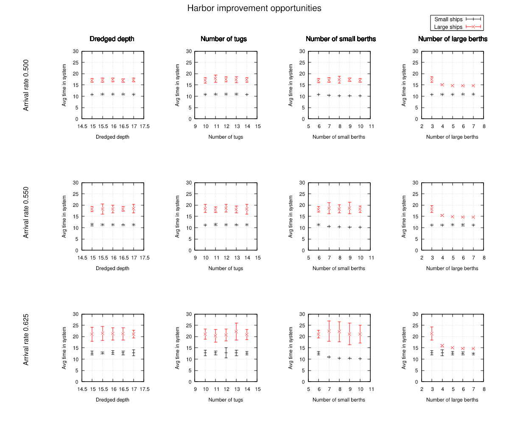
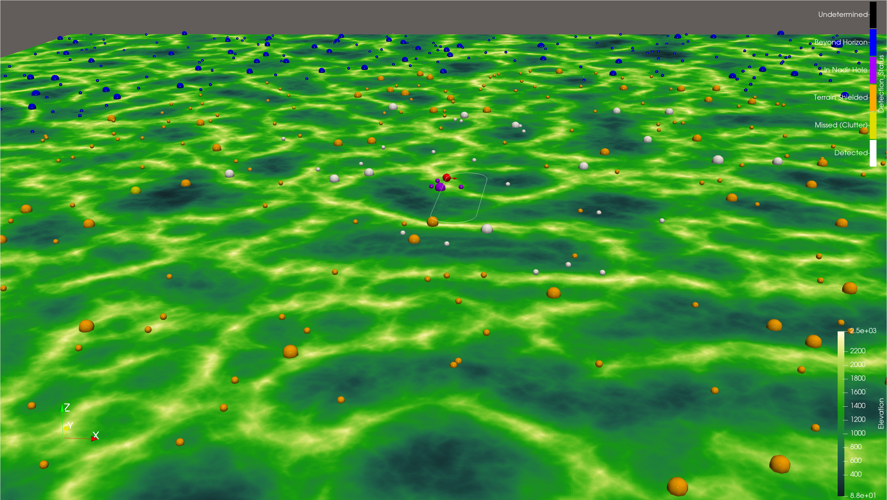
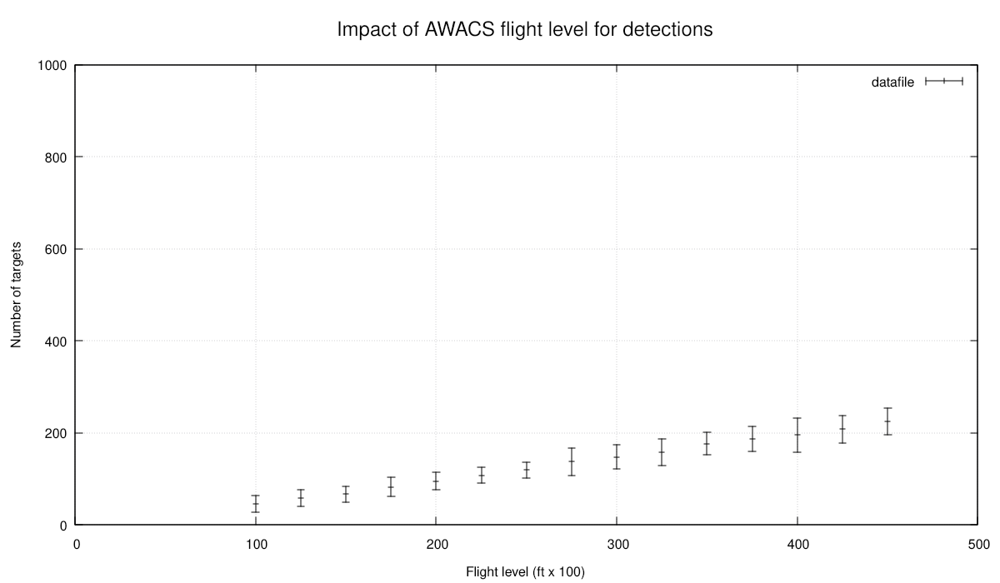

.. _tutorial:

Tutorial: Modeling with Cimba
=============================

Over the course of five different worked examples, we will go from a simple M/M/1 queue
simulation with just two active processes, make it run as a designed experiment
with parallel trials, and then gradually add more powerful simulation tools such as
resource acquisition, timers, and condition variables. We will end the tutorial by
demonstrating how to harness CUDA kernels for massively parallel simulated physics
inside a military simulation with hundreds of parallel trials and a thousand active
processes inside each trial.

.. _tut_1:

A simple M/M/1 queue parallelized
---------------------------------

In this section, we will walk through the development of a simple model from
connecting basic entities and interactions to parallelizing the model on all
available CPU cores and producing presentation-ready output.

Our first simulated system is a M/M/1 queue. In queuing theory (Kendall)
notation, this abbreviation indicates a queuing system where the arrival process
is memoryless with exponentially distributed intervals, the service process is
the same, there is only one server, and the queue has unlimited capacity. This
is a mathematically well understood system.

The simulation model will verify if the well-known formula for expected
queue length is correct (or vice versa).

Arrival, service, and the queue
^^^^^^^^^^^^^^^^^^^^^^^^^^^^^^^

We model this in a straightforward manner: We need an arrival process that puts
customers into the queue at random intervals, a service process that gets
customers from the queue and services them for a random duration, and the queue
itself. We are not concerned with the characteristics of each customer, just how
many there are in the queue, so we do not need a separate object for each customer.
We will use a :c:struct:`cmb_buffer` for this. In this first iteration, we will hard-code
parameter values for simplicity, such as 75 % utilization, and then do it properly
shortly.

Let us start with the arrival and service processes. The code can be very simple:

.. code-block:: c

    #include <cimba.h>

    void *arrival_proc(struct cmb_process *me, void *ctx)
    {
        cmb_unused(me);

        struct cmb_buffer *bp = ctx;
        while (true) {
            const double rate = 0.75;
            const double mean = 1.0 / rate;
            const double t_ia = cmb_random_exponential(mean);
            cmb_process_hold(t_ia);
            uint64_t n = 1;
            cmb_buffer_put(bp, &n);
        }
    }

    void *service_proc(struct cmb_process *me, void *ctx)
    {
        cmb_unused(me);

        struct cmb_buffer *bp = ctx;
        while (true) {
            const double rate = 1.0;
            const double mean = 1.0 / rate;
            uint64_t m = 1;
            cmb_buffer_get(bp, &m);
            double t_srv = cmb_random_exponential(mean);
            cmb_process_hold(t_srv);
        }
    }

The first statement in each function, ``cmb_unused(me)`` just states that the
argument ``me`` will not be used. It has no other effect than suppressing any
compiler warnings about that.

The arrivals process generates an exponentially distributed random value with
mean 1/0.75, holds for that amount of interarrival time, puts one new customer
into the queue, and does it again. Note that the function runs in an infinite loop.

Similarly, the service process gets a customer from the queue (waiting for one to
arrive if there are none waiting), generates a random service time with mean 1.0,
holds for the service time, and does it all over again. An average arrival rate
of 0.75 and service rate of 1.0 gives the 0.75 utilization we wanted. This function
also runs in an infinite loop.

Note that the number of customers to ``put`` or ``get`` is given as a *pointer to
a variable* containing the number, not just a value. In more complex scenarios
than this, the process may encounter a partially completed put or get, and we
need a way to capture the actual state in these cases. For now, just note that
the amount argument to :c:func:`cmb_buffer_put()` and
:c:func:`cmb_buffer_get()` is a pointer to an unsigned 64-bit integer variable.

The process function signature is a function returning a pointer to void (i.e. a
raw address to anything). It takes two arguments, the first one a pointer to a
:c:struct:`cmb_process` (itself), the second a pointer to void that gives whatever
context the process needs to execute. For now, we only use the context pointer as a
pointer to the queue, and do not use the ``me`` pointer or the return value.

Note also that all Cimba functions used here start with ``cmb_`` indicating
that they belong in the namespace of things in the simulated world. There are
functions from three Cimba modules here, :c:struct:`cmb_process`, :c:struct:`cmb_buffer`,
and :c:struct:`cmb_random`. We will encounter other namespaces and modules soon.

We also need a main function to set it all up, run the simulation, and clean up
afterwards. Let us try this:

.. code-block:: c

    int main(void)
    {
        const uint64_t seed = cmb_random_hwseed();
        cmb_random_initialize(seed);

        cmb_event_queue_initialize(0.0);

        struct cmb_buffer *que = cmb_buffer_create();
        cmb_buffer_initialize(que, "Queue", CMB_UNLIMITED);

        struct cmb_process *arr_proc = cmb_process_create();
        cmb_process_initialize(arr_proc, "Arrival", arrival_proc, que, 0);
        cmb_process_start(arr_proc);

        struct cmb_process *serv_proc = cmb_process_create();
        cmb_process_initialize(serv_proc, "Server", service_proc, que, 0);
        cmb_process_start(serv_proc);

        cmb_event_queue_execute();

        cmb_process_terminate(serv_proc);
        cmb_process_destroy(serv_proc);

        cmb_process_terminate(arr_proc);
        cmb_process_destroy(arr_proc);

        cmb_buffer_terminate(que);
        cmb_buffer_destroy(que);

        cmb_event_queue_terminate();
        cmb_random_terminate();

        return 0;
    }

The first thing it does is to get a suitable random number seed from a hardware
entropy source and initialize our pseudo-random number generators with it.

It then initializes the simulation event queue, specifying that our clock will
start from the value 0.0. (It could be any other value.)

Next, it creates and initializes the :c:struct:`cmb_buffer`, naming it "Queue"
and giving it unlimited size.

After that, it creates, initializes, and starts the arrival and service processes.
They get a pointer to the newly created :c:struct:`cmb_buffer` as their context argument,
and the event queue is ready, so they can just start immediately.

Notice the pattern here: Objects are first *created*, then *initialized* in a
separate call. The create method allocates heap memory for the object, the initialize
method makes it ready for use. Some objects, such as the pseudo-random number generator
and the event queue, already exist in pre-allocated memory and cannot be created. There
are no ``cmb_event_queue_create()`` or ``cmb_event_queue_destroy()`` functions.

In later examples, we will also
see cases where some Cimba object is simply declared as a local variable and
allocated memory on the stack. We still need to initialize it, since we are not
in C++ with its "Resource Allocation Is Initialization" (RAII) paradigm. In C,
resource allocation is *not* initialization (RAINI?), and we need to be very
clear on each object's memory allocation and initialization status. We have tried
to be as consistent as possible in the Cimba create/initialize/terminate/destroy
object lifecycle.

Having made it this far, ``main()`` calls :c:func:`cmb_event_queue_execute` to run the
simulation before cleaning up.

Note that there are matching ``_terminate()`` calls for each ``_initialize()`` and
matching ``_destroy()`` for each ``_create()``. These functions un-initialize and
and de-allocate the objects that were allocated and initialized.

Every initialized object needs to be terminated before it is destroyed. This will
deallocate any memory that the object may have allocated during its lifetime. In
C++ terms, the Cimba `cmb_X_terminate` function for some class `X` corresponds to
the C++ destructor function `~X`.
Since C does not provide the convenience of automatically calling destructors when an
object goes out of scope, it needs to be called manually. There will also be some
internal Cimba bookkeeping that depends on correct termination sequence to work.
Skipping it may cause obscure errors later, such as during error handling in a
multithreaded simulation.

The `_destroy()` function deallocates the memory used by the object itself. This may be
as simple as a wrapper to `free()`, or it may be based on an internal memory pool for
fast allocations. It may also do internal bookkeeping, but it will not call
`_terminate` for you, since that will still be needed separately for objects that just
were declared as local variables and initialized there. `_destroy()` can not help you
with that, and then it is cleaner to separate the two functions of destructor and
deallocator everywhere.

.. admonition:: Object lifecycle

    The user code is responsible for managing the object lifecycle. Objects declared as
    local variables or embedded in other objects need to be initialized and terminated
    before going out of scope. Objects created on the heap also need to be destroyed to
    avoid memory leakage.  These four calls, ``_create()``, ``_initialize()``,
    ``_terminate()``, and  ``_destroy()``, must happen in the right sequence.
    Terminating an object that has not been initialized, or destroying an object that has
    not been terminated, will cause an error message. This rigor is necessary to provide
    automatic recovery of memory if abandoning one trial in a multi-threaded simulation.

We can now run
`our first simulation <https://github.com/ambonvik/cimba/blob/main/tutorial/tut_1_1.c>`_
and see what happens. If you have configured ``meson`` with build type ``debug``, the
program will generate output like this:

.. code-block:: none

    [ambonvik@Threadripper tutorial]$ ./tut_1_1 | more
        0.0000	dispatcher	cmb_event_queue_execute (406):  Starting simulation run
        0.0000	Arrival	cmb_process_hold (459):  Holding for 0.352716 time units
        0.0000	Arrival	cmb_process_timer_add (531):  Scheduled timeout event at 0.352716
        0.0000	Server	cmb_buffer_get (245):  Gets 1 from Queue, level 0
        0.0000	Server	cmb_buffer_get (282):  Waiting for more, level now 0
        0.0000	Server	cmb_resourceguard_wait (158):  Waits for Queue
       0.35272	Arrival	cmb_buffer_put (329):  Puts 1 into Queue, level 0
       0.35272	Arrival	cmb_buffer_put (336):  Success, found room for 1, has 0 remaining
       0.35272	Arrival	cmb_resourceguard_signal (277):  Scheduling wakeup event for Server
       0.35272	Arrival	cmb_process_hold (459):  Holding for 0.872962 time units
       0.35272	Arrival	cmb_process_timer_add (531):  Scheduled timeout event at 1.225678
       0.35272	Server	cmb_buffer_get (289):  Returned successfully from wait
       0.35272	Server	cmb_buffer_get (245):  Gets 1 from Queue, level 1
       0.35272	Server	cmb_buffer_get (252):  Success, 1 was available, got 1
       0.35272	Server	cmb_process_hold (459):  Holding for 0.446180 time units
       0.35272	Server	cmb_process_timer_add (531):  Scheduled timeout event at 0.798896
       0.79890	Server	cmb_buffer_get (245):  Gets 1 from Queue, level 0
       0.79890	Server	cmb_buffer_get (282):  Waiting for more, level now 0
       0.79890	Server	cmb_resourceguard_wait (158):  Waits for Queue
        1.2257	Arrival	cmb_buffer_put (329):  Puts 1 into Queue, level 0
        1.2257	Arrival	cmb_buffer_put (336):  Success, found room for 1, has 0 remaining
        1.2257	Arrival	cmb_resourceguard_signal (277):  Scheduling wakeup event for Server
        1.2257	Arrival	cmb_process_hold (459):  Holding for 0.196033 time units
        1.2257	Arrival	cmb_process_timer_add (531):  Scheduled timeout event at 1.421711
        1.2257	Server	cmb_buffer_get (289):  Returned successfully from wait
        1.2257	Server	cmb_buffer_get (245):  Gets 1 from Queue, level 1
        1.2257	Server	cmb_buffer_get (252):  Success, 1 was available, got 1
        1.2257	Server	cmb_process_hold (459):  Holding for 0.222806 time units
        1.2257	Server	cmb_process_timer_add (531):  Scheduled timeout event at 1.448484
        1.4217	Arrival	cmb_buffer_put (329):  Puts 1 into Queue, level 0
        1.4217	Arrival	cmb_buffer_put (336):  Success, found room for 1, has 0 remaining
        1.4217	Arrival	cmb_process_hold (459):  Holding for 1.432564 time units
        1.4217	Arrival	cmb_process_timer_add (531):  Scheduled timeout event at 2.854275
        1.4485	Server	cmb_buffer_get (245):  Gets 1 from Queue, level 1
        1.4485	Server	cmb_buffer_get (252):  Success, 1 was available, got 1
        1.4485	Server	cmb_process_hold (459):  Holding for 1.910950 time units
        1.4485	Server	cmb_process_timer_add (531):  Scheduled timeout event at 3.359434
        ...

...and will keep on doing that forever. We have to press Ctrl-C or similar
to stop it. The good news is that it works. Each line in the trace contains the
time stamp in simulated time, the name of the currently executing process, exactly
what function and line number is logging, and a formatted message about what is
happening. Our simulated processes seem to be doing what we asked them to do,
but there is a wee bit too much information here.

On the other hand, if you configured ``meson`` with build type ``release``, the program
does not produce any output, just seems to hang there, again having to be interrupted
with Ctrl-C. In the following, we will assume a ``debug`` build type until further notice.

Ending a simulation
^^^^^^^^^^^^^^^^^^^

We will address stopping first. The processes are *coroutines*, executing
concurrently on a separate stack for each process. Only one process can execute
at a time. It continues executing until it voluntarily *yields* the CPU to some
other coroutine. Calling :c:func:`cmb_process_hold()` will do exactly that, transferring
control to the hidden dispatcher process that determines what to do next.

However, the dispatcher only knows about *events*, not coroutines or processes. It will
run as long as there are scheduled events to execute. Our little simulation will always
have scheduled events, and the dispatcher will not stop on its own. These events
originate from our two processes: To ensure that a process returns to the other end of
its :c:func:`cmb_process_hold()` call, it will schedule a wakeup event
at the expected time before it yields control to the dispatcher. When executed, this event
will *resume* the coroutine where it left off, returning through the
:c:func:`cmb_process_hold()` call with a return value that indicates normal or abnormal
return. (We have ignored the return values for now in the example above.) So, whenever
there are more than one process running, there may be future events scheduled in the event
queue.

To stop the simulation, we can schedule an "end simulation" event, which
stops any running processes at that point. The dispatcher then ends the run.

This is perhaps easier to do in code than to describe in text. We define a
``struct simulation`` that contains pointers to the entities of our simulated world and
the function for an end simulation event:

.. code-block:: c

    struct simulation {
        struct cmb_process *arr;
        struct cmb_buffer *que;
        struct cmb_process *srv;
    };

    void end_sim(void *subject, void *object)
    {
        cmb_unused(subject);

        struct simulation *sim = object;
        cmb_process_stop(sim->arr, NULL);
        cmb_process_stop(sim->srv, NULL);
    }

We then store pointers to the simulation entities in the ``struct simulation``
and schedule an ``end_sim`` event before executing the event queue:

.. code-block:: c

    int main(void)
    {
        const uint64_t seed = cmb_random_hwseed();
        cmb_random_initialize(seed);

        cmb_event_queue_initialize(0.0);

        struct simulation sim = {};
        sim.que = cmb_buffer_create();
        cmb_buffer_initialize(sim.que, "Queue", CMB_UNLIMITED);

        sim.arr = cmb_process_create();
        cmb_process_initialize(sim.arr, "Arrival", arrival_proc, sim.que, 0);
        cmb_process_start(sim.arr);

        sim.srv = cmb_process_create();
        cmb_process_initialize(sim.srv, "Server", service_proc, sim.que, 0);
        cmb_process_start(sim.srv);

        cmb_event_schedule(end_sim, NULL, &sim, 10.0, 0);
        cmb_event_queue_execute();

        cmb_process_terminate(sim.srv);
        cmb_process_destroy(sim.srv);

        cmb_process_terminate(sim.arr);
        cmb_process_destroy(sim.arr);

        cmb_buffer_terminate(sim.que);
        cmb_buffer_destroy(sim.que);

        cmb_event_queue_terminate();
        cmb_random_terminate();

        return 0;
    }

The arguments to :c:func:`cmb_event_schedule()` are the event function, its subject and
object pointers, the simulated time when this event will happen, and an event
priority. We have set end time 10.0 here. It could also be expressed as
``cmb_time() + 10.0`` for "in 10.0 time units from now".

Note that we now have a mixed simulation world view model, freely combining the two
processes with an event. The difference is that the event is instantaneous, occurs at one
specific time only, while the processes can have a duration in simulated time.

The simulation end event does not need to be at a predetermined time. It is
equally valid for some process in the simulation to schedule an end simulation
event at the current time whenever some condition is met, such as a certain
number of customers having been serviced, a statistics collector having a
certain number of samples, or something else.

Or, even easier for this simple
simulation, the arrival process could just stop generating new arrivals after a certain
number of customers, the event queue would clear, and the simulation would stop. (See
`benchmark/MM1_single.c <https://github.com/ambonvik/cimba/blob/main/benchmark/MM1_single.c>`__
for an example doing exactly that.)

We gave the end simulation event a default priority of 0 as the last argument to
:c:func:`cmb_event_schedule()`. Priorities are signed 64-bit integers, ``int64_t``. The
Cimba dispatcher will always select the scheduled event with the lowest
scheduled time as the next event. The simulation clock then jumps to that time and that
event will be executed. If several events
have the *same* scheduled time, the dispatcher will execute the one with the
highest priority first. If several events have the same scheduled time *and*
the same priority, it will execute them in first-in, first-out (FIFO) order.

Again, we ignored the event handle returned by :c:func:`cmb_event_schedule()`,
since we will not be using it in this example. If we wanted to keep it, it is an
unsigned 64-bit integer (``uint64_t``).

When initializing our arrivals and service processes, we quietly set the last
argument to :c:func:`cmb_process_initialize()`, the *priority*, to 0. This is the
inherent process priority for scheduling any events pertaining to this process, its
priority when waiting for some resource, and so on. The processes can adjust
their own (or each other's) priorities during the simulation, dynamically
moving themselves up or down in various queues. Cimba does not attempt to
adjust any priorities by itself, it just acts on whatever the priorities are,
and reshuffles any existing queues as needed if priorities change.

We compile and run
`our revised code <https://github.com/ambonvik/cimba/blob/main/tutorial/tut_1_2.c>`_
and get something like this:

.. code-block:: none

    [ambonvik@Threadripper tutorial]$ ./tut_1_2
        0.0000	dispatcher	cmb_event_queue_execute (406):  Starting simulation run
        0.0000	Arrival	cmb_process_hold (459):  Holding for 2.984589 time units
        0.0000	Arrival	cmb_process_timer_add (531):  Scheduled timeout event at 2.984589
        0.0000	Server	cmb_buffer_get (245):  Gets 1 from Queue, level 0
        0.0000	Server	cmb_buffer_get (282):  Waiting for more, level now 0
        0.0000	Server	cmb_resourceguard_wait (158):  Waits for Queue
        2.9846	Arrival	cmb_buffer_put (329):  Puts 1 into Queue, level 0
        2.9846	Arrival	cmb_buffer_put (336):  Success, found room for 1, has 0 remaining
        2.9846	Arrival	cmb_resourceguard_signal (277):  Scheduling wakeup event for Server
        2.9846	Arrival	cmb_process_hold (459):  Holding for 2.043605 time units
        2.9846	Arrival	cmb_process_timer_add (531):  Scheduled timeout event at 5.028194
        2.9846	Server	cmb_buffer_get (289):  Returned successfully from wait
        2.9846	Server	cmb_buffer_get (245):  Gets 1 from Queue, level 1
        2.9846	Server	cmb_buffer_get (252):  Success, 1 was available, got 1

        ...

        7.3736	Arrival	cmb_buffer_put (329):  Puts 1 into Queue, level 0
        7.3736	Arrival	cmb_buffer_put (336):  Success, found room for 1, has 0 remaining
        7.3736	Arrival	cmb_resourceguard_signal (277):  Scheduling wakeup event for Server
        7.3736	Arrival	cmb_process_hold (459):  Holding for 2.975370 time units
        7.3736	Arrival	cmb_process_timer_add (531):  Scheduled timeout event at 10.348998
        7.3736	Server	cmb_buffer_get (289):  Returned successfully from wait
        7.3736	Server	cmb_buffer_get (245):  Gets 1 from Queue, level 1
        7.3736	Server	cmb_buffer_get (252):  Success, 1 was available, got 1
        7.3736	Server	cmb_process_hold (459):  Holding for 1.439294 time units
        7.3736	Server	cmb_process_timer_add (531):  Scheduled timeout event at 8.812922
        8.8129	Server	cmb_buffer_get (245):  Gets 1 from Queue, level 0
        8.8129	Server	cmb_buffer_get (282):  Waiting for more, level now 0
        8.8129	Server	cmb_resourceguard_wait (158):  Waits for Queue
        10.000	dispatcher	cmb_process_stop (987):  Stop Arrival value (nil)
        10.000	dispatcher	cmb_process_stop (987):  Stop Server value (nil)
        10.000	dispatcher	cmb_event_queue_execute (409):  No more events in queue

Progress: It started, ran, and now also stopped.

.. _tut_1_logging:

Setting logging levels
^^^^^^^^^^^^^^^^^^^^^^

Next, the verbiage. Cimba has powerful and flexible logging that gives you fine-grained
control of what to log.

The core logging function is called :c:func:`cmb_logger_vfprintf()`. As the name says,
it is similar to the standard function ``vfprintf()`` but with some Cimba-specific added
features. You will rarely interact directly with this function, but instead call
wrapper functions (actually macros) like :c:macro:`cmb_logger_user()` or
:c:macro:`cmb_logger_error()`.

The key concept to understand here is the *logger flags*. Cimba uses a 32-bit
unsigned integer (``uint32_t``) as a bit mask to determine what log entries to print
and which to ignore. Cimba reserves the top four bits for its own use, identifying
messages of various severities, leaving the 28 remaining bits for the user application.

There is a global bit field and a bit mask in each call. If a
simple bitwise and (``&``) between the global bit field and the caller's bit mask gives a
non-zero result, that line is printed, otherwise not. Initially, all bits in the global
bit field are on, ``0xFFFFFFFF``. You can turn selected bits on and off with
:c:func:`cmb_logger_flags_on()` and :c:func:`cmb_logger_flags_off()`.

Again, it may be easier to show this in code than to explain. We add user-defined logging
messages to the end event and the two processes. The messages take ``printf``-style
format strings and arguments:

.. code-block:: c

    #include <cimba.h>
    #include <stdio.h>

    #define USERFLAG1 0x00000001

    struct simulation {
        struct cmb_process *arr;
        struct cmb_buffer *que;
        struct cmb_process *srv;
    };

    void end_sim(void *subject, void *object)
    {
        cmb_unused(subject);

        struct simulation *sim = object;
        cmb_logger_user(stdout, USERFLAG1, "--- Game Over ---");
        cmb_process_stop(sim->arr, NULL);
        cmb_process_stop(sim->srv, NULL);
    }

    void *arrival_proc(struct cmb_process *me, void *ctx)
    {
        cmb_unused(me);
        cmb_assert_debug(ctx != NULL);

        struct cmb_buffer *bp = ctx;
        while (true) {
            const double rate = 0.75;
            const double mean = 1.0 / rate;
            const double t_ia = cmb_random_exponential(mean);
            cmb_logger_user(stdout, USERFLAG1, "Holds for %f time units", t_ia);
            cmb_process_hold(t_ia);
            uint64_t n = 1;
            cmb_logger_user(stdout, USERFLAG1, "Puts one into the queue");
            cmb_buffer_put(bp, &n);
        }
    }

    void *service_proc(struct cmb_process *me, void *ctx)
    {
        cmb_unused(me);
        cmb_assert_debug(ctx != NULL);

        struct cmb_buffer *bp = ctx;
        while (true) {
            const double rate = 1.0;
            const double mean = 1.0 / rate;
            uint64_t m = 1;
            cmb_logger_user(stdout, USERFLAG1, "Gets one from the queue");
            cmb_buffer_get(bp, &m);
            double t_srv = cmb_random_exponential(mean);
            cmb_logger_user(stdout, USERFLAG1, "Got one, services it for %f time units", t_srv);
            cmb_process_hold(t_srv);
        }
    }

.. _tut_1_assert:

.. admonition:: Asserts and debuggers

    Notice the :c:macro:`cmb_assert_debug()` in this code
    fragment. It is a custom version of the standard ``assert()`` macro, triggering
    a hard stop if the condition evaluates to ``false``. Our custom asserts come in
    three flavors, :c:macro:`cmb_assert_debug()`, :c:macro:`cmb_assert_release()`, and
    :c:macro:`cmb_assert_always()`.
    The ``_debug`` assert
    behaves like the standard one and goes away if the preprocessor symbol ``NDEBUG``
    is ``#defined``. The ``_release`` assert is still there, but also goes away if ``NASSERT``
    is ``#defined``. The ``_always`` assert remains in the code, no matter what.
    See :ref:`the background section <background_error>` for more details.

    If using a debugger, place a breakpoint in :c:func:`cmi_assert_failed()`.
    If some assert trips, control will always go there. You can then page up the stack
    and see exactly what happened.

We also suppress the (debug build only) Cimba informationals from the main function:

.. code-block:: c

        cmb_logger_flags_off(CMB_LOGGER_INFO);

We compile and run, and get something like this:

.. code-block:: none

    [ambonvik@Threadripper tutorial]$ ./tut_1_3
        0.0000	Arrival	arrival_proc (32):  Holds for 3.400762 time units
        0.0000	Server	service_proc (50):  Gets one from the queue
        3.4008	Arrival	arrival_proc (35):  Puts one into the queue
        3.4008	Arrival	arrival_proc (32):  Holds for 3.529830 time units
        3.4008	Server	service_proc (53):  Got one, services it for 0.684011 time units
        4.0848	Server	service_proc (50):  Gets one from the queue
        6.9306	Arrival	arrival_proc (35):  Puts one into the queue
        6.9306	Arrival	arrival_proc (32):  Holds for 2.702912 time units
        6.9306	Server	service_proc (53):  Got one, services it for 0.192825 time units
        7.1234	Server	service_proc (50):  Gets one from the queue
        9.6335	Arrival	arrival_proc (35):  Puts one into the queue
        9.6335	Arrival	arrival_proc (32):  Holds for 0.075689 time units
        9.6335	Server	service_proc (53):  Got one, services it for 2.820073 time units
        9.7092	Arrival	arrival_proc (35):  Puts one into the queue
        9.7092	Arrival	arrival_proc (32):  Holds for 0.309229 time units
        10.000	dispatcher	end_sim (17):  --- Game Over ---

Only our user-defined logging messages are printed, also for a debug build. Note how the
simulation time, the name of the active process, the calling function, and the line number are
automagically prepended to the user-defined message. The output from a release build
will be similar. `The code for this version is here <https://github
.com/ambonvik/cimba/blob/main/tutorial/tut_1_3.c>`_

We turn off our user-defined messages like this:

.. code-block:: c

    cmb_logger_flags_off(CMB_LOGGER_INFO);
    cmb_logger_flags_off(USERFLAG1);

We can also combine these with a simple bitwise OR:

.. code-block:: c

    cmb_logger_flags_off(CMB_LOGGER_INFO | USERFLAG1);

As you would expect, this version of the program produces no output.

Collecting and reporting statistics
^^^^^^^^^^^^^^^^^^^^^^^^^^^^^^^^^^^

Which brings us to getting some *useful* output. By now, we are suitably convinced
that our simulated M/M/1 queuing system is behaving as we expect, so we want it to
start reporting some statistics on the queue length.

It will be no surprise that Cimba contains flexible and powerful statistics
collectors and reporting functions. There is actually one built into the
:c:struct:`cmb_buffer` we have been using. We just need to turn it on from our ``main()``:

.. code-block::

    struct simulation sim = {};
    sim.que = cmb_buffer_create();
    cmb_buffer_initialize(sim.que, "Queue", CMB_UNLIMITED);
    cmb_buffer_start_recording(sim.que);

After the simulation is finished executing the event queue, we can make it report its
history like this:

.. code-block::

    cmb_buffer_stop_recording(sim.que);
    cmb_buffer_print_report(sim.que, stdout);

We increase the running time from ten to one million time units by scheduling the
``end_sim`` event at time 1.0e6, compile, and run.
Very shortly thereafter, output appears:

.. code-block:: none

    [ambonvik@Threadripper tutorial]$ ./tut_1_4
    Buffer levels for Queue
    N  1313824  Mean    2.256  StdDev    3.297  Variance    10.87  Skewness    2.405  Kurtosis    8.442
    --------------------------------------------------------------------------------
    ( -Infinity,      0.000)   |
    [     0.000,      1.850)   |##################################################
    [     1.850,      3.700)   |###############=
    [     3.700,      5.550)   |#########-
    [     5.550,      7.400)   |#####-
    [     7.400,      9.250)   |##=
    [     9.250,      11.10)   |#=
    [     11.10,      12.95)   |-
    [     12.95,      14.80)   |=
    [     14.80,      16.65)   |-
    [     16.65,      18.50)   |-
    [     18.50,      20.35)   |-
    [     20.35,      22.20)   |-
    [     22.20,      24.05)   |-
    [     24.05,      25.90)   |-
    [     25.90,      27.75)   |-
    [     27.75,      29.60)   |-
    [     29.60,      31.45)   |-
    [     31.45,      33.30)   |-
    [     33.30,      35.15)   |-
    [     35.15,      37.00)   |-
    [     37.00,   Infinity)   |-
    --------------------------------------------------------------------------------

The text-mode histogram uses the character ``#`` to indicate a full pixel, ``=`` for
one that is more than half full, and ``-`` for one that contains something but less
than half filled.

We can also get a pointer to the :c:struct:`cmb_timeseries` object by
calling :c:func:`cmb_buffer_history()` and doing further analysis on
that. As an example, let's do the first 20 partial autocorrelation coefficients of
the queue length time series and print a correlogram of that as well:

.. code-block:: c

    struct cmb_timeseries *ts = cmb_buffer_history(sim.que);
    double pacf_arr[21];
    cmb_timeseries_PACF(ts, 20, pacf_arr, NULL);
    printf("\nPartial autocorrelation coefficients for %s levels\n",
            cmb_buffer_name(sim.que));
    cmb_timeseries_correlogram_print(ts, stdout, 20, pacf_arr);

Output:

.. code-block:: none

    Partial autocorrelation coefficients for Queue levels
               -1.0                              0.0                              1.0
    --------------------------------------------------------------------------------
       1   0.955                                  |###############################=
       2   0.342                                  |###########-
       3  -0.170                            =#####|
       4   0.139                                  |####=
       5  -0.088                               =##|
       6   0.086                                  |##=
       7  -0.060                                =#|
       8   0.065                                  |##-
       9  -0.043                                -#|
      10   0.051                                  |#=
      11  -0.036                                -#|
      12   0.043                                  |#-
      13  -0.031                                -#|
      14   0.037                                  |#-
      15  -0.024                                 =|
      16   0.033                                  |#-
      17  -0.022                                 =|
      18   0.029                                  |=
      19  -0.020                                 =|
      20   0.026                                  |=
    --------------------------------------------------------------------------------

The code for this stage `can be found here. <https://github.com/ambonvik/cimba/blob/main/tutorial/tut_1_4.c>`_

This is not quite publication-ready graphics, but can be useful at the model
development stage we are at now: We have numbers. Theory predicts an average
queue length of 2.25 for a M/M/1 queue at 75 % utilization. We just got 2.256.

Close, but is it close enough? We need more resolving power.

Refactoring for parallelism
^^^^^^^^^^^^^^^^^^^^^^^^^^^

Before we go there, we will clean up a few rough edges. We want to tidy up the
hard-coded parameters to a proper
data structure. We define a ``struct trial`` to contain parameters and output
values, bundle both our existing ``struct simulation`` and ``struct trial`` in
a ``struct context``, and pass that between the functions.

.. code-block:: c

    struct simulation {
        struct cmb_process *arr;
        struct cmb_buffer *que;
        struct cmb_process *srv;
    };

    struct trial {
        /* Parameters */
        double arr_rate;
        double srv_rate;
        double warmup_s;
        double duration_h;
        /* Results */
        double avg_queue_length;
    };

    struct context {
        struct simulation *sim;
        struct trial *trl;
    };

For now, we just declare these structs as local variables on the stack.

We also need a pair of events to turn data recording on and off at specified times:

.. code-block:: c

    static void start_rec(void *subject, void *object)
    {
        cmb_unused(subject);
        cmb_assert_debug(object != NULL);

        const struct context *ctx = object;
        const struct simulation *sim = ctx->sim;
        cmb_buffer_recording_start(sim->que);
    }

    static void stop_rec(void *subject, void *object)
    {
        cmb_unused(subject);
        cmb_assert_debug(object != NULL);

        const struct context *ctx = object;
        const struct simulation *sim = ctx->sim;
        cmb_buffer_recording_stop(sim->que);
    }

As the last refactoring step before we parallelize, we move the simulation driver
code from ``main()`` to a separate function ``run_MM1_trial()`` and call it from
``main()``. For reasons that soon will become clear, its argument is a single pointer
to ``void``, even if we immediately cast this to our ``struct trial *`` once inside the
function. We remove the call to :c:func:`cmb_buffer_report`, calculate the average
queue length, and store it in the ``trial`` results field:

.. code-block:: c

    struct cmb_wtdsummary wtdsum;
    cmb_wtdsummary_initialize(&wtdsum);
    const struct cmb_timeseries *ts = cmb_buffer_history(ctx.sim->que);
    cmb_timeseries_summarize(ts, &wtdsum);
    ctx.trl->avg_queue_length = cmb_wtdsummary_mean(&wtdsum);
    cmb_wtdsummary_terminate(&wtdsum);

Note that ``wtdsum`` is initialized before use and terminated when done.

The ``main()`` function is now reduced to this:

.. code-block:: c

    int main(void)
    {
        struct trial trl = {};
        trl.arr_rate = 0.75;
        trl.srv_rate = 1.0;
        trl.warmup_s = 1000.0;
        trl.duration_h = 1e6;

        run_MM1_trial(&trl);

        printf("Avg %f\n", trl.avg_queue_length);

        return 0;
    }

We will not repeat the rest of the code here. You can find it in
`tutorial/tut_1_5.c <https://github.com/ambonvik/cimba/blob/main/tutorial/tut_1_5.c>`__.
Instead, we compile and run it, receiving output similar to this:

.. code-block:: none

    [ambonvik@Threadripper tutorial]$ ./tut_1_5
    Avg 2.299748

.. _tut_1_parallel:

Parallelization
^^^^^^^^^^^^^^^

So far, we have been developing the model in a single thread, running on a single
CPU core. All the concurrency between our simulated processes (coroutines) is
happening inside this single thread. The simulation is still pretty fast, but a
modern CPU has many cores, most of them idly watching our work so far with
detached interest. Let's put them to work.

Cimba is built from the ground up for coarse-grained parallelism. Depending on
the viewpoint, parallelizing a discrete event simulation is either terribly
hard or trivially simple. The *hard* way to do it is to try to parallelize a
single simulation run. This is difficult and inefficient, since the outcome of each event
may influence all future events in complex and model-dependent ways. The discrete event
simulation algorthm itself is heavily serializing.

The *easy* way is to realize that we rarely do a *single* simulation run. We want to
run *many* to generate statistically significant answers to questions and/or to test
many parameter combinations, perhaps in a full factorial or some other experimental
design. Even if we could answer a question by a single very long run, we may get a better
understanding by splitting it into many shorter runs to not just get an average, but
also a sense of the variability of our results.

When we do multiple replications of a simulation, these are by design intended to be
independent, identically distributed trials. Multiple parameter combinations are
no less independent. This is what is called an "embarrassingly parallel" problem.
There is no interaction between the trials, and they can be trivially parallelized
by just running them at the same time and collecting the output.

Cimba creates a pool of worker threads, one per (logical) CPU core on the system.
You describe your experiment as an array of trials and the function to execute each
trial, and pass these to :c:func:`cimba_run()`.

The worker threads will pull trials from the experiment array and run them,
storing the results back in your trial struct, before moving to the next un-executed
trial in the array. This gives an inherent load balancing with minimal overhead. When all
trials have been executed, it stops.

Returning to our M/M/1 queue, suppose that we want to test the commonly accepted
queuing theory by testing utilization factors from 0.025 to 0.975 in steps of 0.025,
and that we want to run 10 replications of each parameter combination. We then
want to calculate and plot the mean and 95 % confidence bands for each parameter
combination, and compare that to the analytically calculated value in publication
ready graphics.

We can set up our experimental design like this:

.. code-block:: c

    const unsigned n_rhos = 39;
    const double rho_start = 0.025;
    const double rho_step = 0.025;
    const unsigned n_reps = 10;

    const double srv_rate = 1.0;
    const double warmup_time = 1000.0;
    const double duration = 1.0e6;

    printf("Setting up experiment\n");
    const unsigned n_trials = n_rhos * n_reps;
    struct trial *experiment = calloc(n_trials, sizeof(*experiment));
    cmb_assert_always(experiment != NULL);

    uint64_t ui_exp = 0u;
    double rho = rho_start;
    for (unsigned ui_rho = 0u; ui_rho < n_rhos; ui_rho++) {
        for (unsigned ui_rep = 0u; ui_rep < n_reps; ui_rep++) {
            experiment[ui_exp].arr_rate = rho * srv_rate;
            experiment[ui_exp].srv_rate = srv_rate;
            experiment[ui_exp].warmup_s = warmup_time;
            experiment[ui_exp].duration_h = duration;
            experiment[ui_exp].seed_used = 0u;
            experiment[ui_exp].avg_queue_length = 0.0;

            ui_exp++;
        }

        rho += rho_step;
    }

Here, we have hard-coded the parameters for the sake of the tutorial, but they
would probably be given as an input file or as interactive input in real usage.

.. note::

    Do not use any writeable global variables in your model. The entire parallelized
    experiment exists in a shared memory space. Threads will be interleaving
    in unpredictable ways. A mutable global variable accessible to several threads can be
    written and read by any thread in any sequence, creating potential hard-to-diagnose
    bugs.

    Do not use any static local variables in your model either. Your model
    functions will be called by all threads. A static local variable remembers its
    value from the last call, which may have been a completely different thread.
    Debugging that will not be any easier.

    Regular local variables, function arguments, and heap allocated memory are thread
    safe.

    If you absolutely *must* have a global or static variable, consider prefixing
    it by :c:macro:`CMB_THREAD_LOCAL` to make it global or static *within that thread only*,
    creating separate copies per thread. If it also must allow global write across threads,
    then you will need to read up on Posix mutexes and GCC ``__atomic`` intrinsics first,
    which are beyond the scope of this Cimba tutorial.

We can then run the experiment:

.. code-block:: c

    printf("Executing experiment\n");
    cimba_run(experiment, n_trials, sizeof(*experiment), run_MM1_trial);

The first argument to ``cimba_run()``is the experiment array, the last argument the
simulation driver function we have developed earlier. It will take a pointer to a trial as
its argument, but the internals of :c:func:`cimba_run()` cannot know the
detailed structure of your ``struct trial``, so it will be passed as a ``void *``.
We need to explain the number of trials and the size of each trial struct as the
second and third arguments to :c:func:`cimba_run()` for it to do correct
pointer arithmetic internally.

When done, we can collect the results like this:

.. code-block:: c

    ui_exp = 0u;
    FILE *datafp = fopen("tut_1_6.dat", "w");
    fprintf(datafp, "# utilization\tavg_queue_length\tconf_interval\n");
    for (unsigned ui_rho = 0u; ui_rho < n_rhos; ui_rho++) {
        const double ar = experiment[ui_exp].arr_rate;
        const double sr = experiment[ui_exp].srv_rate;
        const double rho_used = ar / sr;

        struct cmb_datasummary cds;
        cmb_datasummary_initialize(&cds);
        for (unsigned ui_rep = 0u; ui_rep < n_reps; ui_rep++) {
            cmb_datasummary_add(&cds, experiment[ui_exp].avg_queue_length);
            ui_exp++;
        }

        cmb_assert_debug(cmb_datasummary_count(&cds) == n_reps);
        const double sample_avg = cmb_datasummary_mean(&cds);
        const double sample_sd = cmb_datasummary_stddev(&cds);
        const double t_crit = 2.228;
        fprintf(datafp, "%f\t%f\t%f\n", rho_used, sample_avg, t_crit * sample_sd);
        cmb_datasummary_terminate(&cds);
    }

    fclose(datafp);
    free(experiment);

    write_gnuplot_commands();
    if (system("gnuplot -persistent tut_1_6.gp") != 0) {
        cmb_logger_warning(stderr, "gnuplot launch failed");
    }

We use a :c:struct:`cmb_datasummary` to simplify the calculation of confidence
intervals, knowing that it will calculate correct moments in a single pass of the
data. Once done, we can deallocate the experiment array. We
then write the results to an output file, write a gnuplot command file to plot
the results, and spawn a persistent gnuplot window to display the chart.

Also, we would like to know the progress of our experiment, so we define a
separate level of logger messages like this:

.. code-block:: c

    #define USERFLAG1 0x00000001
    #define USERFLAG2 0x00000002

.. note::

    The logging flags are bitmasks, not consecutive numbers. The next three
    values would be ``0x00000004``, ``0x00000008``, and ``0x00000010``. You can
    combine flag values bit-wise. For instance, a call to ``cmb_logger_user()``
    with flag level 63 (``0xFF``) will print a line if *any* of the lowest 8 bits
    are set.

We add a logging call to our ``run_MM1_trial()``:

.. code-block:: c

    cmb_logger_user(stdout, USERFLAG2,
                    "seed: 0x%016" PRIx64 " rho: %f",
                    trl->seed_used, trl->arr_rate / trl->srv_rate);

We use the macro ``PRIx64`` from ``#include <inttypes.h>`` for portable formatting
of the ``uint64_t`` seed value.

We add some code to measure run time and some extra ``printf()`` calls, compile
and run, and get output similar to this:

.. code-block:: none

    [ambonvik@Threadripper tutorial]$ ./tut_1_6
    Cimba version 3.0.0-RC1
    Setting up experiment
    Executing experiment
    0	    0.0000	dispatcher	run_MM1_trial (124):  seed: 0x7866d3d38917be45 rho: 0.025000
    3	    0.0000	dispatcher	run_MM1_trial (124):  seed: 0x7c34fba6010fc4b8 rho: 0.025000
    1	    0.0000	dispatcher	run_MM1_trial (124):  seed: 0x492abf0803226872 rho: 0.025000
    2	    0.0000	dispatcher	run_MM1_trial (124):  seed: 0xe637bd0ed6acfe44 rho: 0.025000
    6	    0.0000	dispatcher	run_MM1_trial (124):  seed: 0xb3a6c991530672ac rho: 0.025000
    5	    0.0000	dispatcher	run_MM1_trial (124):  seed: 0x57b05c8064b8e1b0 rho: 0.025000
    7	    0.0000	dispatcher	run_MM1_trial (124):  seed: 0x750292b4962e365a rho: 0.025000
    4	    0.0000	dispatcher	run_MM1_trial (124):  seed: 0x9decfa8eaa97f26b rho: 0.025000
    8	    0.0000	dispatcher	run_MM1_trial (124):  seed: 0x20606e14460e981b rho: 0.025000
    13	    0.0000	dispatcher	run_MM1_trial (124):  seed: 0xe3f29afa1d30ff88 rho: 0.050000
    11	    0.0000	dispatcher	run_MM1_trial (124):  seed: 0xf34a7ee712b7a2e1 rho: 0.050000
    10	    0.0000	dispatcher	run_MM1_trial (124):  seed: 0xb30f5b4f19651e2e rho: 0.050000
    14	    0.0000	dispatcher	run_MM1_trial (124):  seed: 0x830343619ae31b22 rho: 0.050000
    15	    0.0000	dispatcher	run_MM1_trial (124):  seed: 0x1ee4082b456ca442 rho: 0.050000
    12	    0.0000	dispatcher	run_MM1_trial (124):  seed: 0x322f23e96b874958 rho: 0.050000

    ...

    383	    0.0000	dispatcher	run_MM1_trial (124):  seed: 0x71b22699502bd80f rho: 0.975000
    384	    0.0000	dispatcher	run_MM1_trial (124):  seed: 0x0c945ed9a795e3eb rho: 0.975000
    385	    0.0000	dispatcher	run_MM1_trial (124):  seed: 0xdd60213eedbd12e5 rho: 0.975000
    386	    0.0000	dispatcher	run_MM1_trial (124):  seed: 0xe2754f584dfa18fb rho: 0.975000
    387	    0.0000	dispatcher	run_MM1_trial (124):  seed: 0xb4ac68426d59068f rho: 0.975000
    388	    0.0000	dispatcher	run_MM1_trial (124):  seed: 0x61aa9359b4765149 rho: 0.975000
    389	    0.0000	dispatcher	run_MM1_trial (124):  seed: 0xafb5efc7b7d5d145 rho: 0.975000
    Finished experiment, writing results to file

Note that the Cimba logger understands that it is now running multithreaded and
prepends each logging line with the trial index in your experiment array. Note
also that the trials may not be executed in strict sequence, since we do not
control the detailed interleaving of the threads. That is up to the operating
system.

We also get an image like this in a separate window:

    .. image:: ../images/tut_1_6.png

Evidently, we cannot reject the null hypothesis that conventional queuing theory
may be correct. Nor can we reject the hypothesis that Cimba may be working correctly.

Seed management
^^^^^^^^^^^^^^^

Since we used ``cmb_random_hwseed()`` to seed the pseudo-random number generators in
each trial, our pseudo-random number generators are seeded with real entropy from the
computer hardware. If we run the model again, we will get a slightly different result.
This independence is of course a good thing, but we may also need reproducibility.

We can make our simulation reproducible by providing a master seed as input, e.g., on the
command line, and then use a hashing function to create different seeds for each trial in
the experiment. We can also provide other simulation parameters in the same way:

.. code-block:: c

    #include <errno.h>

    int main(const int argc, char *argv[])
    {
        /* Can be set on command line */
        bool timing_enabled = false;
        uint64_t master_seed = cmb_random_hwseed();
        uint32_t n_reps = 10;
        double warmup_time = 1000.0;
        double duration = 1.0e6;

        /* Not yet added to command line params */
        const unsigned n_rhos = 39;
        const double rho_start = 0.025;
        const double rho_step = 0.025;
        const double srv_rate = 1.0;

        /* Parse command line options, if any */
        int opt;
        while ((opt = getopt(argc, argv, "d:n:s:tw:")) != -1) {
            switch (opt) {
                case 'd': {
                    errno = 0;
                    duration = strtod(optarg, NULL);
                    if (errno != 0 || duration <= 0.0) {
                        fprintf(stderr, "Invalid argument %s\n", optarg);
                        return EXIT_FAILURE;
                    }
                    break;
                }
                case 'n': {
                    errno = 0;
                    n_reps = (uint32_t)strtoul(optarg, NULL, 0);
                    if (errno != 0) {
                        fprintf(stderr, "Invalid argument %s\n", optarg);
                        return EXIT_FAILURE;
                    }
                    break;
                }
                case 's': {
                    errno = 0;
                    master_seed = (uint64_t)strtoull(optarg, NULL, 0);
                    if (errno != 0 || master_seed == 0u) {
                        fprintf(stderr, "Invalid argument %s\n", optarg);
                        return EXIT_FAILURE;
                    }
                    break;
                }
                case 't': {
                    timing_enabled = true;
                    break;
                }
                case 'w': {
                    errno = 0;
                    warmup_time = (double)strtod(optarg, NULL);
                    if (errno != 0 || warmup_time < 0.0) {
                        fprintf(stderr, "Invalid argument %s\n", optarg);
                        return EXIT_FAILURE;
                    }
                    break;
                }
                default: {
                    fprintf(stderr, "Usage: %s [-d <duration>][-n <num_replications>][-s <seed>][-t][-w <warmup_time>]\n", argv[0]);
                    return EXIT_FAILURE;
                }
            }
        }

By using the hash function ``cmb_random_fmix64()`` and a running trial counter as the
unique nonce value for hashing the trial seed., we can now create suitable
deterministic seeds for each trial in our experiment like this:

.. code-block:: c

    printf("Setting up experiment\n");
    printf("Master seed: 0x%" PRIx64 "\n", master_seed);
    const unsigned n_trials = n_rhos * n_reps;
    struct trial *experiment = cmi_calloc(n_trials, sizeof(*experiment));

    uint64_t ui_exp = 0u;
    double rho = rho_start;
    for (unsigned ui_rho = 0u; ui_rho < n_rhos; ui_rho++) {
        for (unsigned ui_rep = 0u; ui_rep < n_reps; ui_rep++) {
            experiment[ui_exp].arr_rate = rho * srv_rate;
            experiment[ui_exp].srv_rate = srv_rate;
            experiment[ui_exp].warmup_s = warmup_time;
            experiment[ui_exp].duration_h = duration;
            experiment[ui_exp].seed_used = cmb_random_fmix64(master_seed, ui_exp);
            experiment[ui_exp].avg_queue_length = 0.0;

            ui_exp++;
        }

        rho += rho_step;
    }

Each trial can now use its pre-assigned seed:

.. code-block:: c

        cmb_random_initialize(trl->seed_used);

We can then type, e.g.:

.. code-block:: none

    [ambonvik@Threadripper tutorial]$ ./tut_1_7 -s 0x123456789abcd0 -d 1e7 -n 15 -w 1e6
    Cimba version 3.0.0-RC1
    Setting up experiment
    Master seed: 0x123456789abcd0
    Executing experiment
    5	    0.0000	dispatcher	run_MM1_trial (173):  seed: 0x7b67c6418c63aae2 rho: 0.025000
    0	    0.0000	dispatcher	run_MM1_trial (173):  seed: 0xfdec9c60e9175db9 rho: 0.025000
    4	    0.0000	dispatcher	run_MM1_trial (173):  seed: 0x4074149906797ad1 rho: 0.025000
    3	    0.0000	dispatcher	run_MM1_trial (173):  seed: 0x6efb9a53ec801f99 rho: 0.025000
    7	    0.0000	dispatcher	run_MM1_trial (173):  seed: 0x85c4ac085200f398 rho: 0.025000
    2	    0.0000	dispatcher	run_MM1_trial (173):  seed: 0x8c86cd3226e7c39a rho: 0.025000
    1	    0.0000	dispatcher	run_MM1_trial (173):  seed: 0xa0f0a732375fb48f rho: 0.025000
    6	    0.0000	dispatcher	run_MM1_trial (173):  seed: 0x8402740fc59daac0 rho: 0.025000
    8	    0.0000	dispatcher	run_MM1_trial (173):  seed: 0xa622550fd8b73be6 rho: 0.025000
    11	    0.0000	dispatcher	run_MM1_trial (173):  seed: 0xf92ed9cb02c4ffad rho: 0.025000
    9	    0.0000	dispatcher	run_MM1_trial (173):  seed: 0xf80baffa542f3b03 rho: 0.025000
    10	    0.0000	dispatcher	run_MM1_trial (173):  seed: 0xee25017da603acb5 rho: 0.025000
    13	    0.0000	dispatcher	run_MM1_trial (173):  seed: 0x009cd75e4d3deb65 rho: 0.025000

    ...

    573	    0.0000	dispatcher	run_MM1_trial (173):  seed: 0xda57f730cc5809e5 rho: 0.975000
    574	    0.0000	dispatcher	run_MM1_trial (173):  seed: 0x9e94f96a6035f669 rho: 0.975000
    575	    0.0000	dispatcher	run_MM1_trial (173):  seed: 0x4c1497ef015d4c70 rho: 0.975000
    576	    0.0000	dispatcher	run_MM1_trial (173):  seed: 0x7c248e1d06156897 rho: 0.975000
    577	    0.0000	dispatcher	run_MM1_trial (173):  seed: 0x0860d4c67e72f345 rho: 0.975000
    578	    0.0000	dispatcher	run_MM1_trial (173):  seed: 0xc7d13810b2cd773b rho: 0.975000
    579	    0.0000	dispatcher	run_MM1_trial (173):  seed: 0x5d20f8af7ddbb0c4 rho: 0.975000
    580	    0.0000	dispatcher	run_MM1_trial (173):  seed: 0x4c79c5afe47c077a rho: 0.975000
    581	    0.0000	dispatcher	run_MM1_trial (173):  seed: 0x24e1643bbf3f2bef rho: 0.975000
    582	    0.0000	dispatcher	run_MM1_trial (173):  seed: 0x218448f76e55882c rho: 0.975000
    583	    0.0000	dispatcher	run_MM1_trial (173):  seed: 0x87cf1c7dd681deb2 rho: 0.975000
    584	    0.0000	dispatcher	run_MM1_trial (173):  seed: 0xb6c0c5fb0077fbe3 rho: 0.975000
    Finished experiment, writing results to file

The chart looks similar, but since we used longer run times and more replications, our
confidence intervals are tighter:

    .. image:: ../images/tut_1_7.png

This concludes our first tutorial. We have followed the development steps from a
first minimal model with basic process interactions to a complete parallelized
experiment with graphical output. The files ``tutorial/tut_1_*.c`` include working
code for each stage of development.

For additional variations of this theme, see
`benchmark/MM1_multi.c <https://github.com/ambonvik/cimba/blob/main/benchmark/MM1_multi.c>`__
where the queue is modeled as a :c:struct:`cmb_objectqueue` with individual customers
tracking their time in the system, and
`test/test_cimba.c <https://github.com/ambonvik/cimba/blob/main/test/test_cimba.c>`__
modeling a M/G/1 queue with different utilizations and service time variabilities.

.. _tut_2:

Acquiring, preempting, holding, and releasing resources, with interruptions
---------------------------------------------------------------------------

We will now introduce the Cimba methods for acquiring and releasing resources
of various kinds. We will also show additional process interactions where
the active process is acting directly on some other process. We will
demonstrate these through a somewhat cartoonish example.

First, some necessary background.

Resources and resource pools
^^^^^^^^^^^^^^^^^^^^^^^^^^^^

Cimba provides two kinds of resources that a process can acquire, hold, and release.
These are the :c:struct:`cmb_resource` and the :c:struct:`cmb_resourcepool`. The difference is
that the :c:struct:`cmb_resource` is a single unit that only can be held by one process
at a time, while the :c:struct:`cmb_resourcepool` consists of several units that each
can be held by a process. A process may hold more than one unit from the
:c:struct:`cmb_resourcepool`, but there is a certain upper limit for how many units are
available simultaneously from the pool. In computer science terms, the
:c:struct:`cmb_resource` is a *binary semaphore*, while the :c:struct:`cmb_resourcepool` is a
*counting semaphore*.

If the requested resource or number of resources is not available, the ``_acquire``
calls will wait in a priority queue until the requested amount becomes available.
The ordering is determined first by the process priority, then FIFO based on the
simulation timestamp when it entered the queue. Changing a process' priority with
:c:func:`cmb_process_priority_set()` will also have effect on any priority queues it may
be waiting in, with no need to explicitly reorder the queue from the application.

The typical usage pattern is also the reason for the name :c:func:`cmb_process_hold()`:

.. code-block:: c

    cmb_resource_acquire(res);
    cmb_process_hold(dur);
    cmb_resource_release(res);

Or:

.. code-block:: c

    cmb_resourcepool_acquire(respl, 6);
    cmb_process_hold(dur);
    cmb_resourcepool_release(respl, 3);
    cmb_process_hold(dur);
    cmb_resourcepool_release(respl, 3);

Or even:

.. code-block:: c

    cmb_resourcepool_acquire(respl, 6);
    cmb_resource_acquire(res);
    cmb_process_hold(dur);
    cmb_resource_release(res);
    cmb_resourcepool_release(respl, 6);

Note that there is no timeout argument in these calls. We will show how to do this
in :ref:`the next tutorial <tut_3>`, but will leave it as a (very small) cliffhanger
until then.

Note also that there are some differences between the ``_acquire()``/``_release()`` pairs
and the similar ``_get()``/``_put()`` pairs for buffers and queues. Suppose that you
have a ``cmb_buffer`` of maximal size ten. It is still possible to call
``cmb_buffer_put(bufp, 100)``. The call just puts in ten to begin with, waits for
someone to get one or more of them, and then keeps refilling the queue until all 100 are
put in. The call only returns at that point (unless interrupted, which we will discuss in
a moment).  Similarly, ``cmb_buffer_get(bufp, 100)`` works as expected, and trying to
``_put()`` another item into a full :c:struct:`cmb_objectqueue` or
:c:struct:`cmb_priorityqueue` just suspends the caller until space becomes available.

Resources and resource pools are not like that. Requesting more from a resource pool
than its maximum is an error. If we have a resource pool with maximum size ten, five of
which already are in use, it is fine to call ``cmb_resourcepool_acquire(rpp, 10)``. The
call just waits until all ten are available, accumulating to its holding whenever some
become available until it has all, and then returns. On the other hand, calling
``cmb_resourcepool_acquire(rpp, 11)`` will not work. It is not a meaningful call, so
Cimba will do the most helpful thing it can: Trip an `assert()` and crash your program
on the spot, encouraging you to find and fix the error. (See :ref:`the
explanatory section <background_error>` for more about the Cimba error handling
philosophy.)

Preemptions and interruptions
^^^^^^^^^^^^^^^^^^^^^^^^^^^^^

We have already explained that Cimba processes (and the coroutines they are
derived from) execute atomically until they explicitly yield control. These
yield (and resume) points are hidden inside functions like :c:func:`cmb_process_hold()`
or :c:func:`cmb_resource_acquire()`. Inside the call, control may (or may not) be
passed to some other process. The call will only return when control is transferred
back to this process. To the calling process just sitting on its own stack, it
looks very simple, just another function call, but a lot of things may be happening
elsewhere in the model in the meantime.

A yielded process does not have any guarantees for what may be happening to it
before it resumes control. Other processes may act on this process, perhaps
stopping it outright, waking it up early, or snatching a resource away from it.

To be able to tell the difference, functions like :c:func:`cmb_process_hold()` and
:c:func:`cmb_resource_acquire()` have an integer return value, an ``int64_t``. We have
quietly ignored the return values in our earlier examples, but they are an
important signalling mechanism between Cimba processes.

Cimba has reserved a few possible return values for itself. Most importantly,
:c:macro:`CMB_PROCESS_SUCCESS` (numeric value 0) means a normal and successful return.
For example, if :c:func:`cmb_process_hold()` returns :c:macro:`CMB_PROCESS_SUCCESS`, the
calling process knows that it was woken up at the scheduled time without any shenanigans.

Another important value is :c:macro:`CMB_PROCESS_PREEMPTED`. That means that a
higher priority process just forcibly took away some resource held by this
process. There are also :c:macro:`CMB_PROCESS_INTERRUPTED`, :c:macro:`CMB_PROCESS_STOPPED`,
:c:macro:`CMB_PROCESS_CANCELLED`, and :c:macro:`CMB_PROCESS_TIMEOUT`. These predefined
signals are all defined as small negative values, leaving an enormous number of available
signal values to application-defined meanings. In particular, all positive
integers are available to the application for coding various model-specific interrupt
signals between its processes.

These signal values create a rich set of direct process interactions. As an
example, suppose some process currently holds 10 units from some resource pool.
It then calls :c:func:`cmb_resourcepool_acquire()` requesting 10 more units. At that
moment, only 5 are available. The process takes these 5 and adds itself to the
priority queue maintained by the resource guard before yielding. In effect, it asks
to be woken up whenever some more is available, intending to return from its
acquire call only when all 10 units have been collected.

There are now three different outcomes for the ``_acquire()`` call:

1. All goes as expected, 5 more units eventually become available, the process
   takes them, and returns :c:macro:`CMB_PROCESS_SUCCESS`. It now holds 20 units.

2. Some higher priority process calls :c:func:`cmb_resourcepool_preempt()` and this
   process gets targeted. The higher priority process takes *all* units held by
   the victim process. Its acquire call returns :c:macro:`CMB_PROCESS_PREEMPTED`. It
   now holds 0 units.

3. Some other process calls :c:func:`cmb_process_interrupt()` on this process. It
   excuses itself from the resource guard priority queue and returns whatever
   signal value was given to :c:func:`cmb_process_interrupt()`, perhaps
   :c:macro:`CMB_PROCESS_INTERRUPTED` or some other value that has an
   application-defined meaning. It unwinds the 5 units it collected during the
   call and returns holding the same amount as it held before
   calling :c:func:`cmb_resourcepool_acquire()`, 10 units.

Preempt calls can themselves be preempted by higher priority processes or
interrupted in the same way as acquire calls if the preempt was not immediately
fulfilled and the preempting process had to wait at the resource guard. Once there,
it is fair game for preempts and interrupts.

Another potential complexity: Suppose a process holds more than one type of
resource, for example:

.. code-block:: c

    cmb_resource_acquire(rp);
    cmb_resourcepool_acquire(rsp1, 10);
    cmb_resourcepool_acquire(rsp2, 15);

    int64_t signal = cmb_process_hold(100.0);

    if (signal == CMB_PROCESS_PREEMPTED) {
        /* ??? */
    }

In cases like this, the functions :c:func:`cmb_resource_held()` and
:c:func:`cmb_resourcepool_held()` with a pointer to the process itself as the
second argument can be useful to figure out which resource was preempted. If the caller
does not have a pointer to itself handy (it is always the first argument to the
process function), it can get one by calling :c:func:`cmb_process_current()`,
returning a pointer to the currently executing process, i.e. the caller.

Buffers and object queues, interrupted
^^^^^^^^^^^^^^^^^^^^^^^^^^^^^^^^^^^^^^

The semantics of buffers and object queues are different from the resources and
resource pools. A process can acquire and hold a resource, making it unavailable
for other processes until it is released. Preempting it naturally means taking
the resource away from the process because someone else needs it more, right now.

Buffers and their cousins act differently. Once something is put into a buffer, other
processes can get it and consume it immediately. Preempting a put or get operation
does not have any obvious meaning. If a buffer is empty, a process get call is waiting
at the resource guard, and a higher priority process wants to get some first, the
higher priority process just calls :c:func:`cmb_buffer_get()` and goes first in the
priority queue.

However, waiting puts and gets can still be interrupted. For :c:struct:`cmb_objectqueue`
and :c:struct:`cmb_priorityqueue`, it is quite simple: If the respective ``_put()`` or
``_get()`` call returned :c:macro:`CMB_PROCESS_SUCCESS` the object was successfully
added to the queue or retrieved from it. If it returned anything else, it was not.

The :c:struct:`cmb_buffer` is similarly intuitive. Recall from
:ref:`our first tutorial <tut_1>` that the ``amount`` argument is given as a pointer
to a variable, not as a value. As the put and get calls get underway, the value at
this location is updated to reflect the progress. If interrupted, this value indicates
how much was placed or obtained. The call returns at this point with no attempt to
roll back to the state at the beginning of the call. If successful, the put call will
return :c:macro:`CMB_PROCESS_SUCCESS` and have a zero value in this location.

In the same way, the `_get()` call will return  :c:macro:`CMB_PROCESS_SUCCESS` if it
has received the requested amount. If interrupted, it will return something else and
the amount variable will contain some other value, ranging from zero and up to one less
than the requested amount.

While the cat is away...
^^^^^^^^^^^^^^^^^^^^^^^^

It is again probably easier to demonstrate with code than explain in computer
sciencey terms how all this works.

On a table, we have some pieces of cheese in a pile. There are several mice
trying to collect the cheese and hold it for a while. Each mouse can carry
different numbers of cheese cubes. They tend to drop it again quite fast,
inefficient hoarders as they are. Unfortunately, there are also some
rats, bigger and stronger than the mice. The rats will preempt the cheese from
the mice, but only if the rat has higher priority. Otherwise, the rat will
politely wait its turn. There is also a cat. It sleeps a lot, but when awake,
it will select a random rodent and interrupt whatever it is doing.

Since we do not plan to run any statistics here, we simplify the context struct
to just the simulation struct. We can then write something like:

.. code-block:: c

    #define CHECK_OUTCOME(sig, me, rpoolp, amnt)                                    \
    {                                                                               \
        if (sig == CMB_PROCESS_SUCCESS) {                                           \
            /* Acquire returned successfully */                                     \
            cmb_logger_user(stdout, USERFLAG1,                                      \
                            "Success, has %" PRIu64,                                \
                            amnt);                                                  \
        }                                                                           \
        else if (sig == CMB_PROCESS_PREEMPTED) {                                    \
            /* The acquire() call did not end well */                               \
            cmb_logger_user(stdout, USERFLAG1,                                      \
                            "Preempted, all is gone, has %" PRIu64,                 \
                            amnt);                                                  \
        }                                                                           \
        else {                                                                      \
            /* Interrupted, but we still have the same amount as before */          \
            cmb_logger_user(stdout, USERFLAG1,                                      \
                            "Interrupted by signal %" PRIi64 ", still has %" PRIu64,\
                            sig, amnt);                                             \
        }                                                                           \
    }

    /* The busy life of a mouse */
    void *mousefunc(struct cmb_process *me, void *ctx)
    {
        cmb_assert_release(me != NULL);
        cmb_assert_release(ctx != NULL);

        const struct simulation *simp = ctx;
        struct cmb_resourcepool *rpoolp = simp->cheese;

        while (true) {
            cmb_logger_user(stdout, USERFLAG1,
                            "Top of loop, has %" PRIu64,
                            cmb_resourcepool_held(rpoolp, me));

            /* Decide on a random amount to get next time and set a random priority */
            const uint64_t amount_req = cmb_random_dice(1, 5);
            const int64_t pri = cmb_random_dice(-10, 10);
            cmb_process_priority_set(me, pri);

            cmb_logger_user(stdout, USERFLAG1, "Acquiring %" PRIu64, amount_req);
            int64_t sig = cmb_resourcepool_acquire(rpoolp, amount_req);
            check_outcome(sig, me, rpoolp, cmb_resourcepool_held(rpoolp, me));

            /* Hold on to it for a while */
            cmb_logger_user(stdout, USERFLAG1,
                            "Holding %" PRIu64,
                            cmb_resourcepool_held(rpoolp, me));
            sig = cmb_process_hold(cmb_random_exponential(1.0));
            check_outcome(sig, me, rpoolp, cmb_resourcepool_held(rpoolp, me));

            /* Drop some amount */
            uint64_t amnt = cmb_resourcepool_held(rpoolp, me);
            if (amnt > 1u) {
                const uint64_t amount_rel = cmb_random_dice(1, amnt);
                cmb_logger_user(stdout, USERFLAG1,
                                "Has %" PRIu64 ", releasing %" PRIu64,
                                amnt, amount_rel);
                cmb_resourcepool_release(rpoolp, amount_rel);
           }

            /* Hang on a moment before trying again */
            cmb_logger_user(stdout, USERFLAG1,
                            "Holding %" PRIu64,
                            cmb_resourcepool_held(rpoolp, me));
            sig = cmb_process_hold(cmb_random_exponential(1.0));
            check_outcome(sig, me, rpoolp, cmb_resourcepool_held(rpoolp, me));
        }
    }

We used a preprosessor macro for `CHECK_OUTCOME()` here to avoid repetitive code
while keeping the logger line numbers referring to the `mousefunc`, not into the
helper function.

The rats are pretty much the same as the mice, just a bit hungrier and stronger
(i.e. assigning themselves somewhat higher priorities), and using
:c:func:`cmb_resourcepool_preempt()` instead of ``_acquire()``:

.. code-block:: c

    /* Decide on a random amount to get next time and set a random priority */
    const uint64_t amount_req = cmb_random_dice(3, 10);
    const int64_t pri = cmb_random_dice(-5, 15);
    cmb_process_priority_set(me, pri);

    cmb_logger_user(stdout, USERFLAG1, "Preempting %" PRIu64, amount_req);
    int64_t sig = cmb_resourcepool_preempt(sp, amount_req);

The cats, on the other hand, are never interrupted and just ignore return values:

.. code-block:: c

    void *catfunc(struct cmb_process *me, void *ctx)
    {
        cmb_unused(me);
        cmb_assert_release(ctx != NULL);

        struct simulation *simp = ctx;
        struct cmb_process **cpp = (struct cmb_process **)simp;
        const long num = NUM_MICE + NUM_RATS;

        while (true) {
            /* Nobody interrupts a sleeping cat, disregard return value */
            cmb_logger_user(stdout, USERFLAG1, "Zzzzz...");
            (void)cmb_process_hold(cmb_random_exponential(5.0));
            do {
                cmb_logger_user(stdout, USERFLAG1,
                                "Awake, looking for rodents");
                struct cmb_process *tgt = cpp[cmb_random_dice(0, num - 1)];
                cmb_logger_user(stdout, USERFLAG1,
                                "Chasing %s", cmb_process_name(tgt));

                /* Send it a random interrupt signal */
                const int64_t sig = (cmb_random_flip()) ?
                                     CMB_PROCESS_INTERRUPTED :
                                     cmb_random_dice(10, 100);
                cmb_process_interrupt(tgt, sig, 0);

                cmb_logger_user(stdout, USERFLAG1, "Pondering");
                (void)cmb_process_hold(cmb_random_exponential(1.0));

                /* Flip a coin to decide whether to go back to sleep */
            } while (cmb_random_flip());
        }
    }

The complete code is in
`tutorial/tut_2_1.c <https://github.com/ambonvik/cimba/blob/main/tutorial/tut_2_1.c>`__
We compile and run, and get output similar to this:

.. code-block:: none

    [ambonvik@Threadripper cimba]$ build/tutorial/tut_2_1 | more
    Create a pile of 20 cheese cubes
    Create 5 mice to compete for the cheese
    Create 2 rats trying to preempt the cheese
    Create 1 cats chasing all the rodents
    Schedule end event
    Execute simulation...
        0.0000	Mouse_3	mousefunc (91):  Top of loop, has 0
        0.0000	Mouse_3	mousefunc (100):  Acquiring 4
        0.0000	Mouse_3	mousefunc (102):  Success, has 4
        0.0000	Mouse_3	mousefunc (105):  Holding 4
        0.0000	Mouse_2	mousefunc (91):  Top of loop, has 0
        0.0000	Mouse_2	mousefunc (100):  Acquiring 1
        0.0000	Mouse_2	mousefunc (102):  Success, has 1
        0.0000	Mouse_2	mousefunc (105):  Holding 1
        0.0000	Mouse_1	mousefunc (91):  Top of loop, has 0
        0.0000	Mouse_1	mousefunc (100):  Acquiring 4
        0.0000	Mouse_1	mousefunc (102):  Success, has 4
        0.0000	Mouse_1	mousefunc (105):  Holding 4
        0.0000	Rat_1	ratfunc (140):  Top of loop, has: 0
        0.0000	Rat_1	ratfunc (149):  Preempting 9
        0.0000	Rat_1	ratfunc (151):  Success, has 9
        0.0000	Rat_1	ratfunc (154):  Holding 9
        0.0000	Cat_1	catfunc (190):  Zzzzz...
        0.0000	Mouse_5	mousefunc (91):  Top of loop, has 0
        0.0000	Mouse_5	mousefunc (100):  Acquiring 3
        0.0000	Mouse_4	mousefunc (91):  Top of loop, has 0
        0.0000	Mouse_4	mousefunc (100):  Acquiring 4
        0.0000	Rat_2	ratfunc (140):  Top of loop, has: 0
        0.0000	Rat_2	ratfunc (149):  Preempting 9
        0.0000	Rat_2	ratfunc (151):  Success, has 9
        0.0000	Rat_2	ratfunc (154):  Holding 9
        0.0000	Mouse_3	mousefunc (109):  Preempted, all is gone, has 0
        0.0000	Mouse_3	mousefunc (122):  Holding 0
        0.0000	Mouse_1	mousefunc (109):  Preempted, all is gone, has 0
        0.0000	Mouse_1	mousefunc (122):  Holding 0
        0.0000	Mouse_2	mousefunc (109):  Preempted, all is gone, has 0
        0.0000	Mouse_2	mousefunc (122):  Holding 0
        1.3546	Rat_1	ratfunc (158):  Success, has 9
        1.3546	Rat_1	ratfunc (164):  Has 9, releasing 4
        1.3546	Rat_1	ratfunc (171):  Holding 5
        1.3546	Mouse_5	mousefunc (102):  Success, has 3
        1.3546	Mouse_5	mousefunc (105):  Holding 3
        1.5029	Cat_1	catfunc (193):  Awake, looking for rodents
        1.5029	Cat_1	catfunc (196):  Chasing Mouse_3
        1.5029	Cat_1	catfunc (205):  Pondering
        1.5029	Mouse_3	mousefunc (126):  Interrupted by signal 42, still has 0
        1.5029	Mouse_3	mousefunc (91):  Top of loop, has 0
        1.5029	Mouse_3	mousefunc (100):  Acquiring 1
        1.5654	Mouse_1	mousefunc (126):  Success, has 0
        1.5654	Mouse_1	mousefunc (91):  Top of loop, has 0
        1.5654	Mouse_1	mousefunc (100):  Acquiring 5
        1.8091	Rat_1	ratfunc (175):  Success, has 5
        1.8091	Rat_1	ratfunc (140):  Top of loop, has: 5
        1.8091	Rat_1	ratfunc (149):  Preempting 5
        1.8091	Rat_1	ratfunc (151):  Success, has 10
        1.8091	Rat_1	ratfunc (154):  Holding 10
        1.8091	Mouse_3	mousefunc (102):  Success, has 1
        1.8091	Mouse_3	mousefunc (105):  Holding 1
        1.8091	Mouse_5	mousefunc (109):  Preempted, all is gone, has 0
        1.8091	Mouse_5	mousefunc (122):  Holding 0
        1.8091	Mouse_4	mousefunc (102):  Preempted, all is gone, has 0
        1.8091	Mouse_4	mousefunc (105):  Holding 0
        2.2274	Cat_1	catfunc (193):  Awake, looking for rodents
        2.2274	Cat_1	catfunc (196):  Chasing Mouse_4
        2.2274	Cat_1	catfunc (205):  Pondering
        2.2274	Mouse_4	mousefunc (109):  Interrupted by signal 79, still has 0
        2.2274	Mouse_4	mousefunc (122):  Holding 0
        2.3894	Rat_2	ratfunc (158):  Success, has 9
        2.3894	Rat_2	ratfunc (164):  Has 9, releasing 9
        2.3894	Rat_2	ratfunc (171):  Holding 0
        2.3894	Mouse_1	mousefunc (102):  Success, has 5
        2.3894	Mouse_1	mousefunc (105):  Holding 5
        2.4937	Rat_1	ratfunc (158):  Success, has 10
        2.4937	Rat_1	ratfunc (164):  Has 10, releasing 10
        2.4937	Rat_1	ratfunc (171):  Holding 0
        2.6472	Mouse_2	mousefunc (126):  Success, has 0
        ...

...and so on. The interactions can get rather intricate, but hopefully intuitive:
A :c:func:`cmb_resourcepool_preempt()` call will start from the lowest priority victim
process and take *all* of its holdinge, but only if the victim has strictly lower
priority than the caller. If the requested amount is not satisfied from the first
victim, it will continue to the next lowest priority victim. If several victims are
available at the same priority, it proceeds in LIFO order. If some amount is
left over after taking everything the victim held, the resource guard is signalled
to evaluate what process gets the remainder. If no potential victims with strictly
lower priority than the caller process exists, the caller will join the priority
queue and wait in line for some amount to become available.

Cimba does not try to be "fair" or "optimal" in its resource allocation, just
efficient and predictable. If the application needs different allocation rules,
it can either adjust process priorities dynamically or create a derived class
with a custom demand function and/or priority ordering. (See the default demand
function :c:func:`is_available()` and the ranking function
:c:func:`holder_queue_rank()` in
`cmb_resourcepool.c <https://github.com/ambonvik/cimba/blob/main/src/cmb_resourcepool.c>`_
for the details.)

It is possible to create deadlocks if multiple processes are waiting for each other.
If you build a model with that property, such as Dijkstra's famous Dining Philosophers,
the purpose of the model could be to compare the performance of different deadlock
prevention algorithms. That logic belongs in the user model, not hidden inside Cimba.
It does not try to detect or prevent deadlocks in the modelled system. Your model will
just stop.

Althogh this example was rather cartoonish, the preempt and interrupt mechanisms we
have demonstrated are important in a range of real-world modeling applications ranging
from hospital emergency room triage operations to manufacturing job shops and machine
breakdown processes.

Parallelizing the simulation will follow the same pattern as in :ref:`our first
tutorial <tut_1>`, so we will not repeat that here.

This completes our second tutorial, demonstrating how to "``_acquire()`` and
``_release()`` resources, and to use direct process interactions like
:c:func:`cmb_process_interrupt()` and :c:func:`cmb_resourcepool_preempt`.

We also have mentioned, but not demonstrated :c:func:`cmb_process_wait_process()`
and :c:func:`cmb_process_wait_event()` that make it possible for a process to wait
for another process and for an event, respectively. We encourage you to look
up these in
`the API reference documentation <https://cimba.readthedocs.io/en/latest/api/library_root.html>`_
.

.. _tut_3:

Agents balking, reneging, and jockeying in queues
-------------------------------------------------

In :ref:`our first tutorial <tut_1>`, we modeled a M/M/1 queue as a simple buffer with
just a numeric value for the queue length. This was sufficient to calculate queue length
statistics. We have extended this in our benchmarking case,
`benchmark/MM1_simple.c <https://github.com/ambonvik/cimba/blob/main/benchmark/MM1_single.c>`__
and
`benchmark/MM1_multi.c <https://github.com/ambonvik/cimba/blob/main/benchmark/MM1_multi.c>`__,
where the customers were modeled as discrete objects containing their own arrival times
to compute statistics for the time each customer spent in the system. In both cases, our
simulated results were well aligned with known queuing theory formulas.

We now extend this to a more realistic but analytically intractable case where the
customers are active, opinionated agents in their own right. The customers generated by
the arrival process will make their own decisions on whether to join the queue or not
(balking), leave midway (reneging), or switch to another queue that seems to be moving
faster (jockeying). Or patiently wait until they get served and then leave for new
adventures. Since the active entities in Cimba are the instances of
:c:struct:`cmb_process`, this requires each customer to be represented as a process
or derived class. We will make our customers a derived class from the
:c:struct:`cmb_process`, inheriting its properties and methods, and adding some more
specifics. By doing so, we will demonstate both object-oriented inheritance and that
Cimba processes themselves can spawn other processes.

The use case is to model an amusement park with guests wanting to use various
attractions. Our customer, the park operator, wants us to analyze ways of influencing
customer behavior. The overall metric is the time spent in the park per visitor and the
breakdown of this time between riding, waiting, and walking. The time unit is minutes.

Classes derived from cmb_process
^^^^^^^^^^^^^^^^^^^^^^^^^^^^^^^^

The object-oriented paradigm is very natural for simulation modeling. It was first
developed for this purpose in Simula67. Obviously, C does not directly support
object-orientation as a language feature, but is flexible enough to support an
object-oriented programming style. We will discuss this in more detail in the
:ref:`background section <background_oop>`. In this tutorial, we will just focus on
how to use it.

Basically, in object-oriented C, the ``struct`` becomes the class. By placing one
struct as the first member of another, the outer struct effectively becomes a derived
class from the inner one. A pointer to the outer struct will point to the same address
as the inner struct, and one can freely cast the same pointer value between the two
types. They exist at the same memory address.

For example, we want our server process to also contain a pointer to the queue it gets
visitors from, the number of visitors that can board for each run of the ride, and the
parameters of the service time distribution. We could pass this to a plain
:c:struct:`cmb_process` as part of its ``context`` initialization argument, but we can
also create a derived ``struct server`` as a derived class from the
:c:struct:`cmb_process`:

.. code-block:: c

    struct server {
        struct cmb_process core;       /* <= Note: The real thing, not a pointer */
        struct cmb_priorityqueue *pq;
        unsigned batch_size;
        double dur_min, dur_mode, dur_max;
    };

It is important to note that the first member of the struct is the parent class struct
itself, not a pointer to an object of that class. We can now define the core methods of
the server class:

.. code-block:: c

    struct server *server_create(void)
    {
        struct server *sp = malloc(sizeof(struct server));
        cmb_assert_release(sp != NULL);
        return sp;
    }

    void server_initialize(struct server *sp,
                           const char *name,
                           struct cmb_priorityqueue *qp,
                           const unsigned bs,
                           const double dmin, const double dmod, const double dmax)
    {
        sp->pq = qp;
        sp->batch_size = bs;
        sp->dur_min = dmin;
        sp->dur_mode = dmod;
        sp->dur_max = dmax;

        cmb_process_initialize(&sp->core, name, serverfunc, NULL, 0u);
    }

    void server_start(struct server *sp)
    {
        cmb_process_start(&sp->core);
    }

    void server_terminate(struct server *sp)
    {
        cmb_process_terminate(&sp->core);
    }

    void server_destroy(struct server *sp)
    {
        free(sp);
    }

The most important member function is the server process function itself. It gets a group of
suspended ``visitor`` processes from the priority queue, loads them into the attraction,
holds them for the duration of the ride, ands stores some statistics in them, before
resuming them as active processes. It can look like this:

.. code-block:: c

    void *serverfunc(struct cmb_process *me, void *vctx)
    {
        cmb_assert_debug(me != NULL);
        cmb_unused(vctx);
        const struct server *sp = (struct server *)me;

        while (true) {
            /* Prepare for the next batch of visitors */
            unsigned cnt = 0u;
            struct visitor *batch[sp->batch_size];

            /* Wait for the first visitor, then fill the ride as best possible */
            cmb_logger_user(stdout, LOGFLAG_SERVICE, "Open for next batch");
            do {
                struct visitor *vip;
                (void)cmb_priorityqueue_get(sp->pq, (void**)&(vip));
                struct cmb_process *pp = (struct cmb_process *)vip;
                cmb_process_timers_clear(pp);
                cmb_logger_user(stdout, LOGFLAG_SERVICE, "Got visitor %s", cmb_process_name(pp));
                batch[cnt++] = vip;
            } while ((cmb_priorityqueue_length(sp->pq) > 0) && (cnt < sp->batch_size)) ;

            /* Log the waiting times for this batch of visitors */
            cmb_logger_user(stdout, LOGFLAG_SERVICE, "Has %u for %u slots", cnt, sp->batch_size);
            for (unsigned ui = 0; ui < cnt; ui++) {
                struct visitor *vip = batch[ui];
                const double qt = cmb_time() - vip->entry_time_queue;
                vip->waiting_time += qt;
            }

            /* Run the ride with these visitors on board */
            cmb_logger_user(stdout, LOGFLAG_SERVICE, "Starting ride");
            const double dur = cmb_random_PERT(sp->dur_min, sp->dur_mode, sp->dur_max);
            cmb_process_hold(dur);
            cmb_logger_user(stdout, LOGFLAG_SERVICE, "Ride finished");

            /* Unload and send the visitors on their merry way */
            for (unsigned ui = 0u; ui < cnt; ui++) {
                struct visitor *vip = batch[ui];
                vip->riding_time += dur;
                struct cmb_process *pp = (struct cmb_process *)vip;
                cmb_logger_user(stdout, LOGFLAG_SERVICE, "Resuming visitor %s", cmb_process_name(pp));
                cmb_process_resume(pp, CMB_PROCESS_SUCCESS);
            }
        }
    }

Since our processes are *asymmetric* coroutines, the :c:func:`cmb_process_resume()` call
does not directly resume the target process (coroutine), but *schedules an event* that
will make the dispatcher resume the target process (coroutine) at the current time. That
way, all control passes through the dispatcher, and all processes are resumed by the
dispatcher only. For this server function, it implies that :c:func:`cmb_process_resume()`
is a non-blocking call. It returns immediately and the server can unload all visitors
before yielding the CPU in the :c:func:`cmb_priorityqueue_get()` or
:c:func:`cmb_process_hold()` calls.

Setting and clearing timers
^^^^^^^^^^^^^^^^^^^^^^^^^^^

Similarly, we can define the ``struct visitor`` as a derived class from the
``cmb_process``:

.. code-block:: c

    struct visitor {
        struct cmb_process core;       /* <= Note: The real thing, not a pointer */
        double patience;
        bool goldcard;
        double entry_time_park;
        double entry_time_queue;
        unsigned current_attraction;
        double riding_time;
        double waiting_time;
        double walking_time;
        unsigned num_attractions_visited;
    };

It contains some parameters, such as its ``patience`` and whether is a priority gold
card holder, holds some state, such as the ``current_attraction``, and collects some
history, such as the count of attractions visited and the accumulated riding, waiting,
and walking times.

Its creators and destructors are similar to the ``server``'s, but the process function
brings some new features:

.. code-block:: c

    void *visitor_proc(struct cmb_process *me, void *vctx)
    {
        cmb_assert_debug(me != NULL);
        cmb_assert_debug(vctx != NULL);

        struct visitor *vip = (struct visitor *)me;
        const struct context *ctx = vctx;
        const struct simulation *sim = ctx->sim;

        cmb_logger_user(stdout, LOGFLAG_VISITOR, "Started");
        vip->current_attraction = IDX_ENTRANCE;
        while (vip->current_attraction != IDX_EXIT) {
            /* Select where to go next */
            const unsigned ua = vip->current_attraction;
            const struct attraction *ap_from = &sim->park_attractions[ua];
            const struct cmb_random_alias *qv = ap_from->quo_vadis;
            const unsigned nxt = cmb_random_alias_sample(qv);
            cmb_logger_user(stdout, LOGFLAG_VISITOR, "At %u, next %u", ua, nxt);

            /* Walk there */
            const double mwt = transition_times[ua][nxt];
            const double wt = cmb_random_PERT(0.5 * mwt, mwt, 2.0 * mwt);
            cmb_process_hold(wt);
            vip->walking_time += wt;
            vip->current_attraction = nxt;

            /* Join the shortest queue if several */
            if (nxt != IDX_EXIT) {
                const struct attraction *ap_to = &sim->park_attractions[nxt];
                uint64_t shrtlen = UINT64_MAX;
                unsigned shrtqi = 0u;
                for (unsigned qi = 0u; qi < ap_to->num_queues; qi++) {
                    struct cmb_priorityqueue *pq = ap_to->queues[qi];
                    const unsigned len = cmb_priorityqueue_length(pq);
                    if (len < shrtlen) {
                        shrtlen = len;
                        shrtqi = qi;
                    }
                }

                cmb_logger_user(stdout, LOGFLAG_VISITOR,
                                "At attraction %u, queue %u looks shortest (%" PRIu64 ")",
                                nxt, shrtqi, shrtlen);

                /* Balking? */
                if (shrtlen > (uint64_t)(vip->patience * balking_threshold)) {
                    /* Too long queue, go to next instead */
                    cmb_logger_user(stdout, LOGFLAG_VISITOR,
                                    "Balked at attraction %u, queue %u", nxt, shrtqi);
                    continue;
                }

                /* Set two timeouts */
                const double jt = vip->patience * jockeying_threshold;
                cmb_process_timer_set(me, jt, TIMER_JOCKEYING);
                const double rt = vip->patience * reneging_threshold;
                cmb_process_timer_add(me, rt, TIMER_RENEGING);

                struct cmb_priorityqueue *q = sim->park_attractions[nxt].queues[shrtqi];
                uint64_t pq_hndl;
                cmb_logger_user(stdout, LOGFLAG_VISITOR,
                                "Joining queue %s", cmb_priorityqueue_name(q));
                vip->entry_time_queue = cmb_time();
                /* Not blocking, since the queue has unlimited size */
                cmb_priorityqueue_put(q, (void *)vip, cmb_process_priority(me), &pq_hndl);

                /* Suspend ourselves until we have finished both queue and ride,
                 * trusting the server to update our waiting and riding times */
                while (true) {
                    const int64_t sig = cmb_process_yield();
                    if (sig == TIMER_JOCKEYING) {
                        cmb_logger_user(stdout, LOGFLAG_VISITOR, "Jockeying at attraction %u", nxt);
                        const unsigned in_q = shrtqi;
                        const unsigned mypos = cmb_priorityqueue_position(q, pq_hndl);
                        shrtlen = UINT64_MAX;
                        shrtqi = 0u;
                        for (unsigned qi = 0u; qi < ap_to->num_queues; qi++) {
                            struct cmb_priorityqueue *pq = ap_to->queues[qi];
                            const unsigned len = cmb_priorityqueue_length(pq);
                            if (len < shrtlen) {
                                shrtlen = len;
                                shrtqi = qi;
                            }
                        }

                        if (shrtlen < mypos) {
                            cmb_logger_user(stdout, LOGFLAG_VISITOR,
                                            "Moving from queue %u to queue %u (len %" PRIu64 ")",
                                            in_q, shrtqi, shrtlen);
                            const bool found = cmb_priorityqueue_cancel(q, pq_hndl);
                            cmb_assert_debug(found == true);
                            q = ap_to->queues[shrtqi];
                            const int64_t pri = cmb_process_priority(me);
                            cmb_priorityqueue_put(q, (void *)vip, pri + 1, &pq_hndl);
                            continue;
                        }
                    }
                    else if (sig == TIMER_RENEGING) {
                        cmb_logger_user(stdout, LOGFLAG_VISITOR, "Reneging at attraction %u", ua);
                        const bool found = cmb_priorityqueue_cancel(q, pq_hndl);
                        cmb_assert_debug(found == true);
                        cmb_process_timers_clear(me);
                        break;
                    }
                    else {
                        cmb_assert_release(sig == CMB_PROCESS_SUCCESS);
                        vip->num_attractions_visited++;
                        cmb_logger_user(stdout, LOGFLAG_VISITOR,
                                        "Yay! Leaving attraction %u", vip->current_attraction);
                        break;
                    }
                }

                /* Out of the attraction, slightly dizzy. Do it again? */
            }
        }

        /* No, enough for today */
        cmb_logger_user(stdout, LOGFLAG_VISITOR, "Leaving");
        cmb_objectqueue_put(sim->departeds, (void *)vip);
        cmb_process_exit(NULL);

        /* Not reached */
        return NULL;
    }

To model the jockeying and reneging behavior, we use additional :c:struct:`cmb_process`
methods: The process can schedule a future timeout event for itself by calling
:c:func:`cmb_process_timer_set()`. When the timer event occurs, the process will be
interrupted from whatever it is doing with whatever signal the timer was set to send, with
:c:macro:`CMB_PROCESS_TIMEOUT` as a predefined possibility. By setting a timeout before
some ``_acquire()``, ``_get()``, or ``_wait()`` call, the process can abort the wait when
patience runs out.

Here, we set *two* different timers, one with the signal ``TIMER_JOCKEYING`` and one with
``TIMER_RENEGING``. After these are set, the visitor process suspends itself
unconditionally by calling :c:func:`cmb_process_yield()` after entering the
:c:struct:`cmb_priorityqueue`. The visitor process is then a passive object managed by
the server process until it is resumed by the server, or until one of the timers goes off
and the visitor process awakes with a start and shows signs of impatience.

Note that the timers remain active past the call to :c:func:`cmb_priorityqueue_put()`.
The timers are *part of the process state*, not of the function call. They remain active
until either going off or getting cancelled / cleared. This is a far more flexible and
general mechanism than having an optional timeout value argument in each ``_put()``,
``_get()``, ``_wait()`` etc etc function call.

In this case, we cancel the jockeying timer if the reneging timer goes off, but not
the other way around, since they model two different behaviors.

Note also that one of the first things the server process does after getting a visitor
from the priority queue is to call :c:func:`cmb_process_timers_clear()` to make sure it
does not suddenly wake up and walk off in the middle of the ride. Conversely, one of the
first things the visitor process does after waking up on a timer signal is to call
:c:func:`cmb_priorityqueue_cancel()` to make sure that it is not admitted on a ride
when it actually is walking away from that attraction.

The entire dynamic of having the same process object act both as an active opinionated
agent in its simulated world, and as a passive object being handled by other
processes is enabled by our processes being stackful coroutines. When suspended, their
entire state is safely stored on their own execution stack until it is resumed from the
same point where it left off. Our processes are first-class objects that can be passed
around as function arguments and return values, stored and retrieved, created and destroyed
at runtime.

Also note that the ``visitor`` process ends by placing itself in the
:c:struct:`cmb_objectqueue` of departed visitors before exiting. That way, a departure
process can wait for it there, collect its statistics, and reclaim its allocated memory:

.. code-block:: c

    void *departure_proc(struct cmb_process *me, void *vctx)
    {
        cmb_unused(me);
        cmb_assert_debug(vctx != NULL);

        const struct context *ctx = vctx;
        struct simulation *sim = ctx->sim;

        while (true) {
            /* Wait for a departing visitor */
            struct visitor *vip = NULL;
            (void)cmb_objectqueue_get(sim->departeds, (void **)(&vip));
            cmb_assert_debug(vip != NULL);
            struct cmb_process *pp = (struct cmb_process *)vip;
            cmb_assert_debug(cmb_process_status(pp) == CMB_PROCESS_FINISHED);
            cmb_logger_user(stdout, LOGFLAG_DEPARTURE, "%s departed",
                            ((struct cmb_process *)vip)->name);

            /* Collect its statistics */
            const double tsys = cmb_time() - vip->entry_time_park;
            cmb_datasummary_add(&sim->time_in_park, tsys);
            cmb_datasummary_add(&sim->riding_times, vip->riding_time);
            cmb_datasummary_add(&sim->waiting_times, vip->waiting_time);
            cmb_datasummary_add(&sim->num_rides, vip->num_attractions_visited);
            cmb_datasummary_add(&sim->walking_times, vip->walking_time);

            /* Reclaim its memory allocation */
            visitor_terminate(vip);
            visitor_destroy(vip);
        }
    }

Here, we have not bothered to define this as a separate derived class, but just pass it
the pointer to the ``departeds`` object queue as part of the ``cmb_process`` context
argument.

Alias sampling probabilities
^^^^^^^^^^^^^^^^^^^^^^^^^^^^

We model the amusement park attractions as nodes in a fully-connected network.
Node 0 will be the entrance, while nodes 1 through *n* are the attractions, and node
*n+1* is the exit. Each node (except the entrance and the exit) has
one or more priority queues for waiting customers. For each node *i*, there is a certain
probability that the customer goes to attraction *j* next, including both the
possibility of exiting the park and the possibility of taking another go on the same
attraction. This can be represented as a matrix of transition probabilities *p(i, j)*.

However, the obvious sampling algorithm is rather slow for large *n*: Generate a random
number *x* in *[0, 1]*. Starting *j* from 0, add *p(i, j)* until the sum is greater
than *x*. The current *j* is then the selected value. (This is implemented in Cimba as
the function :c:func:`cmb_random_loaded_dice()`.)

Instead, we will use a particularly clever O(1) algorithm known as Vose alias sampling.
It requires us to pre-compute a lookup table that we will store with each node by
calling :c:func:`cmb_random_alias_create()`. We can then sample it as often as needed by
calling :c:func:`cmb_random_alias_sample()`, and clean it up when no longer needed by
calling :c:func:`cmb_random_alias_destroy()`. The overhead in construction and
destruction pays for itself in overall efficiency already for *n > 7* or so.

.. note::

    The alert reader will notice that this collapses our usual four-part harmony of
    ``_create()``, ``_initialize()``, ``_terminate()``, and ``_destroy()`` into just the
    two functions ``_create()`` and ``_destroy()``. Since we are not anticipating any
    derived classes from the alias table, we found this a reasonable exception to make.

It looks like this in the ``struct attraction``:

.. code-block:: c

    struct attraction {
        unsigned num_queues;
        struct cmb_priorityqueue **queues;
        unsigned num_servers;
        struct server **servers;
        struct cmb_random_alias *quo_vadis;
    };

It is initialized like this in ``attraction_initialize`` from one row of the transition
probability matrix, the probability vector for a visitor going to any other attraction
after finishing at this one:

.. code-block:: c

    ap->quo_vadis = cmb_random_alias_create(NUM_ATTRACTIONS + 2, transition_probs[ui]);

As we saw above, it is sampled like this by the ``visitor_proc`` when deciding where to
go next:

.. code-block:: c

    const unsigned nxt = cmb_random_alias_sample(qv);

It eventually gets destroyed from ``attraction_terminate()``:

.. code-block:: c

    cmb_random_alias_destroy(ap->quo_vadis);

You can find the rest of the code in
`tutorials/tut_3_1.c <https://github.com/ambonvik/cimba/blob/main/tutorial/tut_3_1.c>`__

A day in the park
^^^^^^^^^^^^^^^^^

Running it, we get output like this:

.. code-block:: none

    [ambonvik@Threadripper cimba]$ build/tutorial/tut_3_1 | more
        0.0000	Server_01_00_00	serverfunc (186):  Open for next batch
        0.0000	Server_02_00_00	serverfunc (186):  Open for next batch
        0.0000	Server_02_00_01	serverfunc (186):  Open for next batch
        0.0000	Server_02_00_02	serverfunc (186):  Open for next batch
        0.0000	Server_03_00_00	serverfunc (186):  Open for next batch
        0.0000	Server_03_00_01	serverfunc (186):  Open for next batch
        0.0000	Server_04_00_00	serverfunc (186):  Open for next batch
        0.0000	Server_04_01_00	serverfunc (186):  Open for next batch
        0.0000	Server_04_02_00	serverfunc (186):  Open for next batch
        0.0000	Server_05_00_00	serverfunc (186):  Open for next batch
        0.0000	Server_06_00_00	serverfunc (186):  Open for next batch
        0.0000	Server_07_00_00	serverfunc (186):  Open for next batch
        0.0000	Server_08_00_00	serverfunc (186):  Open for next batch
        0.0000	Server_09_00_00	serverfunc (186):  Open for next batch
      0.038977	Arrivals	arrival_proc (529):  Visitor_000001 arriving
      0.038977	Visitor_000001	visitor_proc (336):  Started
      0.038977	Visitor_000001	visitor_proc (344):  At 0, next 2
      0.068032	Arrivals	arrival_proc (529):  Visitor_000002 arriving
      0.068032	Visitor_000002	visitor_proc (336):  Started
      0.068032	Visitor_000002	visitor_proc (344):  At 0, next 1
        1.0330	Arrivals	arrival_proc (529):  Visitor_000003 arriving
        1.0330	Visitor_000003	visitor_proc (336):  Started
        1.0330	Visitor_000003	visitor_proc (344):  At 0, next 1
        1.1268	Arrivals	arrival_proc (529):  Visitor_000004 arriving
        1.1268	Visitor_000004	visitor_proc (336):  Started
        1.1268	Visitor_000004	visitor_proc (344):  At 0, next 2
        2.1046	Visitor_000002	visitor_proc (367):  At attraction 1, queue 0 looks shortest (0)
        2.1046	Visitor_000002	visitor_proc (387):  Joining queue Queue_01_00
        2.1046	Server_01_00_00	serverfunc (192):  Got visitor Visitor_000002
        2.1046	Server_01_00_00	serverfunc (197):  Has 1 for 1 slots
        2.1046	Server_01_00_00	serverfunc (206):  Starting ride
        2.6024	Arrivals	arrival_proc (529):  Visitor_000005 arriving
        2.6024	Visitor_000005	visitor_proc (336):  Started
        2.6024	Visitor_000005	visitor_proc (344):  At 0, next 4
        3.9335	Visitor_000003	visitor_proc (367):  At attraction 1, queue 0 looks shortest (0)
        3.9335	Visitor_000003	visitor_proc (387):  Joining queue Queue_01_00
        4.2126	Arrivals	arrival_proc (529):  Visitor_000006 arriving
        4.2126	Visitor_000006	visitor_proc (336):  Started
        4.2126	Visitor_000006	visitor_proc (344):  At 0, next 1
        4.4175	Visitor_000001	visitor_proc (367):  At attraction 2, queue 0 looks shortest (0)
        4.4175	Visitor_000001	visitor_proc (387):  Joining queue Queue_02_00
        4.4175	Server_02_00_00	serverfunc (192):  Got visitor Visitor_000001
        4.4175	Server_02_00_00	serverfunc (197):  Has 1 for 5 slots
        4.4175	Server_02_00_00	serverfunc (206):  Starting ride
        6.2520	Server_01_00_00	serverfunc (209):  Ride finished
        6.2520	Server_01_00_00	serverfunc (218):  Resuming visitor Visitor_000002
        6.2520	Server_01_00_00	serverfunc (186):  Open for next batch
        6.2520	Server_01_00_00	serverfunc (192):  Got visitor Visitor_000003
        6.2520	Server_01_00_00	serverfunc (197):  Has 1 for 1 slots
        6.2520	Server_01_00_00	serverfunc (206):  Starting ride
        6.2520	Visitor_000002	visitor_proc (434):  Yay! Leaving attraction 1
        6.2520	Visitor_000002	visitor_proc (344):  At 1, next 2
        8.9219	Visitor_000006	visitor_proc (367):  At attraction 1, queue 0 looks shortest (0)
        8.9219	Visitor_000006	visitor_proc (387):  Joining queue Queue_01_00
        9.2341	Visitor_000002	visitor_proc (367):  At attraction 2, queue 0 looks shortest (0)
        9.2341	Visitor_000002	visitor_proc (387):  Joining queue Queue_02_00
        9.2341	Server_02_00_01	serverfunc (192):  Got visitor Visitor_000002
        9.2341	Server_02_00_01	serverfunc (197):  Has 1 for 5 slots
        9.2341	Server_02_00_01	serverfunc (206):  Starting ride
        ...

...and so on, until it finishes and reports its statistics for the day:

.. code-block:: none

    Number of rides taken:
    N      477  Mean    2.696  StdDev    2.171  Variance    4.712  Skewness    1.504  Kurtosis    4.213
    Time spent in park:
    N      477  Mean    58.68  StdDev    31.71  Variance    1006.  Skewness    2.786  Kurtosis    13.48
    Riding times:
    N      477  Mean    18.75  StdDev    16.99  Variance    288.5  Skewness    1.971  Kurtosis    7.142
    Waiting times:
    N      477  Mean    4.877  StdDev    5.794  Variance    33.57  Skewness    1.985  Kurtosis    7.021
    Walking times:
    N      477  Mean    33.30  StdDev    12.12  Variance    146.9  Skewness    2.914  Kurtosis    15.28

    Detailed queue reports:
    Queue lengths for Queue_01_00:
    N      286  Mean   0.4110  StdDev   0.7480  Variance   0.5594  Skewness    2.007  Kurtosis    4.068
    --------------------------------------------------------------------------------
    ( -Infinity,      0.000)   |
    [     0.000,      1.000)   |##################################################
    [     1.000,      2.000)   |#############-
    [     2.000,      3.000)   |#####-
    [     3.000,      4.000)   |#-
    [     4.000,      5.000)   |-
    [     5.000,   Infinity)   |
    --------------------------------------------------------------------------------
    Queue lengths for Queue_02_00:
    N      195  Mean  0.02044  StdDev   0.1670  Variance  0.02788  Skewness    9.533  Kurtosis    105.4
    --------------------------------------------------------------------------------
    ( -Infinity,      0.000)   |
    [     0.000,      1.000)   |##################################################
    [     1.000,      2.000)   |=
    [     2.000,      3.000)   |-
    [     3.000,      4.000)   |-
    [     4.000,   Infinity)   |
    --------------------------------------------------------------------------------
    Queue lengths for Queue_03_00:
    N      226  Mean  0.07242  StdDev   0.3426  Variance   0.1174  Skewness    6.695  Kurtosis    61.08
    --------------------------------------------------------------------------------
    ( -Infinity,      0.000)   |
    [     0.000,      1.000)   |##################################################-
    [     1.000,      2.000)   |##-
    [     2.000,      3.000)   |-
    [     3.000,      4.000)   |-
    [     4.000,      5.000)   |-
    [     5.000,      6.000)   |-
    [     6.000,   Infinity)   |
    --------------------------------------------------------------------------------
    Queue lengths for Queue_04_00:
    N      127  Mean   0.7141  StdDev   0.5106  Variance   0.2608  Skewness  -0.2920  Kurtosis  -0.5959
    --------------------------------------------------------------------------------
    ( -Infinity,      0.000)   |
    [     0.000,      1.000)   |#######################=
    [     1.000,      2.000)   |##################################################
    [     2.000,      3.000)   |##-
    [     3.000,   Infinity)   |
    --------------------------------------------------------------------------------
    Queue lengths for Queue_04_01:
    N       97  Mean   0.6702  StdDev   0.4936  Variance   0.2436  Skewness  -0.4400  Kurtosis   -1.116
    --------------------------------------------------------------------------------
    ( -Infinity,      0.000)   |
    [     0.000,      1.000)   |##########################-
    [     1.000,      2.000)   |##################################################
    [     2.000,      3.000)   |=
    [     3.000,   Infinity)   |
    --------------------------------------------------------------------------------
    Queue lengths for Queue_04_02:
    N       47  Mean   0.6594  StdDev   0.6268  Variance   0.3929  Skewness   0.4075  Kurtosis  -0.6762
    --------------------------------------------------------------------------------
    ( -Infinity,      0.000)   |
    [     0.000,      1.000)   |###########################################-
    [     1.000,      2.000)   |##################################################
    [     2.000,      3.000)   |########=
    [     3.000,   Infinity)   |
    --------------------------------------------------------------------------------
    Queue lengths for Queue_05_00:
    N      230  Mean   0.5964  StdDev   0.9796  Variance   0.9596  Skewness    1.978  Kurtosis    4.189
    --------------------------------------------------------------------------------
    ( -Infinity,      0.000)   |
    [     0.000,      1.000)   |##################################################
    [     1.000,      2.000)   |################=
    [     2.000,      3.000)   |#######-
    [     3.000,      4.000)   |###-
    [     4.000,      5.000)   |=
    [     5.000,      6.000)   |=
    [     6.000,   Infinity)   |
    --------------------------------------------------------------------------------
    Queue lengths for Queue_06_00:
    N      202  Mean   0.2753  StdDev   0.5940  Variance   0.3529  Skewness    2.572  Kurtosis    7.949
    --------------------------------------------------------------------------------
    ( -Infinity,      0.000)   |
    [     0.000,      1.000)   |##################################################
    [     1.000,      2.000)   |##########=
    [     2.000,      3.000)   |##-
    [     3.000,      4.000)   |-
    [     4.000,      5.000)   |-
    [     5.000,   Infinity)   |
    --------------------------------------------------------------------------------
    Queue lengths for Queue_07_00:
    N      214  Mean   0.2654  StdDev   0.5742  Variance   0.3297  Skewness    2.359  Kurtosis    5.642
    --------------------------------------------------------------------------------
    ( -Infinity,      0.000)   |
    [     0.000,      1.000)   |##################################################
    [     1.000,      2.000)   |##########-
    [     2.000,      3.000)   |##-
    [     3.000,      4.000)   |=
    [     4.000,   Infinity)   |
    --------------------------------------------------------------------------------
    Queue lengths for Queue_08_00:
    N      145  Mean   0.3593  StdDev   0.6692  Variance   0.4478  Skewness    2.041  Kurtosis    4.269
    --------------------------------------------------------------------------------
    ( -Infinity,      0.000)   |
    [     0.000,      1.000)   |##################################################
    [     1.000,      2.000)   |#############=
    [     2.000,      3.000)   |###=
    [     3.000,      4.000)   |=
    [     4.000,      5.000)   |-
    [     5.000,   Infinity)   |
    --------------------------------------------------------------------------------
    Queue lengths for Queue_09_00:
    N      188  Mean   0.2708  StdDev   0.6848  Variance   0.4689  Skewness    3.649  Kurtosis    17.04
    --------------------------------------------------------------------------------
    ( -Infinity,      0.000)   |
    [     0.000,      1.000)   |##################################################-
    [     1.000,      2.000)   |########=
    [     2.000,      3.000)   |#=
    [     3.000,      4.000)   |-
    [     4.000,      5.000)   |-
    [     5.000,      6.000)   |-
    [     6.000,      7.000)   |-
    [     7.000,   Infinity)   |
    --------------------------------------------------------------------------------

...and finally, it reports the trial outcomes that would be passed on to the experiment
array if we parallelized this simulation in the same way as the first example:

.. code-block:: none

    Trial outcomes:
    ---------------
    Average number of rides: 2.70
    Average time in park: 58.68
    Average time in rides: 18.75
    Average time in queues: 4.88
    Average time walking: 33.30

We will skip parallelizing this example, and will instead move to the next tutorial.

.. _tut_4:

More complex resources and conditions
-------------------------------------

Once upon a time, a harbor simulation with tugs puttering about was the author's
first exposure to Simula67, coroutines, and object-oriented programming. The
essential *rightness* made a lasting impression. Building a beefed-up 21st century
version will be our next Cimba tutorial.

We will use the occasion to introduce the powerful :c:struct:`cmb_condition`
that allows our processes to make arbitrarily complex ``wait`` calls. We will also show
how to use some of the Cimba internal building blocks, like the ``cmi_slist`` singly
linked list and the ``cmi_hashheap`` for various collections of simulation objects.

Moreover, we will introduce the mechanisms for abandoning a trial in progress, safely
recovering the memory allocated in the trial, marking the abandoned trial as incomplete in
the experiment array, and moving on to the next trial.

Since a simulation model only should be built in order to answer some specific
question or set of questions, we will assume that our customer, the Simulated Port
Authority (SPA), needs to decide whether to spend next year's investment budget on buying
more tugs, building another berth, or dredging a deeper harbor channel. The relevant
performance metric is to minimize the average time spent in the harbor for the
ships. The ships come in two sizes, large and small, with different requirements
to wind, water depth, tugs, and berths. Our model will help the SPA prioritize. The
time unit in our simulation will be hours.

An empty simulation template
^^^^^^^^^^^^^^^^^^^^^^^^^^^^

Our starting point will be an empty shell giving the correct initial structure to
the model. You will find it in
`tutorial/tut_4_0.c <https://github.com/ambonvik/cimba/blob/main/tutorial/tut_4_0.c>`__.
It does not do anything, so there is no point in compiling it as it is, but you
can use it as a starting template for your own models as well.

The first functional version is in
`tutorial/tut_4_1.c <https://github.com/ambonvik/cimba/blob/main/tutorial/tut_4_1.c>`__.
We will not repeat all the code here, just point out some of the highlights.

Processes, resources, and conditions
^^^^^^^^^^^^^^^^^^^^^^^^^^^^^^^^^^^^

The simulated world is described in ``struct simulation``. Again, there is an
arrival and a departure process generating and removing ships, and the ships
themselves are again active processes.

We have two pools of resources, the tugs and the berths (of two different sizes),
and one single resource, the communication channel used to announce that a ship is
moving.

There are also two condition variables. One, the harbormaster, ensures that all
necessary conditions (including tides and wind) are met and resources are available
before it permits a ship to start acquiring resources and proceed towards docking.
The other one, Davy Jones, just watches for ships leaving harbor and triggers the
departure process.

There is no guarantee that ships will be leaving in first-in, first-out order, so
we use a ``cmi_hashheap`` as a fast data set for active ships. Departed ships can be
handled by simpler means, so a simple linked list with LIFO (stack) ordering will
be sufficient. These two classes are not considered part of the external Cimba
API, but happen to be available tools that fit the task.

Our environment is next, describing the current wind and tide state for use by
the harbormaster condition. Obviously, water depth will be different at different
locations in a harbor, but we assume that the local topography is known and
that a single tide gauge is sufficient. The ships' requirements are expressed
against this tide gauge.

Building our ships
^^^^^^^^^^^^^^^^^^

Our ships will come in two sizes, small and large. We define an ``enum`` for this,
explicitly starting from zero to use it directly as an array index later. We then
define a ``struct ship`` to be a derived class from :c:struct:`cmb_process` by placing
a :c:struct:`cmb_process` as the first member of ``struct ship``. (Not a pointer
to a :c:struct:`cmb_process` - the ship *is a* process.) The rest of the ship struct contains
the characteristics of a particular ship object to be instantiated in the simulation.

.. code-block:: c

    enum ship_size {
        SMALL = 0,
        LARGE
    };

    /* A ship is a derived class from cmb_process */
    struct ship {
        struct cmb_process core;       /* <= Note: The real thing, not a pointer */
        enum ship_size size;
        unsigned tugs_needed;
        double max_wind;
        double min_depth;
    };

.. note::

    We do not use ``typedef`` for our object classes. It would only confuse matters
    by hiding the nature of the object. We want that to be very clear from the
    code. The only exception is for certain convoluted function prototypes like
    ``cmb_process_func`` and ``cmb_event_func``. These are ``typedef`` under those
    names to avoid complex and error-prone declarations and argument lists.

Weather and tides
^^^^^^^^^^^^^^^^^

Weather and tides are modelled as simple processes that update the
environment state once per hour, using a suitable stochastic and/or periodic
model of the physical world. The weather process can look like this, only
concerned about wind magnitude and direction:

.. code-block:: c

    /* A process that updates the weather once per hour */
    void *weather_proc(struct cmb_process *me, void *vctx)
    {
        cmb_unused(me);
        cmb_assert_debug(vctx != NULL);

        const struct context *ctxp = vctx;
        struct environment *envp = ctxp->env;
        const struct simulation *simp = ctxp->sim;

        while (true) {
            /* Wind magnitude in meters per second */
            const double wmag = cmb_random_rayleigh(5.0);
            const double wold = envp->wind_magnitude;
            envp->wind_magnitude = 0.5 * wmag + 0.5 * wold;

            /* Wind direction in compass degrees, dominant from the southwest */
            envp->wind_direction = cmb_random_PERT(0.0, 225.0, 360.0);

            /* Requesting the harbormaster to read the new weather bulletin */
            cmb_condition_signal(simp->harbormaster);

            /* ... and wait until the next hour */
            cmb_process_hold(1.0);
        }
    }

Notice that just before holding, we ``signal`` the harbormaster
condition, informing it that some state has changed, requiring it to re-evaluate
its list of waiting ships.

The tide process is similar, but combines the periodicity of astronomical tides
with the randomness of weather-driven tide calculated from the environmental state
left by the weather process. It also signals the harbormaster at the end of each
iteration. You find it in the source code,
``void *tide_proc(struct cmb_process *me, void *vctx)``.

The details of the weather and tide models are not important for this tutorial,
only that:

1. We can calculate arbitrary state variables, such as the wind and tide here,
   using relevant mathematical methods. We could embed an AI model or some custom
   CUDA programming here if we needed to, as long as it is thread safe for our
   concurrent execution. Our simulated world just stands still until the calculation
   is done, possibly leaving the CPU to some other trial thread in the meantime
   if this thread is waiting for a response from a GPU, I/O from disk, or another
   blocking system call.

2. We *signal* a :c:struct:`cmb_condition` that the state has changed and that
   it needs to re-evaluate the requirements of any processes waiting for it. The
   :c:struct:`cmb_condition` is not busy-polling the state, but depends on being signaled
   by whatever process changes the state. In a discrete event simulation, state
   only changes due to some event, and no polling is needed between events.

Resources and condition variables
^^^^^^^^^^^^^^^^^^^^^^^^^^^^^^^^^

To understand the general :c:struct:`cmb_condition` class, it may be helpful to start
with the :c:struct:`cmb_resource` as a special case.

The :c:struct:`cmb_resource` is essentially a binary semaphore. Only one process can hold
it at a time. If some process tries to acquire the resource while it is already
in use, that process will have to wait in a priority queue.

There is a :c:struct:`cmb_resourceguard` managing the priority queue. When adding itself
to the queue, a process files its *demand* function with the guard. The demand
function is a predicate returning a ``bool``, either ``true`` or ``false``, essentially
saying to the guard "wake me up when this becomes true".

For a :c:struct:`cmb_resource`, the demand function is internal and pre-defined,
evaluating to ``true`` if the resource is available. When a process releases the
resource, the guard is signaled, the predicate evaluates to ``true``, and the
highest priority waiting process gets the resource and returns successfully from
its :c:func:`cmb_resource_acquire()` (or :c:func:`cmb_resource_preempt()`) call as the
new holder of the resource.

Similarly, the :c:struct:`cmb_resourcepool` is a counting semaphore, where there is a
certain number of resource items and a process can acquire and release more
than one unit at a time. Again, if not enough is available, the process files its
demand with the guard and waits. This demand function is also internal and
pre-defined. It evaluates to true if *some* amount of the resource is available, since
a waiting process may collect its request piecewise.

The :c:struct:`cmb_condition` exposes the resource guard and demand mechanism to the user
application. It does not provide any particular resource object, but lets a
process wait until an arbitrary condition is satisfied. The demand function may
even be different for each waiting process. The condition will evaluate them in
turn, and will schedule a wakeup event at the current time for *every* waiting process
whose demand function evaluates to ``true``. What to do next is up to the user
application.

Making this mechanism even more powerful, the :c:struct:`cmb_resourceguard` class
maintains a list of other resource guards observing this one. This is a signal forwarding
mechanism. When signaled, a resource guard will evaluate its own priority queue,
possibly schedule wakeup events for waiting processes, and then forward the signal
to each observing resource guard for them to do the same. This makes it possible
for the :c:struct:`cmb_condition` to provide complex combinations of "wait for all",
"wait for any", and so forth by registering itself as an observer. If some observed
resource guard gets signaled, the :c:struct:`cmb_condition` will also be signaled.

The :c:struct:`cmb_condition` is still a passive object, not an active process. It only
responds to calls like :c:struct:`cmb_condition_wait` and :c:func:`cmb_condition_signal`
from some active :c:struct:`cmb_process`. If not signaled from a process, it does nothing.

Armed with this knowledge, we can now define the demand predicate function for
a ship requesting permission from the harbormaster to dock:

.. code-block:: c

    /* The demand predicate function for a ship wanting to dock */
    bool is_ready_to_dock(const struct cmb_condition *cvp,
                          const struct cmb_process *pp,
                          const void *vctx) {
        cmb_unused(cvp);
        cmb_assert_debug(pp != NULL);
        cmb_assert_debug(vctx != NULL);

        const struct ship *shpp = (struct ship *)pp;
        const struct context *ctxp = vctx;
        const struct environment *envp = ctxp->env;
        const struct simulation *simp = ctxp->sim;

        if (envp->water_depth < shpp->min_depth) {
            cmb_logger_user(stdout, USERFLAG1,
                            "Water %f m too shallow for %s, needs %f",
                            envp->water_depth, pp->name, shpp->min_depth);
            return false;
        }

        if (envp->wind_magnitude > shpp->max_wind){
            cmb_logger_user(stdout, USERFLAG1,
                            "Wind %f m/s too strong for %s, max %f",
                            envp->wind_magnitude, pp->name, shpp->max_wind);
            return false;
        }

        if (cmb_resourcepool_available(simp->tugs) < shpp->tugs_needed) {
            cmb_logger_user(stdout, USERFLAG1,
                            "Not enough available tugs for %s",
                            pp->name);
            return false;
        }

        if (cmb_resourcepool_available(simp->berths[shpp->size]) < 1u) {
            cmb_logger_user(stdout, USERFLAG1,
                            "No available berth for %s",
                            pp->name);
            return false;
        }

        cmb_logger_user(stdout, USERFLAG1, "All good for %s", pp->name);
        return true;
    }

The ship demands all this to hold true *before* it starts acquiring any tugs or
other resources. This prevents ships from grabbing any tugs before their berth is
available and the conditions permit docking. Cimba's observer pattern for signal
forwarding ensures that this function is evaluated for each ship whenever the
environmental state is updated or some resource has been released.

The life of a ship
^^^^^^^^^^^^^^^^^^

Our ships are derived from the :c:struct:`cmb_process` class, inherit all properties from
there, and adds some of its own. The function to execute in a ship process has
the same signature as for the :c:struct:`cmb_process`. It can look like this:

.. code-block:: c

    void *ship_proc(struct cmb_process *me, void *vctx)
    {
        cmb_assert_debug(me != NULL);
        cmb_assert_debug(vctx != NULL);
        struct ship *shpp = (struct ship *)me;
        const struct context *ctxp = vctx;

        /* Unpack some convenient shortcut names */
        struct simulation *simp = ctxp->sim;
        struct cmb_condition *hbmp = simp->harbormaster;
        const struct trial *trlp = ctxp->trl;

        /* Note ourselves as active */
        cmb_logger_user(stdout, USERFLAG1, "%s arrives", me->name);
        const double t_arr = cmb_time();
        const uint64_t hndl = cmi_hashheap_enqueue(simp->active_ships, shpp,
                                                   NULL, NULL, NULL, t_arr, 0u);

        /* Wait for suitable conditions to dock */
        while (!is_ready_to_dock(NULL, me, ctxp)) {
            /* Loop to catch any spurious wakeups, such as several ships waiting for
             * the tide and one of them grabbing the tugs before we can react. */
            cmb_condition_wait(hbmp, is_ready_to_dock, ctxp);
        }

        /* Resources are ready, grab them for ourselves */
        cmb_logger_user(stdout, USERFLAG1, "%s cleared to dock", me->name);
        cmb_resourcepool_acquire(simp->berths[shpp->size], 1u);
        cmb_resourcepool_acquire(simp->tugs, shpp->tugs_needed);

        /* Announce our intention to move */
        cmb_resource_acquire(simp->comms);
        cmb_process_hold(cmb_random_gamma(5.0, 0.01));
        cmb_resource_release(simp->comms);

        /* It takes a while to move into position */
        const double docking_time = cmb_random_PERT(0.4, 0.5, 0.8);
        cmb_process_hold(docking_time);

        /* Safely at the quay to unload cargo, dismiss the tugs for now */
        cmb_logger_user(stdout, USERFLAG1, "%s docked, unloading", me->name);
        cmb_resourcepool_release(simp->tugs, shpp->tugs_needed);

        /* Unloading also takes a while */
        const double tua = trlp->unloading_time_avg[shpp->size];
        const double unloading_time = cmb_random_PERT(0.75 * tua, tua, 2 * tua);
        cmb_process_hold(unloading_time);

        /* Need the tugs again to get out of here */
        cmb_logger_user(stdout, USERFLAG1, "%s ready to leave", me->name);
        cmb_resourcepool_acquire(simp->tugs, shpp->tugs_needed);

        /* Announce our intention to move */
        cmb_resource_acquire(simp->comms);
        cmb_process_hold(cmb_random_gamma(5.0, 0.01));
        cmb_resource_release(simp->comms);

        /* Gently move out again, assisted by tugs */
        const double undocking_time = cmb_random_PERT(0.4, 0.5, 0.8);
        cmb_process_hold(undocking_time);

        /* Cleared berth, done with the tugs */
        cmb_logger_user(stdout, USERFLAG1, "%s left harbor", me->name);
        cmb_resourcepool_release(simp->berths[shpp->size], 1u);
        cmb_resourcepool_release(simp->tugs, shpp->tugs_needed);

        /* This is a one-pass process, remove ourselves from the active set */
        cmi_hashheap_remove(simp->active_ships, hndl);
        /* List ourselves as departed instead */
        cmi_list_push(&(simp->departed_ships), shpp);
        /* Inform Davy Jones that we are coming his way */
        cmb_condition_signal(simp->davyjones);

        /* Store the time we spent as an exit value in a separate heap object.
         * The exit value is a void*, so we could store anything there, but for this
         * tutorial, we keep it simple. */
        const double t_dep = cmb_time();
        double *t_sys_p = malloc(sizeof(double));
        *t_sys_p = t_dep - t_arr;

        cmb_logger_user(stdout, USERFLAG1, "%s arr %g dep %f time in system %f",
            me->name, t_arr, t_dep, *t_sys_p);

        /* Note that returning from a process function has the same effect as calling
         * cmb_process_exit() with the return value as argument. */
        return t_sys_p;
    }

Note the loop on :c:func:`cmb_condition_wait()`. The condition will schedule a wakeup
event for all waiting processes with a satisfied demand, but it is entirely possible
that some other ship wakes first and grabs the resources before control passes here.
Therefore, we test and wait again if it is no longer satisfied.

For readers familiar with POSIX condition variables, there is a notable lack of
a protecting mutex here. It is not needed in a coroutine-based concurrency model.
Once control is back in this process, it will not be interrupted before we yield
the execution through some call like :c:func:`cmb_process_hold()`. In particular, this
is safe:

.. code-block:: c

        /* Wait for suitable conditions to dock */
        while (!is_ready_to_dock(NULL, me, ctxp)) {
            /* Loop to catch any spurious wakeups, such as several ships waiting for
             * the tide and one of them grabbing the tugs before we can react. */
            cmb_condition_wait(hbmp, is_ready_to_dock, ctxp);
        }

        /* Resources are ready, grab them for ourselves */
        cmb_logger_user(stdout, USERFLAG1, "%s cleared to dock", me->name);
        cmb_resourcepool_acquire(simp->berths[shpp->size], 1u);
        cmb_resourcepool_acquire(simp->tugs, shpp->tugs_needed);

        /* Announce our intention to move */
        cmb_resource_acquire(simp->comms);
        cmb_process_hold(cmb_random_gamma(5.0, 0.01));
        cmb_resource_release(simp->comms);

We know that tugs and berths are available from the :c:func:`cmb_condition_wait()`, so
the ``_acquire()`` calls will return immediately and successfully.

On the other hand, this is not safe at all:

.. code-block:: c

        /* Wait for suitable conditions to dock */
        while (!is_ready_to_dock(NULL, me, ctx)) {
            /* Loop to catch any spurious wakeups, such as several ships waiting for
             * the tide and one of them grabbing the tugs before we can react. */
            cmb_condition_wait(hbm, is_ready_to_dock, ctx);
        }

        /* Do NOT do this: Hold and/or request a resource not part of the condition
         * predicate, possibly yielding execution to other processes that may invalidate
         * our condition before we can act on it. */
        cmb_resource_acquire(simp->comms);
        cmb_process_hold(cmb_random_gamma(5.0, 0.01));
        cmb_resource_release(simp->comms);

        /* Who knows what happened to the resources in the meantime? */
        cmb_logger_user(stdout, USERFLAG1, "%s cleared to dock", me->name);
        cmb_resourcepool_acquire(simp->berths[shpp->size], 1u);
        cmb_resourcepool_acquire(simp->tugs, shpp->tugs_needed);

A mutex is not needed, but only because a coroutine has atomic execution between
explicit yield points. It is the application program's own responsibility to avoid
doing something that could invalidate the condition before acting on it. If your code
needs a simulated mutex for some reason, a simple :c:struct:`cmb_resource` will do,
since it is a binary semaphore that only can be released by the process that acquired it.

We next write the arrival process generating ships:

.. code-block:: c

    /* The arrival process generating new ships */
    void *arrival_proc(struct cmb_process *me, void *vctx)
    {
        cmb_unused(me);
        cmb_assert_debug(vctx != NULL);
        const struct context *ctxp = vctx;

        const struct trial *trlp = ctxp->trl;
        const double mean = 1.0 / trlp->arrival_rate;
        const double p_large = trlp->percent_large;

        uint64_t cnt = 0u;
        while (true) {
            cmb_process_hold(cmb_random_exponential(mean));

            /* The ship class is a derived sub-class of cmb_process, we malloc it
             * directly instead of calling cmb_process_create() */
            struct ship *shpp = malloc(sizeof(struct ship));

            /* We started the ship size enum from 0 to match array indexes. If we
             * had more size classes, we could use cmb_random_dice(0, n) instead. */
            shpp->size = cmb_random_bernoulli(p_large);

            /* We would probably not hard-code parameters except in a demo like this */
            shpp->max_wind = 10.0 + 2.0 * (double)(shpp->size);
            shpp->min_depth = 8.0 + 5.0 * (double)(shpp->size);
            shpp->tugs_needed = 1u + 2u * shpp->size;

            /* A ship needs a name */
            char namebuf[20];
            snprintf(namebuf, sizeof(namebuf),
                     "Ship_%06" PRIu64 "%s",
                     ++cnt, ((shpp->size == SMALL) ? "_small" : "_large"));
            cmb_process_initialize((struct cmb_process *)shpp, namebuf, ship_proc, vctx, 0);

            /* Start our brand new ship heading into the harbor */
            cmb_process_start((struct cmb_process *)shpp);
            cmb_logger_user(stdout, USERFLAG1, "%s started", namebuf);
        }
    }

As we see, Cimba processes can create other processes as needed. These become
additional asymmetric coroutines executing on their own stacks with no special handling
needed. There are no "function coloring" issues. The processes switch
seamlessly between being active agents and passive objects as needed. For the programmer,
mentally placing oneself in a process and just focusing on what that process does is a
very powerful encapsulation of complexity.

In this example, we just did the ship allocation and initialization inline. If we were to
create and/or initialize ships from more than one place in the code, or just wanted to be
tidy, we would wrap these in proper ``ship_create()`` and ``ship_initialize()``
functions to avoid repeating ourselves, but there is nothing that forces us to write
pro forma constructor and destructor functions. For illustration and code style, we
do this "properly" in the next iteration of the example,
`tutorial/tut_4_2.c <https://github.com/ambonvik/cimba/blob/main/tutorial/tut_4_2.c>`__,
where the ship class looks like this:

.. code-block:: C

    * A ship is a derived class from cmb_process */
    struct ship {
        struct cmb_process core;       /* <= Note: The real thing, not a pointer */
        enum ship_size size;
        unsigned tugs_needed;
        double max_wind;
        double min_depth;
    };

    /* We'll do the object lifecycle properly with constructors and destructors. */
    struct ship *ship_create(void)
    {
        struct ship *shpp = malloc(sizeof(struct ship));

        return shpp;
    }

    /* Process function to be defined later, for now just declare that it exists */
    void *ship_proc(struct cmb_process *me, void *vctx);

    void ship_initialize(struct ship *shpp, const enum ship_size sz, uint64_t cnt, void *vctx)
    {
        cmb_assert_release(shpp != NULL);
        shpp->size = sz;

        /* We would probably not hard-code parameters except in a demo like this */
        shpp->max_wind = 10.0 + 2.0 * (double)(shpp->size);
        shpp->min_depth = 8.0 + 5.0 * (double)(shpp->size);
        shpp->tugs_needed = 1u + 2u * shpp->size;

        char namebuf[20];
        snprintf(namebuf, sizeof(namebuf),
                 "Ship_%06" PRIu64 "%s",
                 ++cnt, ((shpp->size == SMALL) ? "_small" : "_large"));

        /* Done initializing the child class properties, pass it on to the parent class */
        cmb_process_initialize((struct cmb_process *)shpp, namebuf, ship_proc, vctx, 0);
    }

    void ship_terminate(struct ship *shpp)
    {
        /* Nothing needed for the ship itself, pass it on to parent class */
        cmb_process_terminate((struct cmb_process *)shpp);
    }

    void ship_destroy(struct ship *shpp)
    {
        free(shpp);
    }

The departure process is reasonably straightforward, capturing the exit value from
the ship process and then recycling the entire ship. A :c:struct:`cmb_condition` is used
to know that one or more ships have departed, triggering the departure process
to do something. This actually does exactly the same as using the
:c:struct:`cmb_objectqueue` in the previous
example, but demonstrates a different way of doing it (effectively exposing the internal
workings of a :c:struct:`cmb_objectqueue`).

.. code-block:: c

    void *departure_proc(struct cmb_process *me, void *vctx)
    {
        cmb_unused(me);
        cmb_assert_debug(vctx != NULL);
        const struct context *ctxp = vctx;

        struct simulation *simp = ctxp->sim;
        const struct trial *trlp = ctxp->trl;
        struct cmi_list_tag **dep_head = &(simp->departed_ships);

        while (true) {
            /* We do not need to loop here, this is the only process waiting */
            cmb_condition_wait(simp->davyjones, is_departed, vctx);

            /* There is one, collect its exit value */
            struct ship *shpp = cmi_list_pop(dep_head);
            double *t_sys_p = cmb_process_exit_value((struct cmb_process *)shpp);
            cmb_assert_debug(t_sys_p != NULL);
            cmb_logger_user(stdout, USERFLAG1,
                            "Recycling %s, time in system %f",
                            ((struct cmb_process *)shpp)->name,
                            *t_sys_p);

            if (cmb_time() > trlp->warmup_time) {
                /* Add it to the statistics */
                cmb_dataset_add(simp->time_in_system[shpp->size], *t_sys_p);
            }

            ship_terminate(shpp);
            ship_destroy(shpp);

            /* The exit value was malloc'ed in the ship process, free it as well */
            free(t_sys_p);
        }
    }

Running a trial
^^^^^^^^^^^^^^^

Our simulation driver function ``run_trial()`` does the same as in
:ref:`our first tutorial <tut_1>`: Sets up the simulated world, runs the simulation,
collects the results, and cleans up everything after itself. There are more objects
involved this time, so we will not reproduce the entire function here, just call your
attention to two sections. The first one is this:

.. code-block:: c

        /* Create weather and tide processes, ensuring that weather goes first */
        sim.weather = cmb_process_create();
        cmb_process_initialize(sim.weather, "Wind", weather_proc, &ctx, 1);
        cmb_process_start(sim.weather);
        sim.tide = cmb_process_create();
        cmb_process_initialize(sim.tide, "Depth", tide_proc, &ctx, 0);
        cmb_process_start(sim.tide);

Since the calculations of tide level depends on the weather state, we give the
weather process a higher priority than the tide process. It will then always
execute first, giving the tide process guaranteed updated information rather
than possibly acting on the previous hour's data.

As an efficiency optimization, we can now also remove the :c:func:`cmb_condition_signal()`
call from the weather process, since we know that the harbormaster will be
signaled by the tide process immediately thereafter, saving one set of demand
recalculations per simulated hour.

The second section to note is where the resource guard observer/signal forwarding becomes
useful:

.. code-block:: c

        /* Create the harbormaster and Davy Jones himself */
        sim.harbormaster = cmb_condition_create();
        cmb_condition_initialize(sim.harbormaster, "Harbormaster");
        cmb_resourceguard_register(&(sim.tugs->guard), &(sim.harbormaster->guard));
        for (int i = 0; i < 2; i++) {
            cmb_resourceguard_register(&(sim.berths[i]->guard), &(sim.harbormaster->guard));
        }

        sim.davyjones = cmb_condition_create();
        cmb_condition_initialize(sim.davyjones, "Davy Jones");

The harbormaster registers itself as an observer at the tugs and berths to receive
a signal whenever one is released by some other process. Otherwise, it would need
to wait until the top of the next hour when it is signaled by the weather and tide
processes before it noticed.

Building and running our new harbor simulation, we get output similar to this:

.. code-block:: none

    1.5696	Arrivals	arrival_proc (335):  Ship_000001_large started
    1.5696	Ship_000001_large	ship_proc (227):  Ship_000001_large arrives
    1.5696	Ship_000001_large	is_ready_to_dock (209):  All good for Ship_000001_large
    1.5696	Ship_000001_large	ship_proc (240):  Ship_000001_large cleared to dock, acquires berth and tugs
    2.1582	Ship_000001_large	ship_proc (253):  Ship_000001_large docked, releases tugs, unloading
    3.2860	Arrivals	arrival_proc (335):  Ship_000002_small started
    3.2860	Ship_000002_small	ship_proc (227):  Ship_000002_small arrives
    3.2860	Ship_000002_small	is_ready_to_dock (209):  All good for Ship_000002_small
    3.2860	Ship_000002_small	ship_proc (240):  Ship_000002_small cleared to dock, acquires berth and tugs
    3.9669	Ship_000002_small	ship_proc (253):  Ship_000002_small docked, releases tugs, unloading
    4.7024	Arrivals	arrival_proc (335):  Ship_000003_small started
    4.7024	Ship_000003_small	ship_proc (227):  Ship_000003_small arrives
    4.7024	Ship_000003_small	is_ready_to_dock (209):  All good for Ship_000003_small
    4.7024	Ship_000003_small	ship_proc (240):  Ship_000003_small cleared to dock, acquires berth and tugs
    5.1600	Arrivals	arrival_proc (335):  Ship_000004_small started
    5.1600	Ship_000004_small	ship_proc (227):  Ship_000004_small arrives
    5.1600	Ship_000004_small	is_ready_to_dock (209):  All good for Ship_000004_small
    5.1600	Ship_000004_small	ship_proc (240):  Ship_000004_small cleared to dock, acquires berth and tugs
    5.2328	Ship_000003_small	ship_proc (253):  Ship_000003_small docked, releases tugs, unloading
    5.7241	Arrivals	arrival_proc (335):  Ship_000005_small started
    5.7241	Ship_000005_small	ship_proc (227):  Ship_000005_small arrives
    5.7241	Ship_000005_small	is_ready_to_dock (209):  All good for Ship_000005_small
    5.7241	Ship_000005_small	ship_proc (240):  Ship_000005_small cleared to dock, acquires berth and tugs
    5.7273	Ship_000004_small	ship_proc (253):  Ship_000004_small docked, releases tugs, unloading
    6.3406	Ship_000005_small	ship_proc (253):  Ship_000005_small docked, releases tugs, unloading
    10.614	Ship_000002_small	ship_proc (260):  Ship_000002_small ready to leave, requests tugs

    [...]

    330.08	Ship_000145_small	ship_proc (227):  Ship_000145_small arrives
    330.08	Ship_000145_small	is_ready_to_dock (189):  Wind 10.491782 m/s too strong for Ship_000145_small, max 10.000000
    330.26	Arrivals	arrival_proc (335):  Ship_000146_small started
    330.26	Ship_000146_small	ship_proc (227):  Ship_000146_small arrives
    330.26	Ship_000146_small	is_ready_to_dock (189):  Wind 10.491782 m/s too strong for Ship_000146_small, max 10.000000
    330.92	Ship_000140_small	ship_proc (260):  Ship_000140_small ready to leave, requests tugs
    330.92	Ship_000140_small	is_ready_to_dock (189):  Wind 10.491782 m/s too strong for Ship_000145_small, max 10.000000
    331.00	Depth	is_ready_to_dock (189):  Wind 10.258885 m/s too strong for Ship_000145_small, max 10.000000
    331.00	Depth	is_ready_to_dock (189):  Wind 10.258885 m/s too strong for Ship_000146_small, max 10.000000
    331.39	Ship_000140_small	ship_proc (272):  Ship_000140_small left harbor, releases berth and tugs
    331.39	Ship_000140_small	is_ready_to_dock (189):  Wind 10.258885 m/s too strong for Ship_000145_small, max 10.000000
    331.39	Ship_000140_small	is_ready_to_dock (189):  Wind 10.258885 m/s too strong for Ship_000145_small, max 10.000000
    331.39	Departures	departure_proc (374):  Recycling Ship_000140_small, time in system 9.899306
    331.48	Ship_000143_small	ship_proc (260):  Ship_000143_small ready to leave, requests tugs
    331.48	Ship_000143_small	is_ready_to_dock (189):  Wind 10.258885 m/s too strong for Ship_000145_small, max 10.000000
    332.00	Depth	is_ready_to_dock (209):  All good for Ship_000145_small
    332.00	Depth	is_ready_to_dock (209):  All good for Ship_000146_small
    332.00	Ship_000145_small	is_ready_to_dock (209):  All good for Ship_000145_small
    332.00	Ship_000145_small	ship_proc (240):  Ship_000145_small cleared to dock, acquires berth and tugs

    [...]

    434.49	Ship_000189_large	is_ready_to_dock (203):  No available berth for Ship_000191_large
    434.87	Ship_000198_small	ship_proc (253):  Ship_000198_small docked, releases tugs, unloading
    434.87	Ship_000198_small	is_ready_to_dock (203):  No available berth for Ship_000191_large
    435.00	Depth	is_ready_to_dock (203):  No available berth for Ship_000191_large
    435.00	Depth	is_ready_to_dock (203):  No available berth for Ship_000193_large
    435.07	Ship_000189_large	ship_proc (272):  Ship_000189_large left harbor, releases berth and tugs
    435.07	Ship_000189_large	is_ready_to_dock (209):  All good for Ship_000191_large
    435.07	Ship_000189_large	is_ready_to_dock (209):  All good for Ship_000193_large
    435.07	Ship_000191_large	is_ready_to_dock (209):  All good for Ship_000191_large
    435.07	Ship_000191_large	ship_proc (240):  Ship_000191_large cleared to dock, acquires berth and tugs
    435.07	Ship_000193_large	is_ready_to_dock (203):  No available berth for Ship_000193_large
    435.07	Departures	departure_proc (374):  Recycling Ship_000189_large, time in system 12.530678
    435.16	Ship_000190_large	ship_proc (260):  Ship_000190_large ready to leave, requests tugs
    435.16	Ship_000190_large	is_ready_to_dock (203):  No available berth for Ship_000193_large
    435.59	Ship_000191_large	ship_proc (253):  Ship_000191_large docked, releases tugs, unloading
    435.59	Ship_000191_large	is_ready_to_dock (203):  No available berth for Ship_000193_large
    435.78	Ship_000190_large	ship_proc (272):  Ship_000190_large left harbor, releases berth and tugs
    435.78	Ship_000190_large	is_ready_to_dock (209):  All good for Ship_000193_large
    435.78	Ship_000193_large	is_ready_to_dock (209):  All good for Ship_000193_large
    435.78	Ship_000193_large	ship_proc (240):  Ship_000193_large cleared to dock, acquires berth and tugs
    435.78	Departures	departure_proc (374):  Recycling Ship_000190_large, time in system 12.268849
    436.42	Ship_000193_large	ship_proc (253):  Ship_000193_large docked, releases tugs, unloading
    436.68	Ship_000184_large	ship_proc (260):  Ship_000184_large ready to leave, requests tugs

...and so on. It looks rather promising, so we turn off the logging and rerun. Output:

.. code-block:: none

    System times for small ships:
    Min    7.126  First_Q    9.097  Median    10.39  Third_Q    12.11  Max    32.92
    N     3298  Mean    10.89  StdDev    2.552  Variance    6.512  Skewness    1.775  Kurtosis    6.340
    --------------------------------------------------------------------------------
    ( -Infinity,      7.126)   |
    [     7.126,      8.416)   |##########################-
    [     8.416,      9.706)   |##################################################
    [     9.706,      11.00)   |#################################################=
    [     11.00,      12.29)   |##################################-
    [     12.29,      13.58)   |#####################=
    [     13.58,      14.87)   |############=
    [     14.87,      16.16)   |#####-
    [     16.16,      17.44)   |##=
    [     17.44,      18.73)   |#=
    [     18.73,      20.02)   |#-
    [     20.02,      21.31)   |=
    [     21.31,      22.60)   |-
    [     22.60,      23.89)   |-
    [     23.89,      25.18)   |-
    [     25.18,      26.47)   |-
    [     26.47,      27.76)   |-
    [     27.76,      29.05)   |
    [     29.05,      30.34)   |-
    [     30.34,      31.63)   |
    [     31.63,      32.92)   |
    [     32.92,   Infinity)   |-
    --------------------------------------------------------------------------------

    System times for large ships:
    Min    10.30  First_Q    13.21  Median    15.37  Third_Q    18.31  Max    48.60
    N     1081  Mean    16.49  StdDev    4.832  Variance    23.35  Skewness    2.000  Kurtosis    6.453
    --------------------------------------------------------------------------------
    ( -Infinity,      10.30)   |
    [     10.30,      12.22)   |###################################-
    [     12.22,      14.13)   |#################################################=
    [     14.13,      16.05)   |##################################################
    [     16.05,      17.96)   |######################################=
    [     17.96,      19.88)   |########################-
    [     19.88,      21.79)   |############-
    [     21.79,      23.71)   |##########-
    [     23.71,      25.62)   |####=
    [     25.62,      27.54)   |#####-
    [     27.54,      29.45)   |##-
    [     29.45,      31.36)   |=
    [     31.36,      33.28)   |=
    [     33.28,      35.19)   |-
    [     35.19,      37.11)   |#-
    [     37.11,      39.02)   |=
    [     39.02,      40.94)   |-
    [     40.94,      42.85)   |
    [     42.85,      44.77)   |-
    [     44.77,      46.68)   |
    [     46.68,      48.60)   |
    [     48.60,   Infinity)   |-
    --------------------------------------------------------------------------------

    Utilization of small berths:
    Min    0.000  First_Q    3.000  Median    4.000  Third_Q    5.000  Max    6.000
    N     5859  Mean    3.839  StdDev    1.671  Variance    2.792  Skewness  -0.2813  Kurtosis  -0.9255
    --------------------------------------------------------------------------------
    ( -Infinity,      0.000)   |
    [     0.000,      1.000)   |####-
    [     1.000,      2.000)   |################-
    [     2.000,      3.000)   |################################=
    [     3.000,      4.000)   |#######################################-
    [     4.000,      5.000)   |##########################################=
    [     5.000,      6.000)   |###################################-
    [     6.000,      7.000)   |##################################################
    [     7.000,   Infinity)   |
    --------------------------------------------------------------------------------

    Utilization of large berths:
    Min    0.000  First_Q    1.000  Median    2.000  Third_Q    3.000  Max    3.000
    N     1853  Mean    1.816  StdDev    1.031  Variance    1.063  Skewness  -0.3223  Kurtosis   -1.102
    --------------------------------------------------------------------------------
    ( -Infinity,      0.000)   |
    [     0.000,      1.000)   |###################-
    [     1.000,      2.000)   |#######################################-
    [     2.000,      3.000)   |###########################################-
    [     3.000,      4.000)   |##################################################
    [     4.000,   Infinity)   |
    --------------------------------------------------------------------------------

    Utilization of tugs:
    Min    0.000  First_Q    0.000  Median    0.000  Third_Q    1.000  Max    10.00
    N    16456  Mean   0.8756  StdDev    1.305  Variance    1.703  Skewness    1.815  Kurtosis    3.444
    --------------------------------------------------------------------------------
    ( -Infinity,      0.000)   |
    [     0.000,      1.000)   |##################################################
    [     1.000,      2.000)   |######################=
    [     2.000,      3.000)   |####=
    [     3.000,      4.000)   |########-
    [     4.000,      5.000)   |###-
    [     5.000,      6.000)   |=
    [     6.000,      7.000)   |=
    [     7.000,      8.000)   |-
    [     8.000,      9.000)   |-
    [     9.000,      10.00)   |-
    [     10.00,      11.00)   |-
    [     11.00,   Infinity)   |
    --------------------------------------------------------------------------------
    Avg time in system, small ships: 10.890823
    Avg time in system, large ships: 16.488005

You can find the code for this single-threaded stage in
`tutorial/tut_4_1.c <https://github.com/ambonvik/cimba/blob/main/tutorial/tut_4_1.c>`__.

Turning up the power
^^^^^^^^^^^^^^^^^^^^

We still find it fascinating to see our simulated ships and tugs scurrying about, but our
paying customer, the Simulated Port Authority, reminds us that next year's budget is due
and that they
would prefer getting answers to their questions soon. And, by the way, could we add
scenarios where traffic increases by 10 % and 25 % above today's baseline levels?

Time to fire up more computing power.

Setting up our experiment, we have the factors dredging depth, number of tugs,
and number of small and large berths. To ensure that the SPA also has numbers it can use
beyond next year's budget, we try five levels of each parameter, dredging in steps of 0.5
meters and adding tugs and berths in steps of one. We again run ten replications of each
parameter set. This gives us 4 * 5 * 3 = 60 parameter combinations and 60 * 10 = 600 trials.
We will run each trial for one year of simulated time, i.e. 365 * 24 = 8760 time
units, allowing 30 days' warmup time before we start collecting data.

Writing the ``main()`` function is straightforward, albeit somewhat tedious. As in
:ref:`the previous tutorial <tut_3>`, it sets up the experiment as an array
of trials, consisting of parameter variations and replications.

.. note::

    In
    `a recent review article <https://www.tandfonline.com/doi/full/10.1080/17477778.2025.2527151#abstract>`_,
    Gjærløv & al argued that Design of Experiments methods could and should be more used by
    the simulation community. One of the explanations for the current under-utilization is
    that typical simulation frameworks are stand-alone tools that run a single trial, not
    well integrated with a programming language. As we have seen, Cimba puts the
    experimental design front and center. When structuring the experiment array, the user
    will *have* to think through the design. What parameters, how many levels, what values, how many
    replications for each? Implementing it is then just a simple piece of code, and
    unpåacking the results its mirror image.

We compile and run, and this chart appears, showing our 60
parameter combinations, the average time in the system for small (blue) and large ships
(red) under each set of parameters, and tight 95 % confidence intervals based
on our 10 replications of each parameter combination:

We see that we can tell our client, the SPA, that they have enough tugs and do
not need to dredge, but that they really should consider building one more large
berth, especially if traffic is expected to increase. However, building more than
one does not make much sense even at the highest traffic scenario. The SPA should
rather consider building another one or two small berths next.

The code for this stage is in
`tutorial/tut_4_2.c <https://github.com/ambonvik/cimba/blob/main/tutorial/tut_4_2.c>`_.

.. _tutorial_abandoning:

Abandoning a trial
^^^^^^^^^^^^^^^^^^

Before we leave the harbor example, we will also demonstrate Cimba's mechanism to
abandon a trial midway and have it automatically reclaim any allocated memory. The use
case for this is either some kind of rejection sampling from some scenario, where the
model determines that it is outside the relevant distribution and skips to the next
trial, or an error condition in the model that invalidates the results (but does not
corrupt the program).

In the first case, rejection sampling or similar, one would probably call
``cimba_trial_abandon()``, which does exactly what it says. In the second case, one
would rather call ``cmb_logger_error()`` with its ``printf``-style formatted message.
It will call ``cimba_trial_abandon()`` internally after printing the log entry.

Either way, Cimba will call the necessary destructors on all abandoned ``cmb_ ``objects
in the trial. Any memory that is directly allocated in user code is its own
responsibility to free. Cimba also provides a callback hook to register a
clanup-handler for this, avoiding the need to add code for memory cleanup just before
each call to ``cmb_logger_error()``.

We modify our ``tut_4_2.c`` slightly. First, we change the local stack-allocated
objects ``env``, ``sim``, and ``ctx`` in ``run_trial()`` to heap-allocated with
``malloc()``. Unless freed by a matching call to ``free``, this memory will be
leaked in an abandoned call. Over a long experiment with may trials, several of them
abandoned, that leakage may add up to an out-of-memory crash. We will ensure that this
does not occur.

.. code-block:: c

    /* Heap allocated for this tutorial */
    struct environment *envp = malloc(sizeof(*envp));
    cmb_assert_always(envp != NULL);
    memset(envp, 0, sizeof(*envp));
    struct simulation *simp = malloc(sizeof(*simp));
    cmb_assert_always(simp != NULL);
    memset(simp, 0, sizeof(*simp));
    struct context *ctxp = malloc(sizeof(*ctxp));
    cmb_assert_always(ctxp != NULL);
    memset(ctxp, 0, sizeof(*ctxp));
    ctxp->env = envp;
    ctxp->sim = simp;
    ctxp->trl = trlp;

We also clean it up at the normal end of a trial run:

.. code-block:: c

    free(ctxp->env);
    free(ctxp->sim);
    free(ctxp);

We define a separate trial cleanup function to be called if needed:

.. code-block:: c

    void trial_cleanup(void *vctx)
    {
        cmb_assert_always(vctx != NULL);

        struct context *ctxp = (struct context *)vctx;
        struct simulation *simp = ctxp->sim;
        struct environment *envp = ctxp->env;

        /* Stop and recycle any still active ships */
        while (cmi_hashheap_count(&(simp->active_ships)) > 0u) {
            void **item = cmi_hashheap_dequeue(&(simp->active_ships));
            struct ship *shpp = item[0];
            cmb_process_stop((struct cmb_process *)shpp, NULL);
            ship_terminate(shpp);
            ship_destroy(shpp);
        }

        /* Any departed ships waiting? */
        struct cmi_slist_node *dep_head = &(simp->departed_ships);
        while (!cmi_slist_is_empty(dep_head)) {
            struct cmi_slist_node *snode = cmi_slist_pop(dep_head);
            struct ship *shp = cmi_slist_entry(snode, struct ship, listnode);
            double *t_sys_p = cmb_process_exit_value((struct cmb_process *)shp);
            ship_terminate(shp);
            ship_destroy(shp);
            free(t_sys_p);
        }

        cmi_hashheap_terminate(&(simp->active_ships));
        cmi_slist_terminate(&(simp->departed_ships));

        free(envp);
        free(simp);
        free(ctxp);
    }

We need to take responsibility for all our ``malloc`` calls, including those in our
derived classes such as ``ship``, and for any direct use of Cimba internal ``cmi_``
objects like the ``cmi_hashheap`` and ``cmi_slist`` here.

We register ``trial_cleanup` as the trial cleanup handler in ``run_trial``, just after
allocating the context struct:

.. code-block:: c

    cimba_trial_cleanup_set(trial_cleanup, ctxp);

We can then make trial-ending error calls from anywhere, for example in the middle of a
``ship_proc``, a derived class object itself created by another process:

.. code-block:: c

    /* Simulate a trial-abandoning error condition */
    if (cmb_random_bernoulli(1e-5)) {
        cmb_logger_error(stdout, "Randomly abandoning trial");
    }

If it had called ``cmb_logger_fatal()`` instead, it would have aborted the
entire run right there, and if it had called ``cmb_logger_warning()``, execution would
just have continued in the same trial. If we wanted to just abandon the trial without a
logger message, it could have called ``cimba_trial_abandon()`` and done just that.

To make sure we calculate the statistics correctly even with missing samples, we
initiate the trial result fields to a known out-of-band value, e.g.:

.. code-block:: c

    experiment[ui_trl].avg_time_in_system[SMALL] = -1.0;
    experiment[ui_trl].avg_time_in_system[LARGE] = -1.0;

``cimba_run()`` will return the number of failed trials, i.e., return value zero means
"all trials good".

.. code-block:: c

    printf("Configured %u trials\n", ui_trl);
    printf("Executing experiment\n");
    const uint64_t nfailed = cimba_run(experiment, n_trials, sizeof(*experiment), run_trial);
    printf("Experiment finished, %" PRIu64 " failed trials, %" PRIu64 " successful\n",
            nfailed, ui_trl - nfailed);

We can then check for valid result or not in each trial when assembling the statistics:

.. code-block:: c

    for (unsigned ui_rep = 0u; ui_rep < N_REPS; ui_rep++) {
        if (experiment[ui_trl].avg_time_in_system[SMALL] != -1.0) {
            cmb_datasummary_add(&ds_small, experiment[ui_trl].avg_time_in_system[SMALL]);
            cmb_datasummary_add(&ds_large, experiment[ui_trl].avg_time_in_system[LARGE]);
        }
        ui_trl++;
    }

For extra credit, we also calculate the confidence intervals from the actual number of
samples in each case:

.. code-block:: c

            const double smpl_cnt_small = cmb_datasummary_count(&ds_small);
            const double smpl_avg_small = cmb_datasummary_mean(&ds_small);
            const double smpl_sd_small = cmb_datasummary_stddev(&ds_small);
            const double t_crit_small = t_crit_95(smpl_cnt_small);

            const double smpl_cnt_large = cmb_datasummary_count(&ds_large);
            const double smpl_avg_large = cmb_datasummary_mean(&ds_large);
            const double smpl_sd_large = cmb_datasummary_stddev(&ds_large);
            const double t_crit_large = t_crit_95(smpl_cnt_large);

We compile and run, and get output similar to this:

.. code-block:: none

    [ambonvik@Threadripper cimba]$ ./build/tutorial/tut_4_3
    Cimba version 3.0.0-RC1
    Setting up experiment
    Configured 600 trials
    Executing experiment
    2	    0.0000	dispatcher	run_trial (568):  Started, seed 0x2b91dbf7402c1b90
    0	    0.0000	dispatcher	run_trial (568):  Started, seed 0x93ceaf7eb880eb72
    4	    0.0000	dispatcher	run_trial (568):  Started, seed 0xf02d686e82beeece
    1	    0.0000	dispatcher	run_trial (568):  Started, seed 0xb2d60cb0046eba9c
    5	    0.0000	dispatcher	run_trial (568):  Started, seed 0x1dbf274139c09c4d
    3	    0.0000	dispatcher	run_trial (568):  Started, seed 0xe6fa5d8c2560411b

    ...

    61	    0.0000	dispatcher	run_trial (568):  Started, seed 0x1015f31088cbb8a3
    63	    0.0000	dispatcher	run_trial (568):  Started, seed 0x655c64dfbd5c0928
    20	    1628.1	Ship_000810_small	ship_proc (324):  Error: Randomly abandoning trial, seed 0x147f3521cef44265
    64	    0.0000	dispatcher	run_trial (568):  Started, seed 0x3c34ef2bc108cc5c
    40	    5763.8	Ship_002874_small	ship_proc (324):  Error: Randomly abandoning trial, seed 0xe80a62c2948f8967
    65	    0.0000	dispatcher	run_trial (568):  Started, seed 0x4e935c39f1b027e8
    48	    8298.5	Ship_004027_small	ship_proc (324):  Error: Randomly abandoning trial, seed 0xa8f207449132e876
    66	    0.0000	dispatcher	run_trial (568):  Started, seed 0xf779b502f70bc2a8
    11	    0.0000	dispatcher	run_trial (677):  Finished normally, seed 0x35acdf8c1e61ba55

    ...

    595	    0.0000	dispatcher	run_trial (677):  Finished normally, seed 0xe70596fed33211a3
    596	    0.0000	dispatcher	run_trial (677):  Finished normally, seed 0x992d7262b2523d7e
    594	    0.0000	dispatcher	run_trial (677):  Finished normally, seed 0x13c0d23b8fde680b
    597	    0.0000	dispatcher	run_trial (677):  Finished normally, seed 0x22fff7f8b6f8960a
    598	    0.0000	dispatcher	run_trial (677):  Finished normally, seed 0x37793f26aa3074f6
    599	    0.0000	dispatcher	run_trial (677):  Finished normally, seed 0x720e51ce0924f645
    Experiment finished, 29 failed trials, 571 successful

Some of our confidence intervals in the gnuplot diagram may also become noticeably
wider. We may also notice that the Leak Sanitizer does not report any leaked memory;
every single allocated object in the entire simulation run has been taken care of.

This concludes our fourth tutorial. We have demonstrated the very powerful
:c:struct:`cmb_condition` allowing processes to wait for arbitrary combinations of
conditions in the simulated world.

We used the internal :c:struct:`cmi_slist` and :c:struct:`cmi_hashheap` as handy building
blocks for other purposes, and leave it to you to discover additional possibilities.

We also demonstrated the trial-abandoning error handling, available from anywhere in a
simulation with automatic memory recovery for all ``cmb_`` objects and a callback hook
for pre-registering a handler for any directly allocated memory that needs to be
cleaned up before continuing to the next trial.

Adding CUDA GPU power for simulation physics
--------------------------------------------

So far, our models have mostly used simple math and have run on the CPU only.
Important simulation tasks may require even more computing power than what we have
used so far.

For example, there might be complex physical and/or geometrical calculations,
optimization algorithms to guide the actions of active agents in the simulated world,
or even artificial intelligence and machine learning capabilities. Or we
might want to have a hybrid simulation with hardware-in-the-loop for special cases.

Cimba does not include direct support for all possible combinations of GPUs and
other hardware, but it does provide the necessary hooks to do this. In this tutorial,
we will illustrate this by adding GPU processing power from Nvidia CUDA devices to
handle model physics.

Moreover, we will distribute the workload across all available CUDA devices in the system
by assigning each POSIX pthread to a specific CUDA stream. This creates three distinct
levels of concurrency within our simulation: The POSIX pthreads executing trials, the
Cimba processes (asymmetric coroutines) that are the active entities inside each trial,
and the CUDA cores providing massively parallel physics numbercrunching within our
simulated processes.

By the end of this tutorial, we will be utilizing all the considerable compute power on
a modern workstation for our simulation purposes.

The AWACS scenario on a single CPU
^^^^^^^^^^^^^^^^^^^^^^^^^^^^^^^^^^

Our simulation scenario is an Airborne Early Warning and Control System flying
over some landscape. There are many ground targets to be detected and tracked. For each
target and each timestep, we need to figure out if the target is in the beam of the
radar, if it is hidden by terrain or earth curvature, and if the reflected signal is
strong enough to be detected among atmospheric attenuation and ground clutter. We want
to analyze some aspect of the AWACS operation. For the purposes of this tutorial, we
assume that the relevant measure of outcome is target detection as a function of AWACS
altitude. We use `ParaView <https://www.paraview.org>`_ for visualization:

In this snapshot, we see our simulated AWACS (red) flying a racetrack pattern over a
simulated terrain. The terrain model is a synthetic 1000 x 1000 nautical mile patch
generated by Perlin noise with 1 arcsecond resolution. The map consists of 59993 x
59993 = 3.6 billion grid points with about 30 meter intervals, about 13.6 GB large. The
altitude for any particular coordinates in the model is calculated by bi-directional
linear interpolation between the nearest terrain grid points.

The terrain is further divided in three altitude-dependent biomes with different clutter
and reflectivity parameters, representing farmland and urban areas in the valleys,
forested hill slopes in middle altitudes, and bare mountain at high altitude.

Our visualization program `ParaView <https://www.paraview.org>`_ is not able
to handle a data set this large without crashing. For that reason, we decimate the
terrain by a factor of 32 before writing it to a
`HDF5 file <https://www.hdfgroup.org/solutions/hdf5/>`_.

The airborne sensor, indicated by the *red* sphere with an arrow indicating the current
beam direction, is a scanning, horizon-limited surveillance radar evaluated
per dwell. The dwell interval is 0.04 seconds, aggregated to one-second updates for
the animation via
`HDF5 files <https://en.wikipedia.org/wiki/Hierarchical_Data_Format>`_.

The AWACS sensor is modelled as a scanning, horizon-limited surveillance radar evaluated
per dwell with a 0.04 second dwell time. The model includes 3D geometry, line-of-sight
terrain masking, tropospheric diffraction, specular reflection, surface clutter,
Doppler processing, target RCS, and probabilistic per-dwell CA-CFAR detection.

The sensor model does *not* include a detailed antenna beam pattern, waveform detail,
target RCS fluctuations (i.e., a 3D model of each moving target), target tracking, etc
etc.

Adding these features would improve the realism of the model, but the chosen level of detail
leaves a sufficiently realistic radar model to give reasonable physics. Our aim here is
to provide a somewhat realistic geometry and detection model for demonstrating
compute-heavy physics modelling with Cimba and CUDA, not to build a complete radar model
for actual military operations research.

There are also 1000 targets distributed randomly over the landscape. Each target is an
active ``cmb_process`` (coroutine) looping through four distinct states: *Hiding* (low
detectability), *staging* (medium detectability), *firing* (high detectability), and
*driving* (medium detectability).

This represents some kind of mobile missile launcher operating in a shoot-and-scoot
pattern. After firing, it selects a random direction, speed, and distance; and drives
there before hiding, stationary at the new location. Target coordinates are
recalculated on each sensor update. The target sizes in the visualization represent
the current radar cross section (on a logarithmic scale).

The target color in the visualization represents the detection state, where the *blue*
targets are beyond the radar horizon due to Earth's curvature, the *orange* ones are
shielded by terrain, the *yellow* ones are too weak to be detected in elevation-dependent
ground clutter, and the *white* ones are successful detections. Just underneath the red
AWACS indicator with its sensor lobe pointing towards the right, there are a handful of
*purple* targets. These are in the "nadir hole" under the sensor platform,
demonstrating the three-dimensional nature of this simulation example.

The code can be found in
`tutorial/tut_5_1.c <https://github.com/ambonvik/cimba/blob/main/tutorial/tut_5_1.c>`_.

Note that the model output is written by a separate ``cmb_process`` that takes a
snapshot every second and appends it to the output file for off-line animation.
This decouples the output intervals (here 1 second) from the simulation events
(e.g., sensor dwells every 0.04 s) and avoids cluttering simulation entities (like
the sensor or targets) with unrelated output code.

Similarily, there is a separate ``cmb_process`` that only updates a progress bar and
an estimated completion time to keep the user informed during a long-running program.
The Cimba coroutines are computationally very efficient, so this is a logical way to
do any model housekeeping tasks that need to happen in simulation time.

The important characteristic of this version of the model is that it is
written single-threaded, for sequential execution on a single processor core. In
this case, the processor happens to be an AMD Threadripper 3970x with 128 GB RAM, but the
program only uses one of the 64 logical cores.

Still, the model is relatively fast, and finishes each run of 6 hours simulated time in
about 640 seconds. Of this, the terrain generation takes about 530 seconds,
while the simulation itself takes about 100 seconds.

CUDA to the rescue
^^^^^^^^^^^^^^^^^^

CUDA can be described as a C++ based programming interface to the massively parallel
computing capabilities of modern graphics processing units (GPUs). This is not intended
to be a tutorial in CUDA programming, only an illustration of how to harness this
computing power in a Cimba discrete event simulation. For more detail about CUDA
programming, see, e.g.,
`the Nvidia CUDA Toolkit <https://developer.nvidia.com/cuda/toolkit>`_.

For our purposes, the most important CUDA concept is the *kernel*. This is a function
that can be launched on a large number of GPU cores in parallel, all running the same
code but acting on different data. A modern GPU can have 10000 or more cores.
Structuring the program to use this efficiently without too much branching and
serializing interdepency is one important concern in writing an efficient CUDA program.

Another concern is memory usage. The GPU has onboard VRAM with caches at several levels.
The proessing cores may be faster than the memory, and certainly much faster than the
data bus connecting CPU and GPU. Minimizing the need to copy large amounts of memory
back and forth between CPU and GPU will be an important determinant for the resulting
performance.

Looking at our simulation in `tut_5_1.c`, there are two clear opportunities for CUDA use:

1.  *The synthetic terrain generation.* This calculates the terrain altitudes for each of
    nearly 3.6 billion points, about 13.4 GB. (If your GPU has less memory, you may
    want to reduce the terrain size before building this tutorial.) Importantly, the
    altitude of each point is calculated independently and does not depend on
    the values of neighboring points. This is what is called an *embarassingly
    parallel* problem. In principle, we can just throw all the points to the GPU, ask
    it to calculate the map, and let the GPU scheduler do the load balancing.

2.  *The sensor detection logic.* For each time step (radar dwell, here every 0.04 s), the
    sensor needs to check each of the 1000 targets for beam coverage, radar horizon,
    terrain shielding, clutter masking, and so forth. This is not quite as embarassingly
    parallel as the terrain generation, since the logic also contains a fair amount of
    branching, but still a clear candidate for parallelization.

As one might expect, there is a bit more to it. A naïve implementation - take the C
code and rebrand it as CUDA - will most likely run slower than the CPU-only program. We
will address the terrain first.

We do not want to shuffle a 13.4 GB data object back and forth between the GPU and CPU.
Once generated on the GPU, the terrain map stays there, in the VRAM of the GPU that
generated it. Code that needs to access the terrain map must run on the GPU.

For visualization output, we also decimate the map on the GPU and only pass back the exact
data that need to be written to file, nothing more.

Moreover, it turns out that CUDA has a specialized type of memory object, a *texture*,
that happens to be optimized for the kind of ray marching we will be doing to check for
intersections between the radar beam and terrain. So, the terrain map is represented as a
CUDA texture in VRAM.

Getting the best out of the detection logic also requires some thought. At each sensor
update, we can run a first triage kernel to check each target against the
easy conditions, such as in beam, in horizon, etc. The surviving candidates can then be
fed to a second kernel to do the actual ray-marching from target to sensor to check for
line-of-sight (suitably accounting for atmospheric diffraction), and finally the
probabilistic detection attempt for the potentially visible candidates.

Again, we want to reduce the amount of data that goes to the visualization, so we let the
output process take snapshots of the targets array once per second and append those to the
events file.

This version of the program consists of the three files
`tut_5_2.c <https://github.com/ambonvik/cimba/blob/main/tutorial/tut_5_2.c>`_,
`tut_5_2.h <https://github.com/ambonvik/cimba/blob/main/tutorial/tut_5_2.h>`_, and
`tut_5_2.cu <https://github.com/ambonvik/cimba/blob/main/tutorial/tut_5_2.cu>`_.

It runs in about 12 seconds, 50 times faster than the CPU-only version. The
most time-consuming part of the CPU-only version, terrain generation, now only takes
0.7 seconds (about 750 times faster), while the simulation itself takes 11 seconds
(9.4 times faster). The output looks the same as before.

But we are still running on just one CPU core, and there is actually another GPU in the
rig, so we are far from firing on all cylinders here. Let's put them all to work.

Pthreads, coroutines, and CUDA kernels
^^^^^^^^^^^^^^^^^^^^^^^^^^^^^^^^^^^^^^

We will in principle do the same as in our first tutorial: Set up an
experiment array of trial structs, each one initialized with the relevant simulation
parameters, where the Cimba worker threads can help themselves to the next trial and
store the results.

The only complication is handling the terrain map between trials. Since generating it
is so fast on CUDA, we could just generate a new one for each trial at very little cost.

However, for the purposes of this tutorial, we will not do that. Instead, we will
count up how many GPUs we have available, generate one terrain map per GPU, and let
the terrain map become a parameter for the simulation. We can do this from ``main()``
like this:

.. code-block:: C

    /* What compute horsepower do we have available? */
    int n_gpus = 0;
    CUDA_CHECK(cudaGetDeviceCount(&n_gpus));
    if (n_gpus < 1) {
        fprintf(stderr, "No CUDA devices found\n");
        return EXIT_FAILURE;
    }

    const uint32_t n_terrains = (uint32_t)n_gpus;   /* one terrain per GPU */
    struct terrain **terrains = cmi_calloc(n_terrains, sizeof(*terrains));

    for (uint32_t t = 0u; t < n_terrains; t++) {
        CUDA_CHECK(cudaSetDevice((int)t));
        terrains[t] = terrain_create();

        /* Deterministic, distinct seed per terrain */
        const uint64_t terr_seed = cmb_random_fmix64(master_seed, SEED_TERRAIN + t);
        terrain_initialize(terrains[t], fwidth_nm, fheight_nm, ref_lat, ref_lon, terr_seed);

        /* Set biome tables per GPU stream */
        sensor_gpu_load();
     }

``CUDA_CHECK`` is a macro to check the outcome of the CUDA calls, see ``tut_5_3.h``. The
last function call ``sensor_gpu_load()`` creates a lookup-table for the GPUs to use,
defined as C-callable CUDA code in ``tut_5_3.cu``. It saves a few compute cycles on each
trial since these lookup values are unchanged across trials.

We want to find out the effect of AWACS altitude on the detection ability. We will set
up our experiment as a series of trials for flight levels from FL100 (feet x 100, about
3000 m) up to FL400 (about 12100 m) in 15 steps of 25 each. We have two GPU's
available, so we will try each flight level on two different terrain maps. And we want
10 replications for each combination of flight level and map, in total 300 trials.
We can then create the experiment in the usual way:

.. code-block:: C

    printf("Setting up experiment\n");
    const double fl_start = 100.0;
    const double fl_step = 25.0;
    const uint32_t n_levels = 15u;
    const uint32_t n_trials = n_levels * n_terrains * n_replications;

    struct trial *experiment = cmi_calloc(n_trials, sizeof(*experiment));

    uint32_t ui_trl = 0u;
    double flt_lvl = fl_start;
    for (uint32_t ul = 0u; ul < n_levels; ul++) {
        for (uint32_t ut = 0u; ut < n_terrains; ut++) {
            for (uint32_t ur = 0u; ur < n_replications; ur++) {
                experiment[ui_trl].flight_level = flt_lvl;
                experiment[ui_trl].terrain = terrains[ut];
                experiment[ui_trl].seed = cmb_random_fmix64(master_seed, SEED_TRIAL + ui_trl);
                experiment[ui_trl].dur_s = dur_h * 3600.0;

                /* Sentinel value to detect aborted trials */
                experiment[ui_trl].num_found = -1;

                ui_trl++;
            }
        }

        flt_lvl += fl_step;
    }

Note that we use ``cmb_random_fmix64()`` to generate unique-but-deterministic seeds for
each trial. We could simply call ``cmb_random_hwseed()`` to obtain unique seeds from
CPU entropy, but it would not be reproducible. Instead, ``cmb_random_fmix64()`` hashes
the master seed (from CPU entropy or command line argument) with a per-trial value
to set the seed to use per trial.

Only one thing remains: The worker threads need to know what CUDA streams to use. Cimba
provides this critical connection with the function ``cimba_thread_hooks_set()``. It
takes three arguments. First a pointer to an initializing function, second an argument
to be passed to that function when called, and third a pointer to an exit function.

For our AWACS model, the init function could look like this:

.. code-block:: C

    static void *gpu_thread_init(uint64_t tid, void *usrarg)
    {
        cmb_unused(tid);

        const int n_gpus = (int)(intptr_t)usrarg;
        struct gpu_thread_ctx *ctx = cmi_malloc(sizeof(*ctx));
        ctx->n_gpus  = n_gpus;
        ctx->streams = cmi_malloc((size_t)n_gpus * sizeof(cudaStream_t));
        for (int d = 0; d < n_gpus; d++) {
            CUDA_CHECK(cudaSetDevice(d));
            CUDA_CHECK(cudaStreamCreate(&ctx->streams[d]));
        }

        return ctx;
    }

The first argument, ``tid``, is the thread identifier, not used here. The second
argument is a ``void *`` that can point to anything the application needs to pass to a
worker thread. In this case, we simply pass the number of GPUs in the system. We could
also obtain that number directly by calling ``CUDA_CHECK(cudaGetDeviceCount(&n_gpus))``
from here, but we already did it, and we wanted to show how to pass an argument to this
thread initializing function.

The function creates a thread context for the worker thread's use. Here, it is a lookup
table of CUDA streams, one per GPU. Each worker thread running this will set up a CUDA
stream per GPU in the system.

It then returns a ``void *``, again basically anything the application wants to store
as a thread context. The return value will be stored in thread local memory once the
thread starts running, and can be obtained from user code by calling
``cimba_thread_context()``.

Internally in ``cimba.c`` the following happens:

.. code-block:: C

    /* User-defined context per thread */
    CMB_THREAD_LOCAL void *cmi_thread_context = NULL;

.. code-block:: C

    /* Any user-defined initialization needed? */
    if (cmg_thread_init_func != NULL) {
        cmi_thread_context = cmg_thread_init_func(tid, cmg_thread_init_usrarg);
    }

One example of using this is in ``tut_5_3.c``'s ``run_trial()`` function. The first thing
it does is to look up what device the terrain map to use is on, and then to look up its
CUDA stream for that device:

.. code-block:: C

    void run_trial(void *vtrl)
    {
        cmb_assert_release(vtrl != NULL);
        struct trial *trl = vtrl;
        struct terrain *terp = trl->terrain;

        const int dev = terp->device;
        CUDA_CHECK(cudaSetDevice(dev));
        const struct gpu_thread_ctx *ctx = cimba_thread_context();
        cudaStream_t stream = ctx->streams[dev];

        /* ... */

The corresponding exit function cleans up the memory allocations before exiting
the worker thread, receiving the stored ``cmi_thread_context`` as its argument.
Whatever the return value from the init function is, the exit function will receive it
as its argument.

.. code-block:: C

    static void gpu_thread_exit(void *vctx)
    {
        struct gpu_thread_ctx *ctx = vctx;
        if (ctx == NULL) return;
        for (int d = 0; d < ctx->n_gpus; d++) {
            cudaSetDevice(d);
            cudaStreamDestroy(ctx->streams[d]);
        }

        cmi_free(ctx->streams);
        cmi_free(ctx);
    }

Our ``main()`` can then run the experiment, ensuring that the Cimba worker thread
associates each trial with its correct terrain map:

.. code-block:: C

    printf("Baiting the hooks\n");
    cimba_thread_hooks_set(gpu_thread_init, (void *)(intptr_t)n_gpus, gpu_thread_exit);
    printf("Running the simulation ...\n");
    cimba_run(experiment, n_trials, sizeof(*experiment), run_trial);

This mechanism to set callback functions that execute at the beginning and end of each
worker thread and store an application-defined thread local state is a very flexible
(and somewhat abstract) tool. Here, we use it as the only real integration point
between the Cimba worker threads and the CUDA streams. That is why it was created.
However, it is not CUDA specific, and can also be used for other purposes such as
integration to other GPGPU APIs or even hardware-in-the-loop purposes.

We also remove the per-trial visualization output and add a Gnuplot chart, compile and
run, and get output like this:

.. code-block:: none

    [ambonvik@Threadripper cimba]$ time build/tutorial/tut_5_3
    Setting up experiment
    Using 64 threads
    Baiting the hooks
    Running the simulation ...
    0	00:00:00.0	dispatcher	run_trial (755):  Start trial: Flight level: 100 GPU: 0 Seed: 0xaabc464bf835ba01
    1	00:00:00.0	dispatcher	run_trial (755):  Start trial: Flight level: 100 GPU: 0 Seed: 0x0187615b9b563892
    2	00:00:00.0	dispatcher	run_trial (755):  Start trial: Flight level: 100 GPU: 0 Seed: 0xfdf3e1d69dc021f1
    3	00:00:00.0	dispatcher	run_trial (755):  Start trial: Flight level: 100 GPU: 0 Seed: 0x166396ef78583e12
    4	00:00:00.0	dispatcher	run_trial (755):  Start trial: Flight level: 100 GPU: 0 Seed: 0xbe4c7beb66bfa52d
    5	00:00:00.0	dispatcher	run_trial (755):  Start trial: Flight level: 100 GPU: 0 Seed: 0x53665865db06f479
    6	00:00:00.0	dispatcher	run_trial (755):  Start trial: Flight level: 100 GPU: 0 Seed: 0x4e7eaff0ecc53516
    7	00:00:00.0	dispatcher	run_trial (755):  Start trial: Flight level: 100 GPU: 0 Seed: 0x4836e23a98da025c
    8	00:00:00.0	dispatcher	run_trial (755):  Start trial: Flight level: 100 GPU: 0 Seed: 0xc7fcca2edd7e7672
    9	00:00:00.0	dispatcher	run_trial (755):  Start trial: Flight level: 100 GPU: 0 Seed: 0x4f08ba1ab652f797

    ...

    283	06:00:00.0	dispatcher	run_trial (834):  End trial: Flight level: 450 Found: 215
    289	06:00:00.0	dispatcher	run_trial (834):  End trial: Flight level: 450 Found: 244
    281	06:00:00.0	dispatcher	run_trial (834):  End trial: Flight level: 450 Found: 213
    284	06:00:00.0	dispatcher	run_trial (834):  End trial: Flight level: 450 Found: 205
    280	06:00:00.0	dispatcher	run_trial (834):  End trial: Flight level: 450 Found: 248
    287	06:00:00.0	dispatcher	run_trial (834):  End trial: Flight level: 450 Found: 220
    286	06:00:00.0	dispatcher	run_trial (834):  End trial: Flight level: 450 Found: 227
    282	06:00:00.0	dispatcher	run_trial (834):  End trial: Flight level: 450 Found: 221
    288	06:00:00.0	dispatcher	run_trial (834):  End trial: Flight level: 450 Found: 232
    Finished, calculating stats

    real	1m13.137s
    user	34m35.338s
    sys	7m0.024s

*We just ran 300 trials of our AWACS simulation in 73 seconds of wall clock time on a
desktop PC.*

Each trial ran for 6 simulated hours, involved 1000 active targets on a
1000 x 1000 nautical mile map with 1 arcsecond resolution, and an active radar with
dwell time of 0.04 seconds doing raymarching against the terrain map for each dwell. The
experiment produced this chart for the number of targets detected as a function of
the AWACS flight level:

By default, Cimba will put one worker thread per logical CPU core reported by the
operating system. That is often twice the number of physical CPU cores.

Cimba also provides functions to manage this. One can get the number of Cimba threads
by calling ``uint32_t cimba_threads_num()`` and set the number of threads to be used by
calling ``uint32_t cimba_threads_use(uint32_t n_threads)``. The argument ``0`` means
"use default". It will return the number of threads actually used used, i.e., the
number of CPU cores if given the argument 0.

The optimal number of threads to use will depend on the task. In general, using a number
of threads between 1.5 to 2.5 times the number of physical CPU cores is close to optimal,
with a rather flat curve through that region and random run-to-run variation swamping
any meaningful differences. The Cimba default number of threads is a reasonable choice.

This completes our fifth tutorial. We have shown how to harness GPU power for model
physics, running at three separate levels of concurrency at the same time: The trials
on CPU cores, the coroutines inside a trial, and the massively GPU CUDA kernels for
model physics. The desktop PC we ran this on, a used AMD Threadripper 3970X from around
2020 with dual consumer-grade Nvidia GeForce RTX 3090 GPUs, each able to do 35.58
TFLOPS of single precision math, has a combined compute power equivalent to almost
90,000 old Cray X-MP/48's (each 800 MFLOPS peak). We just used all of it - for 73 seconds.

Summary
-------

In these five tutorials, we have gone from a basic M/M/1 queue simulation to a near
military grade AWACS scenario running on 64 CPU cores and two GPUs (10496 cores each) in
parallel, efficiently utilizing all the compute power available on a recent
multi-core, multi-GPU desktop PC for discrete event simulation.

For more detailed information about the various features of Cimba, please see
the in-depth :ref:`the background section <background>` and
the detailed :doc:`API reference pages </api/library_root>`.
